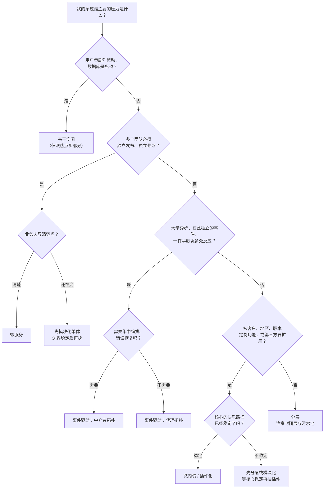
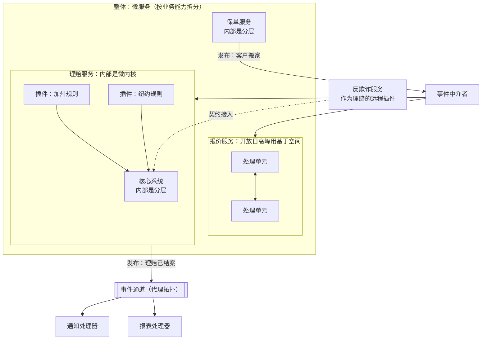

# 横向对比

本篇汇总 [五种经典架构模式](index.md) 的评分、结构和组合方式。

## 书中评分汇总

下表汇总前面各章，来自《软件架构模式》（2015 版报告）的二值定性评价，不是测量值。*Fundamentals* 后来改成了更多维度的 1 到 5 星评分，部分结论有差异（例如[微服务](microservices.md)的“易开发性”）。

| 维度 | [分层](layered.md) | [事件驱动](event-driven.md) | [微内核](microkernel.md) | [微服务](microservices.md) | [基于空间](space-based.md) |
| --- | --- | --- | --- | --- | --- |
| 整体敏捷性 | 低 | 高 | 高 | 高 | 高 |
| 易部署性 | 低 | 高 | 高 | 高 | 高 |
| 可测试性 | 高 | 低 | 高 | 高 | 低 |
| 性能 | 低 | 高 | 高 | 低 | 高 |
| 可扩展性（伸缩） | 低 | 高 | 低 | 高 | 高 |
| 易开发性 | 高 | 低 | 低 | 高 | 低 |

一个有意思的规律：**没有一个模式全是“高”**。分层用敏捷性和伸缩换来了易开发和易测试；事件驱动和基于空间用可测试性和易开发换来了性能和伸缩；微内核在伸缩上让步；微服务在性能上让步。

## 结构性对比

| 维度 | [分层](layered.md) | [事件驱动](event-driven.md) | [微内核](microkernel.md) | [微服务](microservices.md) | [基于空间](space-based.md) |
| --- | --- | --- | --- | --- | --- |
| 部署形态 | 单体 | 分布式 | 通常单体 | 分布式 | 分布式 |
| 切分方式 | 技术分区 | 按事件处理职责 | 核心 + 按功能的插件 | 按业务能力 | 按处理单元 |
| 通信 | 进程内调用 | 异步事件 | 进程内或远程 | 同步 REST 或消息 | 内存 + 异步复制 |
| 数据 | 一个共享库 | 各处理器自行处理 | 核心库 + 插件自带 | 每服务一库 | 内存为主，异步落库 |
| 关键名词 | 封闭 / 开放层、隔离层、污水池 | 中介者、代理、事件通道、处理器 | 核心系统、插件、注册表、契约 | 服务组件、粒度、三种拓扑 | 处理单元、四种网格、数据泵 |
| 主要风险 | 大泥球、污水池 | 一致性、调试难 | 核心契约难改 | 分布式单体、运维 | 数据冲突、成本 |
| 与插件化的关系 | 核心内部常用 | 事件是插件的接入方式 | 本身 | 远程插件 ≈ 服务 | 基本无关 |

## 决策图 {#decision}

这张图以“要不要插件化”为终点问题，但先排除那些其实别的模式更合适的情况。

## 模式怎么组合

五种模式并不互斥，书里自己就多次提到组合：

- [微内核](microkernel.md)的**核心系统内部**通常是[分层](layered.md)的。
- 微内核的插件可以是**远程服务**，于是系统的一部分变成了[微服务](microservices.md)。
- 微服务之间的后续动作常用[事件驱动（代理拓扑）](event-driven.md)。
- [基于空间](space-based.md)的**处理单元内部**可以是分层或模块化的；处理网格本身就像一个事件中介者。
- 事件驱动的单个**事件处理器内部**也可以是分层的。

一个组合示例：一个面向多地区的保险平台。

读这张图：

- 最外层按业务能力拆成服务（微服务）。
- 只有“理赔规则按地区变化”这一块用了微内核——插件化只出现在真正需要按维度定制的地方。
- 核心系统内部仍然是普通的分层。
- 报价服务只在特定高峰时段需要极端伸缩，才用基于空间。
- 服务之间的旁路反应用代理拓扑，跨服务的流程（客户搬家）用中介者拓扑。
- 反欺诈服务以远程插件的形式接入理赔核心，说明“远程插件”和“微服务”之间的边界其实很近。

**回到插件化：** [微内核](microkernel.md)是五种模式里唯一一个以“可扩展、可定制”为核心目标的。书中评分标出了代价：伸缩低、开发难，而且核心契约一旦公开就很难改。判断要不要做插件化，先确认核心的快乐路径已经稳定，扩展确实要按客户、地区或第三方变化；再用[微内核里的决策图](microkernel.md#plugin)确定插件形态。
