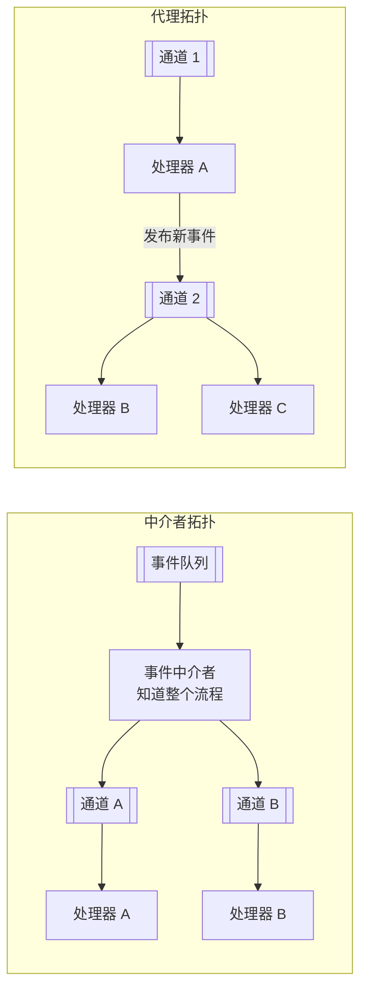
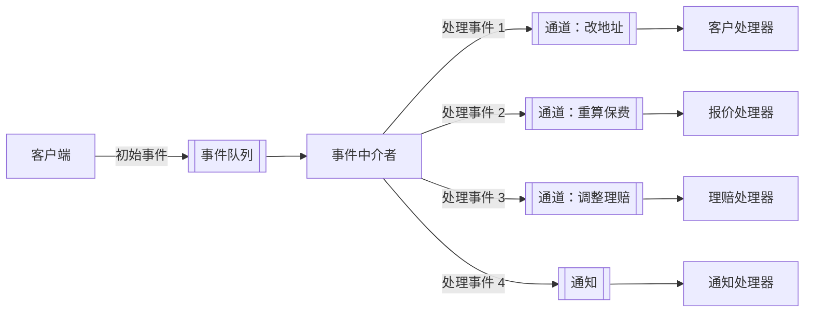
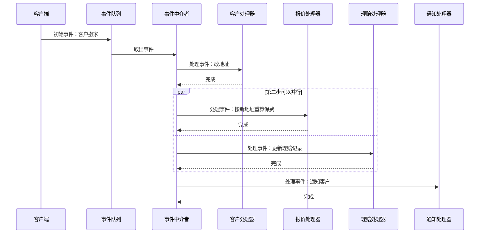
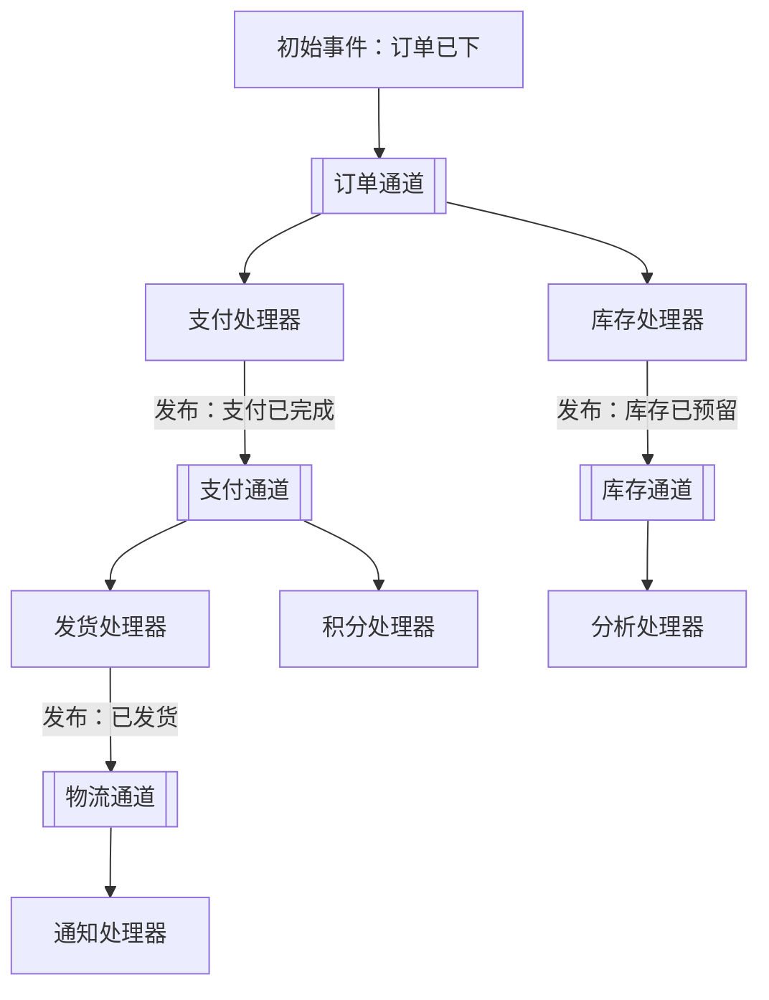
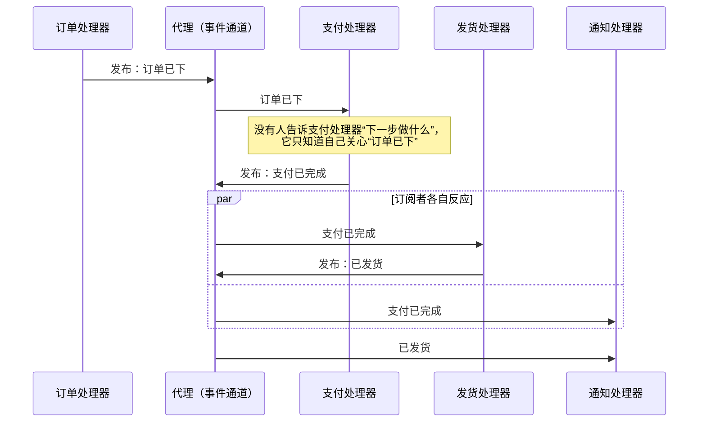

# 事件驱动架构（Event-Driven Architecture）

本篇是 [五种经典架构模式](index.md) 中的事件驱动架构。评分和选型见 [横向对比](comparison.md)。

## 核心思想与它要解决的问题

事件驱动是一种**分布式、异步**的架构模式。它把系统拆成一批**单一用途的事件处理组件**，它们异步地接收事件、处理事件，必要时再产出新的事件。

它要解决的问题是：系统要应对大量**彼此独立、异步发生**的事情（下单、支付、发货、库存变化……），而且需要**高伸缩**、**高响应**。如果用同步调用把这些步骤串起来，最慢的那一步决定整体响应时间，任何一步挂掉都会让整条链失败。

书里的事件驱动有两种**拓扑**：**中介者拓扑**和**代理（Broker）拓扑**。两者的区别是：有没有一个“总指挥”。

## 中介者拓扑（Mediator Topology）

### 组件

中介者拓扑由四类组件组成：

| 组件 | 职责 |
| --- | --- |
| **事件队列（event queue）** | 接收客户端发来的**初始事件**，交给中介者 |
| **事件中介者（event mediator）** | 知道一个初始事件需要哪些步骤，按顺序或并行地把**处理事件**派发出去。它只负责编排，不做业务逻辑 |
| **事件通道（event channel）** | 中介者和处理器之间的异步管道，通常是消息队列或主题 |
| **事件处理器（event processor）** | 包含真正的业务逻辑，每个处理器只做一件事，彼此独立 |

这里有两个容易混的名词：

- **初始事件（initial event）**：外部发进来的那个事件，比如“客户搬家了”。
- **处理事件（processing event）**：中介者为完成初始事件而派生出的一个个步骤事件，比如“改地址”“重算保费”“更新理赔记录”。

事件中介者的实现可以很简单（自己写一段编排代码、Apache Camel 这类集成框架），也可以很重（BPEL 引擎、BPM 流程引擎）。*Fundamentals* 建议按事件的复杂程度分级：简单事件走轻量中介者，复杂、需要人工介入的走 BPM 类中介者。

### 一次事件怎么流动

“客户搬家”这一初始事件：步骤 1 必须先做，步骤 2、3 可以并行，最后发通知。

中介者知道“整个故事”，所以出错时它能决定重试、补偿还是报警。这是中介者拓扑最大的优势，也是它的瓶颈：中介者本身要高可用，而且流程一多，它就变成一个“什么都知道”的中心。

## 代理拓扑（Broker Topology）

代理拓扑**没有中央中介者**。消息流沿着一条“链”分布在各个处理器之间：每个处理器处理完一个事件后，**发布一个新事件**说明自己做了什么，谁关心谁订阅。

组件只有两类：

- **代理（broker）**：一组事件通道，可以是一个消息中间件集群，也可以是多个独立的通道。
- **事件处理器**：处理事件，并发布新事件。

文章的 Figure 2 画的正是这种拓扑：一个事件进入通道，多个处理器订阅，处理器又把新事件放回通道，形成链式反应。

### 一次事件怎么流动

## 两种拓扑怎么选

| 维度 | 中介者拓扑 | 代理拓扑 |
| --- | --- | --- |
| 谁知道全流程 | 中介者 | 没有人，流程散在各处理器里 |
| 错误处理 | 中介者能集中处理、重试、补偿 | 难：没有人知道“整件事”是否完成 |
| 耦合 | 处理器之间解耦，但都依赖中介者 | 处理器之间只靠事件名耦合，最松 |
| 伸缩与性能 | 中介者可能成为瓶颈 | 最好，没有中心节点 |
| 可观测性 | 好，状态在中介者里 | 差，需要链路追踪 |
| 适合 | 步骤有顺序、需要编排和错误恢复的流程 | 简单的事件链，追求吞吐与扩展 |

一句话：**中介者拓扑是编排（orchestration），代理拓扑是协同（choreography）**。

## 关键考虑

- **异步带来的一致性问题**：处理器各自提交，没有跨处理器的事务。一个步骤失败，其他步骤可能已经完成。书里明确提醒：如果一个业务单元需要原子性事务，**不要把它拆到多个处理器里**。
- **契约**：事件的结构（字段、版本）就是处理器之间的契约，要像 API 一样管理。
- **数据丢失**：*Fundamentals* 提到三处可能丢消息——发布时、处理器取出后处理前、处理器写库前。对策是持久化队列、客户端确认（client acknowledge）、最后参与者支持（last participant support）。
- **错误处理**：*Fundamentals* 介绍了“工作流事件模式”（workflow event pattern）：处理器出错时不阻塞，把出错事件交给一个工作流处理器修复后重新提交。
- **请求-响应**：有些场景需要同步结果（比如查余额），可以用“回复队列 + 关联 id”在事件系统上模拟，但不要把整个系统都这么做。

## 适合与不适合

**适合：** 高并发、事件彼此独立的系统；需要高伸缩和高响应；有大量“一件事发生后，好几处要各自反应”的场景。

**不适合：** 强一致、需要立即得到结果的流程；团队还没准备好处理异步调试、重复投递和最终一致。

## 书中评分

| 维度 | 评价 | 理由（概括） |
| --- | --- | --- |
| 整体敏捷性 | 高 | 处理器彼此解耦，改动通常只影响一个处理器 |
| 易部署性 | 高 | 处理器解耦，可以单独部署；中介者拓扑稍难，因为处理器和中介者有关联 |
| 可测试性 | 低 | 异步，需要专门工具产生事件，单测和集成测试都更复杂 |
| 性能 | 高 | 异步、并行处理，消息队列本身的开销被并行抵消 |
| 可扩展性（伸缩） | 高 | 每个处理器可以独立扩容 |
| 易开发性 | 低 | 异步编程、契约管理、错误处理都更复杂 |

## 真实风格的例子

**中介者：** 保险公司“客户搬家”流程，要依次改地址、重算保费、调整理赔、发通知，失败要补偿——用一个流程引擎做中介者。

**代理：** 电商下单之后，库存、支付、积分、推荐、搜索、数据分析各自订阅订单事件。新增一个“发优惠券”，只需新增一个订阅者（Kafka 主题 + 消费组是这种拓扑最常见的实现）。

## 和插件化的关系 {#plugin}

代理拓扑和[插件化](microkernel.md)有一个共同点：**新增功能 = 新增一个订阅者**，发布者不用改。所以事件是插件最常用的**接入方式**之一（VS Code 的 `onDidSaveTextDocument`，WordPress 的 `add_action`）。

差别在于：事件驱动架构里的处理器通常是**独立部署的进程**，由你自己的团队写；插件化里的插件通常**在宿主里运行**，可能由第三方写，还需要安装、加载、版本兼容这一整套机制。把进程内的事件总线当作扩展点，是插件化的一种设计；把整个系统做成事件驱动架构，是另一回事。
