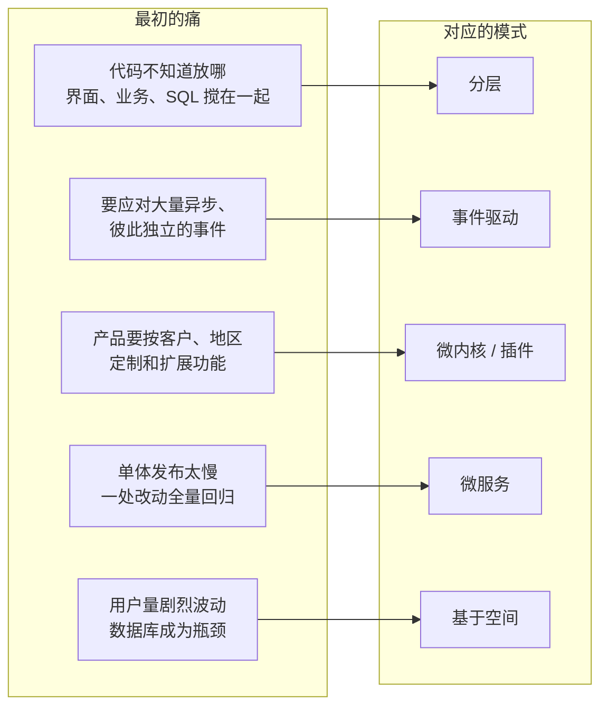
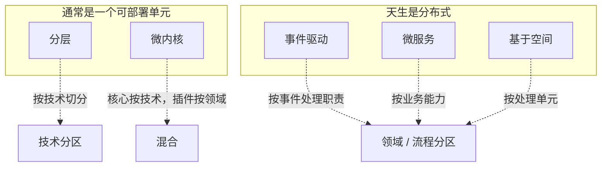

# 五种经典架构模式深讲：分层、事件驱动、微内核、微服务、基于空间

这份笔记对应 Mark Richards 的《软件架构模式》（*Software Architecture Patterns*）里的五种模式，以及 Richards 和 Neal Ford 在《软件架构：架构模式、特征及实践指南》（*Fundamentals of Software Architecture*）里对它们的扩展讲法。

这份笔记不停留在“我该选哪个”，而是往下挖一层：

- 书里给每种模式起的**专门名词**是什么意思（封闭层、事件中介者、插件注册表、处理单元、数据泵……）。
- 每种模式的**内部结构**和**一次请求怎么流动**。
- 书对每种模式的**定性评分**。
- 每种模式和**插件化**是什么关系——你最终要判断的是“我的应用要不要插件化”。

另外，**基于空间的架构（Space-Based）** 会在 [单独一章](space-based.md) 完整展开。

先看五种模式各自想解决的那个“最初的痛”：

再看它们的“形状”：前三种既可以是单体也可以是分布式，后两种天生是分布式。

*Fundamentals* 特别强调“技术分区”和“领域分区”的区别：[分层](layered.md)是按技术角色（界面、业务、持久化）横着切；[微服务](microservices.md)是按业务能力（订单、库存）竖着切。这一区别会贯穿全文。

## 文档

| 文档 | 它要解决的痛 | 这一章讲什么 |
|---|---|---|
| [分层架构](layered.md) | 代码不知道放哪 | 封闭层、开放层、隔离层、污水池，以及一次请求怎么穿过各层 |
| [事件驱动架构](event-driven.md) | 大量异步、彼此独立的事件 | 中介者拓扑与代理拓扑，事件怎么流动，怎么选 |
| [微内核架构](microkernel.md) | 按客户、地区定制和扩展功能 | 核心系统、插件、注册表、契约，以及插件怎么接入 |
| [微服务架构](microservices.md) | 单体发布太慢 | 服务组件、三种拓扑、粒度、数据归属 |
| [基于空间的架构](space-based.md) | 用户量剧烈波动，数据库成为瓶颈 | 处理单元、四种网格、数据泵、数据冲突 |
| [横向对比](comparison.md) | — | 评分、结构对比、[决策图](comparison.md#decision)、模式怎么组合 |

## 建议阅读顺序

1. 先看本页两张图，分清技术分区和领域分区。
2. 按 [分层](layered.md)、[事件驱动](event-driven.md)、[微内核](microkernel.md)、[微服务](microservices.md)、[基于空间](space-based.md) 读。每章结构相同：思想、拓扑、关键概念、一次请求、取舍、评分、例子、和插件化的关系。
3. 最后读 [横向对比](comparison.md)，用[决策图](comparison.md#decision)回到“要不要插件化”。

## 来源 {#sources}

- Orkhan Huseynli，*Software Architecture Patterns: 5 minute read*，Medium，2021-09-04：<https://orkhanscience.medium.com/software-architecture-patterns-5-mins-read-e9e3c8eb47d2>。本笔记的五种模式范围与文章一致，文章的五张示意图均取自下面的 O'Reilly 报告。本笔记的文字和图均为重新编写，未复制原文或原图。
- Mark Richards，*Software Architecture Patterns*，O'Reilly，2015（报告）：<https://www.oreilly.com/content/software-architecture-patterns/>。本笔记的五种模式结构、关键名词与“高 / 低”评分出自这一版。该书 2022 年出了扩充的第二版，内容和评分方式可能有变化。
- Mark Richards、Neal Ford，*Fundamentals of Software Architecture*（中译《软件架构：架构模式、特征及实践指南》），O'Reilly，2020。本笔记中关于技术分区与领域分区、快乐路径、数据泵 / 写入器 / 读取器、复制缓存与分布式缓存、数据冲突、数据归属、工作流事件模式等内容出自这本书。

