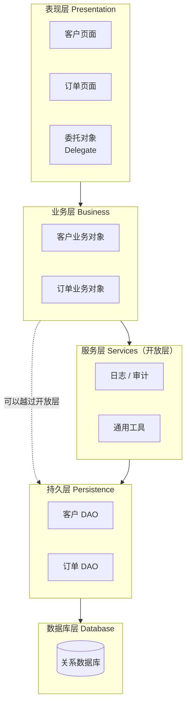
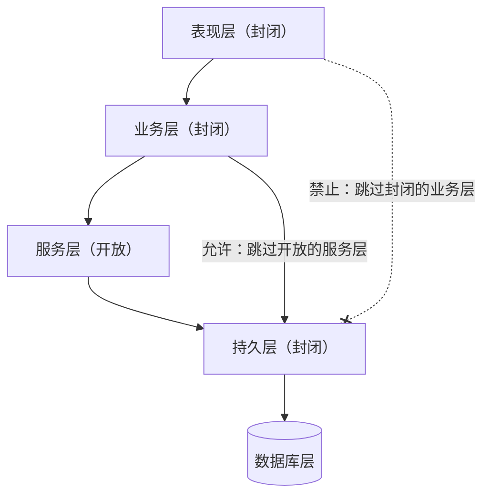
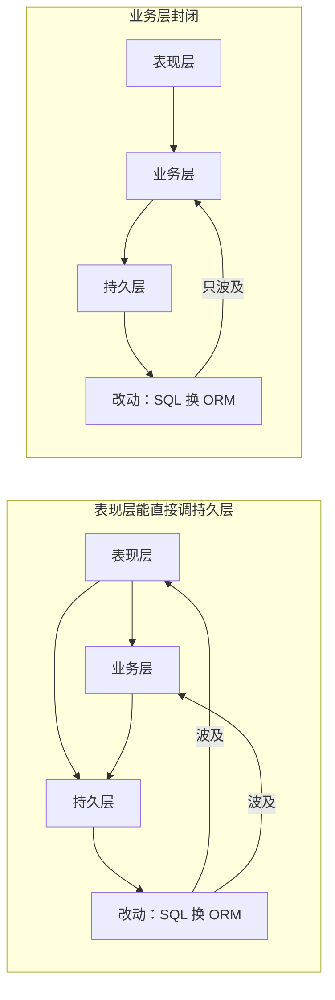
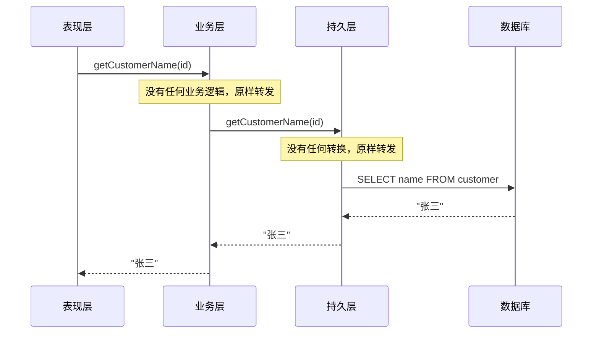
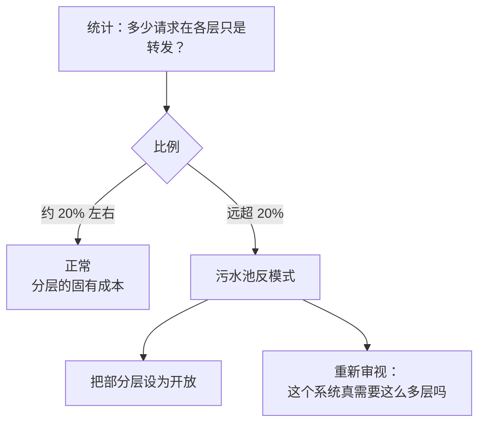
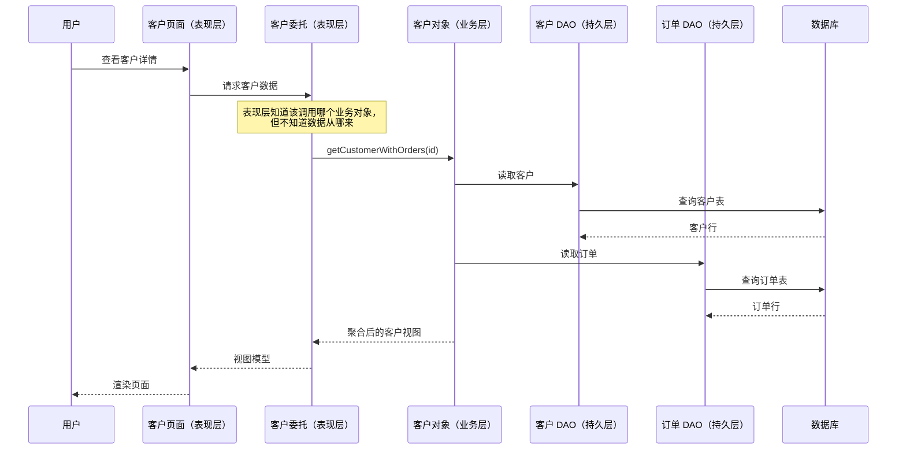

# 分层架构（Layered Architecture）

本篇是 [五种经典架构模式](index.md) 中的分层架构。评分和选型见 [横向对比](comparison.md)。

## 核心思想与它要解决的问题

分层是绝大多数单体应用的默认起点。它要解决的问题很朴素：**代码按什么规则摆放**。把系统按技术职责切成几个水平层，每层只负责一类事情，层与层之间按固定方向调用。

它之所以流行，一个重要原因是**组织结构**：很多公司本来就分成前端组、后端组、DBA 组，分层恰好和这种分工对齐（这是康威定律的一个直接体现）。

## 组件与拓扑

书中最典型的是四层：表现层、业务层、持久层、数据库层。层的数量不是固定的，小系统可能把业务和持久合在一起，大系统可能多出一个“服务层”放公共业务组件。

每一层内部有若干**组件**，同一层的组件职责类型相同。层的意义在于：**某层的组件只处理属于这一层的逻辑**。业务层不关心页面怎么画，也不关心 SQL 怎么写。

## 关键概念

### 封闭层与开放层

书里给每一层一个属性：**封闭（closed）** 或 **开放（open）**。

- **封闭层**：请求从上往下走时，**必须经过**这一层，不能跳过。
- **开放层**：请求**可以绕过**这一层，直接到下一层。

默认情况下，所有层都应该是封闭的。为什么要“多走一步”？因为下一个概念。

### 隔离层（Layers of Isolation）

封闭层带来的好处叫**隔离层**：某一层的改动，一般不会影响其他层，只要层之间的接口（约定）不变。

举例：持久层把 SQL 换成 ORM。如果表现层可以直接调用持久层，表现层也得跟着改；如果持久层上面有一个封闭的业务层，那么改动就止于业务层，表现层完全不知道。

### 为什么需要开放层

如果所有层都封闭，“公共业务组件”放哪？比如日期工具、审计日志。放在业务层，表现层能用但持久层用不了（持久层不能往上调）；单独放一层又必须被每个请求经过，很浪费。书的解法：**加一个开放的服务层**，业务层可以用它，也可以绕过它。

关键是：开放还是封闭，**要在架构里写清楚并沟通到位**，不然每个开发者会按自己的理解跳层，隔离层就形同虚设。

### 架构污水池反模式（Architecture Sinkhole）

**污水池**指的是：请求穿过每一层，每一层什么也不做，只是原样转发。比如“查一个客户的名字”，表现层调业务层，业务层原样调持久层，持久层发一条 `SELECT`，然后原路返回。

每个分层系统都会有一些这样的请求，这本身不是问题。书给了一个经验法则：**大约 80/20**。如果约 20% 的请求是“穿透式”的，属于正常；如果大部分请求都是这样，说明分层不适合这个问题，或者应该把一部分层改成开放的。

## 一次请求怎么流动

以书里的经典例子为原型：查询客户信息和他的订单。这次业务层确实做了事情——把两份数据合成一个视图。

## 取舍：适合与不适合

**适合：**

- 新项目不知道选什么时，先用分层，后续再演进。
- 团队按技术角色分工，规模不大，预算和时间有限。
- 业务以 CRUD 为主。

**不适合：**

- 需求变化通常是**纵向的**。加一个“发票”功能，要同时动表现层、业务层、持久层——一次领域改动穿过所有层，这正是技术分区的弱点。
- 需要高扩展性或高弹性：整个应用是一个部署单元，要扩就整体扩。
- 代码量增长后，分层单体很容易滑向“大泥球”。

## 书中评分

《软件架构模式》（2015 版）给出的是“高 / 低”二值定性评价，不是量化指标：

| 维度 | 评价 | 理由（概括） |
| --- | --- | --- |
| 整体敏捷性 | 低 | 整体是单体，组件在层之间紧耦合，改动需要全量发布 |
| 易部署性 | 低 | 一处小改动也要重新部署整个应用 |
| 可测试性 | 高 | 可以 mock 下层，单独测试某一层 |
| 性能 | 低 | 每个请求都要穿过多层，开销累积 |
| 可扩展性（伸缩） | 低 | 单体，只能整体扩容 |
| 易开发性 | 高 | 模式人人熟悉，和团队分工吻合 |

## 真实风格的例子

一家保险公司的内部客户管理系统：Spring MVC 写页面（表现层），`@Service` 类写核保规则（业务层），MyBatis 写 DAO（持久层），Oracle 数据库。前端组、后端组、DBA 组各管一层。一个新功能（“客户积分”）通常要三个组一起排期——这就是技术分区在组织上的代价。

## 和插件化的关系 {#plugin}

分层本身**不提供扩展点**。但两点值得记住：

- [插件化系统](microkernel.md)的**核心**内部，经常就是一个分层结构。
- 如果你的“扩展需求”其实是“换一种存储”“换一种渲染”，那属于层内替换，用接口 + 依赖注入就够了，不需要做成插件。
