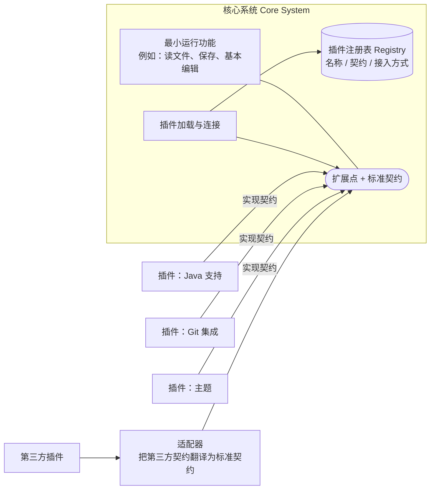
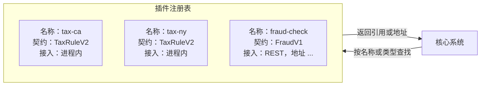
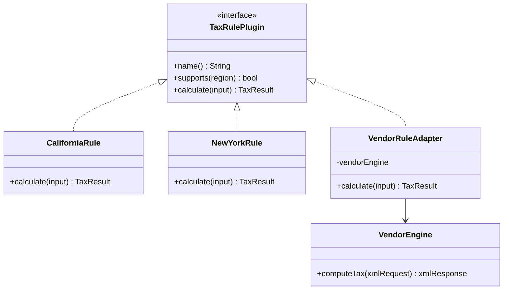
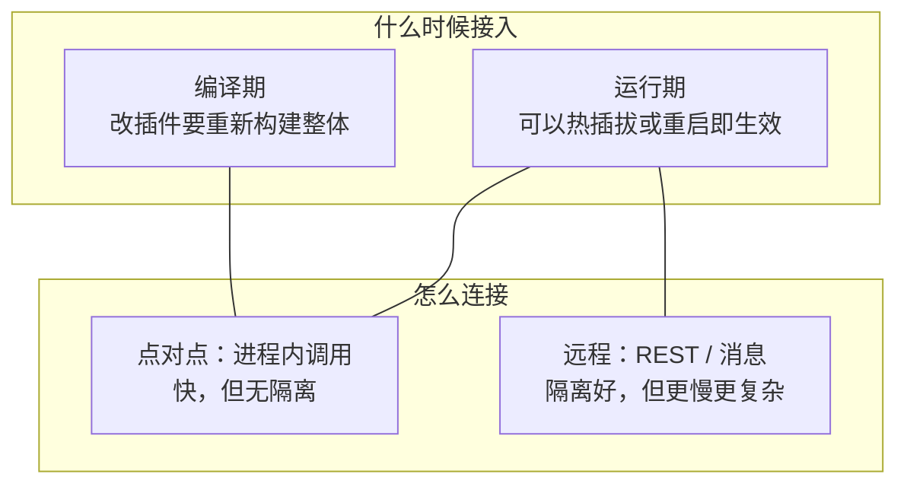
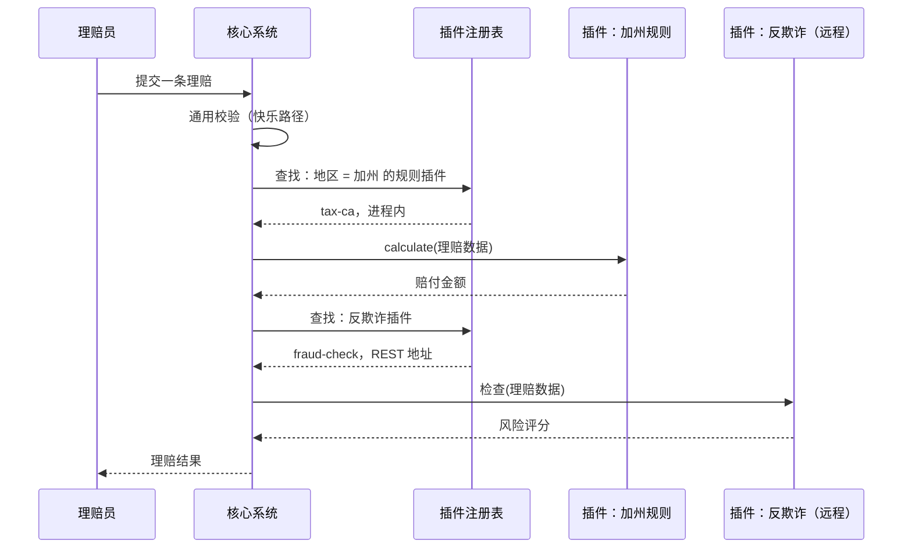
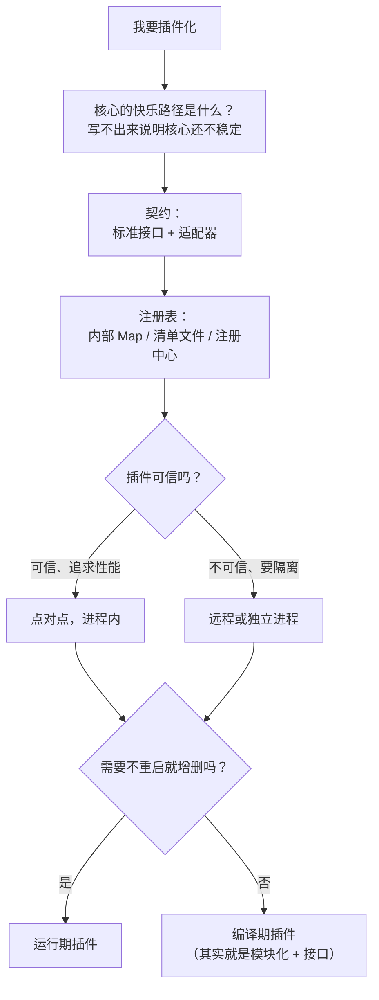

# 微内核架构（Microkernel / Plug-in Architecture）

本篇是 [五种经典架构模式](index.md) 中的微内核架构。评分和选型见 [横向对比](comparison.md)。

## 核心思想与它要解决的问题

微内核也叫**插件架构**。它把应用分成两类组件：**核心系统（core system）** 和 **插件模块（plug-in modules）**。核心提供最小的运行机制，具体功能、定制逻辑、特殊处理都放在插件里。

它最初针对的是**产品型软件**：要打包、下载、安装到客户那里的软件，比如 IDE、浏览器、报税软件。这类软件面对的问题是：不同客户、不同地区、不同时间要不同的功能组合，而你不想为每个客户维护一套分支。书里也指出它适用于**有大量定制规则的业务应用**，比如按地区不同的保险理赔规则。

文章用浏览器做例子：浏览器是核心系统，扩展是插件。文章的 Figure 3 只画了“一个核心 + 周围一圈插件”；下面把书里提到的内部部件也画出来。

## 组件与拓扑

### 核心系统

核心系统包含让系统**运转起来的最少功能**。*Fundamentals* 给了另一种说法：核心是系统的**“快乐路径”（happy path）**——没有任何定制时的通用处理流程。比如保险理赔：核心只做“接收理赔 → 校验 → 计算 → 出结果”这条通用流程，每个地区不同的规则都在插件里。

核心系统内部可以是分层的，也可以是模块化的，这不影响整体是“微内核”。

### 插件模块

插件是**独立的组件**，提供额外功能、定制处理或特殊规则。书里强调一点：**插件之间应该互相独立**，插件 A 不应该依赖插件 B。插件之间出现依赖，就会带来加载顺序、版本组合的问题，复杂度会急剧上升。

## 关键概念

### 插件注册表（Registry）

核心系统需要知道：**有哪些插件可用，以及怎么找到它们**。这就是注册表。书里描述的注册表条目包含：

- 插件的**名称**
- 插件的**数据契约**（输入和输出的结构）
- **远程访问协议细节**（如果插件通过网络连接）

注册表的实现可以很简单：一个内部的 `Map`（键是插件名，值是插件引用），也可以是一个服务注册中心、ZooKeeper 之类的外部组件。

### 契约（Contracts）

核心和插件之间的约定叫**契约**，规定行为、输入数据和输出数据。书里提到契约的三种常见形式：XML 文档、Java 对象，或者其他数据结构（今天更常见的是 JSON 或接口定义）。

- **标准契约**：最常见的做法是核心定义一个通用契约，所有插件都实现它。
- **适配器**：第三方插件的契约和你的标准不一致时，在中间加一个适配器做翻译，核心不需要为每个插件写特殊代码。

### 插件的连接方式

插件怎么接到核心上，书里列了几种：OSGi、消息、Web 服务，或者直接的对象实例化（点对点）。*Fundamentals* 把它归纳成两类：

- **点对点（进程内）**：插件和核心在同一个进程，核心直接调用插件的方法或构造插件对象。最快，但插件出错会拖垮核心。
- **远程**：插件是独立服务，通过 REST 或消息与核心通信。隔离好、插件可以独立伸缩，但多了网络调用，整体变成分布式系统。

另外还有一个正交维度：**编译期插件**还是**运行期插件**。编译期插件改动需要重新构建整个应用；运行期插件可以在不重新部署核心的情况下增删（OSGi、Jigsaw、Java 的 `ServiceLoader`、动态库、脚本包）。

### 插件也可以有自己的数据

*Fundamentals* 建议：插件一般**不直接访问核心的共享数据库**。插件需要的数据由核心通过契约传进去；插件如果需要自己的数据，就自带一个小存储（比如嵌入式数据库、规则文件）。这样插件和核心的数据模型不会缠在一起。

## 一次请求怎么流动

以保险理赔为例：核心跑通用流程，在“规则计算”这一步按地区找插件。

注意核心代码里**没有任何 `if 地区 == 加州`**。新增一个地区，只需新增一个插件并登记到注册表。

## 取舍：适合与不适合

**适合：**

- 产品型软件，需要按客户、地区、版本组合功能。
- 业务规则多、按维度变化（地区、行业、客户等级），且规则之间相互独立。
- 需要第三方或其他团队在不改核心的前提下扩展。
- 作为演进的起点：后期可以把插件拆成远程服务，逐步走向分布式。

**不适合 / 风险：**

- **核心的契约极难改**。核心一改，所有插件都可能受影响。核心要在开始就设计得足够稳定，这需要前期有较多分析。
- 插件之间如果开始互相依赖，模式就被破坏了。
- 插件太多、太细时，管理（版本、兼容、注册）本身成为负担。
- 单体形态下伸缩能力有限（见评分）。

## 书中评分

| 维度 | 评价 | 理由（概括） |
| --- | --- | --- |
| 整体敏捷性 | 高 | 改动大多可以隔离在单个插件内，插件可以独立开发 |
| 易部署性 | 高 | 运行期插件可以在不重启核心的情况下加入（取决于实现） |
| 可测试性 | 高 | 插件可以单独测试，也很容易被 mock 掉 |
| 性能 | 高 | 可以只装需要的插件，裁剪掉不用的功能；书里也指出这个模式本身并不“天然”高性能，评价“高”是说通常表现不错 |
| 可扩展性（伸缩） | 低 | 大多数实现是单体，伸缩只能整体进行 |
| 易开发性 | 低 | 需要周到的契约设计和治理，插件机制本身实现复杂 |

:::note
性能这一项的“高”我有把握，但它是带条件的（书中附了一段说明），不是说微内核天生比其他模式快。
:::

## 真实风格的例子

- **IDE / 编辑器**：Eclipse 的核心几乎只有一个插件运行时（OSGi），连 Java 编辑功能都是插件；VS Code 的扩展运行在单独的扩展宿主进程里。
- **浏览器**：文章举的例子。
- **报税软件**：核心做通用流程，每个州、每种表格是一个插件。
- **保险理赔**：核心跑通用理赔流程，各地区规则是插件——这是书里反复用的业务应用例子。

## 和插件化的关系 {#plugin}

这就是插件化本身。你要做的决定，基本就是本节的那几个变量：

如果走到最后是“编译期插件 + 可信 + 只有本团队写”，那你需要的很可能只是**模块化 + 接口**，而不是一个插件平台。
