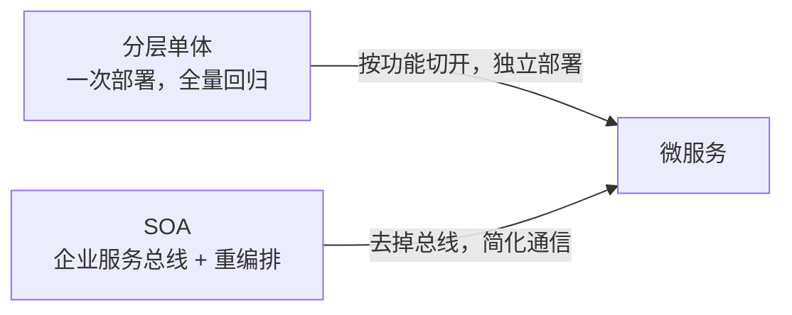
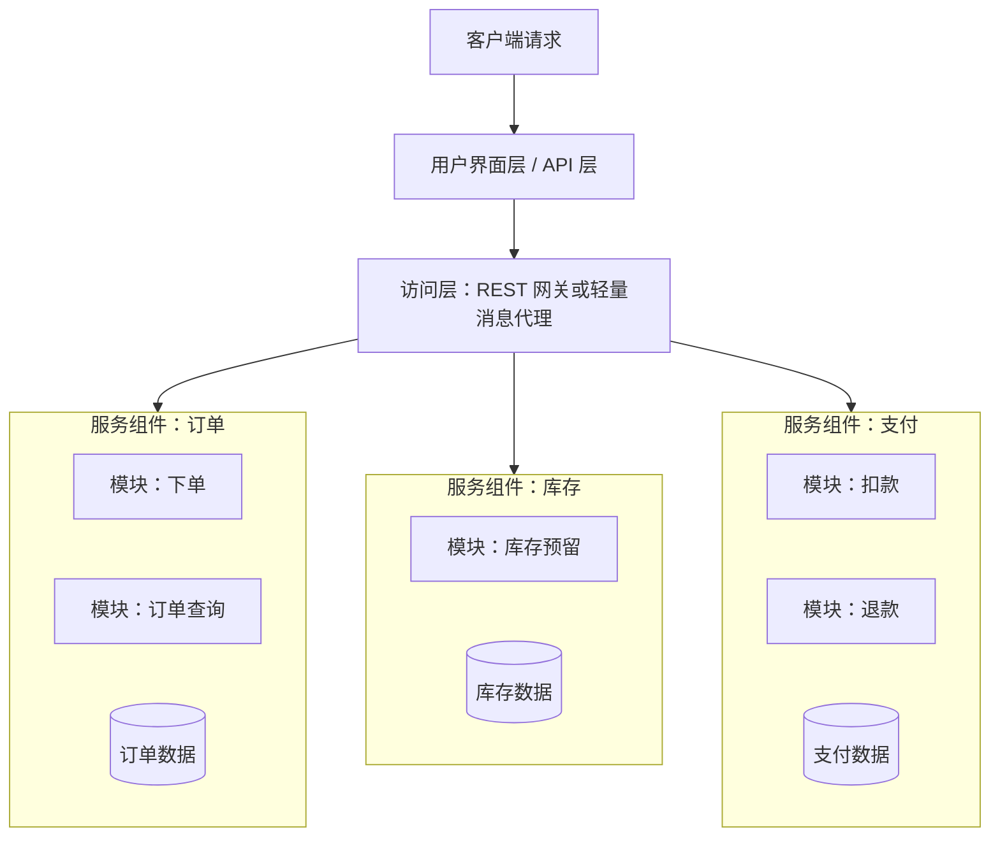
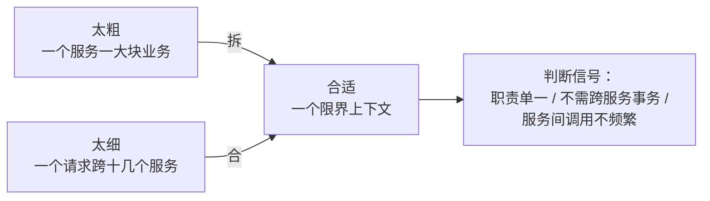
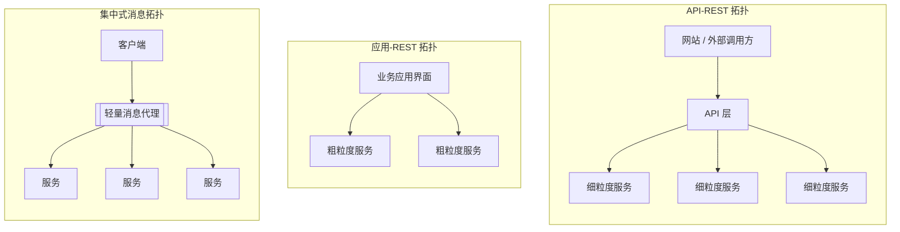
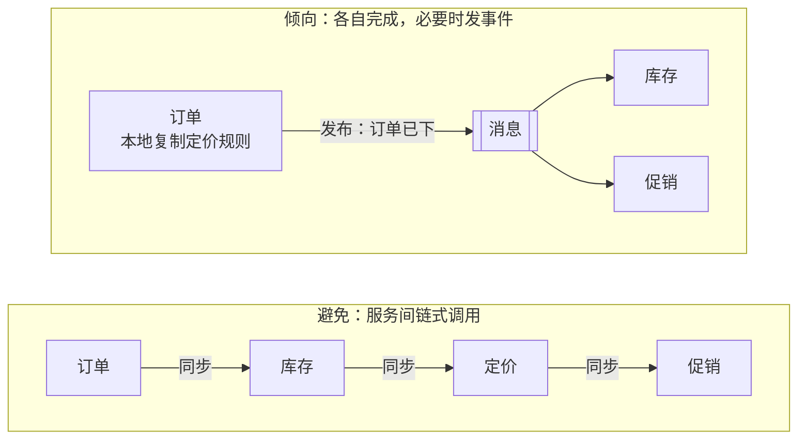
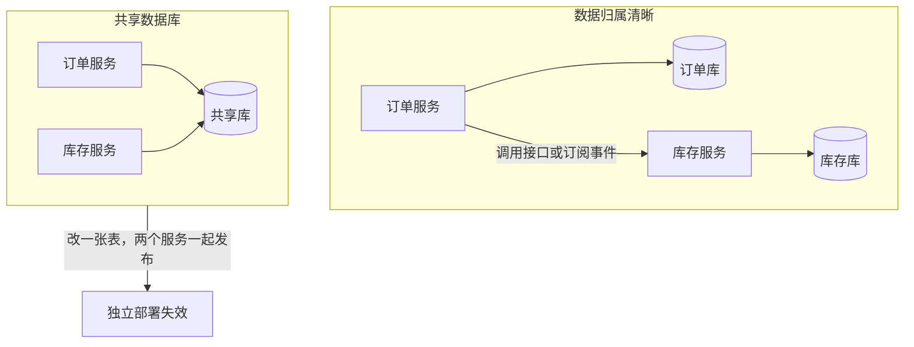
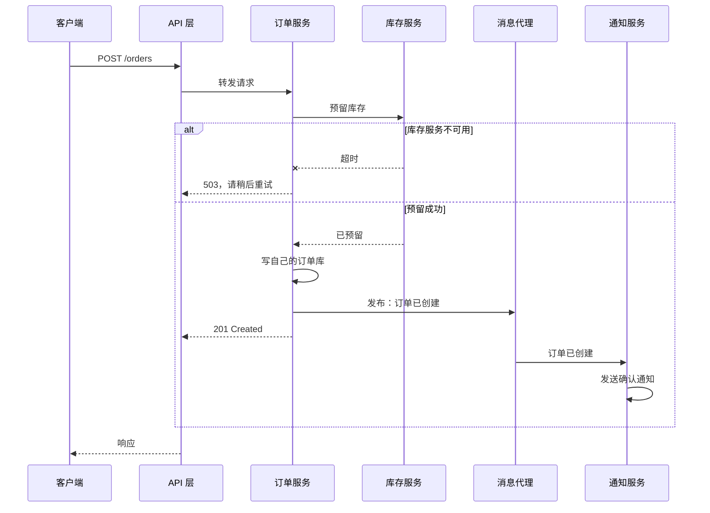

# 微服务架构（Microservices Architecture）

本篇是 [五种经典架构模式](index.md) 中的微服务架构。评分和选型见 [横向对比](comparison.md)。

## 核心思想与它要解决的问题

微服务把应用拆成一组**独立部署的服务组件**，每个服务尽量只负责一件事，服务之间通过网络通信。一个服务挂了，其他服务仍能运行（前提是设计了降级）。

书里认为微服务是从两个方向演化出来的：

- **从单体演化**：分层单体发布太慢、一处改动要全量回归，于是把应用按功能切开，各自独立部署。
- **从 SOA 演化**：SOA 太重（企业服务总线、复杂的服务编排、大量的协议转换），微服务是对它的简化。

## 组件与拓扑

书中微服务的核心概念有三个：

1. **独立部署单元**：每个服务是单独部署的，这让伸缩、隔离、持续交付都容易很多。
2. **服务组件（service component）**：书里特意不用“服务”而用“服务组件”，因为一个服务组件可以包含**一个或多个模块**，粒度可以从一个函数到一大块业务能力。
3. **分布式**：服务组件之间通过远程协议通信（REST、消息、RPC）。

文章 Figure 4 画的就是：客户端请求 → 用户界面层 → 轻量消息代理 → 多个服务组件，每个组件里包含若干模块。

### 粒度：最难的设计决定

服务组件粒度是微服务里**最难做对的事**：

- **太粗**：一个服务包揽太多，回到单体的问题，部署和测试都不轻松。
- **太细**：一个请求要跨十几个服务，服务之间为了完成一件事频繁互调，需要编排——这其实已经退化成 SOA 或“分布式单体”。

*Fundamentals* 用**限界上下文（bounded context）** 作为边界依据（来自领域驱动设计），并给出几个判断粒度的信号：服务的目的是否单一、是否需要事务、服务之间的通信是否过于频繁（“编舞”太多就该合并）。

## 三种拓扑

书里描述了微服务的三种常见拓扑。区别在于**客户端怎么访问服务组件**。

### API-REST 拓扑

面向网站或公开 API。服务组件很细（通常一两个模块），通过 REST 接口暴露，客户端经由一个 API 层（API 网关）访问。很多云平台的公开 API（文件存储、地图、翻译）就是这种形态。

### 应用-REST 拓扑

面向传统的业务应用。客户端是有自己界面的 Web 或富客户端应用，通过 REST 调用后端服务组件。和 API-REST 的区别：服务组件粒度更**粗**，每个代表业务应用的一大块功能，适合中小规模、复杂度不高的业务应用。

### 集中式消息拓扑

不用 REST 直连，而是在客户端和服务组件之间放一个**轻量的集中式消息代理**（如 ActiveMQ、RabbitMQ）。注意它**不是** SOA 的企业服务总线：它不做编排、不做协议转换、不做复杂路由，只负责传递消息。它带来了异步、排队、负载均衡、更好的可靠性，代价是消息代理本身要做集群避免单点。

| 拓扑 | 客户端 | 服务粒度 | 通信 | 典型场景 |
| --- | --- | --- | --- | --- |
| API-REST | 网站、外部开发者 | 细 | 同步 REST | 公开 API、网站后端 |
| 应用-REST | 有自己界面的业务应用 | 粗 | 同步 REST | 中小型企业应用 |
| 集中式消息 | 业务应用、内部系统 | 中到粗 | 异步消息 | 需要排队、可靠投递的大型业务系统 |

## 关键概念

### 避免编排和服务间依赖

这是书里对微服务最重要的告诫之一：**服务组件之间的互相调用越少越好**。服务 A 为了完成请求需要同步调用 B、C、D，那么：

- 延迟叠加，任一服务慢都会拖慢整体。
- 任一服务挂了，A 也失败。
- B 改接口，A 要跟着改，独立部署名存实亡。

书里的建议很具体：

- 如果多个服务都需要同一段通用逻辑（比如格式化、校验），**宁可复制代码**，也不要为它做一个共享服务。这违反 DRY 原则，但换来的是服务间不再耦合。书中把这看作微服务里可以接受的取舍。
- 如果发现无论怎么设计都需要大量服务间调用和编排，那可能说明**这个问题不适合微服务**，应该回到分层单体，或者考虑基于服务的架构（service-based，*Fundamentals* 中的一种更粗粒度的分布式架构）。

*Fundamentals* 把这个话题展开成**协同（choreography） vs 编排（orchestration）**：微服务倾向协同（各服务对事件做出反应），但需要跨服务完成一个业务事务时，也可以引入一个专门的编排服务；同时它明确指出跨服务事务（Saga）是“不得不用时才用”的复杂方案。

### 数据归属

*Fundamentals* 的规则：**每个服务拥有自己的数据**，其他服务不能直接读写它的表，只能通过它的接口或它发布的事件拿数据。这是微服务能独立演进的前提——如果两个服务共享一张表，改表结构就要两个服务一起发布。

### 运维相关的术语

*Fundamentals* 还提到微服务的一些配套概念：**边车（sidecar）** 承担日志、监控、熔断等运维横切关注点；多个边车连起来构成**服务网格（service mesh）**；前端可以是单体 UI，也可以是**微前端**。

## 一次请求怎么流动

API-REST 拓扑下的一次下单。注意订单服务只和库存服务做了一次必要的同步调用，其余后续动作都通过事件完成。

## 取舍：适合与不适合

**适合：**

- 多个团队需要各自独立发布。
- 应用不同部分的伸缩需求差别很大。
- 需要持续交付、快速迭代。
- 业务边界相对稳定，能划出清楚的限界上下文。

**不适合 / 风险：**

- 服务之间天然需要大量交互或强一致事务。
- 团队规模小，运维能力（监控、追踪、自动部署）不足。
- 业务边界还在频繁变化——边界一变，就要跨服务迁移数据。
- 最常见的失败形态是“分布式单体”：服务在名义上拆开了，发布和改动却仍然绑在一起。

## 书中评分

| 维度 | 评价 | 理由（概括） |
| --- | --- | --- |
| 整体敏捷性 | 高 | 服务组件独立部署，改动范围小 |
| 易部署性 | 高 | 粒度细、独立部署，可以只发布改动的服务 |
| 可测试性 | 高 | 只需测试改动的服务；但书中也提醒，服务间如果有依赖，回归测试仍然会扩大 |
| 性能 | 低 | 分布式，网络调用和远程协议有开销 |
| 可扩展性（伸缩） | 高 | 每个服务可以单独扩容 |
| 易开发性 | 高 | 功能隔离在小服务里，开发范围更小、更好理解 |

:::note
注意“性能：低”指的是架构本身的倾向（网络开销），不代表用微服务做不出高性能系统。“易开发性：高”是针对单个服务内部而言；*Fundamentals* 后来的星级评分里，微服务的“简单性”（simplicity）一项评分很低，两本书的视角不同。
:::

## 真实风格的例子

一个外卖平台：用户、商家、菜单、订单、配送、支付、营销各是一个服务，各有自己的数据库。午高峰只扩订单和配送服务；营销服务挂了，下单照样能用，只是不显示优惠券。服务之间的后续动作（下单后通知商家、派单给骑手）通过消息代理用事件完成。

## 和插件化的关系 {#plugin}

微服务和[插件化](microkernel.md)回答的是不同问题：

- 微服务回答“**谁可以独立发布、独立伸缩**”，服务通常都由你的团队写。
- 插件化回答“**核心发布之后，谁还能往里加功能**”，插件可能由别人写。

但两者可以结合：

- [微内核](microkernel.md)的**远程插件**本质上就是一个按契约接入的微服务。
- 一些平台型产品（比如 Shopify 应用、Slack 应用）是“核心是一个大平台 + 第三方以独立服务的形式接入 Webhook / API”，可以看作远程插件化。

如果你想插件化的原因是“我们的团队要能独立发版”，那你要的可能是服务化或模块化，而不是插件化。
