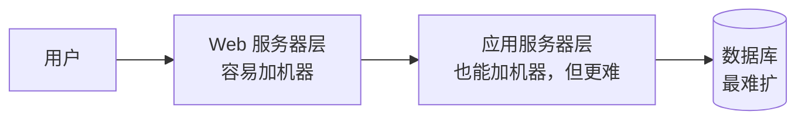
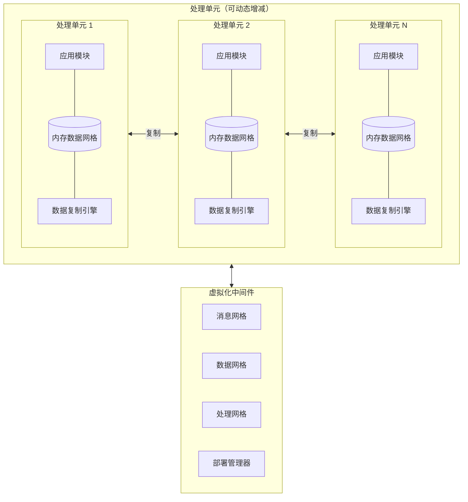
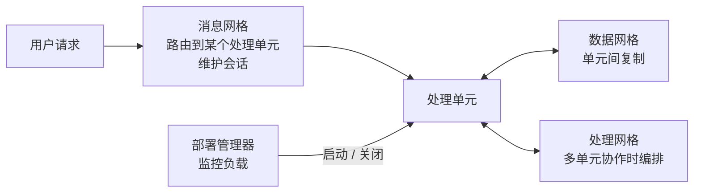
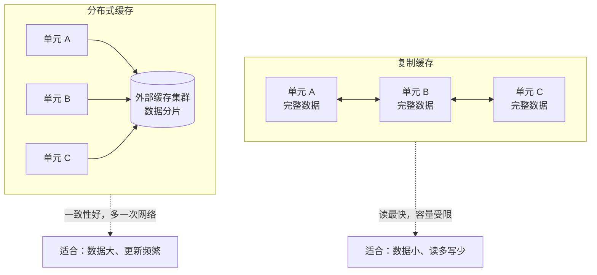
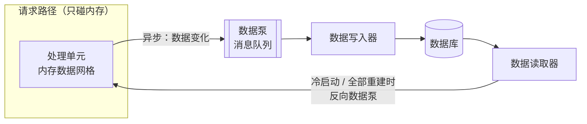
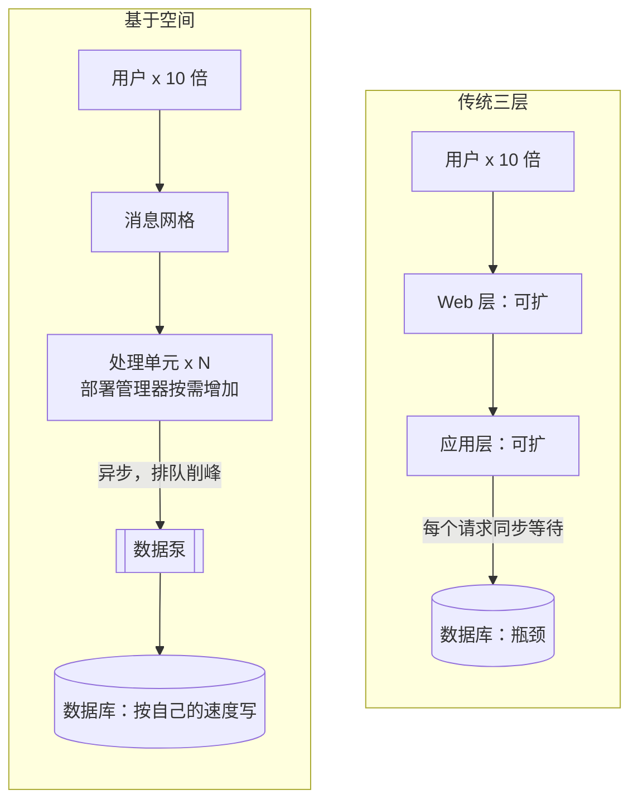
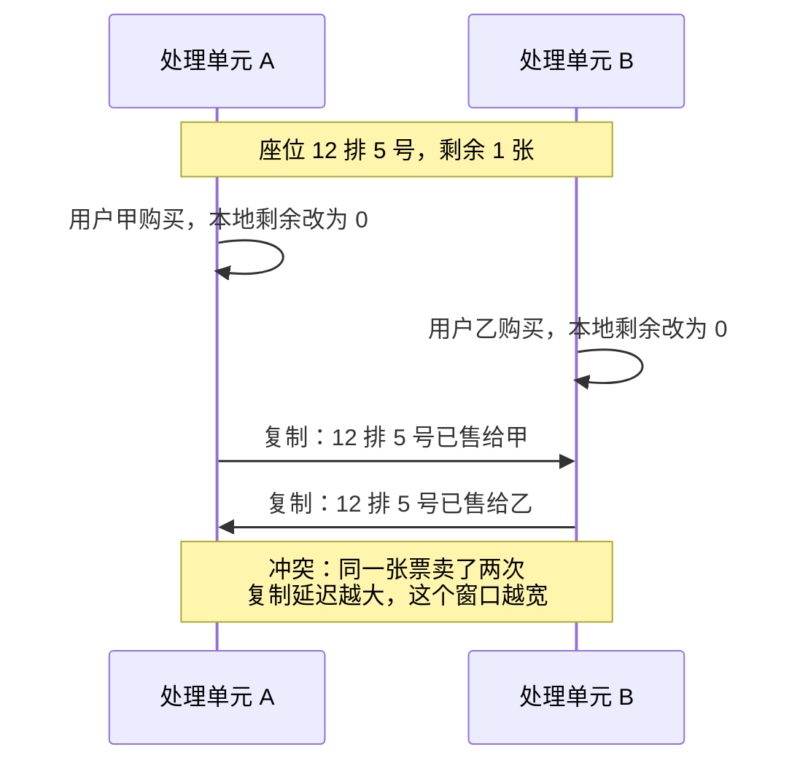
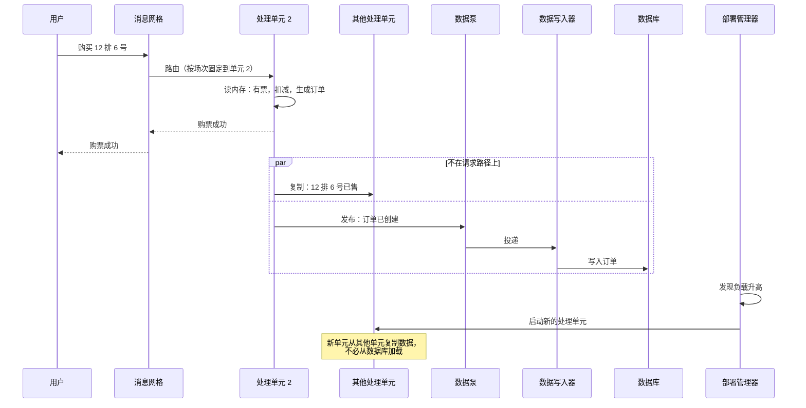

# 基于空间的架构（Space-Based Architecture）

本篇是 [五种经典架构模式](index.md) 中的基于空间的架构。评分和选型见 [横向对比](comparison.md)。

基于空间是五种里最不常见、也最“重”的一种。2015 版报告也称它为“云架构模式”（cloud architecture pattern）。

## 核心思想与它要解决的问题

先看它针对的痛。大多数 Web 应用的结构是：

用户量上来时，Web 服务器可以加，应用服务器也可以加，但**所有请求最终都压到同一个数据库上**。数据库是最难水平扩展的一层，这就形成了一个“三角形”瓶颈：越往下越窄。用户量**突然暴涨**时（秒杀、抢票），扩前两层只会把压力更快地传到数据库，最终整体崩溃。

基于空间的架构的做法是：**把中心数据库从同步请求路径上拿掉**。

- 每个处理单元把应用需要的数据**放在自己的内存里**（内存数据网格）。
- 处理单元之间**互相复制**数据，保持一致。
- 写数据库这件事改为**异步**进行，用户请求完全不用等数据库。

“空间”这个名字来自**元组空间（tuple space）**：多个并行进程通过一块共享内存交换数据的思想。这里的“共享内存”就是分布在各处理单元之间、相互复制的内存数据。

## 组件与拓扑

两类主要组件：**处理单元（processing unit）** 和 **虚拟化中间件（virtualized middleware）**。文章的 Figure 5 画的正是这两块：上面是一排处理单元，每个内部有应用模块、内存数据网格和一个本地小存储；下面是虚拟化中间件，包括消息网格、数据网格、处理网格和部署管理器。

### 处理单元

处理单元包含：

- **应用模块**：业务逻辑。可以是整个应用，也可以只是应用的一部分（按功能分成几类处理单元）。
- **内存数据网格**：这个处理单元需要的数据，放在内存里。
- **数据复制引擎**：把本单元的数据变化同步给其他单元。2015 版报告里还提到一个可选的**异步持久化存储**，用于故障恢复。

文章说的“处理单元可以按需求自动扩缩，数据在单元之间复制处理，不需要持久化到中心数据库”，就是在描述这一部分。

### 虚拟化中间件

虚拟化中间件负责处理单元之间的“家务事”，由四部分组成：

| 组件 | 职责 |
| --- | --- |
| **消息网格（messaging grid）** | 管理输入请求和会话状态。请求进来后，决定交给哪个处理单元（可以是轮询，也可以更复杂） |
| **数据网格（data grid）** | 管理处理单元之间的数据复制。*Fundamentals* 指出它往往其实就分布在各处理单元的复制引擎里，而不是一个独立组件 |
| **处理网格（processing grid）** | 可选。一个请求需要多个不同类型的处理单元协作时，由它编排（类似中介者） |
| **部署管理器（deployment manager）** | 根据负载动态启动和关闭处理单元，用户多了就加，少了就减 |

## 关键概念

### 内存中的复制数据

每个处理单元里都有一份数据。一个单元修改了数据，复制引擎把变化**异步地**推给其他单元。读取几乎都是**本地内存读取**，所以非常快。

*Fundamentals* 区分了两种缓存模型：

- **复制缓存（replicated cache）**：每个单元都有完整的一份。读最快，容错最好；但数据量要能放进每个单元的内存，更新频率也不能太高。
- **分布式缓存（distributed cache）**：数据分片存放在一个外部缓存集群里，单元去远程读。一致性更好、能存更多数据；但多了网络调用，而且缓存集群本身要高可用。

还有一种折中叫**近缓存（near cache）**：本地放热点数据，其余去分布式缓存读。*Fundamentals* 对近缓存并不推荐，因为各处理单元的本地热点不同，行为难以预测。

### 数据泵、数据写入器、数据读取器

数据库并没有消失，只是**被挪出了请求路径**。*Fundamentals* 引入三个名词描述数据怎么最终落库，以及怎么从库里回来：

- **数据泵（data pump）**：处理单元更新了内存数据后，把这次变化**异步地**发出去（通常是消息队列），送往数据库方向。数据泵保证投递，一般按业务领域或处理单元类型分开。
- **数据写入器（data writer）**：从数据泵里接收消息，把变化写进数据库。写入器可以按领域划分，也可以一个写入器服务所有类型。
- **数据读取器（data reader）**：从数据库读数据，送回处理单元。它不在日常请求路径上，只在三种情况下工作：所有处理单元同时崩溃需要重建、重新部署所有处理单元、需要读取不在缓存里的归档数据。这条反向的路径也叫**反向数据泵**。

### 为什么它能去掉数据库瓶颈

关键是两点：

1. **读写都在内存**：用户请求只和本地内存数据网格打交道，不等数据库。
2. **数据库写入异步化、削峰**：峰值时刻的写入先进数据泵排队，数据写入器按数据库能承受的速度慢慢写。数据库从“同步瓶颈”变成“最终落盘的地方”。

于是伸缩只取决于**能起多少个处理单元**，而不是数据库能扛多少连接。

### 数据冲突与一致性风险

代价也正来自“每个单元一份数据、异步复制”：

- **数据冲突（data collision）**：单元 A 和单元 B 几乎同时修改同一条数据，各自先改了本地内存，再把变化复制给对方——结果互相覆盖。复制延迟越长、单元越多、同一数据更新越频繁，冲突越多。
- *Fundamentals* 给了一个估算冲突率的公式，大意是：冲突数与**处理单元实例数**、**同一数据的更新频率的平方**、**复制延迟**成正比，与**缓存中数据条数**成反比。（公式形式我凭记忆写出，原书的确切符号和形式请以原书为准。）
- **最终一致**：数据库总是落后于内存，报表和外部系统读数据库时看到的是“过一会儿之前”的数据。
- **数据丢失风险**：处理单元在数据泵发出消息前崩溃，那次变化可能丢失；需要持久化的消息队列和确认机制。
- **缓存容量**：复制缓存要求数据能放进每个单元的内存，不适合海量数据。

对付冲突的常见手段：按业务键把请求固定路由到同一个处理单元（让同一张票总是由同一个单元处理）、缩短复制延迟、对极少数关键数据改用分布式缓存或分布式锁。

## 一次请求怎么流动

演唱会抢票的一次购票请求：

## 取舍：适合与不适合

**适合：**

- 并发量**极高且波动剧烈**：抢票、秒杀、拍卖、在线投票。
- 对**响应时间**要求很高，数据库撑不住同步访问。
- 数据量能放进内存，或者“热”数据能放进内存。

**不适合：**

- 大规模关系型数据、复杂查询和报表为主的系统。
- 需要强一致事务（金融账务等），冲突的代价无法接受。
- 团队和预算有限：内存数据网格产品（如 Hazelcast、Apache Ignite、GigaSpaces、Oracle Coherence）有许可和运维成本，测试高负载场景也很贵。

## 书中评分

| 维度 | 评价 | 理由（概括） |
| --- | --- | --- |
| 整体敏捷性 | 高 | 处理单元可以动态启动和关闭，应对环境变化快 |
| 易部署性 | 高 | 虽然不是彻底解耦的分布式架构，但它是动态的，借助云平台可以方便地把单元推到服务器上 |
| 可测试性 | 低 | 很难在测试环境里模拟出足以考验伸缩能力的高负载，成本高 |
| 性能 | 高 | 内存数据访问加缓存机制 |
| 可扩展性（伸缩） | 高 | 几乎不依赖中心数据库，去掉了伸缩的主要瓶颈 |
| 易开发性 | 低 | 缓存与内存数据网格产品复杂，开发时要时刻考虑不影响伸缩和一致性 |

:::note
*Fundamentals* 里基于空间的架构在弹性（elasticity）、伸缩、性能上是满分，在简单性、可测试性上很低，成本也偏高。我对星级的具体数字没有把握，这里只说倾向。
:::

## 真实风格的例子

一个演唱会票务平台：平时访问量很小，开票那一刻瞬间几十万人涌入。

- 开票前，部署管理器预先拉起一批处理单元，数据读取器把座位库存加载进内存。
- 开票时，消息网格把同一场次的请求固定路由到少数处理单元，减少冲突；所有购票都在内存里完成。
- 订单通过数据泵排队写入数据库，数据库只需按自己的速度消化。
- 结束后，部署管理器缩容到最少几个单元。

*Fundamentals* 还举了在线拍卖的例子：出价需要即时响应，而且出价数量和时间难以预测。

## 和插件化的关系 {#plugin}

基于空间的架构解决的是**伸缩与性能**，和插件化几乎是两个维度：

- 它不提供扩展点。
- 它的处理单元内部仍然可以是[分层](layered.md)或者[微内核](microkernel.md)的。
- 如果你想插件化的原因里没有“极端并发”，这个模式和你的决定基本无关；了解它的意义在于知道“数据库瓶颈”还可以这样解决。
