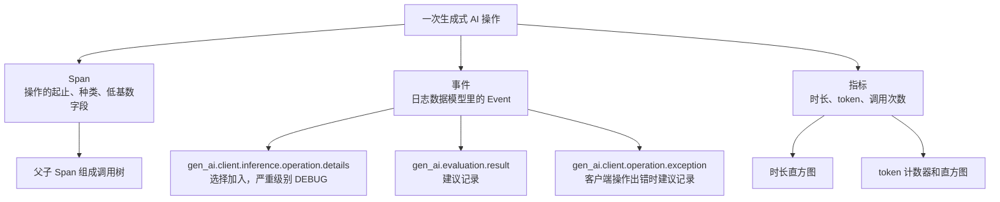
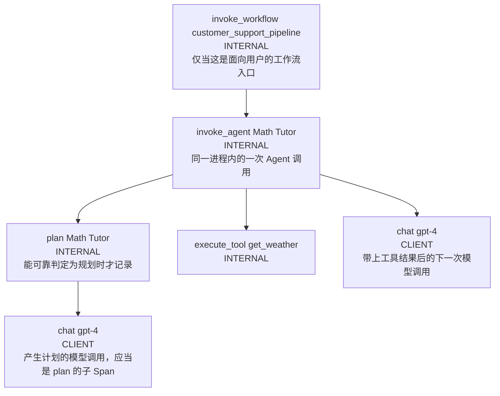
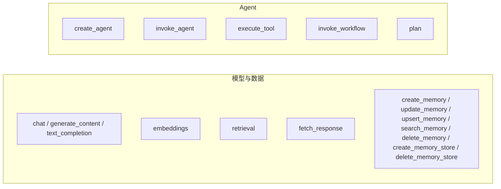
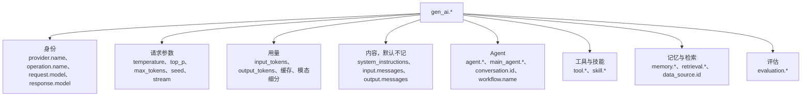

# OpenTelemetry 生成式 AI 语义约定：Agent 可观测

这份笔记讲 OpenTelemetry 怎样观察一次生成式 AI Agent 调用。范围是生成式 AI 语义约定里的 Span、事件、指标和属性。规范里的例子只转述，不另编场景。

## 钉住的名称和版本

官方没有名为 **GenAI 2.0** 的版本号。仓库、清单和文档用下面这些名称。

| 项 | 钉住的事实 |
|---|---|
| 仓库 | [open-telemetry/semantic-conventions-genai](https://github.com/open-telemetry/semantic-conventions-genai/tree/06ec68e722c45a7218e23ea1bc1339fe4e21ecae) |
| 提交 | `06ec68e722c45a7218e23ea1bc1339fe4e21ecae`，提交时间 2026-10-07，说明是 Lock file maintenance |
| 仓库标题 | OpenTelemetry GenAI Semantic Conventions。[README L3-L5](https://github.com/open-telemetry/semantic-conventions-genai/blob/06ec68e722c45a7218e23ea1bc1339fe4e21ecae/README.md#L3-L5) |
| 清单名称 | `semantic-conventions-genai`。描述是 OpenTelemetry Semantic Conventions for Generative AI。[manifest.yaml L1-L6](https://github.com/open-telemetry/semantic-conventions-genai/blob/06ec68e722c45a7218e23ea1bc1339fe4e21ecae/model/manifest.yaml#L1-L6) |
| 总览页标题 | Semantic conventions for generative AI systems。[docs/gen-ai/README.md L5](https://github.com/open-telemetry/semantic-conventions-genai/blob/06ec68e722c45a7218e23ea1bc1339fe4e21ecae/docs/gen-ai/README.md#L5) |
| Agent 页标题 | Semantic Conventions for GenAI agent and framework spans。[gen-ai-agent-spans.md L5](https://github.com/open-telemetry/semantic-conventions-genai/blob/06ec68e722c45a7218e23ea1bc1339fe4e21ecae/docs/gen-ai/gen-ai-agent-spans.md#L5) |
| 稳定状态 | 清单写 `stability: development`。[manifest.yaml L8](https://github.com/open-telemetry/semantic-conventions-genai/blob/06ec68e722c45a7218e23ea1bc1339fe4e21ecae/model/manifest.yaml#L8)。总览页状态也是 Development。[README L7](https://github.com/open-telemetry/semantic-conventions-genai/blob/06ec68e722c45a7218e23ea1bc1339fe4e21ecae/docs/gen-ai/README.md#L7) |
| 模式 URL | 清单写 `https://opentelemetry.io/schemas/gen-ai-dev/1.42.0-dev`。[manifest.yaml L7](https://github.com/open-telemetry/semantic-conventions-genai/blob/06ec68e722c45a7218e23ea1bc1339fe4e21ecae/model/manifest.yaml#L7)。README 的 Schema URL 一节仍是 TODO。[README L14-L16](https://github.com/open-telemetry/semantic-conventions-genai/blob/06ec68e722c45a7218e23ea1bc1339fe4e21ecae/README.md#L14-L16) |
| 发布标签 | 2026-10-09 查询远程 tags 和 heads，这个仓库没有 tag。发布说明要求开发通道标签形如 `vX.Y.Z-dev`，并写明当时还没有按该流程打上的标签。[RELEASING.md L3-L6](https://github.com/open-telemetry/semantic-conventions-genai/blob/06ec68e722c45a7218e23ea1bc1339fe4e21ecae/RELEASING.md#L3-L6) |
| 依赖的核心约定 | `https://opentelemetry.io/schemas/1.44.0`，来自 `open-telemetry/semantic-conventions` 的 tag `v1.44.0`。[manifest.yaml L9-L12](https://github.com/open-telemetry/semantic-conventions-genai/blob/06ec68e722c45a7218e23ea1bc1339fe4e21ecae/model/manifest.yaml#L9-L12) |

下文把这套约定称为**生成式 AI 语义约定**。属性前缀保持规范里的 `gen_ai`。

**【推断】** 口头说的 GenAI 2.0 指的是这套约定，也就是主仓库迁出之后、由 `semantic-conventions-genai` 继续维护的开发中文本。依据有三条。第一，主仓库 `v1.42.0`（提交 `ae3a98640194ed405c4c797281502e4d3bd258b3`）把生成式 AI 约定迁走，并标明原页面不再维护。[v1.42.0 README L5-L10](https://github.com/open-telemetry/semantic-conventions/blob/ae3a98640194ed405c4c797281502e4d3bd258b3/docs/gen-ai/README.md#L5-L10)。第二，内容模型的断裂发生在主仓库 `v1.37.0`（提交 `aec6e9d3e86754683dab7c707655d69d953b2768`）：按消息拆开的事件改成 `gen_ai.input.messages` 等属性，`gen_ai.system` 改名为 `gen_ai.provider.name`。[CHANGELOG L14-L32](https://github.com/open-telemetry/semantic-conventions/blob/aec6e9d3e86754683dab7c707655d69d953b2768/CHANGELOG.md#L14-L32)。第三，官方文本里没有 2.0 这个版本号。

## 信号模型

一次 Agent 调用同时产生三类信号。规范把输入输出事件定义在日志数据模型上，不把它们定义成 Span 上的旧式事件。

信号各记什么，见 [信号、迁移和上下文](signals.md)。

## 一次进程内 Agent 调用的 Span 树

下面这棵树合并了两处规范文字。规划 Span 的父子关系来自 `plan` 的定义。工具 Span 与两次模型调用的关系来自非规范示例：示例说它们的关系取决于应用代码，若外面有一层 Span，它们多半是兄弟。

出处：

- 规划 Span 下的模型调用应当是子 Span。计划产生的工具 Span 通常与规划 Span 一起，挂在同一个 `invoke_agent` 下面，彼此是兄弟。[spans.yaml L694-L698](https://github.com/open-telemetry/semantic-conventions-genai/blob/06ec68e722c45a7218e23ea1bc1339fe4e21ecae/model/gen-ai/spans.yaml#L694-L698)
- 工具示例写明：下面这些 Span 的关系取决于应用代码怎么写。外面有一层 Span 时，它们多半是兄弟。[examples-llm-calls.md L334-L336](https://github.com/open-telemetry/semantic-conventions-genai/blob/06ec68e722c45a7218e23ea1bc1339fe4e21ecae/docs/gen-ai/non-normative/examples-llm-calls.md#L334-L336)
- 工作流 Span 只覆盖协调多个 Agent 或其他生成式 AI 操作的过程。单独的 Agent 调用不记工作流 Span。[spans.yaml L642-L644](https://github.com/open-telemetry/semantic-conventions-genai/blob/06ec68e722c45a7218e23ea1bc1339fe4e21ecae/model/gen-ai/spans.yaml#L642-L644)

远程托管的 Agent 用 `CLIENT` 种类的 `invoke_agent`。进程内框架用 `INTERNAL`。两者的操作名都是 `invoke_agent`。对照表在 [操作](operations.md)。

## 操作对照

`gen_ai.operation.name` 的已知值都处于 Development。适用时必须使用表中的值。都不适用时，可以使用自定义值。[registry.yaml L643-L725](https://github.com/open-telemetry/semantic-conventions-genai/blob/06ec68e722c45a7218e23ea1bc1339fe4e21ecae/model/gen-ai/registry.yaml#L643-L725)

每个操作的 Span 名、种类、属性、事件和指标见 [操作](operations.md)。

## 属性分组

属性按用途分成这些组。名字、类型、枚举和示例值见 [属性注册表](attributes.md)。

## 文档

| 文档 | 这一页讲什么 |
|---|---|
| [信号、迁移和上下文](signals.md) | Span、事件、指标、日志各记什么；和 v1.36 及更早的差异；输入输出、脱敏、截断；父子 Span 和多 Agent |
| [操作](operations.md) | 每个 `gen_ai.operation.name` 的 Span 名、种类、属性、事件、指标 |
| [属性注册表](attributes.md) | 名字、类型、枚举、示例值，以及消息 JSON 的部件类型 |
| [规范里的例子](examples.md) | 非规范示例的转述：关闭内容采集、打开内容采集、工具调用、独立系统指令、推理部件 |
| [按操作和属性浏览](interactive.mdx) | 交互页，链到本提交的规范原文 |

## 仍不稳定或规范未写完的部分

下列条目在本提交里明确未完成，或整套约定仍是 Development。

- 全部 `gen_ai.*` 属性、Span、事件、指标的稳定级别都是 `development`。`error.type` 和 `exception.*` 来自核心约定，级别是 stable。
- README 的 Schema URL 仍是 TODO。清单里的 `gen-ai-dev/1.42.0-dev` 还没有对应的 git tag。
- 流式分片怎么记录内容，这一节是 TODO。[gen-ai-spans.md L1011-L1013](https://github.com/open-telemetry/semantic-conventions-genai/blob/06ec68e722c45a7218e23ea1bc1339fe4e21ecae/docs/gen-ai/gen-ai-spans.md#L1011-L1013)
- 外部存储里的内容引用还没有统一写法。同一节写了 TODO。[gen-ai-spans.md L1007](https://github.com/open-telemetry/semantic-conventions-genai/blob/06ec68e722c45a7218e23ea1bc1339fe4e21ecae/docs/gen-ai/gen-ai-spans.md#L1007)
- 结构化属性在 Span 上未必可用。语言还不支持时，Span 上应把值序列化成 JSON 字符串，事件上保留结构。[gen-ai-spans.md L955-L963](https://github.com/open-telemetry/semantic-conventions-genai/blob/06ec68e722c45a7218e23ea1bc1339fe4e21ecae/docs/gen-ai/gen-ai-spans.md#L955-L963)
- 事件依赖日志数据模型。规范注明：事件仍在开发，部分语言还没有。[client-inference.md L832-L835](https://github.com/open-telemetry/semantic-conventions-genai/blob/06ec68e722c45a7218e23ea1bc1339fe4e21ecae/docs/gen-ai/client-inference.md#L832-L835)
- 规范没有单独的 Agent 传播头。会话号可以通过 OpenTelemetry 上下文或库自己的机制传入。细节在 [信号](signals.md)。
- 同一仓库还有 Anthropic、Azure AI Inference、AWS Bedrock、OpenAI 和 MCP 的专页。本笔记展开公共约定和 Agent Span。厂商字段和 MCP Span 不在本笔记逐字段展开。
