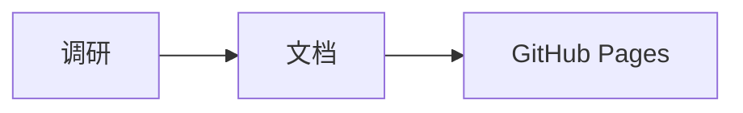
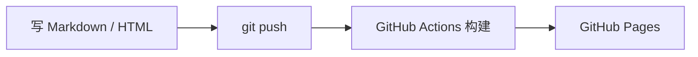

import Tabs from '@theme/Tabs';
import TabItem from '@theme/TabItem';

# 本站写作指南

本站用 [Docusaurus](https://docusaurus.io/zh-CN/) 构建。推送到 `master` 后，GitHub Actions 自动构建并发布到 GitHub Pages。

## 内容结构

```text
docs/
├── research/                    # 调研
│   ├── index.mdx                # 调研总览（自动列出所有分类和专题）
│   └── ai-engineering/          # 分类
│       ├── _category_.json      # 分类名称、排序、描述
│       └── prompt-management/   # 专题（一个目录 = 一个调研）
│           ├── index.md         # 专题概览，首页卡片读取它的标题和描述
│           ├── coze-loop.md     # 详细报告
│           ├── interactive.mdx  # 嵌入交互页面
│           └── assets/          # 图片
└── learning/                    # 学习
    ├── index.mdx
    └── tools/                   # 分类
        ├── _category_.json
        └── writing-guide.mdx    # 单文件笔记
static/
└── html/
    └── prompt-management/
        └── index.html           # 独立 HTML 页面，原样发布
```

- **分类**：`docs/<research|learning>/` 下的一级目录。
- **条目**：分类下的二级内容。可以是一个目录（多篇文档，带 `index.md`），也可以是单个 `.md` / `.mdx` 文件。
- 首页、总览页、侧边栏都根据目录自动生成。不需要手工维护列表。

## 新增一个调研

<Tabs>
  <TabItem value="topic" label="1. 新建专题目录" default>

在已有分类下新建目录，并添加 `index.md`：

```md title="docs/research/ai-engineering/my-topic/index.md"
---
sidebar_position: 1
sidebar_label: 概览
title: 我的调研标题
description: 一句话说明调研范围和结论。首页卡片显示这段文字。
tags: [LLM, 评测]
date: 2026-10-03
---

# 我的调研标题

正文……
```

  </TabItem>
  <TabItem value="category" label="2. 需要时新建分类">

```json title="docs/research/databases/_category_.json"
{
  "label": "数据库",
  "position": 2,
  "description": "存储引擎、分布式数据库、OLAP 调研。",
  "link": {
    "type": "generated-index",
    "slug": "/research/databases"
  },
  "customProps": {"badge": "DB"}
}
```

`customProps.badge` 是分类图标上的短文字。省略时取名称首字。

  </TabItem>
  <TabItem value="preview" label="3. 本地预览">

```bash
npm install
npm start          # http://localhost:3000/survey/
npm run build      # 构建并检查断链
```

  </TabItem>
</Tabs>

### Front matter 字段

| 字段 | 作用 |
|---|---|
| `title` | 页面标题，也是卡片标题 |
| `description` | 卡片和搜索结果中的摘要 |
| `tags` | 标签。所有标签汇总在 [标签页](/tags) |
| `date` | 用于"最近更新"排序。省略时用 Git 最后修改时间 |
| `sidebar_position` / `sidebar_label` | 侧边栏顺序和显示名 |
| `hide_table_of_contents` | 隐藏右侧目录，适合嵌入页面 |
| `reading_meta` | 设为 `false` 时，不在标题下显示阅读量、阅读时间和字数 |

每篇文档的标题下自动显示阅读量、预计阅读时间、字数和更新日期。阅读时间按每分钟 400 个汉字、200 个英文单词、40 行代码估算。全站数据见 [访问统计](/stats)。

## 交互式 HTML 页面

把完整的 HTML 文件放到 `static/html/<名称>/index.html`。构建时原样复制，不经过 Markdown 处理。

1. 页面自动出现在 [交互页面](/gallery) 列表中。列表读取 `<title>` 和 `<meta name="description">`。
2. 添加 `<meta name="survey:doc" content="/research/...">` 关联到所属文档。所属文档的卡片会显示"含交互页面"。
3. 添加 `<base target="_top">`，嵌入时点击链接会在整个窗口打开，而不是在框内。
4. 在文档中嵌入：

```mdx title="interactive.mdx"
import HtmlEmbed from '@site/src/components/HtmlEmbed';

<HtmlEmbed src="/html/my-page/" title="页面标题" />
```

同源页面会自动调整高度。传入 `height={720}` 可以固定高度。

:::tip
从 HTML 页面链接到文档时，使用相对路径，例如 `../../research/ai-engineering/my-topic`。这样本地预览和线上都能用。
:::

## Markdown 能力

`.md` 文件按标准 Markdown 解析，不必担心 `{` 和 `<` 被当成 JSX。需要导入组件时，使用 `.mdx`。

### 提示块

:::note
补充信息。
:::

:::warning
需要注意的风险。
:::

### Mermaid 图

````md

````



### 代码块

````md
```go title="main.go" {3}
package main

func main() {}
```
````

支持标题、行高亮和常见语言的语法高亮。

### 链接

- 文档之间用相对文件路径：`[对比](comparison.md)`。构建时会检查断链。
- 链接到 `static/` 中的文件用 `pathname:///html/my-page/`。
