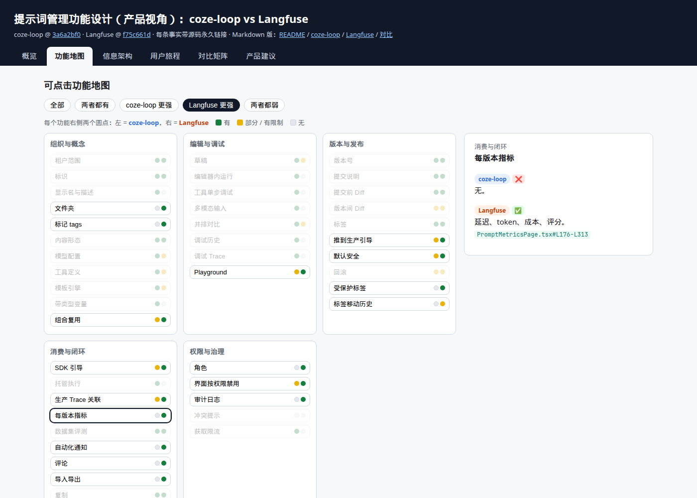

# 提示词管理功能设计调研：coze-loop vs Langfuse（产品视角）

本专题从**产品视角**对比两个开源 LLM 平台的提示词管理：用户看到什么、能做什么、如何发布与回滚、如何与 Trace / 评测 / 实验联动。

- 实现层（存储、缓存、API、执行路径）见 [提示词管理调研：coze-loop vs Langfuse](../prompt-management/index.md)。

## 文档索引

| 文档 | 内容 |
|---|---|
| [交互页面](interactive.mdx) | 可点击功能地图、信息架构线框图、用户旅程步进器、可筛选对比矩阵、Mermaid 图。也可[新窗口打开](pathname:///html/prompt-feature-design/) |
| [coze-loop 功能设计](coze-loop.md) | coze-loop 功能设计：功能地图、概念、路由与页面布局、用户旅程、生命周期、权限、限制、集成、缺口 |
| [Langfuse 功能设计](langfuse.md) | Langfuse 功能设计：同上结构 |
| [功能对比与产品建议](comparison.md) | 功能对比矩阵 + 自建提示词库的产品建议 + 建议信息架构 |

## 源码版本

| 系统 | 仓库 | 提交 |
|---|---|---|
| coze-loop | [wzqwtt/coze-loop](https://github.com/wzqwtt/coze-loop) | [`3a6a2bf0`](https://github.com/wzqwtt/coze-loop/tree/3a6a2bf07b057fec0c702e514e8345fb5684e83a) |
| Langfuse | [wzqwtt/langfuse](https://github.com/wzqwtt/langfuse) | [`f75c661d`](https://github.com/wzqwtt/langfuse/tree/f75c661dbe8c6b85523c81486b39e8403ac2c141) |

## 结论速览

| 维度 | coze-loop | Langfuse |
|---|---|---|
| 产品形态 | IDE 型工作台：编辑、调试、对比在一屏 | 注册中心型：版本、标签、指标闭环 |
| 编辑 | 服务端私有草稿，自动保存 | 每次保存即新版本 |
| 调试 | 编辑器内单次 / 多次 / 工具单步调试，最多 3 组对比 | 跳到 Playground；多窗口 |
| 发布 | 在提交弹窗或版本记录中编辑标签 | 专门的"推到生产"；新版本默认不上线 |
| 回滚 | 移动标签，或恢复为草稿再提交 | 移动 production 标签 |
| 闭环 | 调用记录 + 评测对象 | PromptBadge、Linked Generations、每版本指标、实验 |
| 治理 | 开源版无角色，删除限制仅前端 | RBAC 四角色 + 受保护标签 + 审计 + 自动化 |
| 主要缺口 | 无部署视图、无指标、SDK 引导外置、休眠概念多 | Playground 丢 config、REST 删除不发事件、Diff 受限 |

## 查看交互页面

- 在站内阅读：[交互页面](interactive.mdx)。
- 单独打开：[`/html/prompt-feature-design/`](pathname:///html/prompt-feature-design/)。源文件为 `static/html/prompt-feature-design/index.html`。
- 页面内的 Mermaid 从 jsDelivr CDN 加载，需要联网。

## 写作约定

- 简化技术中文（参考 ASD-STE100）：短句、一句一意、主动语态、术语一致、多用列表和表格。
- 每条事实附源码永久链接。推断用 **【推断】** 标注。
