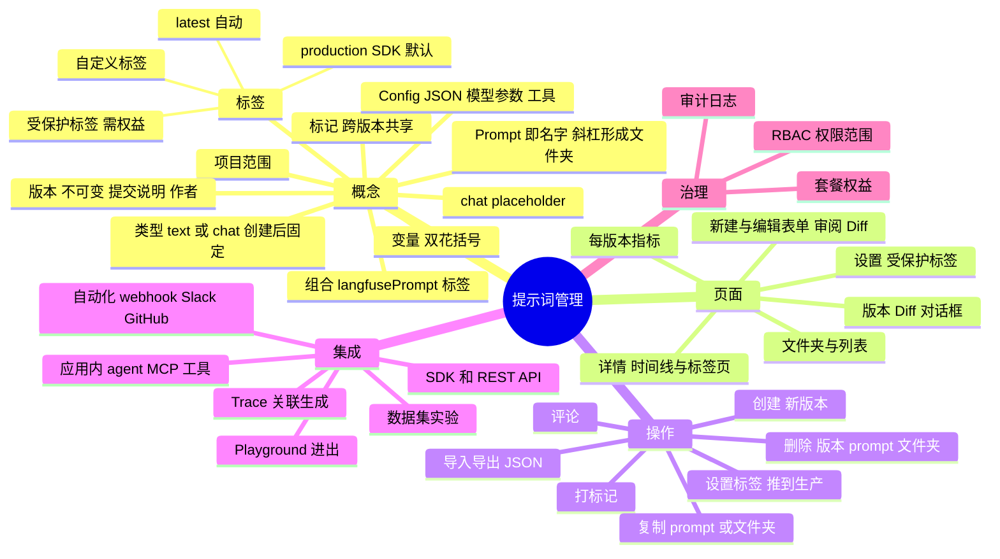
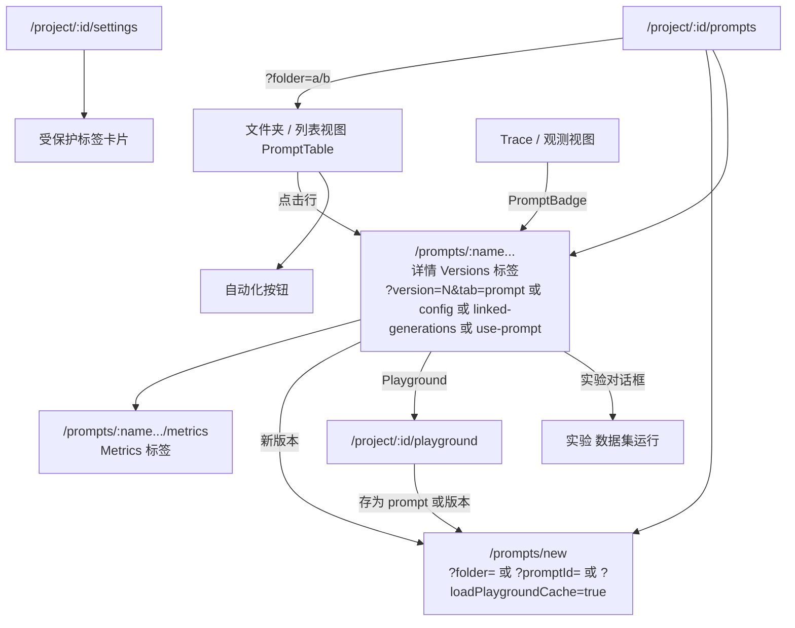
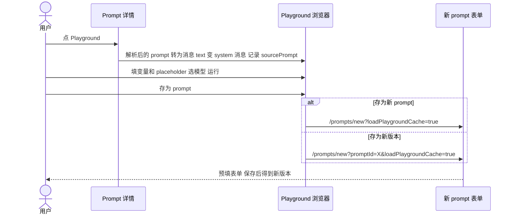
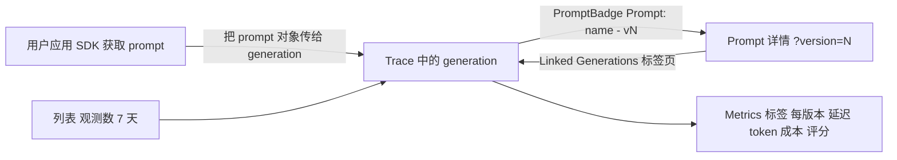
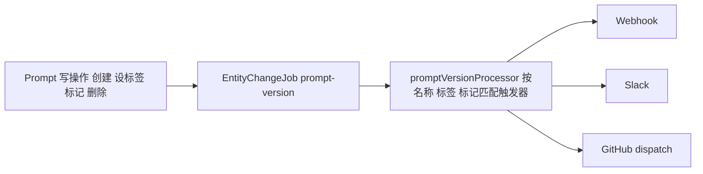
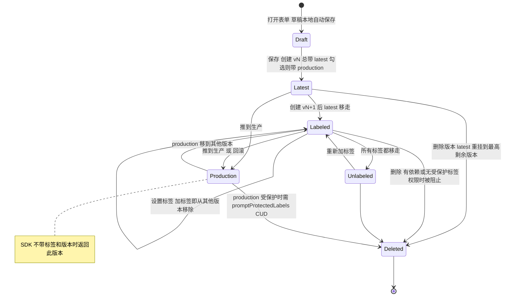

# Langfuse 提示词管理：功能设计（产品视角）

> 返回 [概览](index.md) · 对照阅读 [coze-loop](coze-loop.md) · [横向对比与产品建议](comparison.md) · [交互页面](interactive.mdx)

- **仓库：** [wzqwtt/langfuse](https://github.com/wzqwtt/langfuse)，提交 `f75c661dbe8c6b85523c81486b39e8403ac2c141`。
- **视角：** 用户能看到什么、能做什么。
- **后端实现** 见 [Langfuse 实现](../prompt-management/langfuse.md)。
- **规则：** 每条事实带永久链接。推断用 **【推断】** 标注。

## 目录

1. [结论速览](#1-结论速览)
2. [功能地图](#2-功能地图)
3. [概念与术语](#3-概念与术语)
4. [信息架构](#4-信息架构)
5. [关键用户旅程](#5-关键用户旅程)
6. [版本与标签生命周期](#6-版本与标签生命周期)
7. [权限与套餐](#7-权限与套餐)
8. [限制](#8-限制)
9. [集成](#9-集成)
10. [设计取舍与缺口](#10-设计取舍与缺口)

## 1. 结论速览

- **产品模型："带部署指针的 git"。**
  - Prompt 是一个名字。名字中的 `/` 显示为文件夹。
  - 每个 prompt 有只增不改的版本列表，每个版本可带提交说明。
  - 标签是指向版本的可移动指针。`production` 是 SDK 默认读取的标签。`latest` 自动设置。可以自定义标签（如 `staging`）。
  - 付费企业套餐可以把标签锁在额外权限后面：**受保护标签**。
- **界面：**
  - 文件夹与列表视图
  - 详情页：版本时间线 + Prompt / Config / Linked Generations / Use Prompt 四个标签页
  - 新版本表单（同时是编辑器）
  - Diff 对话框
  - 每版本指标页
  - 跳转到 Playground 和实验
- **编辑总是产生新版本。** 不能原地修改版本，不能重命名 prompt。"新版本"打开预填所选版本内容的创建表单。
- **套餐限制很轻：** 所有套餐都能用提示词管理，数量不限。只有受保护标签需要权益（云端 team / enterprise、自托管 enterprise）。
- **RBAC：** Viewer 只读；Member 可增删改；Admin 和 Owner 还能管理受保护标签。
- **集成：** Trace 关联、每版本指标、Playground 双向、数据集实验、自动化（webhook / Slack / GitHub）、评论、导入导出、应用内 agent 的 MCP 工具。

## 2. 功能地图



## 3. 概念与术语

| 概念 | 产品行为 | 证据 |
|---|---|---|
| **项目** | Prompt 属于项目。每个项目有自己的命名空间、受保护标签、RBAC、缓存。 | 路由在 `/project/[projectId]/prompts` 下。[pages](https://github.com/wzqwtt/langfuse/blob/f75c661dbe8c6b85523c81486b39e8403ac2c141/web/src/pages/project/%5BprojectId%5D/prompts/%5B%5B...folder%5D%5D.tsx#L1) |
| **名字 / 文件夹** | 名字中的 `/` 形成虚拟文件夹，没有文件夹实体。保留名 `new`、`metrics`、`prompt-detail`；禁用 `\|`（组合分隔符）。名字不可改，提示："Prompt 名不能修改。请复制到新名字。" | [validation.ts#L12-L24](https://github.com/wzqwtt/langfuse/blob/f75c661dbe8c6b85523c81486b39e8403ac2c141/packages/shared/src/features/prompts/validation.ts#L12-L24)、[constants.ts#L6-L19](https://github.com/wzqwtt/langfuse/blob/f75c661dbe8c6b85523c81486b39e8403ac2c141/packages/shared/src/features/prompts/constants.ts#L6-L19)、[prompt-detail.tsx#L401-L406](https://github.com/wzqwtt/langfuse/blob/f75c661dbe8c6b85523c81486b39e8403ac2c141/web/src/features/prompts/components/prompt-detail.tsx#L401-L406) |
| **版本** | 整数，自增，不可变。时间线显示提交说明和创建人。保存表单总是创建新版本。 | [prompt-history.tsx#L127-L139](https://github.com/wzqwtt/langfuse/blob/f75c661dbe8c6b85523c81486b39e8403ac2c141/web/src/features/prompts/components/prompt-history.tsx#L127-L139)、[createPrompt.ts#L170](https://github.com/wzqwtt/langfuse/blob/f75c661dbe8c6b85523c81486b39e8403ac2c141/web/src/features/prompts/server/actions/createPrompt.ts#L170) |
| **标签** | 每个名字内唯一的指针；赋给一个版本会从其他版本移走。小写，≤ 36 字符。`latest` 每次创建自动加，API 不能设置。客户端不给标签和版本时返回 `production`。 | [constants.ts#L22-L25](https://github.com/wzqwtt/langfuse/blob/f75c661dbe8c6b85523c81486b39e8403ac2c141/packages/shared/src/features/prompts/constants.ts#L22-L25)、[createPrompt.ts#L190-L203](https://github.com/wzqwtt/langfuse/blob/f75c661dbe8c6b85523c81486b39e8403ac2c141/web/src/features/prompts/server/actions/createPrompt.ts#L190-L203)、[promptVersionHandler.ts#L10-L16](https://github.com/wzqwtt/langfuse/blob/f75c661dbe8c6b85523c81486b39e8403ac2c141/web/src/features/prompts/server/handlers/promptVersionHandler.ts#L10-L16)、[getPromptByName.ts#L49-L55](https://github.com/wzqwtt/langfuse/blob/f75c661dbe8c6b85523c81486b39e8403ac2c141/web/src/features/prompts/server/actions/getPromptByName.ts#L49-L55) |
| **受保护标签** | 项目级标签列表（如 `production`）。增加、移动、删除带它的版本需要 `promptProtectedLabels:CUD`。`latest` 不能被保护。在项目设置中管理，受 `prompt-protected-labels` 权益限制。 | [promptRouter.ts#L1407-L1529](https://github.com/wzqwtt/langfuse/blob/f75c661dbe8c6b85523c81486b39e8403ac2c141/web/src/features/prompts/server/routers/promptRouter.ts#L1407-L1529)、[ProtectedLabelsSettings.tsx#L114-L227](https://github.com/wzqwtt/langfuse/blob/f75c661dbe8c6b85523c81486b39e8403ac2c141/web/src/features/prompts/components/ProtectedLabelsSettings.tsx#L114-L227)、[ProjectSettingsPage.tsx#L57](https://github.com/wzqwtt/langfuse/blob/f75c661dbe8c6b85523c81486b39e8403ac2c141/web/src/features/projects/ProjectSettingsPage.tsx#L57) |
| **标记（tags）** | 自由文本，作用于整个 prompt（同步到所有版本），列表可筛选。在详情页头部浮层编辑。 | [updatePromptTags.ts#L3-L36](https://github.com/wzqwtt/langfuse/blob/f75c661dbe8c6b85523c81486b39e8403ac2c141/web/src/features/prompts/server/utils/updatePromptTags.ts#L3-L36)、[prompt-detail.tsx#L427](https://github.com/wzqwtt/langfuse/blob/f75c661dbe8c6b85523c81486b39e8403ac2c141/web/src/features/prompts/components/prompt-detail.tsx#L427) |
| **text / chat** | 创建时选择，之后锁定。编辑时另一类型的开关禁用，服务端拒绝改类型。 | [NewPromptForm#L297-L318](https://github.com/wzqwtt/langfuse/blob/f75c661dbe8c6b85523c81486b39e8403ac2c141/web/src/features/prompts/components/NewPromptForm/index.tsx#L297-L318)、[createPrompt.ts#L111-L116](https://github.com/wzqwtt/langfuse/blob/f75c661dbe8c6b85523c81486b39e8403ac2c141/web/src/features/prompts/server/actions/createPrompt.ts#L111-L116) |
| **变量** | 写作 `{{variable}}`。表单和详情页列出识别到的变量。 | [NewPromptForm#L282-L290](https://github.com/wzqwtt/langfuse/blob/f75c661dbe8c6b85523c81486b39e8403ac2c141/web/src/features/prompts/components/NewPromptForm/index.tsx#L282-L290)、[prompt-detail.tsx#L745-L747](https://github.com/wzqwtt/langfuse/blob/f75c661dbe8c6b85523c81486b39e8403ac2c141/web/src/features/prompts/components/prompt-detail.tsx#L745-L747)、[stringChecks.ts#L7-L47](https://github.com/wzqwtt/langfuse/blob/f75c661dbe8c6b85523c81486b39e8403ac2c141/packages/shared/src/utils/stringChecks.ts#L7-L47) |
| **Placeholder（仅 chat）** | `{type:"placeholder", name}` 消息，运行时用消息数组（如聊天历史）填充。名字不能与变量名冲突。 | [compileChatMessages.ts#L34-L91](https://github.com/wzqwtt/langfuse/blob/f75c661dbe8c6b85523c81486b39e8403ac2c141/packages/shared/src/server/llm/compileChatMessages.ts#L34-L91)、[createPrompt.ts#L118-L127](https://github.com/wzqwtt/langfuse/blob/f75c661dbe8c6b85523c81486b39e8403ac2c141/web/src/features/prompts/server/actions/createPrompt.ts#L118-L127) |
| **组合** | "用加号按钮链接其他 text prompt"。选择器生成 `@@@langfusePrompt:name=…\|label=…@@@`。详情页可切换**已解析**和**带标签**视图。 | [PromptSelectionDialog.tsx#L32-L66](https://github.com/wzqwtt/langfuse/blob/f75c661dbe8c6b85523c81486b39e8403ac2c141/web/src/features/prompts/components/PromptSelectionDialog.tsx#L32-L66)、[prompt-detail.tsx#L695-L720](https://github.com/wzqwtt/langfuse/blob/f75c661dbe8c6b85523c81486b39e8403ac2c141/web/src/features/prompts/components/prompt-detail.tsx#L695-L720) |
| **Config** | "prompt 上的任意 JSON 配置。用于记录 LLM 参数、函数定义或其他元数据。"有独立 Config 标签页，包含在版本 Diff 中。实验从中读取工具。 | [NewPromptForm#L389-L411](https://github.com/wzqwtt/langfuse/blob/f75c661dbe8c6b85523c81486b39e8403ac2c141/web/src/features/prompts/components/NewPromptForm/index.tsx#L389-L411)、[prompt-detail.tsx#L752-L765](https://github.com/wzqwtt/langfuse/blob/f75c661dbe8c6b85523c81486b39e8403ac2c141/web/src/features/prompts/components/prompt-detail.tsx#L752-L765)、[experiments/utils.ts#L199-L218](https://github.com/wzqwtt/langfuse/blob/f75c661dbe8c6b85523c81486b39e8403ac2c141/worker/src/features/experiments/utils.ts#L199-L218) |

## 4. 信息架构

### 4.1 路由树

- 4 个 Next.js 页面都是功能组件的再导出：[folder](https://github.com/wzqwtt/langfuse/blob/f75c661dbe8c6b85523c81486b39e8403ac2c141/web/src/pages/project/%5BprojectId%5D/prompts/%5B%5B...folder%5D%5D.tsx#L1)、[new](https://github.com/wzqwtt/langfuse/blob/f75c661dbe8c6b85523c81486b39e8403ac2c141/web/src/pages/project/%5BprojectId%5D/prompts/new.tsx#L1-L3)、[metrics](https://github.com/wzqwtt/langfuse/blob/f75c661dbe8c6b85523c81486b39e8403ac2c141/web/src/pages/project/%5BprojectId%5D/prompts/metrics.tsx#L1)、[prompt-detail](https://github.com/wzqwtt/langfuse/blob/f75c661dbe8c6b85523c81486b39e8403ac2c141/web/src/pages/project/%5BprojectId%5D/prompts/prompt-detail.tsx#L1-L3)。
- 通配路由解析 URL 片段，决定显示指标、详情或文件夹。[PromptsPage.tsx#L28-L45](https://github.com/wzqwtt/langfuse/blob/f75c661dbe8c6b85523c81486b39e8403ac2c141/web/src/features/prompts/PromptsPage.tsx#L28-L45)
- 详情页有 2 个顶部标签：**Versions**、**Metrics**。[prompt-tabs.ts#L1-L17](https://github.com/wzqwtt/langfuse/blob/f75c661dbe8c6b85523c81486b39e8403ac2c141/web/src/features/navigation/utils/prompt-tabs.ts#L1-L17)



### 4.2 页面布局草图

**文件夹与列表视图**（[PromptsPage.tsx#L127-L195](https://github.com/wzqwtt/langfuse/blob/f75c661dbe8c6b85523c81486b39e8403ac2c141/web/src/features/prompts/PromptsPage.tsx#L127-L195)、[prompts-table.tsx#L115-L139](https://github.com/wzqwtt/langfuse/blob/f75c661dbe8c6b85523c81486b39e8403ac2c141/web/src/features/prompts/components/prompts-table.tsx#L115-L139)）

```text
┌──────────────────────────────────────────────────────────────────────────┐
│ Prompts                         [自动化] [导出 ▼] [导入] [+ 新 prompt]     │
│ 面包屑: prompts / team-a /         [搜索 ...]                              │
├──────────────┬──────┬──────┬────────────┬──────────────┬──────┬─────────┤
│ 名称         │版本数│ 类型 │最新版本创建│观测数 7 天 ↗ │ 标记 │ 操作     │
│ 📁 team-a/   │      │      │            │              │      │复制 删除 │
│ 📄 summarize │  5   │ chat │ 2026-09-30 │ 1,203        │ prod │删除      │
└──────────────┴──────┴──────┴────────────┴──────────────┴──────┴─────────┘
```

- 列：名称、版本数、类型、最新版本创建时间、**观测数（7 天）**（链接到观测视图）、标记、操作。[prompts-table.tsx#L304-L440](https://github.com/wzqwtt/langfuse/blob/f75c661dbe8c6b85523c81486b39e8403ac2c141/web/src/features/prompts/components/prompts-table.tsx#L304-L440)
- 导出选项："每个 prompt 最新版本"或"所有版本"，JSON 下载。
- 空项目显示 `PromptsOnboarding`。

**详情视图**（[prompt-detail.tsx#L320-L785](https://github.com/wzqwtt/langfuse/blob/f75c661dbe8c6b85523c81486b39e8403ac2c141/web/src/features/prompts/components/prompt-detail.tsx#L320-L344)）

```text
┌──────────────────────────────────────────────────────────────────────────┐
│ 面包屑 team-a / summarize            [标记 🏷] [复制]                      │
│ [Versions] [Metrics]                                                      │
├─────────────────────┬────────────────────────────────────────────────────┤
│ [搜索] [+ 新版本]    │ v5  [设置标签] [Playground] [实验] [评论] [删除版本] │
│ ● v5 latest         │ [Prompt] [Config] [Linked Generations] [Use Prompt] │
│   "改语气" @alice 💬2│  System: You are ...                               │
│ ○ v4 production [比较]│  User: {{text}}        [已解析 | 带标签]          │
│ ○ v3                │  变量: text                                        │
└─────────────────────┴────────────────────────────────────────────────────┘
```

- **左侧时间线：** 每个节点显示版本、标签、提交说明、作者、评论数、**比较**按钮（与当前选中版本 Diff）。[prompt-history.tsx#L140-L178](https://github.com/wzqwtt/langfuse/blob/f75c661dbe8c6b85523c81486b39e8403ac2c141/web/src/features/prompts/components/prompt-history.tsx#L140-L178)
- 选中版本保存在 `?version=`。
- **工具栏：** 设置标签、Playground、实验（需 `promptExperiments:CUD`）、评论抽屉、删除版本。[prompt-detail.tsx#L501-L645](https://github.com/wzqwtt/langfuse/blob/f75c661dbe8c6b85523c81486b39e8403ac2c141/web/src/features/prompts/components/prompt-detail.tsx#L501-L645)
- **内容标签页**（[prompt-detail.tsx#L654-L785](https://github.com/wzqwtt/langfuse/blob/f75c661dbe8c6b85523c81486b39e8403ac2c141/web/src/features/prompts/components/prompt-detail.tsx#L654-L785)）：
  - Prompt：渲染的消息或文本；使用组合时有"已解析 / 带标签"切换；变量列表。
  - Config：JSON 查看器。
  - Linked Generations：按 `promptName` + `promptVersion` 筛选的观测表。
  - Use Prompt：为当前名字和版本生成的 Python 和 JS/TS 代码片段。

**Diff**

- 时间线比较："Changes vA → vB"，两个面板：**Content**（词级 Diff，chat 消息规范化为排序键 JSON）和 **Config**。[PromptVersionDiffDialog.tsx#L18-L100](https://github.com/wzqwtt/langfuse/blob/f75c661dbe8c6b85523c81486b39e8403ac2c141/web/src/features/prompts/components/PromptVersionDiffDialog.tsx#L18-L100)
- 保存前审阅：`ReviewPromptDialog` 与基线版本对比。[ReviewPromptDialog.tsx#L44-L70](https://github.com/wzqwtt/langfuse/blob/f75c661dbe8c6b85523c81486b39e8403ac2c141/web/src/features/prompts/components/NewPromptForm/ReviewPromptDialog.tsx#L44-L70)

**新建 / 编辑表单**（[prompt-new.tsx#L9-L71](https://github.com/wzqwtt/langfuse/blob/f75c661dbe8c6b85523c81486b39e8403ac2c141/web/src/features/prompts/components/prompt-new.tsx#L9-L71)、[NewPromptForm#L76-L90](https://github.com/wzqwtt/langfuse/blob/f75c661dbe8c6b85523c81486b39e8403ac2c141/web/src/features/prompts/components/NewPromptForm/index.tsx#L76-L90)）

```text
┌──────────────────────────────────────────────┐
│ 新 prompt / summarize 的新版本                │
│ 名称 [team-a/______]   (仅新建)               │
│ 类型 (● Text ○ Chat)   (编辑时锁定)           │
│ Prompt [编辑器 ... {{var}} (+链接 prompt)]     │
│ Config [ { "model": "...", ... } ]           │
│ ☐ 设置 production 标签                        │
│ 提交说明 [__________]                         │
│                       [审阅变更] → [保存新版本] │
└──────────────────────────────────────────────┘
```

- `isActive`（即 production 标签）**新 prompt 默认 true，新版本默认 false**（`isActive: !Boolean(initialPrompt)`）。编辑不会自动上线。[NewPromptForm#L89](https://github.com/wzqwtt/langfuse/blob/f75c661dbe8c6b85523c81486b39e8403ac2c141/web/src/features/prompts/components/NewPromptForm/index.tsx#L89)
- 草稿按表单 id 保存在本地，恢复时提示"Draft restored."。[NewPromptForm#L194-L215](https://github.com/wzqwtt/langfuse/blob/f75c661dbe8c6b85523c81486b39e8403ac2c141/web/src/features/prompts/components/NewPromptForm/index.tsx#L194-L215)
- 可从 Playground 缓存预填。[NewPromptForm#L176-L186](https://github.com/wzqwtt/langfuse/blob/f75c661dbe8c6b85523c81486b39e8403ac2c141/web/src/features/prompts/components/NewPromptForm/index.tsx#L176-L186)

**指标页**（[PromptMetricsPage.tsx#L176-L313](https://github.com/wzqwtt/langfuse/blob/f75c661dbe8c6b85523c81486b39e8403ac2c141/web/src/features/prompts/PromptMetricsPage.tsx#L176-L313)）

- 每版本一行：版本、标签、中位延迟、中位输入 / 输出 token、中位成本、生成数、Trace 评分、生成评分、最后使用、首次使用。
- 后端查询：[promptRouter.ts#L1293-L1363](https://github.com/wzqwtt/langfuse/blob/f75c661dbe8c6b85523c81486b39e8403ac2c141/web/src/features/prompts/server/routers/promptRouter.ts#L1293-L1363)。
- 这是产品内置的跨版本 A/B 对比。

## 5. 关键用户旅程

### 5.1 创建 → 迭代 → 推到生产 → 回滚

```mermaid
flowchart LR
  A["Prompt 列表"] -->|"新 prompt"| B["表单 名称 类型 内容 config production 勾选 提交说明"]
  B -->|"保存"| C["详情 v1 latest + production"]
  C -->|"新版本"| D["表单预填 vN production 不勾选"]
  D -->|"审阅变更 Diff"| E["保存 vN+1 latest"]
  E -->|"设置标签 staging"| F["SDK 用 label=staging 测试"]
  F -->|"设置标签 production"| G["SDK 默认读取到新版本"]
  G -->|"出现回归"| H["把 production 移回 vN 即回滚"]
```



- **设置标签对话框**（[SetPromptVersionLabels#L210-L225](https://github.com/wzqwtt/langfuse/blob/f75c661dbe8c6b85523c81486b39e8403ac2c141/web/src/features/prompts/components/SetPromptVersionLabels/index.tsx#L210-L225)）：
  - 说明带 production 标签的版本是默认返回的版本。
  - 有"推到生产？"分组。
  - 按钮文案："保存并推到生产"或"保存并从生产移除"。
  - 需要 `prompts:CUD`。
- **回滚** 没有专门操作。回滚 = 把 `production` 移回旧版本。版本不可变，所以这很安全。
- **SDK：** Use Prompt 标签页展示代码片段。[prompt-detail.tsx#L766-L785](https://github.com/wzqwtt/langfuse/blob/f75c661dbe8c6b85523c81486b39e8403ac2c141/web/src/features/prompts/components/prompt-detail.tsx#L766-L785)

### 5.2 比较版本

1. 在时间线选中一个版本。
2. 悬停另一个版本节点，点**比较**。对话框显示内容和 config 的 Diff。[prompt-history.tsx#L140-L178](https://github.com/wzqwtt/langfuse/blob/f75c661dbe8c6b85523c81486b39e8403ac2c141/web/src/features/prompts/components/prompt-history.tsx#L140-L178)

- Diff 总是相对**当前选中**版本。没有任意 A vs B 选择器。

### 5.3 在 Playground 测试并存回



- 载入：使用**已解析**的 prompt，text 变成 1 条 system 消息，记录 `sourcePrompt`。支持多个窗口，达到上限时失败。[JumpToPlaygroundDropdownMenuController.tsx#L265-L306](https://github.com/wzqwtt/langfuse/blob/f75c661dbe8c6b85523c81486b39e8403ac2c141/web/src/features/playground/page/components/JumpToPlaygroundDropdownMenuController.tsx#L265-L306)
- 存回："存为新 prompt"、"存为新版本"。[SaveToPromptButton.tsx#L59-L91](https://github.com/wzqwtt/langfuse/blob/f75c661dbe8c6b85523c81486b39e8403ac2c141/web/src/features/playground/page/components/SaveToPromptButton.tsx#L59-L91)

### 5.4 在数据集上跑实验

1. 在详情页打开实验对话框，预填当前 prompt。[prompt-detail.tsx#L556-L588](https://github.com/wzqwtt/langfuse/blob/f75c661dbe8c6b85523c81486b39e8403ac2c141/web/src/features/prompts/components/prompt-detail.tsx#L556-L588)
2. 多步表单用 `experiments.validateConfig` 实时校验 prompt 与数据集。[MultiStepExperimentForm.tsx#L272-L280](https://github.com/wzqwtt/langfuse/blob/f75c661dbe8c6b85523c81486b39e8403ac2c141/web/src/features/experiments/components/MultiStepExperimentForm.tsx#L272-L280)、[router.ts#L93-L212](https://github.com/wzqwtt/langfuse/blob/f75c661dbe8c6b85523c81486b39e8403ac2c141/web/src/features/experiments/server/router.ts#L93-L212)
   - prompt 必须有变量或 placeholder："所选 prompt 没有变量或 placeholder"。
   - 数据集条目输入必须以顶层键包含这些变量。[describeVariableMismatch.ts#L8-L16](https://github.com/wzqwtt/langfuse/blob/f75c661dbe8c6b85523c81486b39e8403ac2c141/web/src/features/experiments/fns/describeVariableMismatch.ts#L8-L16)
3. 提交后创建数据集运行，worker 异步执行。[router.ts#L213-L300](https://github.com/wzqwtt/langfuse/blob/f75c661dbe8c6b85523c81486b39e8403ac2c141/web/src/features/experiments/server/router.ts#L213-L300)
4. 结果显示为数据集运行，其中的生成关联回 prompt 版本。

### 5.5 Trace、prompt 与指标闭环



- `PromptBadge` 深链到 `/prompts/{name}?version=N`。[PromptBadge.tsx#L7-L19](https://github.com/wzqwtt/langfuse/blob/f75c661dbe8c6b85523c81486b39e8403ac2c141/web/src/features/traces/components/PromptBadge.tsx#L7-L19)
- Linked Generations 标签页。[prompt-detail.tsx#L667-L689](https://github.com/wzqwtt/langfuse/blob/f75c661dbe8c6b85523c81486b39e8403ac2c141/web/src/features/prompts/components/prompt-detail.tsx#L667-L689)

### 5.6 自动化（webhook、Slack、GitHub）



- 入口：列表页的自动化按钮。[PromptsPage.tsx#L129](https://github.com/wzqwtt/langfuse/blob/f75c661dbe8c6b85523c81486b39e8403ac2c141/web/src/features/prompts/PromptsPage.tsx#L129)
- 事件：created（新版本）、updated（标记或标签变化）、deleted（删除版本）。默认全选，带内联筛选器。[automationForm.tsx#L268-L312](https://github.com/wzqwtt/langfuse/blob/f75c661dbe8c6b85523c81486b39e8403ac2c141/web/src/features/automations/components/automationForm.tsx#L268-L312)
- 匹配：在内存中按名称、标签、标记过滤。[promptVersionProcessor.ts#L50-L60](https://github.com/wzqwtt/langfuse/blob/f75c661dbe8c6b85523c81486b39e8403ac2c141/worker/src/features/entityChange/promptVersionProcessor.ts#L50-L60)
- 动作类型：Webhook、Slack、GitHub dispatch。[actions/index.ts](https://github.com/wzqwtt/langfuse/blob/f75c661dbe8c6b85523c81486b39e8403ac2c141/web/src/features/automations/components/actions/index.ts)
- **【推断】** 典型用法：`production` 移动时通知 Slack 或触发 CI。

### 5.7 批量操作

- **导出：** 最新版本或所有版本，超过 10,000 版本拒绝。[promptRouter.ts#L1530-L1583](https://github.com/wzqwtt/langfuse/blob/f75c661dbe8c6b85523c81486b39e8403ac2c141/web/src/features/prompts/server/routers/promptRouter.ts#L1530-L1583)
- **导入：** 每次 ≤ 500 条。导入时去掉 `latest` 和 `production`，所以导入不会上线。检查数量限制和受保护标签权限，按条返回结果。[promptRouter.ts#L1585-L1728](https://github.com/wzqwtt/langfuse/blob/f75c661dbe8c6b85523c81486b39e8403ac2c141/web/src/features/prompts/server/routers/promptRouter.ts#L1585-L1728)
- **复制：** 单版本或全部版本；文件夹复制可选重写组合引用。[createPrompt.ts#L292-L691](https://github.com/wzqwtt/langfuse/blob/f75c661dbe8c6b85523c81486b39e8403ac2c141/web/src/features/prompts/server/actions/createPrompt.ts#L292-L691)

## 6. 版本与标签生命周期



- 创建总加 `latest`，并从旧版本移走新标签。[createPrompt.ts#L190-L203](https://github.com/wzqwtt/langfuse/blob/f75c661dbe8c6b85523c81486b39e8403ac2c141/web/src/features/prompts/server/actions/createPrompt.ts#L190-L203)
- 删除重挂 `latest`，阻止会断开依赖的删除。[deletePrompt.ts#L56-L119](https://github.com/wzqwtt/langfuse/blob/f75c661dbe8c6b85523c81486b39e8403ac2c141/web/src/features/prompts/server/actions/deletePrompt.ts#L56-L119)
- 删除版本按钮需要 `prompts:CUD`。[delete-prompt-version.tsx#L31-L77](https://github.com/wzqwtt/langfuse/blob/f75c661dbe8c6b85523c81486b39e8403ac2c141/web/src/features/prompts/components/delete-prompt-version.tsx#L31-L77)

## 7. 权限与套餐

### 7.1 RBAC

权限范围：`prompts:read`、`prompts:CUD`、`promptProtectedLabels:CUD`、`promptExperiments:read`、`promptExperiments:CUD`。[projectAccessRights.ts#L35-L37](https://github.com/wzqwtt/langfuse/blob/f75c661dbe8c6b85523c81486b39e8403ac2c141/packages/shared/src/features/rbac/projectAccessRights.ts#L35-L37)

| 角色 | prompts:read | prompts:CUD | promptProtectedLabels:CUD | promptExperiments |
|---|---|---|---|---|
| OWNER | ✓ | ✓ | ✓ | read + CUD |
| ADMIN | ✓ | ✓ | ✓ | read + CUD |
| MEMBER | ✓ | ✓ | ✗ | read + CUD |
| VIEWER | ✓ | ✗ | ✗ | read |
| NONE | ✗ | ✗ | ✗ | ✗ |

来源：[projectAccessRights.ts#L105-L293](https://github.com/wzqwtt/langfuse/blob/f75c661dbe8c6b85523c81486b39e8403ac2c141/packages/shared/src/features/rbac/projectAccessRights.ts#L105-L293)。

- **界面跟随权限：** 无 `prompts:CUD` 时，新 prompt、新版本、设置标签、删除都禁用。[PromptsPage.tsx#L47-L54](https://github.com/wzqwtt/langfuse/blob/f75c661dbe8c6b85523c81486b39e8403ac2c141/web/src/features/prompts/PromptsPage.tsx#L47-L54)、[SetPromptVersionLabels#L121](https://github.com/wzqwtt/langfuse/blob/f75c661dbe8c6b85523c81486b39e8403ac2c141/web/src/features/prompts/components/SetPromptVersionLabels/index.tsx#L121)
- **实验按钮** 需要 `promptExperiments:CUD`。[prompt-detail.tsx#L561-L564](https://github.com/wzqwtt/langfuse/blob/f75c661dbe8c6b85523c81486b39e8403ac2c141/web/src/features/prompts/components/prompt-detail.tsx#L561-L564)
- **API Key 与受保护标签：** 普通项目 API Key **可以**移动受保护标签（支持 CI 推送）。临时应用内 agent key 继承创建者权限。[authorizeProtectedLabelMutation.ts#L70-L152](https://github.com/wzqwtt/langfuse/blob/f75c661dbe8c6b85523c81486b39e8403ac2c141/web/src/features/prompts/server/utils/authorizeProtectedLabelMutation.ts#L70-L152)
- **应用内 agent MCP 工具**（[mcpPolicy.ts#L259-L290](https://github.com/wzqwtt/langfuse/blob/f75c661dbe8c6b85523c81486b39e8403ac2c141/packages/shared/src/in-app-agent/server/mcpPolicy.ts#L259-L290)）：
  - `getPrompt`、`getPromptUnresolved`、`listPrompts`：`prompts:read`，自动批准。
  - `createTextPrompt`、`createChatPrompt`、`updatePromptLabels`：`prompts:CUD`，**需要用户批准**。

### 7.2 套餐权益

来源：[entitlements.ts#L60-L180](https://github.com/wzqwtt/langfuse/blob/f75c661dbe8c6b85523c81486b39e8403ac2c141/web/src/features/entitlements/constants/entitlements.ts#L60-L180)。

| 套餐 | 受保护标签 | prompt 数量 |
|---|---|---|
| cloud:hobby / core / pro | ✗ | 不限 |
| cloud:team / enterprise | ✓ | 不限 |
| oss / self-hosted:pro | ✗ | 不限 |
| self-hosted:enterprise | ✓ | 不限 |

- 数量限制在界面上有接线，但所有套餐都设为 `false`，当前不生效。

## 8. 限制

| 限制 | 值 | 证据 |
|---|---|---|
| 标签 | ≤ 36 字符，`^[a-z0-9_\-.]+$` | [constants.ts#L22-L25](https://github.com/wzqwtt/langfuse/blob/f75c661dbe8c6b85523c81486b39e8403ac2c141/packages/shared/src/features/prompts/constants.ts#L22-L25) |
| 提交说明 | ≤ 500 字符 | [constants.ts#L3](https://github.com/wzqwtt/langfuse/blob/f75c661dbe8c6b85523c81486b39e8403ac2c141/packages/shared/src/features/prompts/constants.ts#L3) |
| Prompt 名 | ≤ 255 字符 | [constants.ts#L6](https://github.com/wzqwtt/langfuse/blob/f75c661dbe8c6b85523c81486b39e8403ac2c141/packages/shared/src/features/prompts/constants.ts#L6) |
| 组合深度 | 5 层，只能引用 text | [PromptService/index.ts#L20](https://github.com/wzqwtt/langfuse/blob/f75c661dbe8c6b85523c81486b39e8403ac2c141/packages/shared/src/server/services/PromptService/index.ts#L20) |
| 导入 | 每次 ≤ 500 条 | [promptRouter.ts#L1589](https://github.com/wzqwtt/langfuse/blob/f75c661dbe8c6b85523c81486b39e8403ac2c141/web/src/features/prompts/server/routers/promptRouter.ts#L1589) |
| 导出 | ≤ 10,000 版本 | [promptRouter.ts#L1548-L1553](https://github.com/wzqwtt/langfuse/blob/f75c661dbe8c6b85523c81486b39e8403ac2c141/web/src/features/prompts/server/routers/promptRouter.ts#L1548-L1553) |
| 筛选选项 | ≤ 1,000 个名字 | [promptRouter.ts#L473-L475](https://github.com/wzqwtt/langfuse/blob/f75c661dbe8c6b85523c81486b39e8403ac2c141/web/src/features/prompts/server/routers/promptRouter.ts#L473-L475) |
| 公开 API 限流 | 所有套餐不限 | [RateLimitService.ts#L280-L285](https://github.com/wzqwtt/langfuse/blob/f75c661dbe8c6b85523c81486b39e8403ac2c141/web/src/features/public-api/server/RateLimitService.ts#L280-L285) |

## 9. 集成

| 模块 | 集成方式 | 证据 |
|---|---|---|
| Trace / 观测 | Linked Generations 标签页；Trace 视图中的 PromptBadge；列表中的 7 天观测数 | [prompt-detail.tsx#L667-L689](https://github.com/wzqwtt/langfuse/blob/f75c661dbe8c6b85523c81486b39e8403ac2c141/web/src/features/prompts/components/prompt-detail.tsx#L667-L689)、[PromptBadge.tsx#L7-L19](https://github.com/wzqwtt/langfuse/blob/f75c661dbe8c6b85523c81486b39e8403ac2c141/web/src/features/traces/components/PromptBadge.tsx#L7-L19) |
| 评分 | Metrics 标签页按版本聚合 Trace 和生成评分 | [promptRouter.ts#L1322-L1361](https://github.com/wzqwtt/langfuse/blob/f75c661dbe8c6b85523c81486b39e8403ac2c141/web/src/features/prompts/server/routers/promptRouter.ts#L1322-L1361) |
| Playground | 打开到窗口；存为新 prompt 或新版本 | [SaveToPromptButton.tsx#L59-L91](https://github.com/wzqwtt/langfuse/blob/f75c661dbe8c6b85523c81486b39e8403ac2c141/web/src/features/playground/page/components/SaveToPromptButton.tsx#L59-L91) |
| 数据集 / 实验 | prompt × 数据集 × 模型 | [router.ts#L213-L300](https://github.com/wzqwtt/langfuse/blob/f75c661dbe8c6b85523c81486b39e8403ac2c141/web/src/features/experiments/server/router.ts#L213-L300) |
| LLM 连接 | 实验和 Playground 使用项目 LLM API Key | [experiments/utils.ts#L220-L231](https://github.com/wzqwtt/langfuse/blob/f75c661dbe8c6b85523c81486b39e8403ac2c141/worker/src/features/experiments/utils.ts#L220-L231) |
| 自动化 | Prompt 事件源 | [automations.ts#L5-L22](https://github.com/wzqwtt/langfuse/blob/f75c661dbe8c6b85523c81486b39e8403ac2c141/packages/shared/src/domain/automations.ts#L5-L22) |
| 评论 | 版本评论，时间线显示数量 | [prompt-detail.tsx#L590-L631](https://github.com/wzqwtt/langfuse/blob/f75c661dbe8c6b85523c81486b39e8403ac2c141/web/src/features/prompts/components/prompt-detail.tsx#L590-L631) |
| 审计日志 | 每次增删改都记录 | [promptRouter.ts#L352-L361](https://github.com/wzqwtt/langfuse/blob/f75c661dbe8c6b85523c81486b39e8403ac2c141/web/src/features/prompts/server/routers/promptRouter.ts#L352-L361)、[prompt-api-service.ts#L85-L93](https://github.com/wzqwtt/langfuse/blob/f75c661dbe8c6b85523c81486b39e8403ac2c141/web/src/features/prompts/server/prompt-api-service.ts#L85-L93) |
| 应用内 agent | MCP prompt 工具 | [mcpPolicy.ts#L259-L290](https://github.com/wzqwtt/langfuse/blob/f75c661dbe8c6b85523c81486b39e8403ac2c141/packages/shared/src/in-app-agent/server/mcpPolicy.ts#L259-L290) |
| LLM-as-judge | **未集成**，使用独立 `EvalTemplate` | [schema.prisma#L1007](https://github.com/wzqwtt/langfuse/blob/f75c661dbe8c6b85523c81486b39e8403ac2c141/packages/shared/prisma/schema.prisma#L1007) |

## 10. 设计取舍与缺口

### 10.1 取舍

| # | 取舍 | 好处 | 代价 |
|---|---|---|---|
| 1 | 标签做部署指针，版本不可变 | 部署和回滚只是移动指针；可先打 `staging` 再推到生产；完整历史 | 不能原地改错字；每次修改产生版本；不能重命名（只能复制）。[createPrompt.ts#L170](https://github.com/wzqwtt/langfuse/blob/f75c661dbe8c6b85523c81486b39e8403ac2c141/web/src/features/prompts/server/actions/createPrompt.ts#L170) |
| 2 | 编辑默认安全 | 新版本默认不带 `production`；新 prompt 默认带，方便首次上手 | —。[NewPromptForm#L89](https://github.com/wzqwtt/langfuse/blob/f75c661dbe8c6b85523c81486b39e8403ac2c141/web/src/features/prompts/components/NewPromptForm/index.tsx#L89) |
| 3 | 文件夹来自名字 | 简单；API 和 SDK 都按普通名字工作 | 移动文件夹要复制；保留名和路由边界问题。[PromptsPage.tsx#L29-L32](https://github.com/wzqwtt/langfuse/blob/f75c661dbe8c6b85523c81486b39e8403ac2c141/web/src/features/prompts/PromptsPage.tsx#L29-L32) |
| 4 | 内联标签组合，延迟绑定 | 复用简单；引用标签时自动跟随 | 只能引用 text，深度 5。[PromptService/index.ts#L20](https://github.com/wzqwtt/langfuse/blob/f75c661dbe8c6b85523c81486b39e8403ac2c141/packages/shared/src/server/services/PromptService/index.ts#L20) |
| 5 | 受保护标签是治理插件 | Member 仍可自由创建版本，只有推送被限制 | 普通 API Key 绕过 Member 级限制以便 CI 推送。[authorizeProtectedLabelMutation.ts#L70-L152](https://github.com/wzqwtt/langfuse/blob/f75c661dbe8c6b85523c81486b39e8403ac2c141/web/src/features/prompts/server/utils/authorizeProtectedLabelMutation.ts#L70-L152) |
| 6 | 服务端只存模板不渲染 | API 热路径便宜、可缓存（不限流） | 渲染逻辑在多个客户端重复。[promptNameHandler.ts#L40-L53](https://github.com/wzqwtt/langfuse/blob/f75c661dbe8c6b85523c81486b39e8403ac2c141/web/src/features/prompts/server/handlers/promptNameHandler.ts#L40-L53) |

### 10.2 缺口

| # | 缺口 | 证据 |
|---|---|---|
| 1 | prompt 数量限制只在批量导入时由服务端检查；单个创建只在界面提示。当前所有套餐都不限，所以暂无影响。 | [promptRouter.ts#L1606-L1647](https://github.com/wzqwtt/langfuse/blob/f75c661dbe8c6b85523c81486b39e8403ac2c141/web/src/features/prompts/server/routers/promptRouter.ts#L1606-L1647) |
| 2 | REST `DELETE /v2/prompts/{name}` 不发 deleted 自动化事件；tRPC 删除会发。SDK/API 删除被自动化漏掉。 | [deletePrompt.ts#L13-L127](https://github.com/wzqwtt/langfuse/blob/f75c661dbe8c6b85523c81486b39e8403ac2c141/web/src/features/prompts/server/actions/deletePrompt.ts#L13-L127)、[promptRouter.ts#L800-L812](https://github.com/wzqwtt/langfuse/blob/f75c661dbe8c6b85523c81486b39e8403ac2c141/web/src/features/prompts/server/routers/promptRouter.ts#L800-L812) |
| 3 | 降级后受保护标签仍生效：检查不看套餐，但设置卡片被隐藏。 | [checkHasProtectedLabels.ts#L9-L25](https://github.com/wzqwtt/langfuse/blob/f75c661dbe8c6b85523c81486b39e8403ac2c141/web/src/features/prompts/server/utils/checkHasProtectedLabels.ts#L9-L25)、[ProjectSettingsPage.tsx#L57](https://github.com/wzqwtt/langfuse/blob/f75c661dbe8c6b85523c81486b39e8403ac2c141/web/src/features/projects/ProjectSettingsPage.tsx#L57) |
| 4 | Playground 往返丢失 config（模型参数、工具）；使用已解析内容，存回时组合标签被展平；Playground 运行不关联版本。 | [JumpToPlaygroundDropdownMenuController.tsx#L265-L306](https://github.com/wzqwtt/langfuse/blob/f75c661dbe8c6b85523c81486b39e8403ac2c141/web/src/features/playground/page/components/JumpToPlaygroundDropdownMenuController.tsx#L265-L306) |
| 5 | 公开 API 不能原地移除标签：PATCH 取并集。界面的 `setLabels` 可以移除。 | [updatePrompts.ts#L52](https://github.com/wzqwtt/langfuse/blob/f75c661dbe8c6b85523c81486b39e8403ac2c141/web/src/features/prompts/server/actions/updatePrompts.ts#L52) |
| 6 | Diff 总是相对选中版本；无任意 A/B；无标签和标记 Diff；时间线不显示标签移动历史。 | [prompt-history.tsx#L140-L178](https://github.com/wzqwtt/langfuse/blob/f75c661dbe8c6b85523c81486b39e8403ac2c141/web/src/features/prompts/components/prompt-history.tsx#L140-L178) |
| 7 | 内部文档过时：README 描述基于锁的按名字失效，代码用项目 epoch。 | [prompts/README.md#L1-L17](https://github.com/wzqwtt/langfuse/blob/f75c661dbe8c6b85523c81486b39e8403ac2c141/web/src/features/prompts/README.md#L1-L17) |
| 8 | 提示词管理与 LLM-as-judge 未统一。 | [schema.prisma#L1007](https://github.com/wzqwtt/langfuse/blob/f75c661dbe8c6b85523c81486b39e8403ac2c141/packages/shared/prisma/schema.prisma#L1007) |
| 9 | 组合限制保存时才报错，选择器中看不到。 | [PromptSelectionDialog.tsx#L32-L66](https://github.com/wzqwtt/langfuse/blob/f75c661dbe8c6b85523c81486b39e8403ac2c141/web/src/features/prompts/components/PromptSelectionDialog.tsx#L32-L66) |
| 10 | URL 歧义：名字以 `/metrics` 结尾时直接访问会误显示指标页（代码注释承认）。 | [PromptsPage.tsx#L29-L32](https://github.com/wzqwtt/langfuse/blob/f75c661dbe8c6b85523c81486b39e8403ac2c141/web/src/features/prompts/PromptsPage.tsx#L29-L32) |
