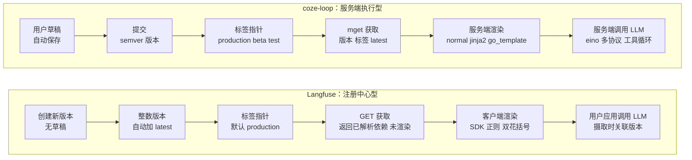
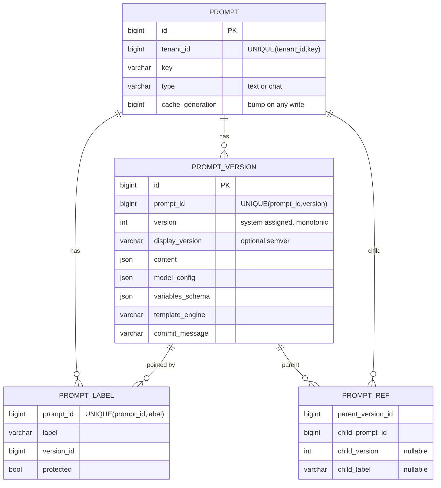

# coze-loop 与 Langfuse 提示词管理：横向对比与建议

> 返回 [概览](index.md) · 详细报告：[coze-loop](coze-loop.md) · [Langfuse](langfuse.md) · [交互页面](interactive.mdx)

- coze-loop 提交：`3a6a2bf0`。Langfuse 提交：`f75c661d`。
- 每个单元格都带源码永久链接。"建议"一节是基于证据的推断，已单独标注。

## 1. 一张图看差异

## 2. 对比矩阵

### 2.1 数据模型与存储

| 维度 | coze-loop | Langfuse |
|---|---|---|
| 数据库 | MySQL，JSON 文本列。[convertor/manage.go#L158-L200](https://github.com/wzqwtt/coze-loop/blob/3a6a2bf07b057fec0c702e514e8345fb5684e83a/backend/modules/prompt/infra/repo/mysql/convertor/manage.go#L158-L200) | Postgres（Prisma），`Json` 列。[schema.prisma#L786-L813](https://github.com/wzqwtt/langfuse/blob/f75c661dbe8c6b85523c81486b39e8403ac2c141/packages/shared/prisma/schema.prisma#L786-L813) |
| 提示词实体 | 头表 `prompt_basic` + 草稿表 + 提交表。[prompt.go#L12-L45](https://github.com/wzqwtt/coze-loop/blob/3a6a2bf07b057fec0c702e514e8345fb5684e83a/backend/modules/prompt/domain/entity/prompt.go#L12-L45) | 无父表。同名版本行的集合就是提示词。[schema.prisma#L786-L813](https://github.com/wzqwtt/langfuse/blob/f75c661dbe8c6b85523c81486b39e8403ac2c141/packages/shared/prisma/schema.prisma#L786-L813) |
| 租户 | `space_id`。[prompt_basic.sql#L1-L24](https://github.com/wzqwtt/coze-loop/blob/3a6a2bf07b057fec0c702e514e8345fb5684e83a/release/deployment/docker-compose/bootstrap/mysql-init/init-sql/prompt_basic.sql#L1-L24) | `projectId`。[schema.prisma#L786-L813](https://github.com/wzqwtt/langfuse/blob/f75c661dbe8c6b85523c81486b39e8403ac2c141/packages/shared/prisma/schema.prisma#L786-L813) |
| 内容类型 | 统一为消息列表。角色含 `placeholder`。支持多模态片段。[prompt_detail.go#L56-L111](https://github.com/wzqwtt/coze-loop/blob/3a6a2bf07b057fec0c702e514e8345fb5684e83a/backend/modules/prompt/domain/entity/prompt_detail.go#L56-L111) | `text`（字符串）或 `chat`（消息数组，含 placeholder）。[types.ts#L25-L29](https://github.com/wzqwtt/langfuse/blob/f75c661dbe8c6b85523c81486b39e8403ac2c141/packages/shared/src/features/prompts/types.ts#L25-L29) |
| 模型配置 | 强类型 `ModelConfig`，用 `ModelID` 引用模型注册表。[prompt_detail.go#L193-L242](https://github.com/wzqwtt/coze-loop/blob/3a6a2bf07b057fec0c702e514e8345fb5684e83a/backend/modules/prompt/domain/entity/prompt_detail.go#L193-L242) | 自由 JSON `config`，服务端基本不解释。[promptToolConfig.ts#L59](https://github.com/wzqwtt/langfuse/blob/f75c661dbe8c6b85523c81486b39e8403ac2c141/packages/shared/src/server/llm/promptToolConfig.ts#L59) |
| 工具 | 内联在提示词中；另有独立版本化的工具子系统。[toolmgmt/tool.go#L8-L46](https://github.com/wzqwtt/coze-loop/blob/3a6a2bf07b057fec0c702e514e8345fb5684e83a/backend/modules/prompt/domain/entity/toolmgmt/tool.go#L8-L46) | 放在 `config` 中，实验时解析。[promptToolConfig.ts#L59](https://github.com/wzqwtt/langfuse/blob/f75c661dbe8c6b85523c81486b39e8403ac2c141/packages/shared/src/server/llm/promptToolConfig.ts#L59) |
| 删除 | 软删除 basic，提交保留。[infra/repo/manage.go#L157-L181](https://github.com/wzqwtt/coze-loop/blob/3a6a2bf07b057fec0c702e514e8345fb5684e83a/backend/modules/prompt/infra/repo/manage.go#L157-L181) | 硬删除版本行；`latest` 重挂到最高剩余版本。[deletePrompt.ts#L96-L123](https://github.com/wzqwtt/langfuse/blob/f75c661dbe8c6b85523c81486b39e8403ac2c141/web/src/features/prompts/server/actions/deletePrompt.ts#L96-L123) |
| 分类 | 无标记；有安全级别 L1–L4。[prompt_basic.go#L8-L35](https://github.com/wzqwtt/coze-loop/blob/3a6a2bf07b057fec0c702e514e8345fb5684e83a/backend/modules/prompt/domain/entity/prompt_basic.go#L8-L35) | `tags[]`（GIN 索引）+ 名字中的 `/` 虚拟文件夹。[createPrompt.ts#L419-L691](https://github.com/wzqwtt/langfuse/blob/f75c661dbe8c6b85523c81486b39e8403ac2c141/web/src/features/prompts/server/actions/createPrompt.ts#L419-L691) |

### 2.2 版本与标签

| 维度 | coze-loop | Langfuse |
|---|---|---|
| 编辑模型 | 每用户私有草稿，800 ms 防抖自动保存。[use-prompt.ts#L238-L285](https://github.com/wzqwtt/coze-loop/blob/3a6a2bf07b057fec0c702e514e8345fb5684e83a/frontend/packages/loop-components/prompt-components-v2/src/hooks/use-prompt.ts#L238-L285) | 无草稿。每次保存创建新版本。[createPrompt.ts#L93-L290](https://github.com/wzqwtt/langfuse/blob/f75c661dbe8c6b85523c81486b39e8403ac2c141/web/src/features/prompts/server/actions/createPrompt.ts#L93-L290) |
| 版本号 | 用户指定的严格 semver，不校验递增。[application/manage.go#L578-L639](https://github.com/wzqwtt/coze-loop/blob/3a6a2bf07b057fec0c702e514e8345fb5684e83a/backend/modules/prompt/application/manage.go#L578-L639) | 系统分配的整数，`latest + 1`。[createPrompt.ts#L160-L175](https://github.com/wzqwtt/langfuse/blob/f75c661dbe8c6b85523c81486b39e8403ac2c141/web/src/features/prompts/server/actions/createPrompt.ts#L160-L175) |
| 提交说明 | `description`。[prompt_commit.sql#L1-L29](https://github.com/wzqwtt/coze-loop/blob/3a6a2bf07b057fec0c702e514e8345fb5684e83a/release/deployment/docker-compose/bootstrap/mysql-init/init-sql/prompt_commit.sql#L1-L29) | `commitMessage`，≤ 500 字符。[types.ts#L37-L86](https://github.com/wzqwtt/langfuse/blob/f75c661dbe8c6b85523c81486b39e8403ac2c141/packages/shared/src/features/prompts/types.ts#L37-L86) |
| 标签存储 | 独立映射表，DB 唯一约束保证 1 标签 1 版本。[prompt_commit_label_mapping.sql#L1-L19](https://github.com/wzqwtt/coze-loop/blob/3a6a2bf07b057fec0c702e514e8345fb5684e83a/release/deployment/docker-compose/bootstrap/mysql-init/init-sql/prompt_commit_label_mapping.sql#L1-L19) | 行上的数组，应用代码在事务中保证唯一。[updatePromptLabels.ts#L3-L43](https://github.com/wzqwtt/langfuse/blob/f75c661dbe8c6b85523c81486b39e8403ac2c141/web/src/features/prompts/server/utils/updatePromptLabels.ts#L3-L43) |
| 预置标签 | `production`、`beta`、`test`（配置）。[prompt.yaml#L18-L22](https://github.com/wzqwtt/coze-loop/blob/3a6a2bf07b057fec0c702e514e8345fb5684e83a/release/deployment/docker-compose/conf/prompt.yaml#L18-L22) | `latest`（自动）、`production`（默认读取）。[constants.ts#L1-L2](https://github.com/wzqwtt/langfuse/blob/f75c661dbe8c6b85523c81486b39e8403ac2c141/packages/shared/src/features/prompts/constants.ts#L1-L2) |
| 标签权限 | 无角色模型，开源版只查空间成员。[foundation/application/auth.go#L30-L70](https://github.com/wzqwtt/coze-loop/blob/3a6a2bf07b057fec0c702e514e8345fb5684e83a/backend/modules/foundation/application/auth.go#L30-L70) | 受保护标签 + 独立 RBAC 动作。[authorizeProtectedLabelMutation.ts#L70-L152](https://github.com/wzqwtt/langfuse/blob/f75c661dbe8c6b85523c81486b39e8403ac2c141/web/src/features/prompts/server/utils/authorizeProtectedLabelMutation.ts#L70-L152) |
| 并发控制 | 所有写先 `FOR UPDATE` 锁 basic 行。[manage.go#L536-L546](https://github.com/wzqwtt/coze-loop/blob/3a6a2bf07b057fec0c702e514e8345fb5684e83a/backend/modules/prompt/infra/repo/manage.go#L536-L546) | 创建不加锁，靠唯一索引 + 重试；改标签锁目标行。[createPrompt.ts#L222-L236](https://github.com/wzqwtt/langfuse/blob/f75c661dbe8c6b85523c81486b39e8403ac2c141/web/src/features/prompts/server/actions/createPrompt.ts#L222-L236) |
| 变更通知 | 事件收集器为空实现。[event_collector.go#L51-L62](https://github.com/wzqwtt/coze-loop/blob/3a6a2bf07b057fec0c702e514e8345fb5684e83a/backend/modules/prompt/infra/collector/event_collector.go#L51-L62) | 每次写发事件，驱动 webhook / Slack。[promptVersionProcessor.ts#L26-L115](https://github.com/wzqwtt/langfuse/blob/f75c661dbe8c6b85523c81486b39e8403ac2c141/worker/src/features/entityChange/promptVersionProcessor.ts#L26-L115) |
| 审计 | 创建、更新、提交时做内容审核（fail open）。[audit.go#L32-L75](https://github.com/wzqwtt/coze-loop/blob/3a6a2bf07b057fec0c702e514e8345fb5684e83a/backend/modules/prompt/infra/rpc/audit.go#L32-L75) | 每次写记审计日志。[prompt-api-service.ts#L41-L96](https://github.com/wzqwtt/langfuse/blob/f75c661dbe8c6b85523c81486b39e8403ac2c141/web/src/features/prompts/server/prompt-api-service.ts#L41-L96) |

### 2.3 模板与组合

| 维度 | coze-loop | Langfuse |
|---|---|---|
| 引擎 | `normal`（fasttemplate）、`jinja2`（gonja 沙箱）、`go_template`。[prompt_detail.go#L400-L422](https://github.com/wzqwtt/coze-loop/blob/3a6a2bf07b057fec0c702e514e8345fb5684e83a/backend/modules/prompt/domain/entity/prompt_detail.go#L400-L422) | 正则 `{{var}}`，无条件和循环。[prompts.ts#L14-L31](https://github.com/wzqwtt/langfuse/blob/f75c661dbe8c6b85523c81486b39e8403ac2c141/packages/shared/src/utils/prompts.ts#L14-L31) |
| 变量类型 | 字符串、布尔、整数、浮点、对象、数组、placeholder、multi_part。[prompt_detail.go#L113-L142](https://github.com/wzqwtt/coze-loop/blob/3a6a2bf07b057fec0c702e514e8345fb5684e83a/backend/modules/prompt/domain/entity/prompt_detail.go#L113-L142) | 文本变量 + placeholder（消息数组）。[compileChatMessages.ts#L21-L91](https://github.com/wzqwtt/langfuse/blob/f75c661dbe8c6b85523c81486b39e8403ac2c141/packages/shared/src/server/llm/compileChatMessages.ts#L21-L91) |
| 未知变量 | `normal`：原样保留。[prompt_detail.go#L400-L422](https://github.com/wzqwtt/coze-loop/blob/3a6a2bf07b057fec0c702e514e8345fb5684e83a/backend/modules/prompt/domain/entity/prompt_detail.go#L400-L422) | 原样保留。[prompts.ts#L14-L31](https://github.com/wzqwtt/langfuse/blob/f75c661dbe8c6b85523c81486b39e8403ac2c141/packages/shared/src/utils/prompts.ts#L14-L31) |
| 安全限制 | 10 s 超时、1 MB 输出、禁用 include、range ≤ 10,000。[jinja_template.go#L21-L104](https://github.com/wzqwtt/coze-loop/blob/3a6a2bf07b057fec0c702e514e8345fb5684e83a/backend/modules/prompt/pkg/template/jinja_template.go#L21-L104) | 无需沙箱（无表达式能力）。[prompts.ts#L14-L31](https://github.com/wzqwtt/langfuse/blob/f75c661dbe8c6b85523c81486b39e8403ac2c141/packages/shared/src/utils/prompts.ts#L14-L31) |
| 组合语法 | `<cozeloop_snippet>id=N&version=V</cozeloop_snippet>`。[snippet_parser.go#L33-L78](https://github.com/wzqwtt/coze-loop/blob/3a6a2bf07b057fec0c702e514e8345fb5684e83a/backend/modules/prompt/domain/service/snippet_parser.go#L33-L78) | `@@@langfusePrompt:name=X\|version=N@@@` 或 `label=L`。[parsePromptDependencyTags.ts#L3-L61](https://github.com/wzqwtt/langfuse/blob/f75c661dbe8c6b85523c81486b39e8403ac2c141/packages/shared/src/features/prompts/parsePromptDependencyTags.ts#L3-L61) |
| 引用方式 | 按 ID + 固定版本。[prompt_relation.sql#L1-L15](https://github.com/wzqwtt/coze-loop/blob/3a6a2bf07b057fec0c702e514e8345fb5684e83a/release/deployment/docker-compose/bootstrap/mysql-init/init-sql/prompt_relation.sql#L1-L15) | 按名字 + 版本或标签，延迟绑定。[schema.prisma#L815-L833](https://github.com/wzqwtt/langfuse/blob/f75c661dbe8c6b85523c81486b39e8403ac2c141/packages/shared/prisma/schema.prisma#L815-L833) |
| 深度 / 环 | 最多 2 层。[service/manage.go#L471-L597](https://github.com/wzqwtt/coze-loop/blob/3a6a2bf07b057fec0c702e514e8345fb5684e83a/backend/modules/prompt/domain/service/manage.go#L471-L597) | 最多 5 层，检测环。[PromptService/index.ts#L267-L284](https://github.com/wzqwtt/langfuse/blob/f75c661dbe8c6b85523c81486b39e8403ac2c141/packages/shared/src/server/services/PromptService/index.ts#L267-L284) |
| 片段内容 | 只取片段第一条消息的内容。[service/manage.go#L514-L533](https://github.com/wzqwtt/coze-loop/blob/3a6a2bf07b057fec0c702e514e8345fb5684e83a/backend/modules/prompt/domain/service/manage.go#L514-L533) | 只能引用 text 提示词。[PromptService/index.ts#L329-L349](https://github.com/wzqwtt/langfuse/blob/f75c661dbe8c6b85523c81486b39e8403ac2c141/packages/shared/src/server/services/PromptService/index.ts#L329-L349) |
| 防止断引用 | 片段不可删除。[application/manage.go#L255-L285](https://github.com/wzqwtt/coze-loop/blob/3a6a2bf07b057fec0c702e514e8345fb5684e83a/backend/modules/prompt/application/manage.go#L255-L285) | 阻止删除或移走被依赖的版本 / 标签。[deletePrompt.ts#L56-L92](https://github.com/wzqwtt/langfuse/blob/f75c661dbe8c6b85523c81486b39e8403ac2c141/web/src/features/prompts/server/actions/deletePrompt.ts#L56-L92) |

### 2.4 获取与缓存

| 维度 | coze-loop | Langfuse |
|---|---|---|
| 接口 | `POST /v1/loop/prompts/mget`，批量。[openapi.thrift#L7-L17](https://github.com/wzqwtt/coze-loop/blob/3a6a2bf07b057fec0c702e514e8345fb5684e83a/idl/thrift/coze/loop/prompt/coze.loop.prompt.openapi.thrift#L7-L17) | `GET /api/public/v2/prompts/{name}`，单个。[promptNameHandler.ts#L17-L54](https://github.com/wzqwtt/langfuse/blob/f75c661dbe8c6b85523c81486b39e8403ac2c141/web/src/features/prompts/server/handlers/promptNameHandler.ts#L17-L54) |
| 鉴权 | PAT Bearer。[pat_verify.go#L20-L69](https://github.com/wzqwtt/coze-loop/blob/3a6a2bf07b057fec0c702e514e8345fb5684e83a/backend/api/router/coze/loop/apis/middleware/pat_verify.go#L20-L69) | 项目 API Key（Basic）+ `prompts:read`。[createAuthedProjectAPIRoute.ts#L229-L254](https://github.com/wzqwtt/langfuse/blob/f75c661dbe8c6b85523c81486b39e8403ac2c141/web/src/features/public-api/server/createAuthedProjectAPIRoute.ts#L229-L254) |
| 默认版本 | `latest_version`。[service/manage.go#L221-L307](https://github.com/wzqwtt/coze-loop/blob/3a6a2bf07b057fec0c702e514e8345fb5684e83a/backend/modules/prompt/domain/service/manage.go#L221-L307) | `production` 标签。[getPromptByName.ts#L21-L56](https://github.com/wzqwtt/langfuse/blob/f75c661dbe8c6b85523c81486b39e8403ac2c141/web/src/features/prompts/server/actions/getPromptByName.ts#L21-L56) |
| 读取草稿 | 支持：版本 `$Draft`。[openapi.go#L473-L485](https://github.com/wzqwtt/coze-loop/blob/3a6a2bf07b057fec0c702e514e8345fb5684e83a/backend/modules/prompt/application/openapi.go#L473-L485) | 无草稿概念。 |
| 返回内容 | 已展开片段的提示词 + 模型配置 + 工具。[openapi.go#L383-L577](https://github.com/wzqwtt/coze-loop/blob/3a6a2bf07b057fec0c702e514e8345fb5684e83a/backend/modules/prompt/application/openapi.go#L383-L577) | 已解析依赖的提示词 + `resolutionGraph`，不渲染变量。[promptNameHandler.ts#L40-L53](https://github.com/wzqwtt/langfuse/blob/f75c661dbe8c6b85523c81486b39e8403ac2c141/web/src/features/prompts/server/handlers/promptNameHandler.ts#L40-L53) |
| 限流 | 每空间 500 QPS，fail open。[openapi.go#L579-L599](https://github.com/wzqwtt/coze-loop/blob/3a6a2bf07b057fec0c702e514e8345fb5684e83a/backend/modules/prompt/application/openapi.go#L579-L599) | 不限流。[RateLimitService.ts#L280-L285](https://github.com/wzqwtt/langfuse/blob/f75c661dbe8c6b85523c81486b39e8403ac2c141/web/src/features/public-api/server/RateLimitService.ts#L280-L285) |
| 服务端缓存 | 只有标签→版本（TTL 60 s）；提示词缓存为空实现。[redis/prompt_label_version.go#L54-L161](https://github.com/wzqwtt/coze-loop/blob/3a6a2bf07b057fec0c702e514e8345fb5684e83a/backend/modules/prompt/infra/repo/redis/prompt_label_version.go#L54-L161) | 缓存已解析提示词（TTL 1 h）。[PromptService/index.ts#L167-L178](https://github.com/wzqwtt/langfuse/blob/f75c661dbe8c6b85523c81486b39e8403ac2c141/packages/shared/src/server/services/PromptService/index.ts#L167-L178) |
| 失效方式 | 按键删除；带标签提交时漏删。[manage.go#L881-L951](https://github.com/wzqwtt/coze-loop/blob/3a6a2bf07b057fec0c702e514e8345fb5684e83a/backend/modules/prompt/infra/repo/manage.go#L881-L951) | 项目级 epoch 轮换，所有写路径都调用。[PromptService/index.ts#L217-L241](https://github.com/wzqwtt/langfuse/blob/f75c661dbe8c6b85523c81486b39e8403ac2c141/packages/shared/src/server/services/PromptService/index.ts#L217-L241) |

### 2.5 发送给 LLM 与追踪

| 维度 | coze-loop | Langfuse |
|---|---|---|
| 渲染位置 | 服务端。[formatter.go#L37-L60](https://github.com/wzqwtt/coze-loop/blob/3a6a2bf07b057fec0c702e514e8345fb5684e83a/backend/modules/prompt/domain/service/formatter.go#L37-L60) | 客户端 SDK / 浏览器 / 实验 worker。[promptNameHandler.ts#L40-L53](https://github.com/wzqwtt/langfuse/blob/f75c661dbe8c6b85523c81486b39e8403ac2c141/web/src/features/prompts/server/handlers/promptNameHandler.ts#L40-L53) |
| 服务端执行 | 有：Playground、调试、PTaaS、内部执行。[openapi.go#L601-L917](https://github.com/wzqwtt/coze-loop/blob/3a6a2bf07b057fec0c702e514e8345fb5684e83a/backend/modules/prompt/application/openapi.go#L601-L917) | 只有实验和 Playground 代理。[experimentServiceClickhouse.ts#L159-L246](https://github.com/wzqwtt/langfuse/blob/f75c661dbe8c6b85523c81486b39e8403ac2c141/worker/src/features/experiments/experimentServiceClickhouse.ts#L159-L246) |
| 模型接入 | eino，9 种协议。[eino/init.go#L35-L69](https://github.com/wzqwtt/coze-loop/blob/3a6a2bf07b057fec0c702e514e8345fb5684e83a/backend/modules/llm/domain/service/llmimpl/eino/init.go#L35-L69) | Vercel AI SDK 封装。[llmText.ts#L175-L260](https://github.com/wzqwtt/langfuse/blob/f75c661dbe8c6b85523c81486b39e8403ac2c141/packages/shared/src/server/llm/llmText.ts#L175-L260) |
| 工具循环 | 最多 50 步 / 30 分钟；工具结果只来自 mock。[service/execute.go#L61-L227](https://github.com/wzqwtt/coze-loop/blob/3a6a2bf07b057fec0c702e514e8345fb5684e83a/backend/modules/prompt/domain/service/execute.go#L61-L227) | 已读代码中未见多步工具循环。实验对每个条目调用 1 次 `generateLLMText`。[experimentServiceClickhouse.ts#L214-L243](https://github.com/wzqwtt/langfuse/blob/f75c661dbe8c6b85523c81486b39e8403ac2c141/worker/src/features/experiments/experimentServiceClickhouse.ts#L214-L243) |
| 参数传递缺口 | `ToolChoice`、`Thinking`、`Extra` 未传给运行时。[chat.go#L23-L70](https://github.com/wzqwtt/coze-loop/blob/3a6a2bf07b057fec0c702e514e8345fb5684e83a/backend/modules/prompt/infra/rpc/convertor/chat.go#L23-L70) | — |
| 版本关联 | 执行时 span baggage 带 key 和 version。[service/execute.go#L359-L399](https://github.com/wzqwtt/coze-loop/blob/3a6a2bf07b057fec0c702e514e8345fb5684e83a/backend/modules/prompt/domain/service/execute.go#L359-L399) | 摄取时按名字 + 版本回查，写 `prompt_id`。[IngestionService/index.ts#L1294-L1326](https://github.com/wzqwtt/langfuse/blob/f75c661dbe8c6b85523c81486b39e8403ac2c141/worker/src/services/IngestionService/index.ts#L1294-L1326) |
| 每版本指标 | 调试日志记录 token 和耗时。[prompt_debug_log.sql#L1-L25](https://github.com/wzqwtt/coze-loop/blob/3a6a2bf07b057fec0c702e514e8345fb5684e83a/release/deployment/docker-compose/bootstrap/mysql-init/init-sql/prompt_debug_log.sql#L1-L25) | UI 展示每版本延迟、token、成本、评分。[promptRouter.ts#L1293-L1363](https://github.com/wzqwtt/langfuse/blob/f75c661dbe8c6b85523c81486b39e8403ac2c141/web/src/features/prompts/server/routers/promptRouter.ts#L1293-L1363) |

### 2.6 主要风险

| 风险类别 | coze-loop | Langfuse |
|---|---|---|
| 权限 | `UpdateCommitLabels` 和片段引用可能跨空间。[application/manage.go#L963-L993](https://github.com/wzqwtt/coze-loop/blob/3a6a2bf07b057fec0c702e514e8345fb5684e83a/backend/modules/prompt/application/manage.go#L963-L993) | 普通 API Key 可推动受保护标签（设计如此）。[authorizeProtectedLabelMutation.ts#L70-L152](https://github.com/wzqwtt/langfuse/blob/f75c661dbe8c6b85523c81486b39e8403ac2c141/web/src/features/prompts/server/utils/authorizeProtectedLabelMutation.ts#L70-L152) |
| 缓存一致性 | 带标签提交后标签缓存最多 60 s 陈旧。[manage.go#L881-L951](https://github.com/wzqwtt/coze-loop/blob/3a6a2bf07b057fec0c702e514e8345fb5684e83a/backend/modules/prompt/infra/repo/manage.go#L881-L951) | 任一写操作让整个项目缓存冷启动。[PromptService/index.ts#L217-L241](https://github.com/wzqwtt/langfuse/blob/f75c661dbe8c6b85523c81486b39e8403ac2c141/packages/shared/src/server/services/PromptService/index.ts#L217-L241) |
| 原子性 | 各写操作都在事务中。[manage.go#L760-L953](https://github.com/wzqwtt/coze-loop/blob/3a6a2bf07b057fec0c702e514e8345fb5684e83a/backend/modules/prompt/infra/repo/manage.go#L760-L953) | 删除路径非原子。[deletePrompt.ts#L96-L123](https://github.com/wzqwtt/langfuse/blob/f75c661dbe8c6b85523c81486b39e8403ac2c141/web/src/features/prompts/server/actions/deletePrompt.ts#L96-L123) |
| 密钥 | 模型 API Key 写入请求记录表。[runtime.go#L263-L288](https://github.com/wzqwtt/coze-loop/blob/3a6a2bf07b057fec0c702e514e8345fb5684e83a/backend/modules/llm/application/runtime.go#L263-L288) | 未发现同类问题（在已读代码范围内）。 |
| 版本语义 | 低版本可成为 latest。[manage.go#L816-L826](https://github.com/wzqwtt/coze-loop/blob/3a6a2bf07b057fec0c702e514e8345fb5684e83a/backend/modules/prompt/infra/repo/manage.go#L816-L826) | 整数自增，无此问题。[createPrompt.ts#L160-L175](https://github.com/wzqwtt/langfuse/blob/f75c661dbe8c6b85523c81486b39e8403ac2c141/web/src/features/prompts/server/actions/createPrompt.ts#L160-L175) |

## 3. 自建提示词库的建议

> 以下是**推断**，不是源码事实。每条都注明了依据。

### 3.1 应该采用

1. **版本不可变，标签做发布指针。**
   - 依据：两者都这样做。[coze-loop 映射表](https://github.com/wzqwtt/coze-loop/blob/3a6a2bf07b057fec0c702e514e8345fb5684e83a/release/deployment/docker-compose/bootstrap/mysql-init/init-sql/prompt_commit_label_mapping.sql#L1-L19)、[Langfuse 标签移动](https://github.com/wzqwtt/langfuse/blob/f75c661dbe8c6b85523c81486b39e8403ac2c141/web/src/features/prompts/server/utils/updatePromptLabels.ts#L3-L43)。
2. **用数据库约束保证"1 标签 1 版本"。**
   - 依据：coze-loop 的唯一键比 Langfuse 的应用代码保证更难出错。[prompt_commit_label_mapping.sql#L1-L19](https://github.com/wzqwtt/coze-loop/blob/3a6a2bf07b057fec0c702e514e8345fb5684e83a/release/deployment/docker-compose/bootstrap/mysql-init/init-sql/prompt_commit_label_mapping.sql#L1-L19)
3. **默认读取一个明确的发布标签，例如 `production`。**
   - 依据：Langfuse 默认读 `production`，未发布内容不会进入生产。[getPromptByName.ts#L21-L56](https://github.com/wzqwtt/langfuse/blob/f75c661dbe8c6b85523c81486b39e8403ac2c141/web/src/features/prompts/server/actions/getPromptByName.ts#L21-L56)。coze-loop 默认读 `latest_version`，刚提交即生效。[service/manage.go#L221-L307](https://github.com/wzqwtt/coze-loop/blob/3a6a2bf07b057fec0c702e514e8345fb5684e83a/backend/modules/prompt/domain/service/manage.go#L221-L307)
4. **系统分配单调版本号；semver 可作为可选显示名。**
   - 依据：coze-loop 不校验递增，低版本可成为 latest。[manage.go#L816-L826](https://github.com/wzqwtt/coze-loop/blob/3a6a2bf07b057fec0c702e514e8345fb5684e83a/backend/modules/prompt/infra/repo/manage.go#L816-L826)
5. **受保护标签 + 独立权限动作。**
   - 依据：Langfuse 的 `promptProtectedLabels:CUD`。[authorizeProtectedLabelMutation.ts#L70-L152](https://github.com/wzqwtt/langfuse/blob/f75c661dbe8c6b85523c81486b39e8403ac2c141/web/src/features/prompts/server/utils/authorizeProtectedLabelMutation.ts#L70-L152)
6. **缓存解析后的结果，用 epoch / 代际号失效。**
   - 依据：Langfuse 的项目级 epoch 一次性解决传递依赖失效。[PromptService/index.ts#L217-L241](https://github.com/wzqwtt/langfuse/blob/f75c661dbe8c6b85523c81486b39e8403ac2c141/packages/shared/src/server/services/PromptService/index.ts#L217-L241)
   - 改进：按"依赖闭包"或按提示词名分代，减少冷启动范围。
7. **所有写路径统一走一个"写后钩子"：失效缓存 + 审计 + 事件。**
   - 依据：coze-loop 漏掉一处失效就产生陈旧读。[manage.go#L881-L951](https://github.com/wzqwtt/coze-loop/blob/3a6a2bf07b057fec0c702e514e8345fb5684e83a/backend/modules/prompt/infra/repo/manage.go#L881-L951)。Langfuse 在每条写路径都调用。[createPrompt.ts#L239-L287](https://github.com/wzqwtt/langfuse/blob/f75c661dbe8c6b85523c81486b39e8403ac2c141/web/src/features/prompts/server/actions/createPrompt.ts#L239-L287)
8. **追踪中记录提示词名 + 版本，并能按版本统计指标。**
   - 依据：Langfuse 摄取时回查。[IngestionService/index.ts#L1294-L1326](https://github.com/wzqwtt/langfuse/blob/f75c661dbe8c6b85523c81486b39e8403ac2c141/worker/src/services/IngestionService/index.ts#L1294-L1326)。coze-loop 用 span baggage。[service/execute.go#L359-L399](https://github.com/wzqwtt/coze-loop/blob/3a6a2bf07b057fec0c702e514e8345fb5684e83a/backend/modules/prompt/domain/service/execute.go#L359-L399)

### 3.2 按需选择

| 选择 | 选 A 的理由 | 选 B 的理由 |
|---|---|---|
| 草稿：每用户私有（coze-loop）vs 无草稿（Langfuse） | 编辑中间态不污染版本历史 | 模型简单；需要冲突检测时再加 |
| 渲染：服务端（coze-loop）vs 客户端（Langfuse） | 统一行为；支持 PTaaS | 获取接口轻；可离线缓存 |
| 模板：多引擎（coze-loop）vs 极简正则（Langfuse） | 条件、循环、类型化变量 | 无需沙箱；跨语言 SDK 易实现一致 |
| 引用：固定版本（coze-loop）vs 标签延迟绑定（Langfuse） | 可复现 | 片段更新自动传播 |

### 3.3 应该避免

- 鉴权只信任请求里的租户 ID。**必须**先加载对象，再用对象的真实租户鉴权。依据：[application/manage.go#L963-L993](https://github.com/wzqwtt/coze-loop/blob/3a6a2bf07b057fec0c702e514e8345fb5684e83a/backend/modules/prompt/application/manage.go#L963-L993)。
- 跨租户解析片段。依据：[service/manage.go#L368-L448](https://github.com/wzqwtt/coze-loop/blob/3a6a2bf07b057fec0c702e514e8345fb5684e83a/backend/modules/prompt/domain/service/manage.go#L368-L448)。
- 把模型密钥写入请求记录。依据：[runtime.go#L263-L288](https://github.com/wzqwtt/coze-loop/blob/3a6a2bf07b057fec0c702e514e8345fb5684e83a/backend/modules/llm/application/runtime.go#L263-L288)。
- 存了配置却不传给模型（`ToolChoice`、`Thinking`）。依据：[chat.go#L23-L70](https://github.com/wzqwtt/coze-loop/blob/3a6a2bf07b057fec0c702e514e8345fb5684e83a/backend/modules/prompt/infra/rpc/convertor/chat.go#L23-L70)。
- 多步删除不放在一个事务里。依据：[deletePrompt.ts#L96-L123](https://github.com/wzqwtt/langfuse/blob/f75c661dbe8c6b85523c81486b39e8403ac2c141/web/src/features/prompts/server/actions/deletePrompt.ts#L96-L123)。
- 时间戳做分页游标。使用 `(created_at, id)` 复合游标。依据：[prompt_commit.go#L140-L160](https://github.com/wzqwtt/coze-loop/blob/3a6a2bf07b057fec0c702e514e8345fb5684e83a/backend/modules/prompt/infra/repo/mysql/prompt_commit.go#L140-L160)。
- 获取接口完全不限流。依据：[RateLimitService.ts#L280-L285](https://github.com/wzqwtt/langfuse/blob/f75c661dbe8c6b85523c81486b39e8403ac2c141/web/src/features/public-api/server/RateLimitService.ts#L280-L285)。

### 3.4 最小可行数据模型（建议）

