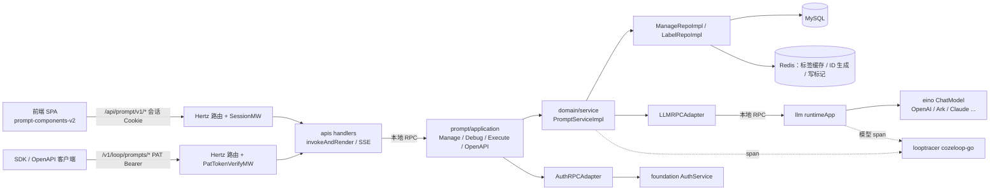
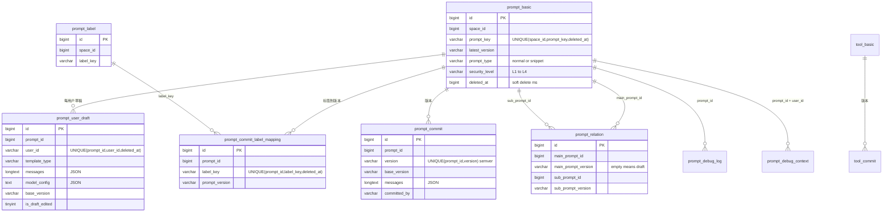
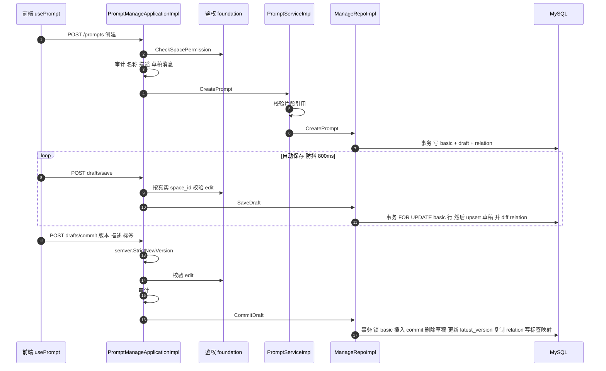
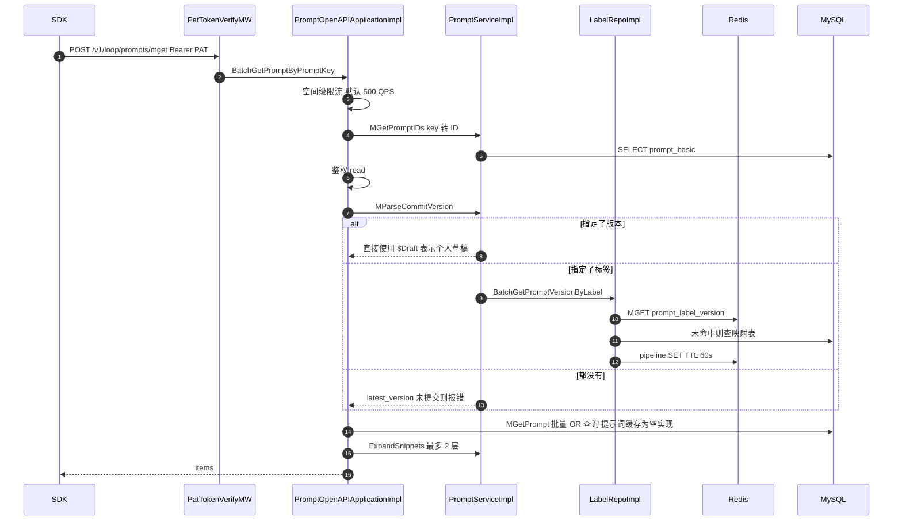
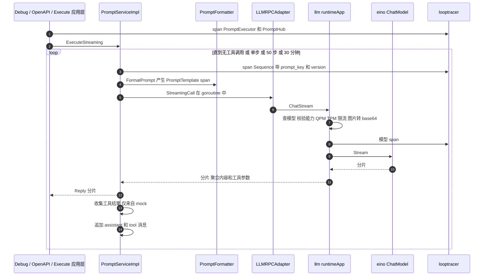

# coze-loop 提示词管理实现

> 返回 [概览](index.md) · 对照阅读 [Langfuse](langfuse.md) · [横向对比与建议](comparison.md) · [交互页面](interactive.mdx)

- **仓库：** [wzqwtt/coze-loop](https://github.com/wzqwtt/coze-loop)
- **提交：** `3a6a2bf07b057fec0c702e514e8345fb5684e83a`（2026-09-28）
- **范围：** 后端 `backend/modules/prompt`、`backend/modules/llm`、Thrift IDL、MySQL 初始化 SQL、Hertz 路由与中间件、前端提示词 hooks。
- **规则：** 每条结论都带源码永久链接。行号对应上述提交。

## 目录

1. [结论速览](#1-结论速览)
2. [术语](#2-术语)
3. [架构](#3-架构)
4. [数据模型](#4-数据模型)
5. [流程一：创建、草稿、提交、标签](#5-流程一创建草稿提交标签)
6. [流程二：SDK / OpenAPI 获取](#6-流程二sdk--openapi-获取)
7. [流程三：渲染并发送给 LLM](#7-流程三渲染并发送给-llm)
8. [模板](#8-模板)
9. [缓存与一致性](#9-缓存与一致性)
10. [风险与缺口](#10-风险与缺口)

## 1. 结论速览

| 主题 | 结论 | 证据 |
|---|---|---|
| 模型 | 一个提示词有 3 部分：元数据 `PromptBasic`、每用户草稿 `PromptDraft`、不可变提交 `PromptCommit`。 | [prompt.go#L12-L45](https://github.com/wzqwtt/coze-loop/blob/3a6a2bf07b057fec0c702e514e8345fb5684e83a/backend/modules/prompt/domain/entity/prompt.go#L12-L45) |
| 生命周期 | 先草稿，后提交。没有单独的"发布"步骤。 | [manage.go#L760-L953](https://github.com/wzqwtt/coze-loop/blob/3a6a2bf07b057fec0c702e514e8345fb5684e83a/backend/modules/prompt/infra/repo/manage.go#L760-L953) |
| 版本 | 版本号必须是严格 semver。 | [application/manage.go#L578-L639](https://github.com/wzqwtt/coze-loop/blob/3a6a2bf07b057fec0c702e514e8345fb5684e83a/backend/modules/prompt/application/manage.go#L578-L639) |
| 标签 | 标签是发布指针。每个提示词的每个标签只指向 1 个版本。 | [prompt_commit_label_mapping.sql#L1-L19](https://github.com/wzqwtt/coze-loop/blob/3a6a2bf07b057fec0c702e514e8345fb5684e83a/release/deployment/docker-compose/bootstrap/mysql-init/init-sql/prompt_commit_label_mapping.sql#L1-L19) |
| 模板 | 3 种引擎：`normal`、`jinja2`、`go_template`。每次渲染 10 s 超时、1 MB 输出上限。 | [prompt_detail.go#L400-L533](https://github.com/wzqwtt/coze-loop/blob/3a6a2bf07b057fec0c702e514e8345fb5684e83a/backend/modules/prompt/domain/entity/prompt_detail.go#L400-L533) |
| 组合 | `snippet` 类型的提示词可以被引用。读取时展开，最多 2 层。 | [service/manage.go#L471-L597](https://github.com/wzqwtt/coze-loop/blob/3a6a2bf07b057fec0c702e514e8345fb5684e83a/backend/modules/prompt/domain/service/manage.go#L471-L597) |
| 获取 | `POST /v1/loop/prompts/mget`，PAT 鉴权。版本优先级：显式版本 > 标签 > 最新版本。 | [openapi.go#L383-L577](https://github.com/wzqwtt/coze-loop/blob/3a6a2bf07b057fec0c702e514e8345fb5684e83a/backend/modules/prompt/application/openapi.go#L383-L577) |
| 缓存 | 开源版只有"标签→版本"缓存是真 Redis（TTL 60 s）。提示词缓存是空实现。 | [redis/prompt.go#L26-L38](https://github.com/wzqwtt/coze-loop/blob/3a6a2bf07b057fec0c702e514e8345fb5684e83a/backend/modules/prompt/infra/repo/redis/prompt.go#L26-L38) |
| 执行 | 服务端渲染并调用 LLM。进程内调用 `llm` 模块，底层是 eino。 | [service/execute.go#L61-L227](https://github.com/wzqwtt/coze-loop/blob/3a6a2bf07b057fec0c702e514e8345fb5684e83a/backend/modules/prompt/domain/service/execute.go#L61-L227) |
| 追踪 | 每一层都发 span，经 cozeloop-go SDK 上报。 | [consts/trace.go#L6-L38](https://github.com/wzqwtt/coze-loop/blob/3a6a2bf07b057fec0c702e514e8345fb5684e83a/backend/modules/prompt/pkg/consts/trace.go#L6-L38) |

## 2. 术语

本文统一使用以下术语。

| 术语 | 含义 | 代码中的名字 |
|---|---|---|
| 提示词 | 一个可管理的 prompt 对象 | `Prompt` |
| 草稿 | 某个用户私有的、可编辑的内容 | `PromptDraft`、表 `prompt_user_draft` |
| 提交 | 不可变的版本快照 | `PromptCommit`、表 `prompt_commit` |
| 版本 | 提交的 semver 版本号 | `version` |
| 标签 | 指向某个版本的可移动指针 | `label_key`、表 `prompt_commit_label_mapping` |
| 片段 | 可被其他提示词引用的提示词 | `PromptType = snippet` |
| 渲染 | 把变量值填入模板 | `formatMessages` / `formatText` |
| 空间 | 租户隔离单位 | `space_id` / `workspace_id` |

## 3. 架构

- 模块遵循仓库规则：`api → application → domain ← infra`。
- `llm` 模块以进程内函数调用的方式注入。它不走网络。证据：[api/api.go#L78-L86](https://github.com/wzqwtt/coze-loop/blob/3a6a2bf07b057fec0c702e514e8345fb5684e83a/backend/api/api.go#L78-L86)。
- 依赖注入在 [application/wire.go#L39-L98](https://github.com/wzqwtt/coze-loop/blob/3a6a2bf07b057fec0c702e514e8345fb5684e83a/backend/modules/prompt/application/wire.go#L39-L98)。

| 层 | 位置 | 关键类型 |
|---|---|---|
| IDL 契约 | `idl/thrift/coze/loop/prompt/*.thrift` | 5 个服务：Manage、Debug、Execute、OpenAPI、ToolManage（[coze.loop.prompt.thrift#L9-L13](https://github.com/wzqwtt/coze-loop/blob/3a6a2bf07b057fec0c702e514e8345fb5684e83a/idl/thrift/coze/loop/prompt/coze.loop.prompt.thrift#L9-L13)） |
| HTTP 网关 | `backend/api/handler/coze/loop/apis/prompt_*.go` | 一元调用用 `invokeAndRender`。流式调用转成 SSE（[prompt_debug_service.go#L24-L58](https://github.com/wzqwtt/coze-loop/blob/3a6a2bf07b057fec0c702e514e8345fb5684e83a/backend/api/handler/coze/loop/apis/prompt_debug_service.go#L24-L58)） |
| 本地 RPC 绑定 | [handler.go#L171-L192](https://github.com/wzqwtt/coze-loop/blob/3a6a2bf07b057fec0c702e514e8345fb5684e83a/backend/api/handler/coze/loop/apis/handler.go#L171-L192) | Kitex 形状的客户端，实际是进程内适配器 |
| 应用层 | `backend/modules/prompt/application/` | 鉴权、审计、DTO↔DO 转换、编排 |
| 领域服务 | `domain/service/` | `IPromptService`（[service.go#L17-L44](https://github.com/wzqwtt/coze-loop/blob/3a6a2bf07b057fec0c702e514e8345fb5684e83a/backend/modules/prompt/domain/service/service.go#L17-L44)） |
| 仓储接口 | `domain/repo/` | `IManageRepo`（[repo/manage.go#L12-L27](https://github.com/wzqwtt/coze-loop/blob/3a6a2bf07b057fec0c702e514e8345fb5684e83a/backend/modules/prompt/domain/repo/manage.go#L12-L27)） |
| 端口（RPC） | `domain/component/rpc/` | `ILLMProvider`（[rpc/llm.go#L32-L36](https://github.com/wzqwtt/coze-loop/blob/3a6a2bf07b057fec0c702e514e8345fb5684e83a/backend/modules/prompt/domain/component/rpc/llm.go#L32-L36)） |
| 基础设施 | `infra/repo`、`infra/rpc`、`infra/conf` | MySQL（gorm-gen）、Redis、适配器 |

## 4. 数据模型

### 4.1 领域实体

- **`Prompt`**：`ID`、`SpaceID`、`PromptKey`、`PromptBasic`、`PromptDraft`、`PromptCommit`。[prompt.go#L12-L19](https://github.com/wzqwtt/coze-loop/blob/3a6a2bf07b057fec0c702e514e8345fb5684e83a/backend/modules/prompt/domain/entity/prompt.go#L12-L19)
  - `GetPromptDetail()` 优先返回草稿，其次返回提交。[prompt.go#L89-L100](https://github.com/wzqwtt/coze-loop/blob/3a6a2bf07b057fec0c702e514e8345fb5684e83a/backend/modules/prompt/domain/entity/prompt.go#L89-L100)
  - `GetVersion()` 只读提交的版本。[prompt.go#L78-L87](https://github.com/wzqwtt/coze-loop/blob/3a6a2bf07b057fec0c702e514e8345fb5684e83a/backend/modules/prompt/domain/entity/prompt.go#L78-L87)
- **`PromptBasic`**：类型（`normal` / `snippet`）、安全级别（L1–L4）、名称、描述、`LatestVersion`。[prompt_basic.go#L8-L35](https://github.com/wzqwtt/coze-loop/blob/3a6a2bf07b057fec0c702e514e8345fb5684e83a/backend/modules/prompt/domain/entity/prompt_basic.go#L8-L35)
- **`PromptDetail`**：草稿和提交共用。包含模板、工具、工具调用配置、模型配置、MCP 配置。[prompt_detail.go#L28-L35](https://github.com/wzqwtt/coze-loop/blob/3a6a2bf07b057fec0c702e514e8345fb5684e83a/backend/modules/prompt/domain/entity/prompt_detail.go#L28-L35)
- **`PromptTemplate`**：模板类型、消息列表、变量定义、片段。[prompt_detail.go#L37-L54](https://github.com/wzqwtt/coze-loop/blob/3a6a2bf07b057fec0c702e514e8345fb5684e83a/backend/modules/prompt/domain/entity/prompt_detail.go#L37-L54)
- **`Message`**：
  - 角色：`system`、`user`、`assistant`、`tool`、`placeholder`。[prompt_detail.go#L56-L77](https://github.com/wzqwtt/coze-loop/blob/3a6a2bf07b057fec0c702e514e8345fb5684e83a/backend/modules/prompt/domain/entity/prompt_detail.go#L56-L77)
  - 多模态片段类型：`text`、`image_url`、`video_url`、`base64_data`、`multi_part_variable`。[prompt_detail.go#L79-L111](https://github.com/wzqwtt/coze-loop/blob/3a6a2bf07b057fec0c702e514e8345fb5684e83a/backend/modules/prompt/domain/entity/prompt_detail.go#L79-L111)
- **`VariableDef` / `VariableVal`**：变量可以是标量、对象、数组、placeholder（注入消息列表）、multi_part（注入多模态片段）。[prompt_detail.go#L113-L142](https://github.com/wzqwtt/coze-loop/blob/3a6a2bf07b057fec0c702e514e8345fb5684e83a/backend/modules/prompt/domain/entity/prompt_detail.go#L113-L142)
- **工具**：`function` 或 `google_search`。`ToolChoice` 取值 `none`、`auto`、`specific`。[prompt_detail.go#L144-L191](https://github.com/wzqwtt/coze-loop/blob/3a6a2bf07b057fec0c702e514e8345fb5684e83a/backend/modules/prompt/domain/entity/prompt_detail.go#L144-L191)
- **`McpConfig`**：随提示词存储。开源执行路径不使用它。[prompt_detail.go#L244-L255](https://github.com/wzqwtt/coze-loop/blob/3a6a2bf07b057fec0c702e514e8345fb5684e83a/backend/modules/prompt/domain/entity/prompt_detail.go#L244-L255)
- **`ModelConfig`**：只用 `ModelID` 引用 `llm` 模块的模型注册表，另含温度、TopP、Thinking 等参数。[prompt_detail.go#L193-L242](https://github.com/wzqwtt/coze-loop/blob/3a6a2bf07b057fec0c702e514e8345fb5684e83a/backend/modules/prompt/domain/entity/prompt_detail.go#L193-L242)
- **IDL 镜像**：所有字段都是 `optional`。[prompt.thrift#L3-L267](https://github.com/wzqwtt/coze-loop/blob/3a6a2bf07b057fec0c702e514e8345fb5684e83a/idl/thrift/coze/loop/prompt/domain/prompt.thrift#L3-L267)
  - 命名不一致：IDL 用 `has_snippet`，领域层和数据库用 `has_snippets`。[prompt.thrift#L86-L93](https://github.com/wzqwtt/coze-loop/blob/3a6a2bf07b057fec0c702e514e8345fb5684e83a/idl/thrift/coze/loop/prompt/domain/prompt.thrift#L86-L93)
- **工具独立子系统**：`tool_basic` + `tool_commit`，共享草稿版本常量 `$PublicDraft`。提示词草稿则是每用户私有。[toolmgmt/tool.go#L8-L46](https://github.com/wzqwtt/coze-loop/blob/3a6a2bf07b057fec0c702e514e8345fb5684e83a/backend/modules/prompt/domain/entity/toolmgmt/tool.go#L8-L46)

### 4.2 MySQL 表

- Docker 初始化 SQL 在 `release/deployment/docker-compose/bootstrap/mysql-init/init-sql/`。Helm 有一份镜像。
- `PromptDetail` 不做范式化。每个子对象序列化成独立的 JSON 文本列。[convertor/manage.go#L158-L200](https://github.com/wzqwtt/coze-loop/blob/3a6a2bf07b057fec0c702e514e8345fb5684e83a/backend/modules/prompt/infra/repo/mysql/convertor/manage.go#L158-L200)

| 表 | 用途 | 关键约束 |
|---|---|---|
| [`prompt_basic`](https://github.com/wzqwtt/coze-loop/blob/3a6a2bf07b057fec0c702e514e8345fb5684e83a/release/deployment/docker-compose/bootstrap/mysql-init/init-sql/prompt_basic.sql#L1-L24) | 每个提示词 1 行头记录 | `UNIQUE(space_id,prompt_key,deleted_at)`，软删除 |
| [`prompt_user_draft`](https://github.com/wzqwtt/coze-loop/blob/3a6a2bf07b057fec0c702e514e8345fb5684e83a/release/deployment/docker-compose/bootstrap/mysql-init/init-sql/prompt_user_draft.sql#L1-L28) | 每用户每提示词 1 份草稿 | `UNIQUE(prompt_id,user_id,deleted_at)` |
| [`prompt_commit`](https://github.com/wzqwtt/coze-loop/blob/3a6a2bf07b057fec0c702e514e8345fb5684e83a/release/deployment/docker-compose/bootstrap/mysql-init/init-sql/prompt_commit.sql#L1-L29) | 不可变版本快照 | `UNIQUE(prompt_id,version)`，无软删除 |
| [`prompt_label`](https://github.com/wzqwtt/coze-loop/blob/3a6a2bf07b057fec0c702e514e8345fb5684e83a/release/deployment/docker-compose/bootstrap/mysql-init/init-sql/prompt_label.sql#L1-L16) | 空间级标签定义 | `UNIQUE(space_id,label_key,deleted_at)` |
| [`prompt_commit_label_mapping`](https://github.com/wzqwtt/coze-loop/blob/3a6a2bf07b057fec0c702e514e8345fb5684e83a/release/deployment/docker-compose/bootstrap/mysql-init/init-sql/prompt_commit_label_mapping.sql#L1-L19) | 标签→版本指针 | `UNIQUE(prompt_id,label_key,deleted_at)` |
| [`prompt_relation`](https://github.com/wzqwtt/coze-loop/blob/3a6a2bf07b057fec0c702e514e8345fb5684e83a/release/deployment/docker-compose/bootstrap/mysql-init/init-sql/prompt_relation.sql#L1-L15) | 片段引用图 | 双向索引；`main_prompt_version=''` 表示草稿 |
| [`prompt_debug_log`](https://github.com/wzqwtt/coze-loop/blob/3a6a2bf07b057fec0c702e514e8345fb5684e83a/release/deployment/docker-compose/bootstrap/mysql-init/init-sql/prompt_debug_log.sql#L1-L25) | 调试历史 | token 数、耗时、状态码 |
| [`prompt_debug_context`](https://github.com/wzqwtt/coze-loop/blob/3a6a2bf07b057fec0c702e514e8345fb5684e83a/release/deployment/docker-compose/bootstrap/mysql-init/init-sql/prompt_debug_context.sql#L1-L18) | 每用户 Playground 状态 | `UNIQUE(prompt_id,user_id)` |
| [`tool_commit`](https://github.com/wzqwtt/coze-loop/blob/3a6a2bf07b057fec0c702e514e8345fb5684e83a/release/deployment/docker-compose/bootstrap/mysql-init/init-sql/tool_commit.sql#L1-L17) | 工具版本 | `UNIQUE(tool_id,version)` |

### 4.3 ID

- 表声明了 `AUTO_INCREMENT`。但每次插入都自带 ID。[manage.go#L81-L91](https://github.com/wzqwtt/coze-loop/blob/3a6a2bf07b057fec0c702e514e8345fb5684e83a/backend/modules/prompt/infra/repo/manage.go#L81-L91)
- ID 类似 snowflake：32 位秒 + 10 位毫秒 + 8 位计数器 + 14 位服务器 ID。计数器用 Redis `INCRBY`。[redis_gen.go#L26-L136](https://github.com/wzqwtt/coze-loop/blob/3a6a2bf07b057fec0c702e514e8345fb5684e83a/backend/infra/idgen/redis_gen/redis_gen.go#L26-L136)
- `prompt_key` 在空间内唯一。重复时返回 `PromptKeyExistCode`。[prompt_basic.go#L74-L91](https://github.com/wzqwtt/coze-loop/blob/3a6a2bf07b057fec0c702e514e8345fb5684e83a/backend/modules/prompt/infra/repo/mysql/prompt_basic.go#L74-L91)

## 5. 流程一：创建、草稿、提交、标签

### 5.1 HTTP 接口

- 路由定义：[manage.thrift#L8-L44](https://github.com/wzqwtt/coze-loop/blob/3a6a2bf07b057fec0c702e514e8345fb5684e83a/idl/thrift/coze/loop/prompt/coze.loop.prompt.manage.thrift#L8-L44)。
  - `POST /api/prompt/v1/prompts`：创建
  - `POST .../drafts/save`：保存草稿
  - `POST .../drafts/commit`：提交
  - `POST .../drafts/revert_from_commit`：从提交回滚草稿
  - `POST .../commits/:commit_version/labels_update`：移动标签
- 所有 `/api/*` 路由经过 `SessionMW`。[middleware.go#L26-L34](https://github.com/wzqwtt/coze-loop/blob/3a6a2bf07b057fec0c702e514e8345fb5684e83a/backend/api/router/coze/loop/apis/middleware.go#L26-L34)
- 前端 `usePrompt` 每 800 ms 防抖自动保存草稿。[use-prompt.ts#L238-L285](https://github.com/wzqwtt/coze-loop/blob/3a6a2bf07b057fec0c702e514e8345fb5684e83a/frontend/packages/loop-components/prompt-components-v2/src/hooks/use-prompt.ts#L238-L285)

### 5.2 时序

### 5.3 步骤细节

**创建**（[application/manage.go#L127-L189](https://github.com/wzqwtt/coze-loop/blob/3a6a2bf07b057fec0c702e514e8345fb5684e83a/backend/modules/prompt/application/manage.go#L127-L189)）

- 默认类型是 `normal`。默认安全级别是 L3。
- 审计在领域服务之前运行。
- 仓储在 1 个事务里写 basic、草稿、草稿引用关系。[infra/repo/manage.go#L76-L155](https://github.com/wzqwtt/coze-loop/blob/3a6a2bf07b057fec0c702e514e8345fb5684e83a/backend/modules/prompt/infra/repo/manage.go#L76-L155)

**保存草稿**（[manage.go#L531-L641](https://github.com/wzqwtt/coze-loop/blob/3a6a2bf07b057fec0c702e514e8345fb5684e83a/backend/modules/prompt/infra/repo/manage.go#L531-L641)）

- 事务先对 `prompt_basic` 行执行 `SELECT … FOR UPDATE`。这把同一提示词的并发写串行化。
- 系统校验 `base_version` 存在。
- 新草稿与旧草稿深度相等时，系统不做任何事。
- 否则系统设置 `IsModified = !DeepEqual(草稿, 基线提交)`。
- 系统按 diff 调整片段引用。[manage.go#L643-L758](https://github.com/wzqwtt/coze-loop/blob/3a6a2bf07b057fec0c702e514e8345fb5684e83a/backend/modules/prompt/infra/repo/manage.go#L643-L758)
- 保存草稿**不**调用审计。

**提交**（[manage.go#L760-L953](https://github.com/wzqwtt/coze-loop/blob/3a6a2bf07b057fec0c702e514e8345fb5684e83a/backend/modules/prompt/infra/repo/manage.go#L760-L953)）

1. 锁住 basic 行。
2. 用草稿内容构建提交。`BaseVersion` 取草稿的基线版本。
3. 插入 `prompt_commit`。版本重复时唯一键报错。
4. 软删除草稿。
5. 更新 `latest_version`。
6. 把草稿引用关系复制为提交引用关系。
7. 写入标签映射。
- 系统只校验版本格式。系统**不**校验版本递增。

**其他操作**

- 回滚：把某个提交载入为当前用户草稿。[application/manage.go#L779-L820](https://github.com/wzqwtt/coze-loop/blob/3a6a2bf07b057fec0c702e514e8345fb5684e83a/backend/modules/prompt/application/manage.go#L779-L820)
- 克隆：把提交内容复制成新提示词的草稿。[application/manage.go#L191-L253](https://github.com/wzqwtt/coze-loop/blob/3a6a2bf07b057fec0c702e514e8345fb5684e83a/backend/modules/prompt/application/manage.go#L191-L253)
- 删除：片段不可删除。删除只软删 basic 和草稿关系，提交保留。[application/manage.go#L255-L285](https://github.com/wzqwtt/coze-loop/blob/3a6a2bf07b057fec0c702e514e8345fb5684e83a/backend/modules/prompt/application/manage.go#L255-L285)
- 历史：游标是 `created_at` 秒级时间戳。[mysql/prompt_commit.go#L140-L160](https://github.com/wzqwtt/coze-loop/blob/3a6a2bf07b057fec0c702e514e8345fb5684e83a/backend/modules/prompt/infra/repo/mysql/prompt_commit.go#L140-L160)

### 5.4 标签

- 标签键必须匹配 `^[a-z0-9_]+$`，且不能与预置标签冲突。[service/label.go#L18-L42](https://github.com/wzqwtt/coze-loop/blob/3a6a2bf07b057fec0c702e514e8345fb5684e83a/backend/modules/prompt/domain/service/label.go#L18-L42)
- 预置标签来自配置：`production`、`beta`、`test`。[prompt.yaml#L18-L22](https://github.com/wzqwtt/coze-loop/blob/3a6a2bf07b057fec0c702e514e8345fb5684e83a/release/deployment/docker-compose/conf/prompt.yaml#L18-L22)
- `UpdateCommitLabels` 把给定标签移到目标提交，并移除目标提交上不在列表中的标签。[service/label.go#L209-L246](https://github.com/wzqwtt/coze-loop/blob/3a6a2bf07b057fec0c702e514e8345fb5684e83a/backend/modules/prompt/domain/service/label.go#L209-L246)
  - 仓储在 1 个事务中先锁 basic 行，再增删改映射。[infra/repo/label.go#L121-L243](https://github.com/wzqwtt/coze-loop/blob/3a6a2bf07b057fec0c702e514e8345fb5684e83a/backend/modules/prompt/infra/repo/label.go#L121-L243)
  - 事务后删除对应的标签缓存键。删除失败只记日志。

## 6. 流程二：SDK / OpenAPI 获取

### 6.1 鉴权

- `/v1/loop/*` 路由使用 `PatTokenVerifyMW`。[coze.loop.apis.go#L490-L493](https://github.com/wzqwtt/coze-loop/blob/3a6a2bf07b057fec0c702e514e8345fb5684e83a/backend/api/router/coze/loop/apis/coze.loop.apis.go#L490-L493)
- 中间件去掉 `Bearer ` 前缀，校验 token，把用户放入上下文。[pat_verify.go#L20-L69](https://github.com/wzqwtt/coze-loop/blob/3a6a2bf07b057fec0c702e514e8345fb5684e83a/backend/api/router/coze/loop/apis/middleware/pat_verify.go#L20-L69)
- 应用层调用 `MCheckPromptPermissionForOpenAPI(read)`。[infra/rpc/auth.go#L30-L86](https://github.com/wzqwtt/coze-loop/blob/3a6a2bf07b057fec0c702e514e8345fb5684e83a/backend/modules/prompt/infra/rpc/auth.go#L30-L86)
- 开源 foundation 只检查"用户属于请求中的空间"。它忽略动作。[foundation/application/auth.go#L30-L70](https://github.com/wzqwtt/coze-loop/blob/3a6a2bf07b057fec0c702e514e8345fb5684e83a/backend/modules/foundation/application/auth.go#L30-L70)

### 6.2 时序

- 接口：`POST /v1/loop/prompts/mget`。请求体 `{workspace_id, queries:[{prompt_key, version?, label?}]}`。[openapi.thrift#L7-L17](https://github.com/wzqwtt/coze-loop/blob/3a6a2bf07b057fec0c702e514e8345fb5684e83a/idl/thrift/coze/loop/prompt/coze.loop.prompt.openapi.thrift#L7-L17)

### 6.3 步骤细节

- **限流**：每空间默认 500 QPS。配置或限流器出错时放行（fail open）。[openapi.go#L579-L599](https://github.com/wzqwtt/coze-loop/blob/3a6a2bf07b057fec0c702e514e8345fb5684e83a/backend/modules/prompt/application/openapi.go#L579-L599)、[prompt.yaml#L1-L4](https://github.com/wzqwtt/coze-loop/blob/3a6a2bf07b057fec0c702e514e8345fb5684e83a/release/deployment/docker-compose/conf/prompt.yaml#L1-L4)
- **版本解析**：显式版本 > 标签 > 最新版本。未提交返回 `PromptUncommittedCode`。标签未关联返回 `PromptLabelUnAssociatedCode`。[service/manage.go#L221-L307](https://github.com/wzqwtt/coze-loop/blob/3a6a2bf07b057fec0c702e514e8345fb5684e83a/backend/modules/prompt/domain/service/manage.go#L221-L307)
- **个人草稿**：版本 `$Draft` 选择调用者自己的草稿。无用户时回退到常量用户 `"openAPI"`。[openapi.go#L473-L485](https://github.com/wzqwtt/coze-loop/blob/3a6a2bf07b057fec0c702e514e8345fb5684e83a/backend/modules/prompt/application/openapi.go#L473-L485)
- **批量读**：把 `(prompt_id, version)` 对拼成 OR 查询。`MGet` 调用了 `.Debug()`，会打印每条 SQL。[mysql/prompt_commit.go#L105-L134](https://github.com/wzqwtt/coze-loop/blob/3a6a2bf07b057fec0c702e514e8345fb5684e83a/backend/modules/prompt/infra/repo/mysql/prompt_commit.go#L105-L134)
- **管理类 OpenAPI**：也提供 Create、Get、SaveDraft、Commit、List。OpenAPI 的提交不接受标签，也不审计。[openapi.go#L350-L381](https://github.com/wzqwtt/coze-loop/blob/3a6a2bf07b057fec0c702e514e8345fb5684e83a/backend/modules/prompt/application/openapi.go#L350-L381)
- **内部获取**：评测等内部调用方使用 `BatchGetPrompt`，按设计不鉴权（"内部接口不鉴权"）。[application/manage.go#L382-L407](https://github.com/wzqwtt/coze-loop/blob/3a6a2bf07b057fec0c702e514e8345fb5684e83a/backend/modules/prompt/application/manage.go#L382-L407)

## 7. 流程三：渲染并发送给 LLM

coze-loop 在**服务端**渲染并调用模型。入口有 3 个：调试 / Playground、PTaaS 执行、内部执行。

### 7.1 执行循环

- **循环**：`Execute` 和 `ExecuteStreaming` 共用结构。停止条件：单步模式、50 步、30 分钟、无工具调用。[service/execute.go#L61-L227](https://github.com/wzqwtt/coze-loop/blob/3a6a2bf07b057fec0c702e514e8345fb5684e83a/backend/modules/prompt/domain/service/execute.go#L61-L227)
- **工具结果只来自 mock**。系统从不执行真实工具。[tool_results_collector.go#L38-L75](https://github.com/wzqwtt/coze-loop/blob/3a6a2bf07b057fec0c702e514e8345fb5684e83a/backend/modules/prompt/domain/service/tool_results_collector.go#L38-L75)
- **工具选择**：`tool_choice != none` 时才发送工具。`specific` 只在单步模式下允许。[tool_config.go#L27-L51](https://github.com/wzqwtt/coze-loop/blob/3a6a2bf07b057fec0c702e514e8345fb5684e83a/backend/modules/prompt/domain/service/tool_config.go#L27-L51)
- **请求转换**：`LLMCallParamConvert` 生成 `runtime.ChatRequest`。[rpc/convertor/chat.go#L23-L70](https://github.com/wzqwtt/coze-loop/blob/3a6a2bf07b057fec0c702e514e8345fb5684e83a/backend/modules/prompt/infra/rpc/convertor/chat.go#L23-L70)
  - 工具选择映射被注释掉了（"llm暂时不支持toolCallConfig"）。
  - `Thinking` 和 `Extra` 没有映射。
- **模型运行时**：校验请求 → 查模型 → QPM/TPM 限流（TPM 按 `max_tokens` 计，不按实际用量）→ 图片转 base64 → 模型 span → 调用 → 异步记录请求。[llm/application/runtime.go#L55-L212](https://github.com/wzqwtt/coze-loop/blob/3a6a2bf07b057fec0c702e514e8345fb5684e83a/backend/modules/llm/application/runtime.go#L55-L212)
- **协议**：只支持 eino 框架。协议有 ark、openai、claude、deepseek、ollama、gemini、qwen、qianfan、arkbot。[eino/init.go#L35-L69](https://github.com/wzqwtt/coze-loop/blob/3a6a2bf07b057fec0c702e514e8345fb5684e83a/backend/modules/llm/domain/service/llmimpl/eino/init.go#L35-L69)

### 7.2 调试 / Playground

- 客户端在请求中发送**完整提示词**。服务端不从数据库重新加载。[debug.go#L225-L233](https://github.com/wzqwtt/coze-loop/blob/3a6a2bf07b057fec0c702e514e8345fb5684e83a/backend/modules/prompt/application/debug.go#L225-L233)
- `id==0` 时是 Playground，key 为 `playground-<uid>`。否则是调试，校验 `debug` 权限。[debug.go#L76-L90](https://github.com/wzqwtt/coze-loop/blob/3a6a2bf07b057fec0c702e514e8345fb5684e83a/backend/modules/prompt/application/debug.go#L76-L90)
- 调试日志在 defer 中用 `context.WithoutCancel` 写入。客户端断开也会保存。[debug.go#L255-L267](https://github.com/wzqwtt/coze-loop/blob/3a6a2bf07b057fec0c702e514e8345fb5684e83a/backend/modules/prompt/application/debug.go#L255-L267)
- 前端 `fetchStream` 调用 `/api/prompt/v1/prompts/:prompt_id/debug_streaming`。[use-llm-stream-run.ts#L165-L240](https://github.com/wzqwtt/coze-loop/blob/3a6a2bf07b057fec0c702e514e8345fb5684e83a/frontend/packages/loop-components/prompt-components-v2/src/hooks/use-llm-stream-run.ts#L165-L240)

### 7.3 PTaaS 执行（提示词即服务）

- 接口：`POST /v1/loop/prompts/execute` 和 `/execute_streaming`。[openapi.go#L601-L917](https://github.com/wzqwtt/coze-loop/blob/3a6a2bf07b057fec0c702e514e8345fb5684e83a/backend/modules/prompt/application/openapi.go#L601-L917)
- 限流：每 `(空间, prompt_key)` 默认 100 QPS。
- 版本解析与获取流程相同。
- 覆盖参数前先深拷贝提示词，避免污染缓存。[openapi.go#L1248-L1323](https://github.com/wzqwtt/coze-loop/blob/3a6a2bf07b057fec0c702e514e8345fb5684e83a/backend/modules/prompt/application/openapi.go#L1248-L1323)
- 以 `SingleStep=true`、`ScenarioPTaaS` 调用 `Execute`。

### 7.4 追踪

| Span | 产生者 | 证据 |
|---|---|---|
| `PromptExecutor` | Debug、OpenAPI、Execute 应用层 | [debug.go#L91-L136](https://github.com/wzqwtt/coze-loop/blob/3a6a2bf07b057fec0c702e514e8345fb5684e83a/backend/modules/prompt/application/debug.go#L91-L136) |
| `PromptHub` | 提示词解析 | [openapi.go#L943-L966](https://github.com/wzqwtt/coze-loop/blob/3a6a2bf07b057fec0c702e514e8345fb5684e83a/backend/modules/prompt/application/openapi.go#L943-L966) |
| `Sequence`（baggage 带 key 和 version） | 每一步 | [service/execute.go#L359-L399](https://github.com/wzqwtt/coze-loop/blob/3a6a2bf07b057fec0c702e514e8345fb5684e83a/backend/modules/prompt/domain/service/execute.go#L359-L399) |
| `PromptTemplate` | 渲染器 | [formatter.go#L37-L60](https://github.com/wzqwtt/coze-loop/blob/3a6a2bf07b057fec0c702e514e8345fb5684e83a/backend/modules/prompt/domain/service/formatter.go#L37-L60) |
| 工具 span | 每次工具调用 | [service/execute.go#L330-L357](https://github.com/wzqwtt/coze-loop/blob/3a6a2bf07b057fec0c702e514e8345fb5684e83a/backend/modules/prompt/domain/service/execute.go#L330-L357) |
| 模型 span | llm 运行时 | [runtime.go#L81-L83](https://github.com/wzqwtt/coze-loop/blob/3a6a2bf07b057fec0c702e514e8345fb5684e83a/backend/modules/llm/application/runtime.go#L81-L83) |

## 8. 模板

源码：[prompt_detail.go#L257-L398](https://github.com/wzqwtt/coze-loop/blob/3a6a2bf07b057fec0c702e514e8345fb5684e83a/backend/modules/prompt/domain/entity/prompt_detail.go#L257-L398)。

1. **组装消息**：模板消息在前，运行时消息追加在后。
2. **按角色渲染**：
   - `placeholder` 被变量中的消息列表替换。
   - `tool` 不渲染。
   - `system`、`user` 默认渲染。
   - `assistant` 只在 `SkipRender` 显式为 false 时渲染。
3. **按引擎渲染文本**（[prompt_detail.go#L400-L533](https://github.com/wzqwtt/coze-loop/blob/3a6a2bf07b057fec0c702e514e8345fb5684e83a/backend/modules/prompt/domain/entity/prompt_detail.go#L400-L533)）：

| 引擎 | 实现 | 行为 |
|---|---|---|
| `normal` | `fasttemplate`，`{{var}}` | 未定义的标签原样保留。已定义但无值的标签变成空串 |
| `jinja2` | `gonja/v2`，沙箱 | 变量先按类型转换（整数、浮点、布尔、JSON） |
| `go_template` | `text/template` | 同上 |
| `custom_template_m` | 无 | 返回 `UnsupportedTemplateTypeCode` |

4. **沙箱**（[jinja_template.go#L21-L104](https://github.com/wzqwtt/coze-loop/blob/3a6a2bf07b057fec0c702e514e8345fb5684e83a/backend/modules/prompt/pkg/template/jinja_template.go#L21-L104)、[safe_writer.go#L12-L41](https://github.com/wzqwtt/coze-loop/blob/3a6a2bf07b057fec0c702e514e8345fb5684e83a/backend/modules/prompt/pkg/template/safe_writer.go#L12-L41)）：
   - 禁用 `include`、`extends`、`import`、`from`。
   - `range` 最多 10,000 个元素。
   - 10 s 超时，输出上限 1 MB。
   - 超时后渲染 goroutine 不会被取消。
5. **片段展开**在渲染之前进行。每个引用替换为片段**第一条消息的内容**。[service/manage.go#L514-L533](https://github.com/wzqwtt/coze-loop/blob/3a6a2bf07b057fec0c702e514e8345fb5684e83a/backend/modules/prompt/domain/service/manage.go#L514-L533)
   - 标签语法：`<cozeloop_snippet>id=N&version=V</cozeloop_snippet>`。[snippet_parser.go#L33-L78](https://github.com/wzqwtt/coze-loop/blob/3a6a2bf07b057fec0c702e514e8345fb5684e83a/backend/modules/prompt/domain/service/snippet_parser.go#L33-L78)

## 9. 缓存与一致性

| 缓存 | 开源版状态 | 证据 |
|---|---|---|
| 提示词（按 `prompt_id + version`） | **空实现**。周边逻辑完整：只缓存提交、命中指标、未命中回写 | [redis/prompt.go#L26-L38](https://github.com/wzqwtt/coze-loop/blob/3a6a2bf07b057fec0c702e514e8345fb5684e83a/backend/modules/prompt/infra/repo/redis/prompt.go#L26-L38)、[manage.go#L235-L300](https://github.com/wzqwtt/coze-loop/blob/3a6a2bf07b057fec0c702e514e8345fb5684e83a/backend/modules/prompt/infra/repo/manage.go#L235-L300) |
| 提示词元数据（按 `space_id + prompt_key`） | **空实现**。更新、删除、提交时仍调用失效 | [redis/prompt_basic.go#L19-L36](https://github.com/wzqwtt/coze-loop/blob/3a6a2bf07b057fec0c702e514e8345fb5684e83a/backend/modules/prompt/infra/repo/redis/prompt_basic.go#L19-L36) |
| 标签→版本 | **真 Redis**。键 `prompt_label_version:prompt_id=%d:label_key=%s`，默认 TTL 60 s | [redis/prompt_label_version.go#L54-L161](https://github.com/wzqwtt/coze-loop/blob/3a6a2bf07b057fec0c702e514e8345fb5684e83a/backend/modules/prompt/infra/repo/redis/prompt_label_version.go#L54-L161)、[prompt.yaml#L24-L27](https://github.com/wzqwtt/coze-loop/blob/3a6a2bf07b057fec0c702e514e8345fb5684e83a/release/deployment/docker-compose/conf/prompt.yaml#L24-L27) |
| 读己之写 | Redis 写标记。写后读走 MySQL 主库 | [prompt_basic.go#L109-L116](https://github.com/wzqwtt/coze-loop/blob/3a6a2bf07b057fec0c702e514e8345fb5684e83a/backend/modules/prompt/infra/repo/mysql/prompt_basic.go#L109-L116) |

## 10. 风险与缺口

### 10.1 并发与一致性

| # | 问题 | 影响 | 证据 |
|---|---|---|---|
| 1 | 带标签提交后，系统只失效空实现的 basic 缓存，不失效标签缓存 | SDK 按标签读取，最多 60 s 内拿到旧版本 | [manage.go#L881-L951](https://github.com/wzqwtt/coze-loop/blob/3a6a2bf07b057fec0c702e514e8345fb5684e83a/backend/modules/prompt/infra/repo/manage.go#L881-L951) |
| 2 | 提交 `Get` 计算了写标记但丢弃结果 | 写后读可能落到从库 | [mysql/prompt_commit.go#L82-L103](https://github.com/wzqwtt/coze-loop/blob/3a6a2bf07b057fec0c702e514e8345fb5684e83a/backend/modules/prompt/infra/repo/mysql/prompt_commit.go#L82-L103) |
| 3 | 不校验 semver 递增 | 低版本可以成为 `latest_version` | [manage.go#L816-L826](https://github.com/wzqwtt/coze-loop/blob/3a6a2bf07b057fec0c702e514e8345fb5684e83a/backend/modules/prompt/infra/repo/manage.go#L816-L826) |
| 4 | 历史分页游标是秒级时间戳，比较含等号 | 同一秒的提交可能跨页重复 | [prompt_commit.go#L140-L160](https://github.com/wzqwtt/coze-loop/blob/3a6a2bf07b057fec0c702e514e8345fb5684e83a/backend/modules/prompt/infra/repo/mysql/prompt_commit.go#L140-L160) |
| 5 | 草稿每用户私有，无合并或冲突检测 | 最后一次提交决定 `latest_version` | [manage.go#L531-L641](https://github.com/wzqwtt/coze-loop/blob/3a6a2bf07b057fec0c702e514e8345fb5684e83a/backend/modules/prompt/infra/repo/manage.go#L531-L641) |
| 6 | 流式发送失败时消费者提前返回 | 生产者阻塞在无缓冲通道上，直到上游 context 取消 | [openapi.go#L827-L858](https://github.com/wzqwtt/coze-loop/blob/3a6a2bf07b057fec0c702e514e8345fb5684e83a/backend/modules/prompt/application/openapi.go#L827-L858) |

### 10.2 权限（开源 foundation）

| # | 问题 | 影响 | 证据 |
|---|---|---|---|
| 7 | 鉴权只查空间成员关系，忽略动作 | 开源版没有角色模型 | [infra/rpc/auth.go#L30-L53](https://github.com/wzqwtt/coze-loop/blob/3a6a2bf07b057fec0c702e514e8345fb5684e83a/backend/modules/prompt/infra/rpc/auth.go#L30-L53)、[foundation/application/auth.go#L45-L64](https://github.com/wzqwtt/coze-loop/blob/3a6a2bf07b057fec0c702e514e8345fb5684e83a/backend/modules/foundation/application/auth.go#L45-L64) |
| 8 | `UpdateCommitLabels` 用请求中的 `workspace_id` 鉴权，不先加载提示词 | 空间 A 的成员似乎可以移动空间 B 提示词的标签 | [application/manage.go#L963-L993](https://github.com/wzqwtt/coze-loop/blob/3a6a2bf07b057fec0c702e514e8345fb5684e83a/backend/modules/prompt/application/manage.go#L963-L993) |
| 9 | 片段按原始 ID 读取，不校验空间 | 其他空间的片段可能被展开进模型输入 | [service/manage.go#L368-L448](https://github.com/wzqwtt/coze-loop/blob/3a6a2bf07b057fec0c702e514e8345fb5684e83a/backend/modules/prompt/domain/service/manage.go#L368-L448) |
| 10 | 内部接口 `BatchGetPrompt`、`ExecuteInternal` 不鉴权 | 依赖"只在进程内可达" | [execute.go#L63-L67](https://github.com/wzqwtt/coze-loop/blob/3a6a2bf07b057fec0c702e514e8345fb5684e83a/backend/modules/prompt/application/execute.go#L63-L67) |
| 11 | 审计和限流出错时放行；审计只查 `Content`，不查多模态片段 | 内容审核可被绕过 | [infra/rpc/audit.go#L32-L75](https://github.com/wzqwtt/coze-loop/blob/3a6a2bf07b057fec0c702e514e8345fb5684e83a/backend/modules/prompt/infra/rpc/audit.go#L32-L75) |
| 12 | 模型 API Key 写入 `model_request_record.model_ak` | 每次调用都落库一份密钥 | [runtime.go#L263-L288](https://github.com/wzqwtt/coze-loop/blob/3a6a2bf07b057fec0c702e514e8345fb5684e83a/backend/modules/llm/application/runtime.go#L263-L288) |

### 10.3 功能缺口

- `ToolChoice`、`Thinking`、`Extra`、`ResponseAPIConfig` 没有传给模型运行时。[chat.go#L23-L70](https://github.com/wzqwtt/coze-loop/blob/3a6a2bf07b057fec0c702e514e8345fb5684e83a/backend/modules/prompt/infra/rpc/convertor/chat.go#L23-L70)
- 以下只是类型、常量或空实现。商业版似乎在这些扩展点上补齐：
  - `custom_template_m` 没有渲染器。
  - `McpConfig` 存储但不使用。
  - 提示词缓存、元数据缓存为空实现。
  - 加密钩子为空。[prompt_commit_hook.go#L12-L29](https://github.com/wzqwtt/coze-loop/blob/3a6a2bf07b057fec0c702e514e8345fb5684e83a/backend/modules/prompt/infra/repo/mysql/hooks/prompt_commit_hook.go#L12-L29)
  - 事件收集器为空实现。[event_collector.go#L51-L62](https://github.com/wzqwtt/coze-loop/blob/3a6a2bf07b057fec0c702e514e8345fb5684e83a/backend/modules/prompt/infra/collector/event_collector.go#L51-L62)
- 片段展开只用第一条消息内容，最多 2 层，用字符串 `ReplaceAll` 替换。[service/manage.go#L471-L597](https://github.com/wzqwtt/coze-loop/blob/3a6a2bf07b057fec0c702e514e8345fb5684e83a/backend/modules/prompt/domain/service/manage.go#L471-L597)
