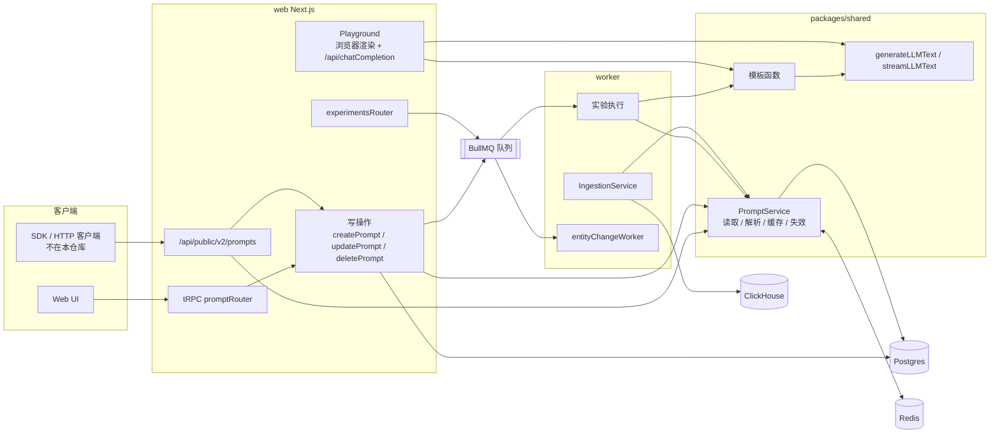
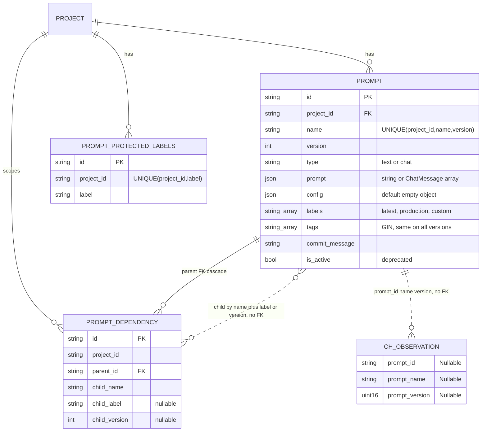
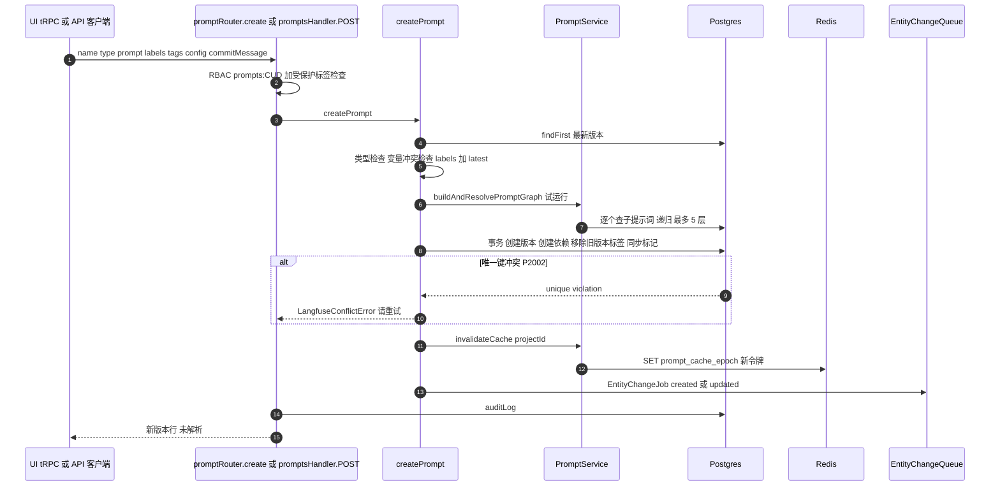
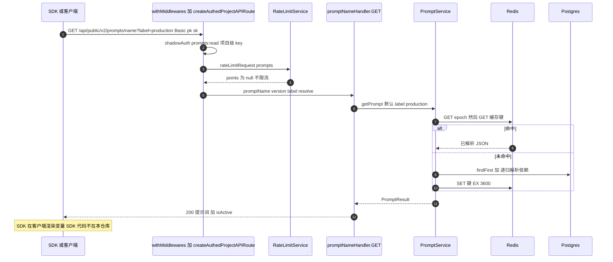
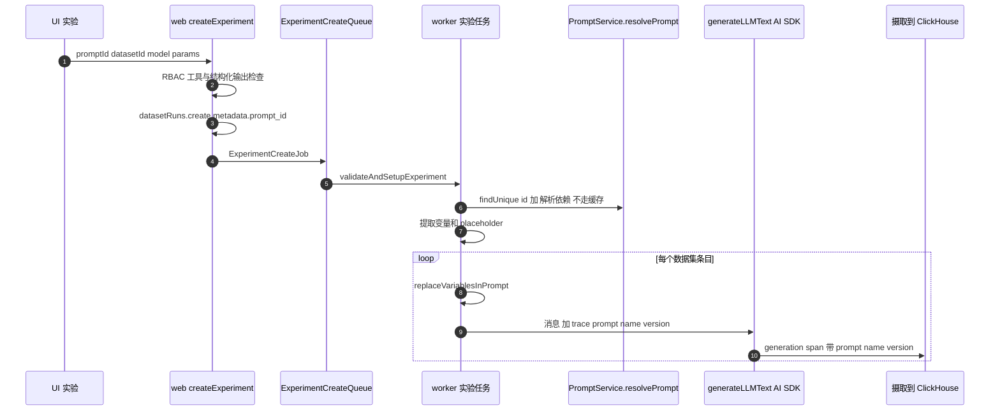
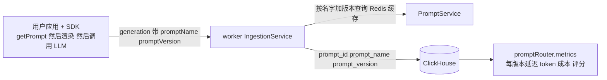
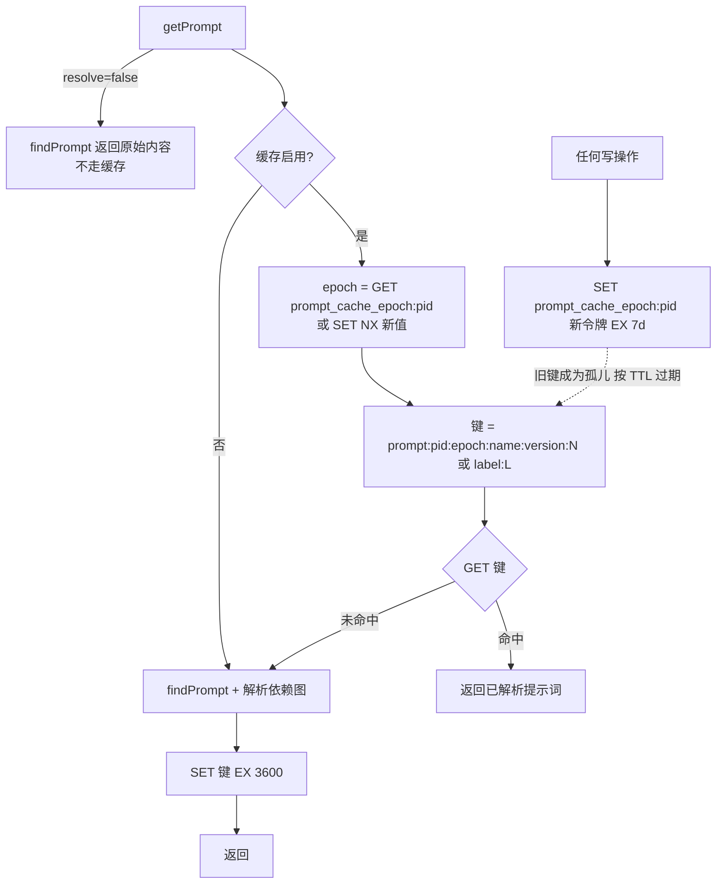

# Langfuse 提示词管理实现

> 返回 [概览](index.md) · 对照阅读 [coze-loop](coze-loop.md) · [横向对比与建议](comparison.md) · [交互页面](interactive.mdx)

- **仓库：** [wzqwtt/langfuse](https://github.com/wzqwtt/langfuse)
- **提交：** `f75c661dbe8c6b85523c81486b39e8403ac2c141`
- **范围：** `packages/shared`（Prisma、PromptService、模板）、`web`（tRPC、公开 REST、Playground）、`worker`（实验、摄取、自动化）。
- **规则：** 每条结论都带源码永久链接。行号对应上述提交。
- **注意：** SDK 代码不在本仓库。客户端缓存与客户端渲染无法从本仓库验证。

## 目录

1. [结论速览](#1-结论速览)
2. [术语](#2-术语)
3. [架构](#3-架构)
4. [数据模型](#4-数据模型)
5. [流程一：创建版本、移动标签、删除](#5-流程一创建版本移动标签删除)
6. [流程二：公开 API 获取](#6-流程二公开-api-获取)
7. [流程三：发送给 LLM](#7-流程三发送给-llm)
8. [组合（提示词依赖）](#8-组合提示词依赖)
9. [模板](#9-模板)
10. [缓存](#10-缓存)
11. [风险与观察](#11-风险与观察)

## 1. 结论速览

| 主题 | 结论 | 证据 |
|---|---|---|
| 存储 | 一个提示词是 Postgres `prompts` 表中的一组不可变版本行。没有父表。提示词就是它的名字。 | [schema.prisma#L786-L813](https://github.com/wzqwtt/langfuse/blob/f75c661dbe8c6b85523c81486b39e8403ac2c141/packages/shared/prisma/schema.prisma#L786-L813) |
| 版本 | 版本号是整数，自增。唯一键 `(projectId, name, version)`。 | [createPrompt.ts#L160-L175](https://github.com/wzqwtt/langfuse/blob/f75c661dbe8c6b85523c81486b39e8403ac2c141/web/src/features/prompts/server/actions/createPrompt.ts#L160-L175) |
| 标签 | 标签是可移动指针。同一事务中，标签从其他版本移除。新版本总是带 `latest`。 | [createPrompt.ts#L129](https://github.com/wzqwtt/langfuse/blob/f75c661dbe8c6b85523c81486b39e8403ac2c141/web/src/features/prompts/server/actions/createPrompt.ts#L129)、[updatePromptLabels.ts#L3-L43](https://github.com/wzqwtt/langfuse/blob/f75c661dbe8c6b85523c81486b39e8403ac2c141/web/src/features/prompts/server/utils/updatePromptLabels.ts#L3-L43) |
| 默认读取 | 不指定版本和标签时，读取 `production`。 | [getPromptByName.ts#L21-L56](https://github.com/wzqwtt/langfuse/blob/f75c661dbe8c6b85523c81486b39e8403ac2c141/web/src/features/prompts/server/actions/getPromptByName.ts#L21-L56) |
| 受保护标签 | 项目可以保护标签。修改受保护标签需要额外 RBAC 权限。 | [authorizeProtectedLabelMutation.ts#L70-L152](https://github.com/wzqwtt/langfuse/blob/f75c661dbe8c6b85523c81486b39e8403ac2c141/web/src/features/prompts/server/utils/authorizeProtectedLabelMutation.ts#L70-L152) |
| 组合 | 内联标签 `@@@langfusePrompt:name=X\|label=L@@@`。最多 5 层，拒绝环，只能引用 text 提示词。 | [PromptService/index.ts#L243-L404](https://github.com/wzqwtt/langfuse/blob/f75c661dbe8c6b85523c81486b39e8403ac2c141/packages/shared/src/server/services/PromptService/index.ts#L243-L404) |
| 模板 | 基于正则的 `{{var}}`，不是真正的 Mustache。chat 提示词支持 placeholder 消息。 | [prompts.ts#L14-L31](https://github.com/wzqwtt/langfuse/blob/f75c661dbe8c6b85523c81486b39e8403ac2c141/packages/shared/src/utils/prompts.ts#L14-L31) |
| 服务端渲染 | 公开 API **不**渲染。返回原始模板。渲染由 SDK、Playground 或 worker 完成。 | [promptNameHandler.ts#L40-L53](https://github.com/wzqwtt/langfuse/blob/f75c661dbe8c6b85523c81486b39e8403ac2c141/web/src/features/prompts/server/handlers/promptNameHandler.ts#L40-L53) |
| 缓存 | Redis 缓存**解析后**的提示词，TTL 1 h。任何写操作轮换项目级 epoch 来失效。 | [PromptService/index.ts#L195-L241](https://github.com/wzqwtt/langfuse/blob/f75c661dbe8c6b85523c81486b39e8403ac2c141/packages/shared/src/server/services/PromptService/index.ts#L195-L241) |
| 限流 | `prompts` 资源在所有套餐上都不限流。 | [RateLimitService.ts#L280-L285](https://github.com/wzqwtt/langfuse/blob/f75c661dbe8c6b85523c81486b39e8403ac2c141/web/src/features/public-api/server/RateLimitService.ts#L280-L285) |
| 关联追踪 | 摄取时按 `promptName + promptVersion` 查找提示词，写入 ClickHouse 的 `prompt_id`。 | [IngestionService/index.ts#L1294-L1326](https://github.com/wzqwtt/langfuse/blob/f75c661dbe8c6b85523c81486b39e8403ac2c141/worker/src/services/IngestionService/index.ts#L1294-L1326) |
| 写副作用 | 每次写：轮换缓存 epoch、写审计日志、发 `EntityChangeQueue` 事件（驱动 webhook / Slack）。 | [promptChangeEventSourcing.ts#L14-L56](https://github.com/wzqwtt/langfuse/blob/f75c661dbe8c6b85523c81486b39e8403ac2c141/web/src/features/prompts/server/promptChangeEventSourcing.ts#L14-L56) |

## 2. 术语

| 术语 | 含义 | 代码中的名字 |
|---|---|---|
| 提示词 | 同名的一组版本行 | `name` |
| 版本 | 一行不可变记录，整数版本号 | `Prompt` 行、`version` |
| 标签 | 指向某个版本的可移动指针，存为行上的数组 | `labels[]` |
| 标记（tag） | 作用于整个提示词名的分类，写到每个版本上 | `tags[]` |
| 依赖 | 一个提示词内联引用另一个提示词 | `prompt_dependencies` |
| 渲染 | 把变量值填入模板 | `compileTemplateString` / `compileChatMessages` |
| 解析 | 把依赖标签展开成子提示词文本 | `resolvePrompt` / `buildAndResolvePromptGraph` |
| 项目 | 租户隔离单位 | `projectId` |

## 3. 架构

- 所有提示词**写操作**在 `web`。
- `web` 和 `worker` 都通过共享的 `PromptService` **读**提示词。
- tRPC 把路由注册为 `prompts: promptRouter`。[root.ts#L98](https://github.com/wzqwtt/langfuse/blob/f75c661dbe8c6b85523c81486b39e8403ac2c141/web/src/server/api/root.ts#L98)

| 层 | 职责 | 关键文件 |
|---|---|---|
| `packages/shared` | Prisma schema、zod 契约、`PromptService`、依赖解析、模板函数、LLM 调用封装 | `prisma/schema.prisma`、`src/server/services/PromptService/*`、`src/utils/prompts.ts`、`src/server/llm/*` |
| `web`（Next.js） | UI、tRPC `promptRouter`、公开 REST、写操作、受保护标签授权、审计、发送变更事件 | `web/src/features/prompts/**`、`web/src/pages/api/public/v2/prompts/**` |
| `worker`（BullMQ） | 实验执行、摄取时关联提示词、消费变更事件触发自动化 | `worker/src/features/experiments/*`、`worker/src/services/IngestionService/index.ts`、`worker/src/features/entityChange/*` |

## 4. 数据模型

### 4.1 表

**`prompts`**（[schema.prisma#L786-L813](https://github.com/wzqwtt/langfuse/blob/f75c661dbe8c6b85523c81486b39e8403ac2c141/packages/shared/prisma/schema.prisma#L786-L813)）

- 字段：
  - `id`、`projectId`（外键，级联删除）、`createdBy`
  - `name`、`version Int`
  - `type`：`text` 或 `chat`，默认 `text`
  - `prompt Json`：字符串或 chat 消息数组
  - `config Json`：默认 `{}`
  - `labels String[]`、`tags String[]`
  - `commitMessage String?`
  - `isActive Boolean?`：已废弃，由 `production` 标签代替
- 索引：
  - `@@unique([projectId, name, version])`
  - `tags` 上有 GIN 索引
  - `labels` 上**没有**索引。对比 `Skill` 表有标签 GIN 索引。[schema.prisma#L869](https://github.com/wzqwtt/langfuse/blob/f75c661dbe8c6b85523c81486b39e8403ac2c141/packages/shared/prisma/schema.prisma#L869)

**`prompt_dependencies`**（[schema.prisma#L815-L833](https://github.com/wzqwtt/langfuse/blob/f75c661dbe8c6b85523c81486b39e8403ac2c141/packages/shared/prisma/schema.prisma#L815-L833)）

- 字段：`parentId`（外键，级联）、`childName`、`childLabel?` 或 `childVersion?`。
- 子提示词按"名字 + 标签或版本"引用，不用外键。依赖是**延迟绑定**的：标签依赖会跟随标签移动。

**`prompt_protected_labels`**（[schema.prisma#L835-L845](https://github.com/wzqwtt/langfuse/blob/f75c661dbe8c6b85523c81486b39e8403ac2c141/packages/shared/prisma/schema.prisma#L835-L845)）：唯一键 `(projectId, label)`。

**ClickHouse 观测列**：`prompt_id`、`prompt_name`、`prompt_version`。[0002_observations.up.sql#L25-L27](https://github.com/wzqwtt/langfuse/blob/f75c661dbe8c6b85523c81486b39e8403ac2c141/packages/shared/clickhouse/migrations/canonical/0002_observations.up.sql#L25-L27)

### 4.2 契约（zod）

源码：[types.ts](https://github.com/wzqwtt/langfuse/blob/f75c661dbe8c6b85523c81486b39e8403ac2c141/packages/shared/src/features/prompts/types.ts)。

- 类型：`enum PromptType { Chat, Text }`。[types.ts#L25-L29](https://github.com/wzqwtt/langfuse/blob/f75c661dbe8c6b85523c81486b39e8403ac2c141/packages/shared/src/features/prompts/types.ts#L25-L29)
- 标签：最多 36 字符，正则 `^[a-z0-9_\-.]+$`。[constants.ts#L22-L25](https://github.com/wzqwtt/langfuse/blob/f75c661dbe8c6b85523c81486b39e8403ac2c141/packages/shared/src/features/prompts/constants.ts#L22-L25)
- 名字：保留 `new`、`metrics`、`prompt-detail`。名字不能含 `|`，因为 `|` 是依赖标签的分隔符。[constants.ts#L12-L19](https://github.com/wzqwtt/langfuse/blob/f75c661dbe8c6b85523c81486b39e8403ac2c141/packages/shared/src/features/prompts/constants.ts#L12-L19)
- 创建：text 的 `prompt` 是字符串，chat 的 `prompt` 是消息数组。`commitMessage` 最多 500 字符。[types.ts#L37-L86](https://github.com/wzqwtt/langfuse/blob/f75c661dbe8c6b85523c81486b39e8403ac2c141/packages/shared/src/features/prompts/types.ts#L37-L86)
- 读取：`promptName`、`version?`、`label?`、`resolve`（默认 true）。[types.ts#L126-L135](https://github.com/wzqwtt/langfuse/blob/f75c661dbe8c6b85523c81486b39e8403ac2c141/packages/shared/src/features/prompts/types.ts#L126-L135)
- chat 消息：`{role, content}` 或 placeholder `{type:"placeholder", name}`。[llm/types.ts#L236-L243](https://github.com/wzqwtt/langfuse/blob/f75c661dbe8c6b85523c81486b39e8403ac2c141/packages/shared/src/server/llm/types.ts#L236-L243)
- `config` 是自由 JSON。服务端只在实验中读取其中的工具配置。[promptToolConfig.ts#L59](https://github.com/wzqwtt/langfuse/blob/f75c661dbe8c6b85523c81486b39e8403ac2c141/packages/shared/src/server/llm/promptToolConfig.ts#L59)

## 5. 流程一：创建版本、移动标签、删除

### 5.1 入口

| 入口 | 鉴权 | 证据 |
|---|---|---|
| UI 表单 → tRPC `prompts.create` | `prompts:CUD`；含受保护标签时另需 `promptProtectedLabels:CUD` | [NewPromptForm/index.tsx#L125-L170](https://github.com/wzqwtt/langfuse/blob/f75c661dbe8c6b85523c81486b39e8403ac2c141/web/src/features/prompts/components/NewPromptForm/index.tsx#L125-L170)、[promptRouter.ts#L312-L364](https://github.com/wzqwtt/langfuse/blob/f75c661dbe8c6b85523c81486b39e8403ac2c141/web/src/features/prompts/server/routers/promptRouter.ts#L312-L364) |
| Playground "保存到提示词" | 同上 | [SaveToPromptButton.tsx#L39-L51](https://github.com/wzqwtt/langfuse/blob/f75c661dbe8c6b85523c81486b39e8403ac2c141/web/src/features/playground/page/components/SaveToPromptButton.tsx#L39-L51) |
| REST `POST /api/public/v2/prompts` | API Key + `prompts:CUD` | [promptsHandler.ts#L29-L45](https://github.com/wzqwtt/langfuse/blob/f75c661dbe8c6b85523c81486b39e8403ac2c141/web/src/features/prompts/server/handlers/promptsHandler.ts#L29-L45)、[prompt-api-service.ts#L41-L96](https://github.com/wzqwtt/langfuse/blob/f75c661dbe8c6b85523c81486b39e8403ac2c141/web/src/features/prompts/server/prompt-api-service.ts#L41-L96) |
| REST v1 `POST /api/public/prompts`（旧） | `isActive` 映射为 `production` 标签 | [prompts.ts#L43-L70](https://github.com/wzqwtt/langfuse/blob/f75c661dbe8c6b85523c81486b39e8403ac2c141/web/src/pages/api/public/prompts.ts#L43-L70) |

### 5.2 `createPrompt` 步骤

源码：[createPrompt.ts#L93-L290](https://github.com/wzqwtt/langfuse/blob/f75c661dbe8c6b85523c81486b39e8403ac2c141/web/src/features/prompts/server/actions/createPrompt.ts#L93-L290)。

1. 按版本倒序读取最新版本。新版本类型必须与旧版本相同。（L106-L116）
2. chat 提示词：变量名与 placeholder 名不能冲突。（L118-L127）
3. 标签：`finalLabels = [...labels, "latest"]`。（L129）
4. 标记：未传时继承上一版本。（L131-L132）
5. 依赖：解析依赖标签，然后**试运行**依赖图解析。缺失、成环、过深、非 text 都会失败。（L136-L158）
6. 在 1 个 `$transaction([...])` 中：
   - 创建版本行，`version = latest + 1` 或 `1`。
   - 每个依赖创建 1 行 `prompt_dependencies`。
   - 从其他版本移除这些标签。
   - 标记变化时，重写所有版本的标记。[updatePromptTags.ts#L3-L36](https://github.com/wzqwtt/langfuse/blob/f75c661dbe8c6b85523c81486b39e8403ac2c141/web/src/features/prompts/server/utils/updatePromptTags.ts#L3-L36)
7. 并发：没有锁。两个并发创建都算出 `version + 1`。唯一索引拒绝第二个（`P2002`），系统返回"请重试"。（L55-L69、L222-L236）
8. 提交后：失效缓存、发变更事件。失败只记日志并吞掉，避免调用方重试产生重复版本。（L239-L287）

### 5.3 移动标签（发布 / 回滚）

- REST：`PATCH /api/public/v2/prompts/{name}/versions/{version}`，请求体 `{newLabels}`。不能包含 `latest`。[promptVersionHandler.ts#L10-L41](https://github.com/wzqwtt/langfuse/blob/f75c661dbe8c6b85523c81486b39e8403ac2c141/web/src/features/prompts/server/handlers/promptVersionHandler.ts#L10-L41)
- 授权只检查**新增**的受保护标签。[prompt-api-service.ts#L98-L164](https://github.com/wzqwtt/langfuse/blob/f75c661dbe8c6b85523c81486b39e8403ac2c141/web/src/features/prompts/server/prompt-api-service.ts#L98-L164)
- `updatePrompt`（[updatePrompts.ts#L15-L165](https://github.com/wzqwtt/langfuse/blob/f75c661dbe8c6b85523c81486b39e8403ac2c141/web/src/features/prompts/server/actions/updatePrompts.ts#L15-L165)）：
  1. 在交互式事务中对目标行执行 `SELECT … FOR UPDATE`。（L24-L44）
  2. 新标签 = 旧标签 ∪ 新标签。该接口实际只增不减。（L52）
  3. 阻止移除被其他提示词依赖的标签。（L63-L98）
  4. 从其他版本移除新标签，设到目标版本。（L107-L132）
  5. 失效缓存，发 `updated` 事件。（L137、L154-L162）
- tRPC `setLabels` 是 UI 路径。[promptRouter.ts#L819-L1013](https://github.com/wzqwtt/langfuse/blob/f75c661dbe8c6b85523c81486b39e8403ac2c141/web/src/features/prompts/server/routers/promptRouter.ts#L819-L1013)
- 受保护标签管理：`latest` 不能被保护。[promptRouter.ts#L1407-L1529](https://github.com/wzqwtt/langfuse/blob/f75c661dbe8c6b85523c81486b39e8403ac2c141/web/src/features/prompts/server/routers/promptRouter.ts#L1407-L1529)
  - 普通项目 API Key 可以推动受保护标签（注释说用于 CI）。临时应用内 agent key 还要满足创建者角色。[authorizeProtectedLabelMutation.ts#L70-L152](https://github.com/wzqwtt/langfuse/blob/f75c661dbe8c6b85523c81486b39e8403ac2c141/web/src/features/prompts/server/utils/authorizeProtectedLabelMutation.ts#L70-L152)

### 5.4 删除

- REST `DELETE /api/public/v2/prompts/{name}?version|label`。不带过滤时删除所有版本。[promptNameHandler.ts#L55-L75](https://github.com/wzqwtt/langfuse/blob/f75c661dbe8c6b85523c81486b39e8403ac2c141/web/src/features/prompts/server/handlers/promptNameHandler.ts#L55-L75)
- `deletePrompt`（[deletePrompt.ts#L13-L127](https://github.com/wzqwtt/langfuse/blob/f75c661dbe8c6b85523c81486b39e8403ac2c141/web/src/features/prompts/server/actions/deletePrompt.ts#L13-L127)）：
  1. 通过 `child_name` 加载依赖方。
  2. 只在依赖会真正断开时阻止删除。（L56-L92）
  3. 删除 `latest` 时，把它挂到剩余的最高版本。（L96-L119）
  4. `deleteMany`，然后失效缓存。（L121-L126）
  - 第 3 步和第 4 步**不在**同一事务中。

### 5.5 复制与文件夹

- 名字中的 `/` 形成虚拟文件夹。
- `duplicatePrompt` 复制一个或全部版本，并复制依赖行。[createPrompt.ts#L292-L417](https://github.com/wzqwtt/langfuse/blob/f75c661dbe8c6b85523c81486b39e8403ac2c141/web/src/features/prompts/server/actions/createPrompt.ts#L292-L417)
- `duplicateFolder` 复制整个文件夹，可选重写依赖标签指向新名字。[createPrompt.ts#L419-L691](https://github.com/wzqwtt/langfuse/blob/f75c661dbe8c6b85523c81486b39e8403ac2c141/web/src/features/prompts/server/actions/createPrompt.ts#L419-L691)

### 5.6 变更事件

- `promptChangeEventSourcing` 把 `EntityChangeJob {entityType:"prompt-version"}` 放入队列。[promptChangeEventSourcing.ts#L14-L56](https://github.com/wzqwtt/langfuse/blob/f75c661dbe8c6b85523c81486b39e8403ac2c141/web/src/features/prompts/server/promptChangeEventSourcing.ts#L14-L56)
- worker 分发到 `promptVersionProcessor`。[entityChangeWorker.ts#L31-L33](https://github.com/wzqwtt/langfuse/blob/f75c661dbe8c6b85523c81486b39e8403ac2c141/worker/src/features/entityChange/entityChangeWorker.ts#L31-L33)
- 处理器匹配触发器，排队 webhook 或 Slack 动作。[promptVersionProcessor.ts#L26-L115](https://github.com/wzqwtt/langfuse/blob/f75c661dbe8c6b85523c81486b39e8403ac2c141/worker/src/features/entityChange/promptVersionProcessor.ts#L26-L115)

## 6. 流程二：公开 API 获取

### 6.1 路由

| 方法与路径 | 处理器 | 证据 |
|---|---|---|
| `GET /api/public/v2/prompts`（列表元数据） | `getPromptsMeta`：1 条原生 SQL，按名字分页，lateral join 聚合版本、标签、标记 | [promptsHandler.ts#L14-L28](https://github.com/wzqwtt/langfuse/blob/f75c661dbe8c6b85523c81486b39e8403ac2c141/web/src/features/prompts/server/handlers/promptsHandler.ts#L14-L28)、[getPromptsMeta.ts#L12-L80](https://github.com/wzqwtt/langfuse/blob/f75c661dbe8c6b85523c81486b39e8403ac2c141/web/src/features/prompts/server/actions/getPromptsMeta.ts#L12-L80) |
| `GET /api/public/v2/prompts/{promptName}` | `promptNameHandler.GET` | [promptNameHandler.ts#L17-L54](https://github.com/wzqwtt/langfuse/blob/f75c661dbe8c6b85523c81486b39e8403ac2c141/web/src/features/prompts/server/handlers/promptNameHandler.ts#L17-L54) |
| `GET /api/public/prompts`（v1 旧） | 不允许应用内 agent key | [prompts.ts#L17-L72](https://github.com/wzqwtt/langfuse/blob/f75c661dbe8c6b85523c81486b39e8403ac2c141/web/src/pages/api/public/prompts.ts#L17-L72) |

### 6.2 按名字获取

1. **中间件**：`withMiddlewares`（CORS、错误映射）包装 `createAuthedProjectAPIRoute`。
2. **鉴权**：`shadowAuth`，动作 `prompts:read`，只接受项目级 API Key（Basic auth，公钥 + 私钥）。[createAuthedProjectAPIRoute.ts#L229-L254](https://github.com/wzqwtt/langfuse/blob/f75c661dbe8c6b85523c81486b39e8403ac2c141/web/src/features/public-api/server/createAuthedProjectAPIRoute.ts#L229-L254)
3. **限流**：
   - 只在 Langfuse Cloud、启用限流且有 Redis 时生效。[RateLimitService.ts#L80-L99](https://github.com/wzqwtt/langfuse/blob/f75c661dbe8c6b85523c81486b39e8403ac2c141/web/src/features/public-api/server/RateLimitService.ts#L80-L99)
   - `prompts` 资源在所有套餐上 `points: null`。[RateLimitService.ts#L280-L285](https://github.com/wzqwtt/langfuse/blob/f75c661dbe8c6b85523c81486b39e8403ac2c141/web/src/features/public-api/server/RateLimitService.ts#L280-L285)
   - 配置为 null 时直接返回，不限流。[RateLimitService.ts#L105-L114](https://github.com/wzqwtt/langfuse/blob/f75c661dbe8c6b85523c81486b39e8403ac2c141/web/src/features/public-api/server/RateLimitService.ts#L105-L114)
4. **处理器**：同时给出版本和标签时返回 400。否则按版本、标签或**默认 `production`** 读取。[getPromptByName.ts#L21-L56](https://github.com/wzqwtt/langfuse/blob/f75c661dbe8c6b85523c81486b39e8403ac2c141/web/src/features/prompts/server/actions/getPromptByName.ts#L21-L56)
5. **响应**：返回**已解析依赖**的 `prompt`、`resolutionGraph`，以及计算出的 `isActive`。[promptNameHandler.ts#L40-L53](https://github.com/wzqwtt/langfuse/blob/f75c661dbe8c6b85523c81486b39e8403ac2c141/web/src/features/prompts/server/handlers/promptNameHandler.ts#L40-L53)
6. **服务端不渲染变量**。响应中保留原始 `{{var}}` 和 placeholder。

### 6.3 SDK 侧

- SDK 提示词客户端不在本仓库。契约在 Fern：[prompts.yml](https://github.com/wzqwtt/langfuse/blob/f75c661dbe8c6b85523c81486b39e8403ac2c141/fern/apis/server/definition/prompts.yml)。
- 文档说 `resolve=false` 绕过缓存，只用于调试或一次性任务。

## 7. 流程三：发送给 LLM

Langfuse 有 4 条与 LLM 相关的路径。只有"实验"在服务端用 `Prompt` 表渲染并调用模型。

| 路径 | 渲染位置 | 是否关联提示词版本 | 证据 |
|---|---|---|---|
| 用户应用 + SDK | 客户端 | 是：摄取时按名字 + 版本关联 | [IngestionService/index.ts#L1294-L1326](https://github.com/wzqwtt/langfuse/blob/f75c661dbe8c6b85523c81486b39e8403ac2c141/worker/src/services/IngestionService/index.ts#L1294-L1326) |
| 提示词实验（worker） | 服务端 worker | 是：`TraceSinkParams.prompt` | [experimentServiceClickhouse.ts#L159-L246](https://github.com/wzqwtt/langfuse/blob/f75c661dbe8c6b85523c81486b39e8403ac2c141/worker/src/features/experiments/experimentServiceClickhouse.ts#L159-L246) |
| Playground | 浏览器 | **否** | [chatCompletionHandler.ts#L29-L170](https://github.com/wzqwtt/langfuse/blob/f75c661dbe8c6b85523c81486b39e8403ac2c141/web/src/features/playground/server/chatCompletionHandler.ts#L29-L170) |
| LLM-as-judge | 服务端 worker | **否**：使用独立的 `EvalTemplate` | [llmEvaluatorExecution.ts#L40-L87](https://github.com/wzqwtt/langfuse/blob/f75c661dbe8c6b85523c81486b39e8403ac2c141/packages/shared/src/server/evals/llmEvaluatorExecution.ts#L40-L87) |

### 7.1 提示词实验

- **web 侧**：`createExperiment` 要求 `promptExperiments:CUD`，检查工具与结构化输出冲突，创建 `datasetRuns`（metadata 含 `prompt_id`），放入 `ExperimentCreateQueue`。[router.ts#L213-L300](https://github.com/wzqwtt/langfuse/blob/f75c661dbe8c6b85523c81486b39e8403ac2c141/web/src/features/experiments/server/router.ts#L213-L300)
- **worker 侧**：
  1. `fetchPrompt` 用 `findUnique` **按 id** 加载，再 `resolvePrompt`。它展开依赖，但**不走缓存**（缓存按名字做键）。[utils.ts#L63-L71](https://github.com/wzqwtt/langfuse/blob/f75c661dbe8c6b85523c81486b39e8403ac2c141/worker/src/features/experiments/utils.ts#L63-L71)
  2. 计算所有变量和 placeholder 名。[utils.ts#L233-L245](https://github.com/wzqwtt/langfuse/blob/f75c661dbe8c6b85523c81486b39e8403ac2c141/worker/src/features/experiments/utils.ts#L233-L245)
  3. 对每个数据集条目渲染：text 提示词变成 1 条 **system** 消息。chat 提示词先填 placeholder，再替换变量。[utils.ts#L73-L158](https://github.com/wzqwtt/langfuse/blob/f75c661dbe8c6b85523c81486b39e8403ac2c141/worker/src/features/experiments/utils.ts#L73-L158)
  4. 调用 `generateLLMText`，追踪参数带 `prompt: {name, version}`。错误被吞掉，不重试。[experimentServiceClickhouse.ts#L181-L243](https://github.com/wzqwtt/langfuse/blob/f75c661dbe8c6b85523c81486b39e8403ac2c141/worker/src/features/experiments/experimentServiceClickhouse.ts#L181-L243)
- **关联方式**：
  - AI SDK 路径：设置 OTel 属性 `langfuse.observation.prompt.name` / `.version`。[telemetry.ts#L197-L205](https://github.com/wzqwtt/langfuse/blob/f75c661dbe8c6b85523c81486b39e8403ac2c141/packages/shared/src/server/llm/ai-sdk/telemetry.ts#L197-L205)
  - LangChain 旧路径：向 `generation-create` 事件注入 `promptName` / `promptVersion`。[getInternalTracingHandler.ts#L11-L77](https://github.com/wzqwtt/langfuse/blob/f75c661dbe8c6b85523c81486b39e8403ac2c141/packages/shared/src/server/llm/getInternalTracingHandler.ts#L11-L77)
  - `generateLLMText` / `streamLLMText` 是 AI SDK 的薄封装。[llmText.ts#L175-L260](https://github.com/wzqwtt/langfuse/blob/f75c661dbe8c6b85523c81486b39e8403ac2c141/packages/shared/src/server/llm/llmText.ts#L175-L260)

### 7.2 Playground

- 浏览器中校验每个变量和 placeholder 都有值，然后调用 `compileChatMessagesWithIds`。[playground context#L963-L1022](https://github.com/wzqwtt/langfuse/blob/f75c661dbe8c6b85523c81486b39e8403ac2c141/web/src/features/playground/page/context/index.tsx#L963-L1022)
- 服务端 `POST /api/chatCompletion` 只代理到 LLM。它不传 `TraceSinkParams`，也不传提示词引用。[chatCompletionHandler.ts#L29-L170](https://github.com/wzqwtt/langfuse/blob/f75c661dbe8c6b85523c81486b39e8403ac2c141/web/src/features/playground/server/chatCompletionHandler.ts#L29-L170)

### 7.3 LLM-as-judge

- 评估器提示词存在 `EvalTemplate` 表，不在 `prompts` 表。[schema.prisma#L1007](https://github.com/wzqwtt/langfuse/blob/f75c661dbe8c6b85523c81486b39e8403ac2c141/packages/shared/prisma/schema.prisma#L1007)
- worker 调用 `generateLLMText` 时，追踪参数**不带** `prompt` 字段。[evalExecutionDeps.ts#L270-L322](https://github.com/wzqwtt/langfuse/blob/f75c661dbe8c6b85523c81486b39e8403ac2c141/worker/src/features/evaluation/evalExecutionDeps.ts#L270-L322)

### 7.4 摄取时关联

- SDK 在 generation 事件上发送 `promptName` 和 `promptVersion`，或发送 OTel 属性。[OtelIngestionProcessor.ts#L1276-L1283](https://github.com/wzqwtt/langfuse/blob/f75c661dbe8c6b85523c81486b39e8403ac2c141/packages/shared/src/server/otel/OtelIngestionProcessor.ts#L1276-L1283)
- worker 的 `IngestionService` 持有 `PromptService`。[IngestionService/index.ts#L227-L235](https://github.com/wzqwtt/langfuse/blob/f75c661dbe8c6b85523c81486b39e8403ac2c141/worker/src/services/IngestionService/index.ts#L227-L235)
- 查询按名字 + 版本，**走缓存**。版本不存在时 `prompt_id` 为空串。[IngestionService/index.ts#L1294-L1326](https://github.com/wzqwtt/langfuse/blob/f75c661dbe8c6b85523c81486b39e8403ac2c141/worker/src/services/IngestionService/index.ts#L1294-L1326)
- UI 按 `prompt_id` 聚合观测，展示每版本的延迟、token、成本、评分。[promptRouter.ts#L1293-L1363](https://github.com/wzqwtt/langfuse/blob/f75c661dbe8c6b85523c81486b39e8403ac2c141/web/src/features/prompts/server/routers/promptRouter.ts#L1293-L1363)

## 8. 组合（提示词依赖）

- **语法**：`@@@langfusePrompt:name=X|version=N@@@` 或 `@@@langfusePrompt:name=X|label=L@@@`。
- **解析器**：先对内容 `JSON.stringify`，所以 text 和 chat 都适用。去重后要求恰好 2 段，`name=` 在前。[parsePromptDependencyTags.ts#L3-L61](https://github.com/wzqwtt/langfuse/blob/f75c661dbe8c6b85523c81486b39e8403ac2c141/packages/shared/src/features/prompts/parsePromptDependencyTags.ts#L3-L61)
- **解析**：`buildAndResolvePromptGraph`（[PromptService/index.ts#L243-L404](https://github.com/wzqwtt/langfuse/blob/f75c661dbe8c6b85523c81486b39e8403ac2c141/packages/shared/src/server/services/PromptService/index.ts#L243-L404)）
  - 最大深度 5。用 `seen` 集合检测环。提示词不能引用自己的其他版本。（L20、L267-L284）
  - 子提示词必须存在，且类型必须是 `text`。（L329-L349）
  - 替换步骤：递归解析子提示词 → 父提示词转 JSON → 正则匹配子提示词的版本标签**或任意当前标签** → 替换为 JSON 转义后的子文本 → 解析回对象。（L360-L380）
- **结果类型**：`PromptResult = Prompt & { resolutionGraph }`。[PromptService/types.ts#L3-L36](https://github.com/wzqwtt/langfuse/blob/f75c661dbe8c6b85523c81486b39e8403ac2c141/packages/shared/src/server/services/PromptService/types.ts#L3-L36)

## 9. 模板

仓库中没有 Mustache 库。全部基于正则。

| 函数 | 行为 | 证据 |
|---|---|---|
| `extractVariables` | 模式 `/{{([^{}]*)}}/g`。变量名须匹配 `^\p{L}[\p{L}\p{N}_]*$`（Unicode，字母开头） | [stringChecks.ts#L7-L47](https://github.com/wzqwtt/langfuse/blob/f75c661dbe8c6b85523c81486b39e8403ac2c141/packages/shared/src/utils/stringChecks.ts#L7-L47) |
| `compileTemplateString` | 替换 `{{ key }}`。未知键原样保留。null / undefined 变空串。其他值用 `String(v)` | [prompts.ts#L14-L31](https://github.com/wzqwtt/langfuse/blob/f75c661dbe8c6b85523c81486b39e8403ac2c141/packages/shared/src/utils/prompts.ts#L14-L31) |
| `compileEvalPrompt` | LLM-as-judge 使用。值先经 `parseUnknownToString` | [prompts.ts#L33-L46](https://github.com/wzqwtt/langfuse/blob/f75c661dbe8c6b85523c81486b39e8403ac2c141/packages/shared/src/utils/prompts.ts#L33-L46) |
| `compileChatMessages` | 把 placeholder 展开为消息数组。缺值或非数组时抛错。然后替换变量 | [compileChatMessages.ts#L21-L91](https://github.com/wzqwtt/langfuse/blob/f75c661dbe8c6b85523c81486b39e8403ac2c141/packages/shared/src/server/llm/compileChatMessages.ts#L21-L91) |
| `compileChatMessagesWithIds` | Playground 变体，保留或分配消息 id | [compileChatMessages.ts#L93-L124](https://github.com/wzqwtt/langfuse/blob/f75c661dbe8c6b85523c81486b39e8403ac2c141/packages/shared/src/server/llm/compileChatMessages.ts#L93-L124) |

- 边界情况：`replaceTextVariables` 用变量名拼正则，**不转义**。UI 和提取器限制了变量名，但该函数本身不强制。

## 10. 缓存

源码：[PromptService/index.ts#L23-L421](https://github.com/wzqwtt/langfuse/blob/f75c661dbe8c6b85523c81486b39e8403ac2c141/packages/shared/src/server/services/PromptService/index.ts#L23-L421)。

- **开关**：有 Redis 且 `LANGFUSE_CACHE_PROMPT_ENABLED=true`（默认 true）。TTL 默认 3600 s。[env.ts#L147-L148](https://github.com/wzqwtt/langfuse/blob/f75c661dbe8c6b85523c81486b39e8403ac2c141/packages/shared/src/env.ts#L147-L148)
- **键**：`prompt:{projectId}:{epoch}:{name}:version:{N}` 或 `…:label:{L}`。（L195-L215）
- **值**：**已解析**的提示词 JSON，包含依赖展开结果。（L167-L178）
- **失效**：任何写操作把 `prompt_cache_epoch:{projectId}` 设为新随机令牌（6 字节，7 天 TTL）。旧键不可达，按 TTL 自然过期。（L180-L193、L217-L241）
  - epoch 是**项目级**的，因为解析后的提示词含跨名字的传递依赖。
  - `getOrCreateEpoch` 用 `SET NX` 再读回，并发初始化收敛到同一个值。
- **容错**：缓存读写错误只记日志，回退到数据库。（L153-L177）
- **`resolve=false`**：绕过缓存，返回 `resolutionGraph: null`。（L51-L53、L90-L101）
- **所有写路径都调用失效**：创建、改标签、删除、复制、tRPC 路由。

## 11. 风险与观察

| # | 观察 | 影响 | 证据 |
|---|---|---|---|
| 1 | 版本不可变，只有标签和标记会变 | 内容修改总是产生新版本 | [createPrompt.ts#L160-L175](https://github.com/wzqwtt/langfuse/blob/f75c661dbe8c6b85523c81486b39e8403ac2c141/web/src/features/prompts/server/actions/createPrompt.ts#L160-L175) |
| 2 | 标记变更重写所有版本 | 每个版本 1 条 UPDATE | [updatePromptTags.ts#L3-L36](https://github.com/wzqwtt/langfuse/blob/f75c661dbe8c6b85523c81486b39e8403ac2c141/web/src/features/prompts/server/utils/updatePromptTags.ts#L3-L36) |
| 3 | 标签唯一性靠应用代码保证，不靠数据库约束 | 依赖事务和 `FOR UPDATE` 的正确使用 | [updatePrompts.ts#L24-L44](https://github.com/wzqwtt/langfuse/blob/f75c661dbe8c6b85523c81486b39e8403ac2c141/web/src/features/prompts/server/actions/updatePrompts.ts#L24-L44) |
| 4 | 创建不加锁，靠唯一索引拒绝并发 | 并发创建时调用方须重试 | [createPrompt.ts#L222-L236](https://github.com/wzqwtt/langfuse/blob/f75c661dbe8c6b85523c81486b39e8403ac2c141/web/src/features/prompts/server/actions/createPrompt.ts#L222-L236) |
| 5 | 项目级 epoch 失效 | 项目内任何一次写都让整个项目的提示词缓存冷启动 | [PromptService/index.ts#L217-L241](https://github.com/wzqwtt/langfuse/blob/f75c661dbe8c6b85523c81486b39e8403ac2c141/packages/shared/src/server/services/PromptService/index.ts#L217-L241) |
| 6 | `prompts` 资源不限流 | 获取被视为热路径；也失去了滥用保护 | [RateLimitService.ts#L280-L285](https://github.com/wzqwtt/langfuse/blob/f75c661dbe8c6b85523c81486b39e8403ac2c141/web/src/features/public-api/server/RateLimitService.ts#L280-L285) |
| 7 | 模板是极简正则，无条件和循环 | 复杂逻辑须放到调用方 | [prompts.ts#L14-L31](https://github.com/wzqwtt/langfuse/blob/f75c661dbe8c6b85523c81486b39e8403ac2c141/packages/shared/src/utils/prompts.ts#L14-L31) |
| 8 | 组合只支持引用 text 提示词，基于 JSON 字符串替换 | chat 提示词不能被复用为片段 | [PromptService/index.ts#L329-L349](https://github.com/wzqwtt/langfuse/blob/f75c661dbe8c6b85523c81486b39e8403ac2c141/packages/shared/src/server/services/PromptService/index.ts#L329-L349) |
| 9 | 删除路径非原子：`latest` 重挂和 `deleteMany` 分开执行 | 中途失败可能留下不一致状态 | [deletePrompt.ts#L96-L123](https://github.com/wzqwtt/langfuse/blob/f75c661dbe8c6b85523c81486b39e8403ac2c141/web/src/features/prompts/server/actions/deletePrompt.ts#L96-L123) |
| 10 | `labels` 列无索引 | 按标签查询依赖 `(project, name, version)` 前缀后过滤 | [schema.prisma#L786-L813](https://github.com/wzqwtt/langfuse/blob/f75c661dbe8c6b85523c81486b39e8403ac2c141/packages/shared/prisma/schema.prisma#L786-L813) |
| 11 | Playground 不关联提示词；LLM-as-judge 用独立 `EvalTemplate` | 这两类调用无法按提示词版本统计 | [chatCompletionHandler.ts#L29-L170](https://github.com/wzqwtt/langfuse/blob/f75c661dbe8c6b85523c81486b39e8403ac2c141/web/src/features/playground/server/chatCompletionHandler.ts#L29-L170)、[evalExecutionDeps.ts#L270-L322](https://github.com/wzqwtt/langfuse/blob/f75c661dbe8c6b85523c81486b39e8403ac2c141/worker/src/features/evaluation/evalExecutionDeps.ts#L270-L322) |
| 12 | 保留 v1 路由和 `isActive` 字段 | 由 `production` 标签派生，兼容旧客户端 | [prompts.ts#L17-L72](https://github.com/wzqwtt/langfuse/blob/f75c661dbe8c6b85523c81486b39e8403ac2c141/web/src/pages/api/public/prompts.ts#L17-L72) |
