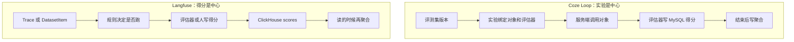

# 评测设计对比：同一任务，两种结构

> 返回 [概览](index.md) · [Coze Loop](coze-loop.md) · [Langfuse](langfuse.md) · [交互页面](interactive.mdx)

两边都要完成四件事：

1. 准备一批输入。
2. 用规则给输出打分。
3. 批量跑一遍。
4. 允许人改判或补标。

结构不同。代价也不同。

## 1. 一张图

## 2. 对照

| 问题 | Coze Loop | Langfuse | 选择的代价 |
|---|---|---|---|
| 评测的主语是什么 | 实验。一次运行有 id、状态和统计 | 得分。它挂在 trace、观察、session 或 `dataset_run_id` 上 | Coze 的批量状态清楚。Langfuse 的线上打分和离线打分是同一行 |
| 评测集如何版本化 | 整集 SemVer。行的 `item_id` 跨版本稳定。另有 `versioned_item` | 行级 `validFrom` / `validTo`。没有整集版本号 | Coze 适合「冻结一批题再跑」。Langfuse 适合「改一行不影响历史」 |
| 谁调用被测模型 | 实验里的评测对象。开源执行只接 Prompt。沙箱是空实现 | 实验 worker 调模型。或用户自己的应用先写 trace | Coze 把调用收进平台。Langfuse 默认可评已有 trace |
| 评估器如何挂上 | 实验保存 `evaluator_version_ids` 和字段映射 | `EvaluationRule` 用过滤、采样、延迟挑选目标 | Coze 的映射显式。Langfuse 的规则能盯着新流量 |
| 一条规则能挂几个评估器 | 实验可挂多个版本，并可加权 | trace / dataset 规则必须恰好一个模型评估器。event / experiment 可以多赋值 | Langfuse 的旧目标被刻意收窄。新目标才放开 |
| 得分存在哪 | MySQL `evaluator_record.score` | ClickHouse `scores` | Coze 好按实验连接查询。Langfuse 好按时间和名称扫大量得分 |
| 人工结果 | 并列的 `AnnotateRecord`。改评估器分用 `Correction` | 同一张得分表，`source=ANNOTATION` | Coze 能同时保留机器分和人工分。Langfuse 用同一查询看两种来源 |
| 汇总 | 实验结束后写入聚合结果。类型含平均、求和、最大、最小、分布 | `aggregateScores` 对当次查出的行做平均或计数 | Coze 的汇总会过期，要重算。Langfuse 的汇总不落库，每次读都算 |
| 自定义评估器 | IDL 有 CustomRPC、Agent、SPI。开源执行表只有 Prompt 和 Code | 代码评估器在观察级队列。公共 API 可写 `API` 得分 | Coze 的扩展点在契约里，开源跑不通。Langfuse 的扩展点是代码或外部写分 |
| 实验是否一等对象 | 是。`CreateExperiment` 甚至没有公开 HTTP，提交用 `submit` | 否。实验是 `dataset_runs` 加元数据。菜单和公共 API 都有开关 | Coze 的实验生命周期完整。Langfuse 的实验仍绑在评测集 run 上 |

依据见 [Coze Loop](coze-loop.md) 和 [Langfuse](langfuse.md) 各节链接。

## 3. 三条设计选择

### 3.1 实验闭环，还是得分流

Coze Loop 把评测集版本、评测对象版本、评估器版本收进 `Experiment`。运行状态在实验、行、轮三层。得分带 `experiment_run_id`。

代价：线上一条 trace 要先变成实验行，或走 `Online` 实验，才能进入同一套结果。`ExptType` 确实有 `Online = 2`。在线运行还要抢心跳锁。[expt.thrift#L31-L34](https://github.com/wzqwtt/coze-loop/blob/3a6a2bf07b057fec0c702e514e8345fb5684e83a/idl/thrift/coze/loop/evaluation/domain/expt.thrift#L31-L34)、[expt_manage_execution_impl.go#L352-L366](https://github.com/wzqwtt/coze-loop/blob/3a6a2bf07b057fec0c702e514e8345fb5684e83a/backend/modules/evaluation/domain/service/expt_manage_execution_impl.go#L352-L366)

Langfuse 不要求先有实验。评估规则看着新 trace。人在队列里打分。SDK 也能写分。三条路都进 `scores`。

代价：没有「这次实验成功了没有」这种单对象状态。实验页还要 feature flag。公共列表还要 v4 预览开关。

### 3.2 得分是列，还是事件

Coze 的分数是 `decimal(10,4)`。理由放在 JSON。人工标注是另一行记录。加权分在轮次上。聚合是一次批任务。

代价：数值类型固定。分类和文本主要靠标注标签，不靠评估器的 `score` 列。`AnnotateRecord` 才有布尔、分类和纯文本。

Langfuse 的一行得分自带 `data_type`。数值、分类、布尔、文本、修正都能进同一表。配置约束在 Postgres。

代价：一次实验的「最终分」不是一列。调用方要按 `name`、`source`、`dataset_run_id` 自己聚。`aggregateScores` 只处理已经取出的数组。

### 3.3 扩展放在进程内，还是放在边界上

Coze 的新评估器类型要进 `evaluatorSourceServices`。开源只注册 Prompt 和 Code。SPI 把自定义调用定义成对方实现的接口。

代价：类型系统完整，开源二进制却跑不了 Agent、CustomRPC 和沙箱。

Langfuse 的新打分方可以不进执行器。公共 API 写 `API`。远程实验把 HTTP 打到客户 URL。代码评估器则进 worker 队列。

代价：平台不拥有被测对象的调用。变量映射和过滤要用户配。trace / dataset 规则不能挂代码评估器，只能挂一个模型评估器。

## 4. 什么时候哪种更贴任务

**【推断】** 下面是设计推论，不是两个仓库的产品声明。

| 任务 | 更贴的结构 | 原因 |
|---|---|---|
| 冻结一批题，对比两个 Prompt 版本 | Coze 实验 | 评测集版本、对象版本、评估器版本在一次实验里对齐 |
| 给生产 trace 持续打分 | Langfuse 规则 | 规则挂在新 trace 上，得分和 trace 在一起 |
| 多人标注队列 | Langfuse 标注队列 | 队列、锁、完成状态是独立对象 |
| 机器分和人工分同时保留 | Coze 轮次载荷 | `evaluator_output` 和 `annotate_result` 并列 |
| 用外部服务打分 | 两边都能，入口不同 | Coze 走 SPI / CustomRPC。Langfuse 走公共 API |
| 开源仓库里今天就能跑通 | Prompt 或 Code 评估器 | Coze 沙箱是空实现。Langfuse 实验页和实验 API 有开关 |

## 5. 不要混用的名字

| 本文用词 | Coze Loop 类型 | Langfuse 类型 |
|---|---|---|
| 评测集 | `EvaluationSet` | `Dataset` |
| 评测集行 | `EvaluationSetItem` | `DatasetItem` |
| 评估器 | `Evaluator` | `Evaluator` |
| 何时执行 | 实验上的版本列表 | `EvaluationRule` |
| 实验 | `Experiment` | `DatasetRuns` 加实验元数据 |
| 得分 | `evaluator_record.score` | `scores` 一行 |
| 人工结果 | `AnnotateRecord` | `source=ANNOTATION` 的得分 |
