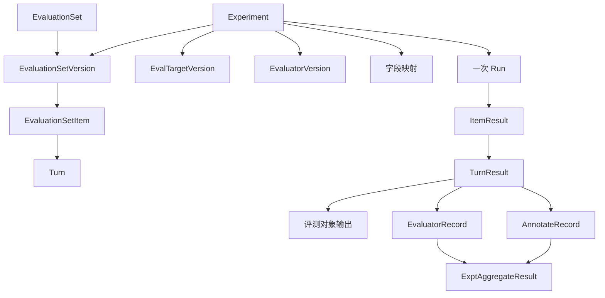
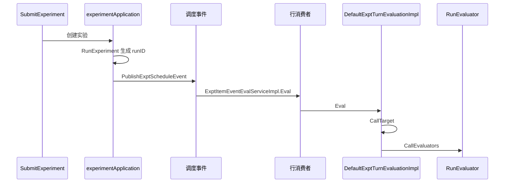

# Coze Loop 评测：功能设计

> 返回 [概览](index.md) · 对照 [Langfuse](langfuse.md) · [对比](comparison.md) · [交互页面](interactive.mdx)

- 仓库 [wzqwtt/coze-loop](https://github.com/wzqwtt/coze-loop)，提交 `3a6a2bf07b057fec0c702e514e8345fb5684e83a`。
- 入口是 IDL、前端路由和 `backend/modules/evaluation`。
- 推断标 **【推断】**。

## 1. 用户能做什么

菜单在每个空间下有三个入口。文案是「评测」「评测集」「评估器」「实验」。

证据：[menu-config.tsx#L62-L84](https://github.com/wzqwtt/coze-loop/blob/3a6a2bf07b057fec0c702e514e8345fb5684e83a/frontend/apps/cozeloop/src/components/navbar/menu-config.tsx#L62-L84)、[zh-CN.json#L82](https://github.com/wzqwtt/coze-loop/blob/3a6a2bf07b057fec0c702e514e8345fb5684e83a/frontend/packages/loop-base/loop-lng/src/locales/common/zh-CN.json#L82)、[L84](https://github.com/wzqwtt/coze-loop/blob/3a6a2bf07b057fec0c702e514e8345fb5684e83a/frontend/packages/loop-base/loop-lng/src/locales/common/zh-CN.json#L84)、[L99](https://github.com/wzqwtt/coze-loop/blob/3a6a2bf07b057fec0c702e514e8345fb5684e83a/frontend/packages/loop-base/loop-lng/src/locales/common/zh-CN.json#L99)、[components/zh-CN.json#L61](https://github.com/wzqwtt/coze-loop/blob/3a6a2bf07b057fec0c702e514e8345fb5684e83a/frontend/packages/loop-base/loop-lng/src/locales/components/zh-CN.json#L61)。

路由挂在 `/console/enterprise/:enterpriseID/space/:spaceID/evaluation/*`。默认页是实验列表。

证据：[routes/index.tsx#L37-L75](https://github.com/wzqwtt/coze-loop/blob/3a6a2bf07b057fec0c702e514e8345fb5684e83a/frontend/apps/cozeloop/src/routes/index.tsx#L37-L75)、[app.tsx#L31-L72](https://github.com/wzqwtt/coze-loop/blob/3a6a2bf07b057fec0c702e514e8345fb5684e83a/frontend/packages/loop-pages/evaluate-pages/src/app.tsx#L31-L72)。

| 页面 | 路由 | 作用 |
|---|---|---|
| 评测集列表 / 创建 / 详情 | `datasets`、`datasets/create`、`datasets/:id` | 管理评测集 |
| 评估器列表 | `evaluators` | 管理评估器 |
| Prompt 评估器 | `evaluators/create/llm`、`evaluators/:id` | 模型评估器 |
| Code 评估器 | `evaluators/create/code`、`evaluators/code/:id` | 代码评估器 |
| 实验列表 / 创建 / 详情 / 对比 | `experiments/list`、`experiments/create`、`experiments/:experimentID`、`experiments/contrast` | 跑实验并对比 |

开源前端有两处开关：

- 多模态评测关闭：`IS_DISABLED_MULTI_MODEL_EVAL = true`。[biz-config#L7-L8](https://github.com/wzqwtt/coze-loop/blob/3a6a2bf07b057fec0c702e514e8345fb5684e83a/frontend/packages/loop-components/biz-config/src/index.ts#L7-L8)
- 实验详情的评测集模糊筛选隐藏。注释写服务端暂不支持。[biz-config#L9-L10](https://github.com/wzqwtt/coze-loop/blob/3a6a2bf07b057fec0c702e514e8345fb5684e83a/frontend/packages/loop-components/biz-config/src/index.ts#L9-L10)

创建实验时，评测对象下拉只有 Prompt 和 CozeBot。[eval-target-cascade-tree-select.tsx#L24-L71](https://github.com/wzqwtt/coze-loop/blob/3a6a2bf07b057fec0c702e514e8345fb5684e83a/frontend/packages/loop-modules/evaluate/src/components/experiment/selectors/eval-target-version-select/eval-target-cascade-tree-select.tsx#L24-L71)

## 2. 领域对象

IDL 把评测拆成六个服务：`EvaluationSetService`、`EvaluatorService`、`ExperimentService`、`EvalTargetService`、`EvalOpenAPIService`、`EvalSPIService`。[coze.loop.evaluation.thrift](https://github.com/wzqwtt/coze-loop/blob/3a6a2bf07b057fec0c702e514e8345fb5684e83a/idl/thrift/coze/loop/evaluation/coze.loop.evaluation.thrift)

### 2.1 评测集

产品名是 `EvaluationSet`，不是 `EvalSet`。

| 类型 | 作用 | 关键字段 |
|---|---|---|
| `EvaluationSet` | 评测集头 | `name`、`status`、`item_count`、`type`、`latest_version`、`dataset_key` |
| `EvaluationSetVersion` | 一次提交 | `version`（SemVer）、`version_num`、`evaluation_set_schema` |
| `FieldSchema` | 一列 | `key`、`content_type`、`text_schema`、`locked` |
| `EvaluationSetItem` | 一行 | `item_id`、`turns`。`item_id` 不随版本变 |
| `Turn` / `FieldData` | 一轮 / 一个字段 | `field_data_list`、`content` |

证据：[eval_set.thrift#L27-L181](https://github.com/wzqwtt/coze-loop/blob/3a6a2bf07b057fec0c702e514e8345fb5684e83a/idl/thrift/coze/loop/evaluation/domain/eval_set.thrift#L27-L181)。

类型有两种：`default` 和 `versioned_item`。后者给单行自己的版本。[eval_set.thrift#L179-L181](https://github.com/wzqwtt/coze-loop/blob/3a6a2bf07b057fec0c702e514e8345fb5684e83a/idl/thrift/coze/loop/evaluation/domain/eval_set.thrift#L179-L181)

创建评测集不直接写评测表。领域服务调用数据集 RPC `CreateDataset`。[evaluation_set_impl.go#L52-L80](https://github.com/wzqwtt/coze-loop/blob/3a6a2bf07b057fec0c702e514e8345fb5684e83a/backend/modules/evaluation/domain/service/evaluation_set_impl.go#L52-L80)

应用层入口是 `EvaluationSetApplicationImpl.CreateEvaluationSet`。[evaluation_set_app.go#L125](https://github.com/wzqwtt/coze-loop/blob/3a6a2bf07b057fec0c702e514e8345fb5684e83a/backend/modules/evaluation/application/evaluation_set_app.go#L125)

HTTP 前缀是 `/api/evaluation/v1/evaluation_sets`。创建、改 schema、提交版本、批量写行都在这里。[eval_set.thrift#L555-L609](https://github.com/wzqwtt/coze-loop/blob/3a6a2bf07b057fec0c702e514e8345fb5684e83a/idl/thrift/coze/loop/evaluation/coze.loop.evaluation.eval_set.thrift#L555-L609)

### 2.2 评估器

`EvaluatorType` 有四个值。[evaluator.thrift#L6-L11](https://github.com/wzqwtt/coze-loop/blob/3a6a2bf07b057fec0c702e514e8345fb5684e83a/idl/thrift/coze/loop/evaluation/domain/evaluator.thrift#L6-L11)

| 值 | 名称 | 内容结构 |
|---|---|---|
| 1 | Prompt | `PromptEvaluator`：消息、模型、模板来源 |
| 2 | Code | `CodeEvaluator`：语言 Python 或 JS，加代码 |
| 3 | CustomRPC | `CustomRPCEvaluator`：协议、服务名、超时、限流 |
| 4 | Agent | `AgentEvaluator`：模型、技能、打分提示 |

`Evaluator` 有草稿和 `current_version`。内容在 `EvaluatorContent`。[evaluator.thrift#L134-L188](https://github.com/wzqwtt/coze-loop/blob/3a6a2bf07b057fec0c702e514e8345fb5684e83a/idl/thrift/coze/loop/evaluation/domain/evaluator.thrift#L134-L188)

还有 `EvaluatorTemplate`。它是可复用模板，带热度和标签。[evaluator.thrift#L190-L203](https://github.com/wzqwtt/coze-loop/blob/3a6a2bf07b057fec0c702e514e8345fb5684e83a/idl/thrift/coze/loop/evaluation/domain/evaluator.thrift#L190-L203)

创建走 `EvaluatorHandlerImpl.CreateEvaluator`，再进 `EvaluatorServiceImpl.CreateEvaluator`。[evaluator_app.go#L276-L317](https://github.com/wzqwtt/coze-loop/blob/3a6a2bf07b057fec0c702e514e8345fb5684e83a/backend/modules/evaluation/application/evaluator_app.go#L276-L317)、[evaluator_impl.go#L462](https://github.com/wzqwtt/coze-loop/blob/3a6a2bf07b057fec0c702e514e8345fb5684e83a/backend/modules/evaluation/domain/service/evaluator_impl.go#L462)

主要 HTTP：

| 动作 | 方法 |
|---|---|
| 创建 | `POST /api/evaluation/v1/evaluators` |
| 更新草稿 | `PATCH .../evaluators/:evaluator_id/update_draft` |
| 提交版本 | `POST .../evaluators/:evaluator_id/submit_version` |
| 试跑 | `POST .../evaluators/debug` |
| 按版本运行 | `POST .../evaluators_versions/:evaluator_version_id/run` |
| 改得分 | `PATCH .../evaluator_records/:evaluator_record_id` |

证据：[evaluator.thrift#L548-L610](https://github.com/wzqwtt/coze-loop/blob/3a6a2bf07b057fec0c702e514e8345fb5684e83a/idl/thrift/coze/loop/evaluation/coze.loop.evaluation.evaluator.thrift#L548-L610)。

### 2.3 评测对象

`EvalTarget` 指向一个外部对象的某个版本。`EvalTargetType` 从 CozeBot 到 SandboxAgent，共 17 种。带 `Online` 后缀的类型注释写明：评测过程中不执行，只用于展示。[eval_target.thrift#L88-L110](https://github.com/wzqwtt/coze-loop/blob/3a6a2bf07b057fec0c702e514e8345fb5684e83a/idl/thrift/coze/loop/evaluation/domain/eval_target.thrift#L88-L110)

开源 `NewSourceTargetOperators` 只注册两个实现：

- `EvalTargetTypeLoopPrompt`
- `EvalTargetTypeSandboxAgent`

证据：[wire.go#L148-L153](https://github.com/wzqwtt/coze-loop/blob/3a6a2bf07b057fec0c702e514e8345fb5684e83a/backend/modules/evaluation/domain/service/wire.go#L148-L153)。

沙箱调度适配器的每个方法都返回 `not implement`。注释写明真实调用在商业仓库。[sandbox_scheduler.go#L14-L28](https://github.com/wzqwtt/coze-loop/blob/3a6a2bf07b057fec0c702e514e8345fb5684e83a/backend/modules/evaluation/infra/rpc/agent_studio/sandbox_scheduler.go#L14-L28)

**【推断】** 开源界面里的 CozeBot 没有对应 operator。SandboxAgent 虽已注册，调度调用会失败。

### 2.4 实验

`Experiment` 把三样东西钉在一次运行上：

- `eval_set_id` + `eval_set_version_id`
- `target_id` + `target_version_id`
- `evaluator_version_ids`

另外有字段映射 `target_field_mapping`、`evaluator_field_mapping`。映射决定评测集列和评测对象输出如何填进评估器输入。[expt.thrift#L191-L232](https://github.com/wzqwtt/coze-loop/blob/3a6a2bf07b057fec0c702e514e8345fb5684e83a/idl/thrift/coze/loop/evaluation/domain/expt.thrift#L191-L232)

`ExptTuple` 是这三样的简写。[expt.thrift#L292-L301](https://github.com/wzqwtt/coze-loop/blob/3a6a2bf07b057fec0c702e514e8345fb5684e83a/idl/thrift/coze/loop/evaluation/domain/expt.thrift#L292-L301)

实验类型：`Offline = 1`，`Online = 2`。[expt.thrift#L31-L34](https://github.com/wzqwtt/coze-loop/blob/3a6a2bf07b057fec0c702e514e8345fb5684e83a/idl/thrift/coze/loop/evaluation/domain/expt.thrift#L31-L34)

评测集来源：`SingleSet = 1`，`MultiSetConfig = 2`。多评测集时，每个集可以绑自己的评测对象和评估器。读接口默认只返回老的 SingleSet。[expt.thrift#L452-L456](https://github.com/wzqwtt/coze-loop/blob/3a6a2bf07b057fec0c702e514e8345fb5684e83a/idl/thrift/coze/loop/evaluation/domain/expt.thrift#L452-L456)

创建多评测集实验要过空间白名单。注释写默认白名单为空，等于全部禁止。[experiment_app.go#L206-L211](https://github.com/wzqwtt/coze-loop/blob/3a6a2bf07b057fec0c702e514e8345fb5684e83a/backend/modules/evaluation/application/experiment_app.go#L206-L211)

`CreateExperiment` 在 IDL 上没有 HTTP 注解。对外提交是 `POST /api/evaluation/v1/experiments/submit`。注释写 Submit 会创建并提交运行。[expt.thrift#L1021-L1026](https://github.com/wzqwtt/coze-loop/blob/3a6a2bf07b057fec0c702e514e8345fb5684e83a/idl/thrift/coze/loop/evaluation/coze.loop.evaluation.expt.thrift#L1021-L1026)

## 3. 对象关系

一行结果的载荷是 `ExperimentTurnPayload`。它同时放评测集、评测对象输出、评估器输出和人工标注。[expt.thrift#L614-L626](https://github.com/wzqwtt/coze-loop/blob/3a6a2bf07b057fec0c702e514e8345fb5684e83a/idl/thrift/coze/loop/evaluation/domain/expt.thrift#L614-L626)

## 4. 运行过程

步骤：

1. `SubmitExperiment` 先做创建。单次 `item_ids` 最多 100。[experiment_app.go#L689-L702](https://github.com/wzqwtt/coze-loop/blob/3a6a2bf07b057fec0c702e514e8345fb5684e83a/backend/modules/evaluation/application/experiment_app.go#L689-L702)
2. 创建成功后调用 `RunExperiment`。[experiment_app.go#L806-L814](https://github.com/wzqwtt/coze-loop/blob/3a6a2bf07b057fec0c702e514e8345fb5684e83a/backend/modules/evaluation/application/experiment_app.go#L806-L814)
3. `RunExperiment` 生成 `runID`，写运行日志，再 `manager.Run`。[experiment_app.go#L1708-L1728](https://github.com/wzqwtt/coze-loop/blob/3a6a2bf07b057fec0c702e514e8345fb5684e83a/backend/modules/evaluation/application/experiment_app.go#L1708-L1728)
4. `ExptMangerImpl.Run` 发布 `ExptScheduleEvent`。在线实验还要先抢心跳锁。[expt_manage_execution_impl.go#L346-L383](https://github.com/wzqwtt/coze-loop/blob/3a6a2bf07b057fec0c702e514e8345fb5684e83a/backend/modules/evaluation/domain/service/expt_manage_execution_impl.go#L346-L383)
5. 行消费者是 `ExptItemEventEvalServiceImpl.Eval`。[expt_run_item_event_impl.go#L150](https://github.com/wzqwtt/coze-loop/blob/3a6a2bf07b057fec0c702e514e8345fb5684e83a/backend/modules/evaluation/domain/service/expt_run_item_event_impl.go#L150)
6. 每一轮先 `CallTarget`，再 `CallEvaluators`。评测对象失败则不再打分。[expt_run_item_turn_impl.go#L66-L102](https://github.com/wzqwtt/coze-loop/blob/3a6a2bf07b057fec0c702e514e8345fb5684e83a/backend/modules/evaluation/domain/service/expt_run_item_turn_impl.go#L66-L102)

状态分三层：

| 枚举 | 取值 |
|---|---|
| `ExptStatus` | Pending、Processing、Success、Failed、Terminated、SystemTerminated、Terminating、Draining |
| `ItemRunState` | Queueing、Processing、Success、Fail、Terminal |
| `TurnRunState` | Queueing、Success、Fail、Processing、Terminal |
| `EvaluatorRunStatus` | Unknown、Success、Fail、AsyncInvoking |

证据：[expt.thrift#L16-L29](https://github.com/wzqwtt/coze-loop/blob/3a6a2bf07b057fec0c702e514e8345fb5684e83a/idl/thrift/coze/loop/evaluation/domain/expt.thrift#L16-L29)、[L467-L482](https://github.com/wzqwtt/coze-loop/blob/3a6a2bf07b057fec0c702e514e8345fb5684e83a/idl/thrift/coze/loop/evaluation/domain/expt.thrift#L467-L482)、[evaluator.thrift#L33-L38](https://github.com/wzqwtt/coze-loop/blob/3a6a2bf07b057fec0c702e514e8345fb5684e83a/idl/thrift/coze/loop/evaluation/domain/evaluator.thrift#L33-L38)。

重试模式：全部、仅失败、指定行。[expt.thrift#L460-L465](https://github.com/wzqwtt/coze-loop/blob/3a6a2bf07b057fec0c702e514e8345fb5684e83a/idl/thrift/coze/loop/evaluation/domain/expt.thrift#L460-L465)

HTTP 还有 kill、按行终止、克隆、导出、洞察分析。[expt.thrift#L1057-L1121](https://github.com/wzqwtt/coze-loop/blob/3a6a2bf07b057fec0c702e514e8345fb5684e83a/idl/thrift/coze/loop/evaluation/coze.loop.evaluation.expt.thrift#L1057-L1121)

## 5. 得分如何产生和存储

一次评估器运行得到 `EvaluatorRecord`。输出里的 `EvaluatorResult` 有三个字段：`score`、`correction`、`reasoning`。[evaluator.thrift#L242-L278](https://github.com/wzqwtt/coze-loop/blob/3a6a2bf07b057fec0c702e514e8345fb5684e83a/idl/thrift/coze/loop/evaluation/domain/evaluator.thrift#L242-L278)

`RunEvaluator` 按评估器类型找 `evaluatorSourceServices`。找不到就返回不存在。分数再保留两位小数。[evaluator_impl.go#L871-L907](https://github.com/wzqwtt/coze-loop/blob/3a6a2bf07b057fec0c702e514e8345fb5684e83a/backend/modules/evaluation/domain/service/evaluator_impl.go#L871-L907)

开源只把 Prompt 和 Code 放进这张表。[wire.go#L136-L145](https://github.com/wzqwtt/coze-loop/blob/3a6a2bf07b057fec0c702e514e8345fb5684e83a/backend/modules/evaluation/domain/service/wire.go#L136-L145)

落库表 `evaluator_record`：

| 列 | 含义 |
|---|---|
| `score` | `decimal(10,4)`，注释为得分 |
| `output_data` | 执行结果 JSON |
| `experiment_id` / `experiment_run_id` | 属于哪次实验运行 |
| `item_id` / `turn_id` | 属于哪一行、哪一轮 |
| `evaluator_version_id` | 哪个评估器版本 |
| `status` | 执行状态 |
| `trace_id` | 关联 trace |

证据：[evaluator_record.sql#L1-L30](https://github.com/wzqwtt/coze-loop/blob/3a6a2bf07b057fec0c702e514e8345fb5684e83a/release/deployment/docker-compose/bootstrap/mysql-init/init-sql/evaluator_record.sql#L1-L30)。

多评估器可以加权。轮次上有 `weighted_score`。表 `expt_turn_result` 有同名列。[expt.thrift#L592-L596](https://github.com/wzqwtt/coze-loop/blob/3a6a2bf07b057fec0c702e514e8345fb5684e83a/idl/thrift/coze/loop/evaluation/domain/expt.thrift#L592-L596)、[expt_turn_result.sql#L16](https://github.com/wzqwtt/coze-loop/blob/3a6a2bf07b057fec0c702e514e8345fb5684e83a/release/deployment/docker-compose/bootstrap/mysql-init/init-sql/expt_turn_result.sql#L16)

人工改分走 `Correction`：新分数、说明、修改人。HTTP 是更新 `evaluator_record`。

聚合不是写得分时顺手算的。`CalculateExperimentAggrResult_` 要求实验已结束，然后发聚合事件。[experiment_app.go#L3039-L3065](https://github.com/wzqwtt/coze-loop/blob/3a6a2bf07b057fec0c702e514e8345fb5684e83a/backend/modules/evaluation/application/experiment_app.go#L3039-L3065)

`CreateExptAggrResult` 按评估器实例、评测对象耗时和标注分别聚合。[expt_result_aggr_impl.go#L75-L104](https://github.com/wzqwtt/coze-loop/blob/3a6a2bf07b057fec0c702e514e8345fb5684e83a/backend/modules/evaluation/domain/service/expt_result_aggr_impl.go#L75-L104)

聚合器类型：Average、Sum、Max、Min、Distribution。[expt.thrift#L751-L803](https://github.com/wzqwtt/coze-loop/blob/3a6a2bf07b057fec0c702e514e8345fb5684e83a/idl/thrift/coze/loop/evaluation/domain/expt.thrift#L751-L803)

HTTP：`POST /api/evaluation/v1/experiments/:expt_id/aggr_results`。[expt.thrift#L1086](https://github.com/wzqwtt/coze-loop/blob/3a6a2bf07b057fec0c702e514e8345fb5684e83a/idl/thrift/coze/loop/evaluation/coze.loop.evaluation.expt.thrift#L1086)

## 6. 扩展点

| 扩展 | 现状 |
|---|---|
| Prompt 评估器 | 开源可执行。消息加模型配置 |
| Code 评估器 | 开源可执行。语言 Python 或 JS |
| 模板 | `list_template`、`evaluator_template` CRUD |
| CustomRPC / Agent | 创建前有单独鉴权。执行表里没有对应 source |
| SPI | `InvokeEvaluator`、`AsyncInvokeEvaluator`，以及评测对象的搜索和调用 |
| 人工标注 | 关联标签，再创建 `AnnotateRecord` |
| 改分 | `Correction` 写回评估器记录 |

SPI 方法：[spi.thrift#L206-L214](https://github.com/wzqwtt/coze-loop/blob/3a6a2bf07b057fec0c702e514e8345fb5684e83a/idl/thrift/coze/loop/evaluation/coze.loop.evaluation.spi.thrift#L206-L214)。

标注 HTTP：

- `POST .../experiments/:expt_id/associate_tag`
- `POST .../experiments/:expt_id/annotate_record/create`

证据：[expt.thrift#L1104-L1107](https://github.com/wzqwtt/coze-loop/blob/3a6a2bf07b057fec0c702e514e8345fb5684e83a/idl/thrift/coze/loop/evaluation/coze.loop.evaluation.expt.thrift#L1104-L1107)。

`AnnotateRecord` 可以是分数、布尔、分类或纯文本。键是标签 `tag_key_id`。它和评估器得分并列，不替换 `score`。[expt.thrift#L598-L611](https://github.com/wzqwtt/coze-loop/blob/3a6a2bf07b057fec0c702e514e8345fb5684e83a/idl/thrift/coze/loop/evaluation/domain/expt.thrift#L598-L611)

CustomRPC 和 Agent 在创建时要过额外鉴权。[evaluator_app.go#L293-L304](https://github.com/wzqwtt/coze-loop/blob/3a6a2bf07b057fec0c702e514e8345fb5684e83a/backend/modules/evaluation/application/evaluator_app.go#L293-L304)

**【推断】** 即使创建成功，开源 `RunEvaluator` 仍会因 source 未注册而失败。
