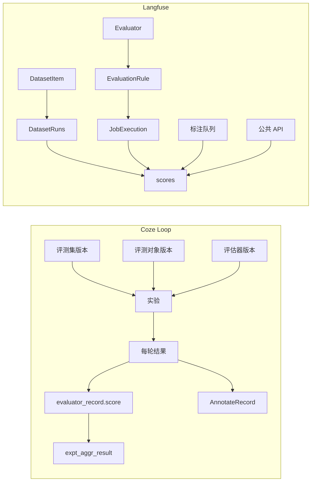

# 评测功能设计：Coze Loop 与 Langfuse

本文对比两个开源 LLM 平台如何设计评测。

范围是功能设计。内容来自当前检出的源码。不写实现细节之外的部署步骤。

术语在对比里固定为四个词：

- **评测集**：待评测的输入行。
- **评估器**：产生得分的规则。
- **实验**：一次批量评测。
- **得分**：一条评测结果。

Langfuse 的类型名仍写英文。对应关系见下表。

## 文档索引

| 文档 | 内容 |
|---|---|
| [Coze Loop](coze-loop.md) | 评测集、评估器、实验、运行过程、得分落库、扩展点 |
| [Langfuse](langfuse.md) | 得分、评估器、评测集、实验、人工标注、运行过程 |
| [对比](comparison.md) | 同一任务上的设计选择，以及每种选择的代价 |
| [交互页面](interactive.mdx) | 对照对象、生命周期、得分写入位置 |

## 源码版本

| 系统 | 仓库 | 提交 |
|---|---|---|
| Coze Loop | [wzqwtt/coze-loop](https://github.com/wzqwtt/coze-loop) | [`3a6a2bf0`](https://github.com/wzqwtt/coze-loop/tree/3a6a2bf07b057fec0c702e514e8345fb5684e83a) |
| Langfuse | [wzqwtt/langfuse](https://github.com/wzqwtt/langfuse) | [`f75c661d`](https://github.com/wzqwtt/langfuse/tree/f75c661dbe8c6b85523c81486b39e8403ac2c141) |

下文每条事实都链到这两个提交。推断单独标 **【推断】**。

## 结论速览

| 维度 | Coze Loop | Langfuse |
|---|---|---|
| 产品中心 | 实验。评测集、评估器和评测对象绑在一次实验上 | 得分。评估器、人工标注和 API 都写成同一类得分 |
| 评测集 | `EvaluationSet`。版本是 SemVer。行数据存在数据集服务 | `Dataset` + `DatasetItem`。行用 `validFrom` / `validTo` 版本化 |
| 评估器 | 类型 Prompt、Code、CustomRPC、Agent。开源执行只注册 Prompt 和 Code | 类型 `LLM_AS_JUDGE`、`CODE`、`DECISION_MODEL`、`FACET`。规则决定何时跑 |
| 实验 | 一等对象 `Experiment`。服务端按行调用评测对象，再调用评估器 | `dataset_runs` 的一行，加上实验元数据。模型调用在 worker |
| 得分 | MySQL `evaluator_record.score`。聚合另存 `expt_aggr_result` | ClickHouse `scores`。聚合在读出后的内存里计算 |
| 人工标注 | 实验行上的 `AnnotateRecord`。与评估器得分并列 | 标注队列。写入来源为 `ANNOTATION` 的得分 |
| 扩展 | SPI 可外接评测对象和评估器。开源沙箱调度是空实现 | 代码评估器、远程实验 URL、公共 API 写得分 |

## 对象怎么拼在一起

## 得分写到哪里

| 问题 | Coze Loop | Langfuse |
|---|---|---|
| 得分行存在哪 | MySQL `evaluator_record` | ClickHouse `scores` |
| 分数列 | `score decimal(10,4)`，理由在 `output_data` JSON | `value Float64`，另有 `string_value`、`data_type` |
| 人工结果 | `annotate_record`，挂在实验轮次上 | 同一张 `scores`，`source=ANNOTATION` |
| 汇总 | 实验结束后写入 `expt_aggr_result` | `aggregateScores` 对已取出的得分数组分组 |

## 查看交互页面

- 站内阅读：[交互页面](interactive.mdx)。
- 单独打开：[`/html/evaluation-feature-design/`](pathname:///html/evaluation-feature-design/)。
