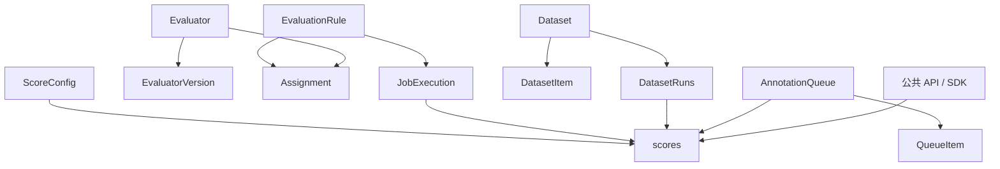
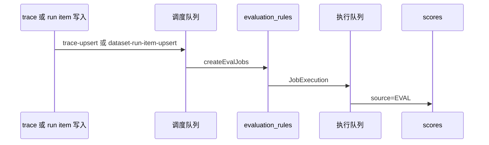

# Langfuse 评测：功能设计

> 返回 [概览](index.md) · 对照 [Coze Loop](coze-loop.md) · [对比](comparison.md) · [交互页面](interactive.mdx)

- 仓库 [wzqwtt/langfuse](https://github.com/wzqwtt/langfuse)，提交 `f75c661dbe8c6b85523c81486b39e8403ac2c141`。
- 下文只描述这个检出里的代码。
- 推断标 **【推断】**。

## 1. 用户能做什么

评测菜单在项目下。组名是 `RouteGroup.Evaluation`。

| 菜单 | 路径 | 门闩 |
|---|---|---|
| Scores | `/project/[projectId]/scores` | 无额外 flag |
| Evaluators | `/project/[projectId]/evals` | 读权限 `evaluator:read` 或 `evaluationRule:read` |
| Human Annotation | `/project/[projectId]/annotation-queues` | `annotationQueues:read` |
| Datasets | `/project/[projectId]/datasets` | `datasets:read` |
| Experiments | `/project/[projectId]/experiments` | feature flag `experimentsV4Enabled` |

证据：[routes.tsx#L186-L227](https://github.com/wzqwtt/langfuse/blob/f75c661dbe8c6b85523c81486b39e8403ac2c141/web/src/components/layouts/routes.tsx#L186-L227)。

评估器首页默认导出 v2 的 `EvaluatorsPage`。被强制留在 v3 体验的项目会重定向到 `/evals/legacy`。[evals/index.tsx#L4-L19](https://github.com/wzqwtt/langfuse/blob/f75c661dbe8c6b85523c81486b39e8403ac2c141/web/src/pages/project/%5BprojectId%5D/evals/index.tsx#L4-L19)

tRPC 同时注册新旧两套：`evals` 和 `evalsV2`。还有 `scores`、`scoreConfigs`、`datasets`、`experiments`、`annotationQueues`。[root.ts#L72-L103](https://github.com/wzqwtt/langfuse/blob/f75c661dbe8c6b85523c81486b39e8403ac2c141/web/src/server/api/root.ts#L72-L103)

## 2. 领域对象

本文把 `Dataset` 称作评测集。Langfuse 界面标题是 Datasets。

### 2.1 得分

得分实例不在 Postgres。表在 ClickHouse，名字是 `scores`。引擎是 `ReplacingMergeTree`。[0003_scores.up.sql#L1-L19](https://github.com/wzqwtt/langfuse/blob/f75c661dbe8c6b85523c81486b39e8403ac2c141/packages/shared/clickhouse/migrations/canonical/0003_scores.up.sql#L1-L19)

初始列：`id`、`trace_id`、`observation_id`、`name`、`value`、`source`、`comment`、`config_id`、`data_type`、`string_value`、`queue_id`。

后来加上：

| 列 | 迁移 |
|---|---|
| `dataset_run_id` | [0017_add_run_id_column_scores.up.sql](https://github.com/wzqwtt/langfuse/blob/f75c661dbe8c6b85523c81486b39e8403ac2c141/packages/shared/clickhouse/migrations/canonical/0017_add_run_id_column_scores.up.sql) |
| `execution_trace_id` | [0030_add_eval_execution_trace_id_to_scores.up.sql](https://github.com/wzqwtt/langfuse/blob/f75c661dbe8c6b85523c81486b39e8403ac2c141/packages/shared/clickhouse/migrations/canonical/0030_add_eval_execution_trace_id_to_scores.up.sql) |
| `evaluator_id`、`evaluation_rule_id` | [0047_add_eval_execution_columns.up.sql#L27-L30](https://github.com/wzqwtt/langfuse/blob/f75c661dbe8c6b85523c81486b39e8403ac2c141/packages/shared/clickhouse/migrations/canonical/0047_add_eval_execution_columns.up.sql#L27-L30) |

来源只有三个：`API`、`EVAL`、`ANNOTATION`。公共创建接口不能自己填 `EVAL`。[scores.ts#L4-L21](https://github.com/wzqwtt/langfuse/blob/f75c661dbe8c6b85523c81486b39e8403ac2c141/packages/shared/src/domain/scores.ts#L4-L21)

数据类型：`NUMERIC`、`CATEGORICAL`、`BOOLEAN`、`CORRECTION`、`TEXT`。[scores.ts#L46-L52](https://github.com/wzqwtt/langfuse/blob/f75c661dbe8c6b85523c81486b39e8403ac2c141/packages/shared/src/domain/scores.ts#L46-L52)

`ANNOTATION` 必须带 `configId`。例外是 `CORRECTION`。[scores.ts#L23-L40](https://github.com/wzqwtt/langfuse/blob/f75c661dbe8c6b85523c81486b39e8403ac2c141/packages/shared/src/domain/scores.ts#L23-L40)

配置在 Postgres `score_configs`。类型是 `CATEGORICAL`、`NUMERIC`、`BOOLEAN`、`TEXT`。数值有上下界。分类存在 `categories` JSON。[schema.prisma#L516-L545](https://github.com/wzqwtt/langfuse/blob/f75c661dbe8c6b85523c81486b39e8403ac2c141/packages/shared/prisma/schema.prisma#L516-L545)

写入函数是 `upsertScore`。它写入 ClickHouse 表 `scores`。[scores.ts#L171-L180](https://github.com/wzqwtt/langfuse/blob/f75c661dbe8c6b85523c81486b39e8403ac2c141/packages/shared/src/server/repositories/scores.ts#L171-L180)

### 2.2 评估器

当前模型是 v2。四张 Postgres 表：

| 模型 | 作用 |
|---|---|
| `Evaluator` | 评估器头。`name`、`type`、`blockedAt` |
| `EvaluatorVersion` | 整数版本。提示词、模型、变量映射、代码 |
| `EvaluationRule` | 何时跑。目标、过滤、采样、延迟 |
| `EvaluationRuleEvaluatorAssignment` | 规则和评估器的多对多，可带变量映射 |

证据：[schema.prisma#L1036-L1198](https://github.com/wzqwtt/langfuse/blob/f75c661dbe8c6b85523c81486b39e8403ac2c141/packages/shared/prisma/schema.prisma#L1036-L1198)。

`EvalTemplateType`：[schema.prisma#L1089-L1094](https://github.com/wzqwtt/langfuse/blob/f75c661dbe8c6b85523c81486b39e8403ac2c141/packages/shared/prisma/schema.prisma#L1089-L1094)

| 类型 | 执行上的位置 |
|---|---|
| `LLM_AS_JUDGE` | trace、dataset、event、experiment 都能跑 |
| `CODE` | 观察级规则可跑。代码语言 Python 或 TypeScript |
| `DECISION_MODEL` | 观察级规则可跑 |
| `FACET` | 调度时被跳过 |

目标对象：`trace`、`dataset`、`event`、`experiment`。[types.ts#L116-L121](https://github.com/wzqwtt/langfuse/blob/f75c661dbe8c6b85523c81486b39e8403ac2c141/packages/shared/src/features/evals/types.ts#L116-L121)

旧模型仍在库里：`EvalTemplate` 加 `JobConfiguration`。`JobConfiguration` 把分数名、过滤、采样和目标对象写在同一行。[schema.prisma#L1007-L1154](https://github.com/wzqwtt/langfuse/blob/f75c661dbe8c6b85523c81486b39e8403ac2c141/packages/shared/prisma/schema.prisma#L1007-L1154)

新建旧的 trace / dataset 评估任务会被门闩拒绝。错误文案要求改去 observation 或 experiment 级评估器。强制 v3 的项目在非 `events_only` 时除外。[legacyEvalGate.ts#L13-L29](https://github.com/wzqwtt/langfuse/blob/f75c661dbe8c6b85523c81486b39e8403ac2c141/web/src/features/evals/server/legacyEvalGate.ts#L13-L29)

公共 API 在 v2：`/api/public/v2/evaluators` 和 `/api/public/v2/evaluation-rules`。包内说明要求公共契约不要露出 `EvalTemplate` 或 `JobConfiguration` 这两个名字。[web/AGENTS.md](https://github.com/wzqwtt/langfuse/blob/f75c661dbe8c6b85523c81486b39e8403ac2c141/web/AGENTS.md)

### 2.3 评测集和实验

| 模型 | 存储 | 作用 |
|---|---|---|
| `Dataset` | Postgres | 名称在项目内唯一。有输入 schema 和期望输出 schema |
| `DatasetItem` | Postgres | `input`、`expectedOutput`。版本列 `validFrom`、`validTo` |
| `DatasetRuns` | Postgres | 某次运行的名字和元数据。名称在评测集内唯一 |

证据：[schema.prisma#L626-L709](https://github.com/wzqwtt/langfuse/blob/f75c661dbe8c6b85523c81486b39e8403ac2c141/packages/shared/prisma/schema.prisma#L626-L709)。

`Dataset` 还带远程实验字段：`remoteExperimentUrl`、payload、签名密钥、自定义头。密钥注释写明静态加密。[schema.prisma#L632-L642](https://github.com/wzqwtt/langfuse/blob/f75c661dbe8c6b85523c81486b39e8403ac2c141/packages/shared/prisma/schema.prisma#L632-L642)

没有单独的 Experiment 表。创建实验时插入 `dataset_runs`。元数据写入 `prompt_id`、模型、`experiment_name`。[router.ts#L255-L280](https://github.com/wzqwtt/langfuse/blob/f75c661dbe8c6b85523c81486b39e8403ac2c141/web/src/features/experiments/server/router.ts#L255-L280)

公共实验列表默认不可用。环境变量 `LANGFUSE_MIGRATION_V4_ALLOW_PREVIEW_OPT_IN` 不是 `"true"` 时，接口抛 404。[experiments/index.ts#L20-L24](https://github.com/wzqwtt/langfuse/blob/f75c661dbe8c6b85523c81486b39e8403ac2c141/web/src/pages/api/public/experiments/index.ts#L20-L24)

`dataset_run_items` 旧表已删除。注释写读写都改到 `dataset_run_items_rmt`。[0046_drop_dataset_run_items.up.sql](https://github.com/wzqwtt/langfuse/blob/f75c661dbe8c6b85523c81486b39e8403ac2c141/packages/shared/clickhouse/migrations/canonical/0046_drop_dataset_run_items.up.sql)

v1 的 run item 接口仍在。`events_only` 时 POST 不写 ClickHouse，只返回稳定 id。GET 在该模式下被拒绝。[dataset-run-items.ts#L24-L50](https://github.com/wzqwtt/langfuse/blob/f75c661dbe8c6b85523c81486b39e8403ac2c141/web/src/pages/api/public/dataset-run-items.ts#L24-L50)

### 2.4 人工标注

`AnnotationQueue` 保存一组 `scoreConfigIds`。队列项的对象类型是 `TRACE`、`OBSERVATION`、`SESSION`。状态是 `PENDING` 或 `COMPLETED`。可以锁给某个用户。[schema.prisma#L547-L614](https://github.com/wzqwtt/langfuse/blob/f75c661dbe8c6b85523c81486b39e8403ac2c141/packages/shared/prisma/schema.prisma#L547-L614)

标注写的是得分，不是另一张结果表。

## 3. 对象关系

一次执行记在 Postgres `job_executions`。它保存输入 trace、观察、评测集行，以及 `jobOutputScoreId`。这个 id 指向 ClickHouse 得分，表上没有外键。[schema.prisma#L1209-L1243](https://github.com/wzqwtt/langfuse/blob/f75c661dbe8c6b85523c81486b39e8403ac2c141/packages/shared/prisma/schema.prisma#L1209-L1243)

## 4. 运行过程

两条主路径。

### 4.1 评估器挂在已有 trace 或评测集行上

`createEvalJobs` 只加载目标为 `trace` 或 `dataset` 的规则。规则必须恰好有一个 `LLM_AS_JUDGE` 赋值。多个赋值会被丢掉。代码把规则投影成旧的 `JobConfiguration` 形状，执行器仍吃这个形状。[evalService.ts#L232-L269](https://github.com/wzqwtt/langfuse/blob/f75c661dbe8c6b85523c81486b39e8403ac2c141/worker/src/features/evaluation/evalService.ts#L232-L269)、[L313-L342](https://github.com/wzqwtt/langfuse/blob/f75c661dbe8c6b85523c81486b39e8403ac2c141/worker/src/features/evaluation/evalService.ts#L313-L342)

观察级路径不同。`fetchObservationEvalRules` 加载目标为 `event` 或 `experiment` 的规则。可执行类型是 `LLM_AS_JUDGE`、`CODE`、`DECISION_MODEL`。[fetchObservationEvalRules.ts#L17-L66](https://github.com/wzqwtt/langfuse/blob/f75c661dbe8c6b85523c81486b39e8403ac2c141/worker/src/features/evaluation/observationEval/fetchObservationEvalRules.ts#L17-L66)

`FACET` 在调度时被跳过。[scheduleObservationEvals.ts#L312-L329](https://github.com/wzqwtt/langfuse/blob/f75c661dbe8c6b85523c81486b39e8403ac2c141/worker/src/features/evaluation/observationEval/scheduleObservationEvals.ts#L312-L329)

队列名：[queues.ts#L406-L464](https://github.com/wzqwtt/langfuse/blob/f75c661dbe8c6b85523c81486b39e8403ac2c141/packages/shared/src/server/queues.ts#L406-L464)

| 队列 | 作用 |
|---|---|
| `trace-upsert` | 为新 trace 调度评估 |
| `dataset-run-item-upsert-queue` | 为评测集行调度评估 |
| `create-eval-queue` | 补跑或批量创建 |
| `evaluation-execution-queue` | 执行 trace / dataset 的模型评估器 |
| `llm-as-a-judge-execution-queue` | 观察级模型评估器 |
| `code-eval-execution-queue` | 观察级代码评估器 |
| `ingestion-queue` | 把得分事件写入 ClickHouse |
| `score-delete` | 删除得分 |

### 4.2 实验：平台替你调用模型

1. tRPC `experiments.create` 插入 `dataset_runs`。
2. 向 `experiment-create-queue` 投递 `experiment-create-job`。
3. worker 按行调用模型，并写入 trace。
4. 行上的评估规则再产生 `EVAL` 得分。

创建入队：[router.ts#L268-L299](https://github.com/wzqwtt/langfuse/blob/f75c661dbe8c6b85523c81486b39e8403ac2c141/web/src/features/experiments/server/router.ts#L268-L299)。

实验菜单还要 flag。**【推断】** 未开 flag 时，用户仍可通过 Datasets 的 run 和评估器规则完成评测。实验页只是另一层入口。

## 5. 得分如何产生和存储

三条写入路径，终点都是 ClickHouse `scores`。

| 路径 | 入口 | 来源 | 怎么落库 |
|---|---|---|---|
| 公共 API / SDK | `ScoresApiService` 进摄入队列 | `API` 或 `ANNOTATION` | 摄入后 `upsertScore` |
| 人工标注 | tRPC `scores.createAnnotationScore` | `ANNOTATION` | 直接 `upsertScore` |
| 评估器 | `completeEvalExecution` | `EVAL` | 先入摄入队列，再写 ClickHouse |

人工标注的直接写入：[scores.ts#L574-L689](https://github.com/wzqwtt/langfuse/blob/f75c661dbe8c6b85523c81486b39e8403ac2c141/web/src/server/api/routers/scores.ts#L574-L689)。注释写标注只支持 trace 和 session。

评估器先组 `source: EVAL` 的事件，带上 `evaluatorId` 和 `evaluationRuleId`。[evalScoreEvent.ts#L56-L61](https://github.com/wzqwtt/langfuse/blob/f75c661dbe8c6b85523c81486b39e8403ac2c141/worker/src/features/evaluation/evalScoreEvent.ts#L56-L61)

然后上传事件并投入 `IngestionQueue`。没有得分就抛错。[evalCompletion.ts#L50-L78](https://github.com/wzqwtt/langfuse/blob/f75c661dbe8c6b85523c81486b39e8403ac2c141/worker/src/features/evaluation/evalCompletion.ts#L50-L78)

Postgres 只留执行指针 `job_output_score_id`。

汇总不另存一张聚合表。`aggregateScores` 把已取出的得分按名称、来源、数据类型分组。数值做平均。其他类型按值计数。[aggregateScores.ts#L106-L125](https://github.com/wzqwtt/langfuse/blob/f75c661dbe8c6b85523c81486b39e8403ac2c141/web/src/features/scores/lib/aggregateScores.ts#L106-L125)

实验详情和评测集 run 都调用它。[experiments/router.ts#L480-L488](https://github.com/wzqwtt/langfuse/blob/f75c661dbe8c6b85523c81486b39e8403ac2c141/web/src/features/experiments/server/router.ts#L480-L488)、[dataset-router.ts#L760-L763](https://github.com/wzqwtt/langfuse/blob/f75c661dbe8c6b85523c81486b39e8403ac2c141/web/src/features/datasets/server/dataset-router.ts#L760-L763)

## 6. 扩展点

| 扩展 | 做法 |
|---|---|
| 模型评估器 | `LLM_AS_JUDGE`。用户把 trace 字段映射到提示词变量 |
| 代码评估器 | `CODE`。语言 Python 或 TypeScript。观察级队列执行 |
| 决策模型 | `DECISION_MODEL`。只出现在观察级可执行类型里 |
| 规则 | 过滤、采样比例、延迟、时间范围 `NEW` |
| 人工标注 | 队列绑定得分配置。人提交 `ANNOTATION` 得分 |
| 外部打分 | 公共 API。不能把 `source` 设成 `EVAL` |
| 远程实验 | 评测集上的 URL。平台把请求打到客户端点 |
| 屏蔽 | `blockedAt` 加 `EvaluatorBlockReason`。计费、鉴权、缺模型都会挡住 |

`EvaluatorBlockReason` 包括连接鉴权失败、账单耗尽、端点不可达、缺默认模型。[schema.prisma#L1117-L1126](https://github.com/wzqwtt/langfuse/blob/f75c661dbe8c6b85523c81486b39e8403ac2c141/packages/shared/prisma/schema.prisma#L1117-L1126)

包内说明：模型评估器的变量映射由用户做。代码评估器把一份固定映射写入数据库，具体取值仍由用户在代码里映射。[evals/AGENTS.md](https://github.com/wzqwtt/langfuse/blob/f75c661dbe8c6b85523c81486b39e8403ac2c141/web/src/features/evals/AGENTS.md)
