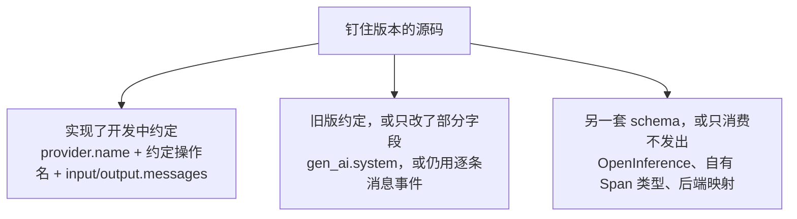

# 谁实现了 OpenTelemetry 生成式 AI 语义约定

本篇记录各开源项目在钉住版本上实际发出的信号。每条事实链到该版本的源码。规范本身的字段说明在学习笔记 [OpenTelemetry 生成式 AI 语义约定](../../../learning/observability/otel-genai/index.md)。

点选框架并打开证据：[点选实现](interactive.mdx)。单独打开静态页：[otel-genai-implementations](pathname:///html/otel-genai-implementations/)。

## 钉住的规范

| 项 | 钉住的事实 |
|---|---|
| 仓库 | [open-telemetry/semantic-conventions-genai](https://github.com/open-telemetry/semantic-conventions-genai/tree/06ec68e722c45a7218e23ea1bc1339fe4e21ecae) |
| 提交 | `06ec68e722c45a7218e23ea1bc1339fe4e21ecae`，2026-10-07 |
| 官方名称 | OpenTelemetry GenAI Semantic Conventions。总览页标题是 Semantic conventions for generative AI systems |
| 稳定状态 | `development` |
| 模式 URL | `https://opentelemetry.io/schemas/gen-ai-dev/1.42.0-dev` |

名称、状态和模式 URL 的出处在学习笔记的 [钉住的名称和版本](../../../learning/observability/otel-genai/index.md)。本篇把这套文本称为**开发中约定**。

**【推断】** 口头说的 GenAI 2.0 指的是这套开发中约定。官方文本里没有 2.0 这个版本号。推断依据写在学习笔记同一节。

下文的「旧版约定」指主仓库 `v1.36.0` 及更早：提供方字段是 `gen_ai.system`，内容是每条消息一个事件（`gen_ai.user.message`、`gen_ai.choice` 等），token 指标是直方图 `gen_ai.client.token.usage`。差异表在学习笔记 [信号、迁移和上下文](../../../learning/observability/otel-genai/signals.md)。

## 判定

一条实现要同时满足下面三条，才写入「实现了开发中约定」：

1. 提供方字段用 `gen_ai.provider.name`。只写 `gen_ai.system` 不算。
2. 操作名使用约定里的值，例如 `chat`、`invoke_agent`、`execute_tool`。Span 名是否写成 `{操作名} {目标}` 单独记在表里。
3. 输入输出用 `gen_ai.input.messages` / `gen_ai.output.messages`，可以在 Span 上，也可以在事件 `gen_ai.client.inference.operation.details` 上。仍只用旧的逐条消息事件，不算。

事件和指标分开核对，缺了不把整条划出这一类，但表里写明缺口。规范把内容采集和 `gen_ai.client.inference.operation.details` 都定为选择加入。默认不记内容，仍可以算实现了身份字段。

没有源码证据的项目不写入「已实现」。常量文件里出现属性名，而没有仪器把它们写到 Span 上，不算实现。

本篇没有找到任何项目发出规范里的推理时长 `gen_ai.client.inference.duration`，也没有找到按模态拆开的 token 计数器 `gen_ai.client.inference.usage.*`。查到的时长直方图仍叫 `gen_ai.client.operation.duration`。查到的 token 直方图仍叫 `gen_ai.client.token.usage`。

## 总表

| 项目 | 钉住版本 | 分类 | 默认就发开发中约定？ |
|---|---|---|---|
| OpenTelemetry Python `opentelemetry-util-genai` 及同仓库仪器 | `1.2b0`，`14c76fee` | 实现了 | 是。内容采集要另开环境变量 |
| OpenTelemetry Python contrib `openai-v2` | `v0.66b1`，`a22d0330` | 实现了，需开关 | 否。要 `OTEL_SEMCONV_STABILITY_OPT_IN=gen_ai_latest_experimental` |
| Pydantic AI | `v2.54.0`，`66951321` | 实现了 | 是。同时仍写 `gen_ai.system` |
| Microsoft Agent Framework（Python） | `python-1.21.0`，`91ab44fa` | 实现了 | 是。环境变量未设置时走新字段 |
| Vercel AI SDK `@ai-sdk/otel` | `1.0.136`，`e00b1b14` | 实现了 | 是。`LegacyOpenTelemetry` 仍是旧版 |
| OpenLLMetry | `0.62.4`，`be498301` | 实现了 | OpenAI 仪器默认把消息写成新属性 |
| CrewAI 自带遥测 | `1.15.26`，`bb235ef1` | 实现了 | 是。Span 名仍是 CrewAI 自己的字符串 |
| Google ADK | `v2.11.0`，`9f7965e7` | 实现了，需开关 | 否。推理内容默认是旧版事件 |
| Strands Agents | `python/v1.59.0`，`925067cb` | 实现了，需开关 | 否 |
| JS `@opentelemetry/instrumentation-openai` | `0.21.0`，`cc263ac4` | 实现了，仅 Responses API | Chat Completions 仍是旧版 |
| JS Bedrock、Java OpenAI/Bedrock、Ruby OpenAI | 见后文 | 旧版或只改了部分字段 | 否 |
| Semantic Kernel、Spring AI、AutoGen、LangSmith OTel 导出 | 见后文 | 旧版或只改了部分字段 | 否 |
| OpenInference、Mastra、Langfuse、PHP contrib OpenAI | 见后文 | 另一套 schema，或只消费 | 不适用 |
| LangChain、LlamaIndex、OpenAI Agents SDK 自身 | 见后文 | 自身不发这套属性 | 不适用。官方 Python 仪器在另一仓库 |

## 实现了开发中约定

### OpenTelemetry Python GenAI 仪器，`1.2b0`

仓库 [open-telemetry/opentelemetry-python-genai](https://github.com/open-telemetry/opentelemetry-python-genai/tree/14c76fee1a5270d194bfada07f711352a2d3aa4d)。GitHub release 标签 `opentelemetry-util-genai==1.2b0` 与 `opentelemetry-instrumentation-genai-openai==1.2b0` 都指向提交 `14c76fee1a5270d194bfada07f711352a2d3aa4d`（2026-09-24 的 release 列表里，同一提交还打了 anthropic、langchain、google-genai、openai-agents、bedrock、dspy、llama-index、portkey、agno、smolagents、qwen-agent 的 `1.2b0` 标签）。

同一提交的 README 仍把 bedrock、dspy、llama-index、portkey 写成 to be released，并把 crewai、claude-agent-sdk、weaviate-client 写成 skeleton。[README L12-L36](https://github.com/open-telemetry/opentelemetry-python-genai/blob/14c76fee1a5270d194bfada07f711352a2d3aa4d/README.md#L12-L36)。CrewAI 仪器的 README 写明操作仪器会在后续变更里加。[crewai README L3-L5](https://github.com/open-telemetry/opentelemetry-python-genai/blob/14c76fee1a5270d194bfada07f711352a2d3aa4d/instrumentation/opentelemetry-instrumentation-genai-crewai/README.rst#L3-L5)。本篇不把这三个 skeleton 算成已发出信号的仪器。

仓库 README 写：全部仪器使用 `opentelemetry-util-genai`。[README L7-L8](https://github.com/open-telemetry/opentelemetry-python-genai/blob/14c76fee1a5270d194bfada07f711352a2d3aa4d/README.md#L7-L8)。OpenAI 仪器调用 `handler.inference()`。[utils.py L119-L123](https://github.com/open-telemetry/opentelemetry-python-genai/blob/14c76fee1a5270d194bfada07f711352a2d3aa4d/instrumentation/opentelemetry-instrumentation-genai-openai/src/opentelemetry/instrumentation/genai/openai/utils.py#L119-L123)。LangChain 仪器把 agent 信号映射成 `invoke_agent`。[operation_mapping.py L272](https://github.com/open-telemetry/opentelemetry-python-genai/blob/14c76fee1a5270d194bfada07f711352a2d3aa4d/instrumentation/opentelemetry-instrumentation-genai-langchain/src/opentelemetry/instrumentation/genai/langchain/operation_mapping.py#L272)。

共享工具发出的信号：

| 信号 | 源码里的做法 |
|---|---|
| 推理 Span | 操作名默认 `chat`。属性包含 `gen_ai.provider.name`。Span 名是 `{操作名} {请求模型}`。[`_inference_invocation.py` L105-L126](https://github.com/open-telemetry/opentelemetry-python-genai/blob/14c76fee1a5270d194bfada07f711352a2d3aa4d/util/opentelemetry-util-genai/src/opentelemetry/util/genai/_inference_invocation.py#L105-L126) |
| Agent Span | Span 名 `invoke_agent {agent_name}`。[`_agent_invocation.py` L85](https://github.com/open-telemetry/opentelemetry-python-genai/blob/14c76fee1a5270d194bfada07f711352a2d3aa4d/util/opentelemetry-util-genai/src/opentelemetry/util/genai/_agent_invocation.py#L85) |
| 工具 Span | 操作名 `execute_tool`。Span 名 `execute_tool {name}`。[`_tool_invocation.py` L81-L96](https://github.com/open-telemetry/opentelemetry-python-genai/blob/14c76fee1a5270d194bfada07f711352a2d3aa4d/util/opentelemetry-util-genai/src/opentelemetry/util/genai/_tool_invocation.py#L81-L96) |
| 消息 | `get_content_attributes` 把输入输出序列化进属性。Span 上是 JSON 字符串，事件上是结构。[`_invocation.py` L332-L375](https://github.com/open-telemetry/opentelemetry-python-genai/blob/14c76fee1a5270d194bfada07f711352a2d3aa4d/util/opentelemetry-util-genai/src/opentelemetry/util/genai/_invocation.py#L332-L375) |
| 事件 | 事件名 `gen_ai.client.inference.operation.details`。内容模式不允许时不发。[`_inference_invocation.py` L438-L455](https://github.com/open-telemetry/opentelemetry-python-genai/blob/14c76fee1a5270d194bfada07f711352a2d3aa4d/util/opentelemetry-util-genai/src/opentelemetry/util/genai/_inference_invocation.py#L438-L455) |
| 指标 | 推理时长用常量 `GEN_AI_CLIENT_OPERATION_DURATION`，token 用 `GEN_AI_CLIENT_TOKEN_USAGE`。另外创建 `gen_ai.invoke_agent.duration`、`gen_ai.execute_tool.duration`、`gen_ai.invoke_workflow.duration`。[`_instruments.py` L53-L128](https://github.com/open-telemetry/opentelemetry-python-genai/blob/14c76fee1a5270d194bfada07f711352a2d3aa4d/util/opentelemetry-util-genai/src/opentelemetry/util/genai/_instruments.py#L53-L128) |

常量的字符串在 `opentelemetry-python` 标签 `v1.45.1`（提交 `14971cef9c84c2354cbaf6871090896fad0f9a1a`，2026-10-06）里是 `gen_ai.client.operation.duration` 和 `gen_ai.client.token.usage`。[gen_ai_metrics.py L9-L54](https://github.com/open-telemetry/opentelemetry-python/blob/14971cef9c84c2354cbaf6871090896fad0f9a1a/opentelemetry-semantic-conventions/src/opentelemetry/semconv/_incubating/metrics/gen_ai_metrics.py#L9-L54)。`gen_ai.provider.name` 与 `gen_ai.input.messages` 的常量字符串也在这一标签。[gen_ai_attributes.py L69](https://github.com/open-telemetry/opentelemetry-python/blob/14971cef9c84c2354cbaf6871090896fad0f9a1a/opentelemetry-semantic-conventions/src/opentelemetry/semconv/_incubating/attributes/gen_ai_attributes.py#L69) 与 [L124](https://github.com/open-telemetry/opentelemetry-python/blob/14971cef9c84c2354cbaf6871090896fad0f9a1a/opentelemetry-semantic-conventions/src/opentelemetry/semconv/_incubating/attributes/gen_ai_attributes.py#L124)。

内容默认不采集。打开时把 `OTEL_INSTRUMENTATION_GENAI_CAPTURE_MESSAGE_CONTENT` 设为 `span_only`、`event_only` 或 `span_and_event`。[OpenAI README L105-L115](https://github.com/open-telemetry/opentelemetry-python-genai/blob/14c76fee1a5270d194bfada07f711352a2d3aa4d/instrumentation/opentelemetry-instrumentation-genai-openai/README.rst#L105-L115)。这一版 README 没有要求 `OTEL_SEMCONV_STABILITY_OPT_IN`。提供方字段在推理 Span 构造时直接写 `GEN_AI_PROVIDER_NAME`。

该仓库自己的符合性工具把规范钉在更早的提交 `94f432d7126f5884d30a2cdde6f4e89908ebb6fd`（2026-09-03）。[versions.env L7-L9](https://github.com/open-telemetry/opentelemetry-python-genai/blob/14c76fee1a5270d194bfada07f711352a2d3aa4d/versions.env#L7-L9)。本篇对照的是 `06ec68e`，不是那条符合性钉。

### OpenTelemetry Python contrib 的 OpenAI v2，需开关

仓库 [open-telemetry/opentelemetry-python-contrib](https://github.com/open-telemetry/opentelemetry-python-contrib/tree/a22d03307b27d958ca9dc340a3514ae1898f63e7)，标签 `v0.66b1`，提交 `a22d03307b27d958ca9dc340a3514ae1898f63e7`（2026-10-06）。`instrumentation-genai/` 下有 `opentelemetry-instrumentation-openai-v2`、`opentelemetry-instrumentation-openai-agents-v2`、`opentelemetry-instrumentation-vertexai`。本篇逐行核对了 OpenAI v2。另外两个包只确认目录存在，不写成已实现。

OpenAI v2 的模块文档写：默认对齐 Semantic Conventions v1.30.0。设置 `OTEL_SEMCONV_STABILITY_OPT_IN=gen_ai_latest_experimental` 才发较新的属性。[`__init__.py` L31-L39](https://github.com/open-telemetry/opentelemetry-python-contrib/blob/a22d03307b27d958ca9dc340a3514ae1898f63e7/instrumentation-genai/opentelemetry-instrumentation-openai-v2/src/opentelemetry/instrumentation/openai_v2/__init__.py#L31-L39)。开关来自 `is_experimental_mode()`。[utils.py L25-L31](https://github.com/open-telemetry/opentelemetry-python-contrib/blob/a22d03307b27d958ca9dc340a3514ae1898f63e7/util/opentelemetry-util-genai/src/opentelemetry/util/genai/utils.py#L25-L31)。

打开开关时属性用 `gen_ai.provider.name`，否则用 `gen_ai.system`。[openai_v2/utils.py L202-L224](https://github.com/open-telemetry/opentelemetry-python-contrib/blob/a22d03307b27d958ca9dc340a3514ae1898f63e7/instrumentation-genai/opentelemetry-instrumentation-openai-v2/src/opentelemetry/instrumentation/openai_v2/utils.py#L202-L224)。contrib 里的工具注释写：`OTEL_INSTRUMENTATION_GENAI_EMIT_EVENT` 控制是否发出 `gen_ai.client.inference.operation.details`，默认 `false`。[environment_variables.py L6-L12](https://github.com/open-telemetry/opentelemetry-python-contrib/blob/a22d03307b27d958ca9dc340a3514ae1898f63e7/util/opentelemetry-util-genai/src/opentelemetry/util/genai/environment_variables.py#L6-L12)。时长和 token 直方图仍通过 `GEN_AI_CLIENT_OPERATION_DURATION` 与 `GEN_AI_CLIENT_TOKEN_USAGE` 创建。[instruments.py L42-L56](https://github.com/open-telemetry/opentelemetry-python-contrib/blob/a22d03307b27d958ca9dc340a3514ae1898f63e7/util/opentelemetry-util-genai/src/opentelemetry/util/genai/instruments.py#L42-L56)。

python-genai 仓库的 OpenAI README 写：该包延续以前发布的 `opentelemetry-instrumentation-openai-v2`。[README L15-L17](https://github.com/open-telemetry/opentelemetry-python-genai/blob/14c76fee1a5270d194bfada07f711352a2d3aa4d/instrumentation/opentelemetry-instrumentation-genai-openai/README.rst#L15-L17)。两边在 `v0.66b1` 与 `1.2b0` 上不是同一份源码。contrib 默认仍是旧提供方字段。python-genai `1.2b0` 直接写 `gen_ai.provider.name`。

### Pydantic AI `v2.54.0`

仓库 [pydantic/pydantic-ai](https://github.com/pydantic/pydantic-ai/tree/66951321b89587235f432281eba909a30a585ffd)，提交 `66951321b89587235f432281eba909a30a585ffd`。

`provider_attributes` 同时写入 `gen_ai.provider.name` 和 `gen_ai.system`，注释把后者标成兼容用的废弃字段。[`_instrumentation.py` L415-L420](https://github.com/pydantic/pydantic-ai/blob/66951321b89587235f432281eba909a30a585ffd/pydantic_ai_slim/pydantic_ai/_instrumentation.py#L415-L420)。聊天 Span 的操作名是 `chat`，Span 名是 `chat {模型名}`。[L758-L762](https://github.com/pydantic/pydantic-ai/blob/66951321b89587235f432281eba909a30a585ffd/pydantic_ai_slim/pydantic_ai/_instrumentation.py#L758-L762)。Agent Span 写 `gen_ai.operation.name=invoke_agent`。[capabilities/instrumentation.py L225-L228](https://github.com/pydantic/pydantic-ai/blob/66951321b89587235f432281eba909a30a585ffd/pydantic_ai_slim/pydantic_ai/capabilities/instrumentation.py#L225-L228)。工具 Span 写 `execute_tool`。[L471-L472](https://github.com/pydantic/pydantic-ai/blob/66951321b89587235f432281eba909a30a585ffd/pydantic_ai_slim/pydantic_ai/capabilities/instrumentation.py#L471-L472)。消息属性是 `gen_ai.input.messages` 与 `gen_ai.output.messages`。[instrumented.py L271-L272](https://github.com/pydantic/pydantic-ai/blob/66951321b89587235f432281eba909a30a585ffd/pydantic_ai_slim/pydantic_ai/models/instrumented.py#L271-L272)。

token 直方图名仍是 `gen_ai.client.token.usage`。[instrumented.py L168-L173](https://github.com/pydantic/pydantic-ai/blob/66951321b89587235f432281eba909a30a585ffd/pydantic_ai_slim/pydantic_ai/models/instrumented.py#L168-L173)。这一版没有 `gen_ai.client.inference.operation.details`，也没有 `gen_ai.client.inference.duration`。

### Microsoft Agent Framework，Python `python-1.21.0`

仓库 [microsoft/agent-framework](https://github.com/microsoft/agent-framework/tree/91ab44faa4824a30247d00c341f3498ba46b1ca3)，标签 `python-1.21.0`，提交 `91ab44faa4824a30247d00c341f3498ba46b1ca3`（2026-10-08）。同一时期还有 `dotnet-1.24.0`。本篇只读了 Python 树。

`use_latest_experimental_gen_ai_semconv` 在环境变量未设置时返回 true。[observability.py L1178-L1192](https://github.com/microsoft/agent-framework/blob/91ab44faa4824a30247d00c341f3498ba46b1ca3/python/packages/core/agent_framework/observability.py#L1178-L1192)。此时提供方属性取 `gen_ai.provider.name`。注释写 `gen_ai.system` 在 v1.36.0 之后改名。[L3135-L3140](https://github.com/microsoft/agent-framework/blob/91ab44faa4824a30247d00c341f3498ba46b1ca3/python/packages/core/agent_framework/observability.py#L3135-L3140)。属性常量包括 `gen_ai.operation.name`、`gen_ai.provider.name`、`gen_ai.input.messages`、`gen_ai.output.messages`。[L231-L232](https://github.com/microsoft/agent-framework/blob/91ab44faa4824a30247d00c341f3498ba46b1ca3/python/packages/core/agent_framework/observability.py#L231-L232) 与 [L284-L287](https://github.com/microsoft/agent-framework/blob/91ab44faa4824a30247d00c341f3498ba46b1ca3/python/packages/core/agent_framework/observability.py#L284-L287)。Span 名是 `{操作名} {模型、Agent 或工具名}`。[L2853-L2855](https://github.com/microsoft/agent-framework/blob/91ab44faa4824a30247d00c341f3498ba46b1ca3/python/packages/core/agent_framework/observability.py#L2853-L2855)。

直方图仍是 `gen_ai.client.operation.duration` 和 `gen_ai.client.token.usage`。[L1868-L1880](https://github.com/microsoft/agent-framework/blob/91ab44faa4824a30247d00c341f3498ba46b1ca3/python/packages/core/agent_framework/observability.py#L1868-L1880)。源码里没有事件名 `gen_ai.client.inference.operation.details`。把 `OTEL_SEMCONV_STABILITY_OPT_IN` 设成不含 `gen_ai_latest_experimental` 的列表时，提供方字段退回 `gen_ai.system`。

### Vercel AI SDK `@ai-sdk/otel` `1.0.136`

仓库 [vercel/ai](https://github.com/vercel/ai/tree/e00b1b14e99b9f0fcb5e49848b26ff84613ea067)。标签 `ai@7.0.136` 与 `@ai-sdk/otel@1.0.136` 是同一提交 `e00b1b14e99b9f0fcb5e49848b26ff84613ea067`。包入口导出 `OpenTelemetry` 和 `LegacyOpenTelemetry`。[index.ts L1-L7](https://github.com/vercel/ai/blob/e00b1b14e99b9f0fcb5e49848b26ff84613ea067/packages/otel/src/index.ts#L1-L7)。

新导出在语言模型调用上写 `gen_ai.operation.name=chat` 和 `gen_ai.provider.name`。[open-telemetry.ts L824-L827](https://github.com/vercel/ai/blob/e00b1b14e99b9f0fcb5e49848b26ff84613ea067/packages/otel/src/open-telemetry.ts#L824-L827)。`ai.generateText` 与 `ai.streamText` 映射成 `invoke_agent`。[gen-ai-format-messages.ts L116-L119](https://github.com/vercel/ai/blob/e00b1b14e99b9f0fcb5e49848b26ff84613ea067/packages/otel/src/gen-ai-format-messages.ts#L116-L119)。工具 Span 名是 ``execute_tool ${toolName}``，操作名是 `execute_tool`。[open-telemetry.ts L1006-L1010](https://github.com/vercel/ai/blob/e00b1b14e99b9f0fcb5e49848b26ff84613ea067/packages/otel/src/open-telemetry.ts#L1006-L1010)。消息使用 `gen_ai.input.messages` 与 `gen_ai.output.messages`。

时长写在 Span 属性上，名为 `gen_ai.client.operation.duration`。[L110-L115](https://github.com/vercel/ai/blob/e00b1b14e99b9f0fcb5e49848b26ff84613ea067/packages/otel/src/open-telemetry.ts#L110-L115)。工具耗时属性是 `gen_ai.execute_tool.duration`。[L1108](https://github.com/vercel/ai/blob/e00b1b14e99b9f0fcb5e49848b26ff84613ea067/packages/otel/src/open-telemetry.ts#L1108)。它们不是直方图仪器。源码里没有 `gen_ai.client.inference.operation.details`。映射里还有约定表之外的操作名，例如 `agent_step`。

旧导出 `LegacyOpenTelemetry` 写 `gen_ai.system`。[legacy-open-telemetry.ts L492-L493](https://github.com/vercel/ai/blob/e00b1b14e99b9f0fcb5e49848b26ff84613ea067/packages/otel/src/legacy-open-telemetry.ts#L492-L493)。

### OpenLLMetry `0.62.4`

仓库 [traceloop/openllmetry](https://github.com/traceloop/openllmetry/tree/be498301c40c55155e6d0678b63943093cda14d1)，提交 `be498301c40c55155e6d0678b63943093cda14d1`。

OpenAI 仪器默认 `use_attributes=True`。注释写 GenAI 规范把提示和补全发成 `gen_ai.input.messages` / `gen_ai.output.messages`。[`__init__.py` L36-L46](https://github.com/traceloop/openllmetry/blob/be498301c40c55155e6d0678b63943093cda14d1/packages/opentelemetry-instrumentation-openai/opentelemetry/instrumentation/openai/__init__.py#L36-L46)。请求路径设置 `GenAIAttributes.GEN_AI_PROVIDER_NAME`。[shared/`__init__.py` L140-L143](https://github.com/traceloop/openllmetry/blob/be498301c40c55155e6d0678b63943093cda14d1/packages/opentelemetry-instrumentation-openai/opentelemetry/instrumentation/openai/shared/__init__.py#L140-L143)。`use_attributes=False` 时改发旧事件。

指标常量仍是 `gen_ai.client.token.usage` 和 `gen_ai.client.operation.duration`。[semconv_ai/`__init__.py` L38-L41](https://github.com/traceloop/openllmetry/blob/be498301c40c55155e6d0678b63943093cda14d1/packages/opentelemetry-semantic-conventions-ai/opentelemetry/semconv_ai/__init__.py#L38-L41)。Agents 仪器写 `gen_ai.operation.name=invoke_agent` 和 `gen_ai.provider.name=openai`，Span 名是 `{agent_name}.agent`，并带 `traceloop.span.kind`。[`_hooks.py` L878-L886](https://github.com/traceloop/openllmetry/blob/be498301c40c55155e6d0678b63943093cda14d1/packages/opentelemetry-instrumentation-openai-agents/opentelemetry/instrumentation/openai_agents/_hooks.py#L878-L886)。

### CrewAI `1.15.26` 自带遥测

仓库 [crewAIInc/crewAI](https://github.com/crewAIInc/crewAI/tree/bb235ef17259de4d251c7c8f882a42e47863c80d)，提交 `bb235ef17259de4d251c7c8f882a42e47863c80d`。这是框架自己的遥测，不是上一节的官方 skeleton 仪器。

`gen_ai()` 写入 `gen_ai.operation.name`、`gen_ai.provider.name`、`gen_ai.input.messages`。[semantic_conventions.py L236-L262](https://github.com/crewAIInc/crewAI/blob/bb235ef17259de4d251c7c8f882a42e47863c80d/lib/crewai/src/crewai/telemetry/tracing/semantic_conventions.py#L236-L262)。LLM 调用把操作名设为 `chat`，Span 名传的是 `"call llm"`。[handlers.py L2046-L2071](https://github.com/crewAIInc/crewAI/blob/bb235ef17259de4d251c7c8f882a42e47863c80d/lib/crewai/src/crewai/telemetry/tracing/handlers.py#L2046-L2071)。Agent 调用的操作名是 `invoke_agent`。[L1125](https://github.com/crewAIInc/crewAI/blob/bb235ef17259de4d251c7c8f882a42e47863c80d/lib/crewai/src/crewai/telemetry/tracing/handlers.py#L1125)。工具调用的操作名是 `execute_tool`。[L1290](https://github.com/crewAIInc/crewAI/blob/bb235ef17259de4d251c7c8f882a42e47863c80d/lib/crewai/src/crewai/telemetry/tracing/handlers.py#L1290)。`crewai/telemetry` 下没有 `create_histogram`。源码里没有 `gen_ai.client.inference.operation.details`。

### Google ADK `v2.11.0`，需开关

仓库 [google/adk-python](https://github.com/google/adk-python/tree/9f7965e776c6bfd689e3537dba6dd07103864fc4)，提交 `9f7965e776c6bfd689e3537dba6dd07103864fc4`。

Tracer 的 schema URL 是 `Schemas.V1_36_0`。[tracing.py L179-L183](https://github.com/google/adk-python/blob/9f7965e776c6bfd689e3537dba6dd07103864fc4/src/google/adk/telemetry/tracing.py#L179-L183)。进程内 Span 名包括 `invoke_agent {agent.name}` 和 `execute_tool {tool.name}`。[`_instrumentation.py` L579](https://github.com/google/adk-python/blob/9f7965e776c6bfd689e3537dba6dd07103864fc4/src/google/adk/telemetry/_instrumentation.py#L579) 与 [L616](https://github.com/google/adk-python/blob/9f7965e776c6bfd689e3537dba6dd07103864fc4/src/google/adk/telemetry/_instrumentation.py#L616)。直方图包括 `gen_ai.invoke_agent.duration` 和 `gen_ai.execute_tool.duration`，同时也创建旧的 `gen_ai.client.operation.duration` 与 `gen_ai.client.token.usage`。[`_metrics.py` L68-L94](https://github.com/google/adk-python/blob/9f7965e776c6bfd689e3537dba6dd07103864fc4/src/google/adk/telemetry/_metrics.py#L68-L94)。

默认推理 Span 写 `gen_ai.system`，并发送 `gen_ai.system.message` 等旧事件。[tracing.py L1111-L1123](https://github.com/google/adk-python/blob/9f7965e776c6bfd689e3537dba6dd07103864fc4/src/google/adk/telemetry/tracing.py#L1111-L1123)。`OTEL_SEMCONV_STABILITY_OPT_IN` 含 `gen_ai_latest_experimental` 时才改走新内容模型。事件名常量是 `gen_ai.client.inference.operation.details`。[`_experimental_semconv.py` L87](https://github.com/google/adk-python/blob/9f7965e776c6bfd689e3537dba6dd07103864fc4/src/google/adk/telemetry/_experimental_semconv.py#L87)。读取函数在环境变量为空时返回 false。[context.py L110-L115](https://github.com/google/adk-python/blob/9f7965e776c6bfd689e3537dba6dd07103864fc4/src/google/adk/telemetry/context.py#L110-L115)。

### Strands Agents `python/v1.59.0`，需开关

仓库 [strands-agents/sdk-python](https://github.com/strands-agents/sdk-python/tree/925067cb1f80656aa5dbe19ce20df585701e54c8)，标签 `python/v1.59.0`，提交 `925067cb1f80656aa5dbe19ce20df585701e54c8`。

构造时检查 `OTEL_SEMCONV_STABILITY_OPT_IN` 是否包含 `gen_ai_latest_experimental`。[tracer.py L124-L127](https://github.com/strands-agents/sdk-python/blob/925067cb1f80656aa5dbe19ce20df585701e54c8/strands-py/src/strands/telemetry/tracer.py#L124-L127)。打开时写 `gen_ai.provider.name`，否则写 `gen_ai.system`。两边的值都是 `"strands-agents"`。[L1283-L1294](https://github.com/strands-agents/sdk-python/blob/925067cb1f80656aa5dbe19ce20df585701e54c8/strands-py/src/strands/telemetry/tracer.py#L1283-L1294)。打开时发出事件 `gen_ai.client.inference.operation.details`，并带上 `gen_ai.input.messages`。关闭时发 `gen_ai.system.message`。[L1306-L1323](https://github.com/strands-agents/sdk-python/blob/925067cb1f80656aa5dbe19ce20df585701e54c8/strands-py/src/strands/telemetry/tracer.py#L1306-L1323)。

指标名是 `strands.tool.duration`、`strands.event_loop.input.tokens` 等，不是 `gen_ai.client.inference.*`。[metrics_constants.py L11-L14](https://github.com/strands-agents/sdk-python/blob/925067cb1f80656aa5dbe19ce20df585701e54c8/strands-py/src/strands/telemetry/metrics_constants.py#L11-L14)。

### JavaScript OpenAI 仪器 `0.21.0`，仅 Responses API

仓库 [open-telemetry/opentelemetry-js-contrib](https://github.com/open-telemetry/opentelemetry-js-contrib/tree/cc263ac4e94320402ac3afe50d50eb00905e1bb8)。标签 `instrumentation-openai-v0.21.0`、`genai-util-v0.2.0`、`instrumentation-aws-sdk-v0.78.0` 都是提交 `cc263ac4e94320402ac3afe50d50eb00905e1bb8`（2026-10-06）。

Chat Completions 与 embeddings 写 `gen_ai.system`，日志记录的 `event.name` 是 `gen_ai.system.message`、`gen_ai.user.message`、`gen_ai.choice` 等。直方图是 `gen_ai.client.operation.duration` 和 `gen_ai.client.token.usage`。[instrumentation.ts L169-L184](https://github.com/open-telemetry/opentelemetry-js-contrib/blob/cc263ac4e94320402ac3afe50d50eb00905e1bb8/packages/instrumentation-openai/src/instrumentation.ts#L169-L184) 与 [L298-L364](https://github.com/open-telemetry/opentelemetry-js-contrib/blob/cc263ac4e94320402ac3afe50d50eb00905e1bb8/packages/instrumentation-openai/src/instrumentation.ts#L298-L364)。这条路径归入下一节。

Responses API 写 `gen_ai.provider.name`，操作名 `chat`，并发送事件 `gen_ai.client.inference.operation.details`，属性含 `gen_ai.input.messages`。[L973-L1014](https://github.com/open-telemetry/opentelemetry-js-contrib/blob/cc263ac4e94320402ac3afe50d50eb00905e1bb8/packages/instrumentation-openai/src/instrumentation.ts#L973-L1014)。token 直方图仍是旧名。没有 `invoke_agent` 或 `execute_tool`。内容开关是 `OTEL_INSTRUMENTATION_GENAI_CAPTURE_MESSAGE_CONTENT`。[L105-L110](https://github.com/open-telemetry/opentelemetry-js-contrib/blob/cc263ac4e94320402ac3afe50d50eb00905e1bb8/packages/instrumentation-openai/src/instrumentation.ts#L105-L110)。

`@opentelemetry/genai-util` `0.2.0` 把模式 URL 写成 `https://opentelemetry.io/schemas/gen-ai-dev/1.42.0-dev`。[semconv.ts L32-L33](https://github.com/open-telemetry/opentelemetry-js-contrib/blob/cc263ac4e94320402ac3afe50d50eb00905e1bb8/packages/genai-util/src/semconv.ts#L32-L33)。文件头写这些名字拷自 semantic-conventions-genai 提交 `fee465db333bdd6a7d2faa320edab5cf3101a4f4`，不是本篇的 `06ec68e`。它实际创建的直方图仍是旧名。[L467-L470](https://github.com/open-telemetry/opentelemetry-js-contrib/blob/cc263ac4e94320402ac3afe50d50eb00905e1bb8/packages/genai-util/src/semconv.ts#L467-L470)。`_emitContentEvent` 是空函数。[invocations/base.ts L362-L375](https://github.com/open-telemetry/opentelemetry-js-contrib/blob/cc263ac4e94320402ac3afe50d50eb00905e1bb8/packages/genai-util/src/invocations/base.ts#L362-L375)。OpenAI 仪器不依赖这个包。本篇不把这个工具包单独算成已发出开发中约定的仪器。

## 旧版约定，或只改了部分字段

这些项目使用 `gen_ai.*`，但没有一条路径同时满足上一节的三条。表里写它们已经改了什么。

| 项目 | 版本与提交 | 已经发出的信号 | 未达到开发中约定的点 |
|---|---|---|---|
| JS OpenAI Chat Completions | 同上 `0.21.0` | 操作名 `chat`，Span 名 `{操作} {模型}`，旧事件，旧直方图 | 提供方是 `gen_ai.system` |
| JS AWS SDK Bedrock | `instrumentation-aws-sdk` `0.78.0`，同一提交 | 操作名 `chat`，`gen_ai.system=aws.bedrock`，旧直方图 | 不写 `gen_ai.provider.name`，不写消息属性。[bedrock-runtime.ts L113-L116](https://github.com/open-telemetry/opentelemetry-js-contrib/blob/cc263ac4e94320402ac3afe50d50eb00905e1bb8/packages/instrumentation-aws-sdk/src/services/bedrock-runtime.ts#L113-L116) |
| Java 仪器 OpenAI 与 Bedrock | `v2.32.0`，`1b8644f8eb11d90295b1c313391aa84edeeec6e2` | Span 名 `{操作} {模型}`。提取器写入 `gen_ai.provider.name`。操作名含 `chat`、`embeddings`，Titan 为 `text_completion` | 消息仍是 `event.name` 为 `gen_ai.user.message` / `gen_ai.choice`。直方图是旧名。没有 `gen_ai.input.messages`。[GenAiAttributesExtractor.java L79-L81](https://github.com/open-telemetry/opentelemetry-java-instrumentation/blob/1b8644f8eb11d90295b1c313391aa84edeeec6e2/instrumentation-api-incubator/src/main/java/io/opentelemetry/instrumentation/api/incubator/semconv/genai/GenAiAttributesExtractor.java#L79-L81)，[GenAiClientMetrics.java L64-L73](https://github.com/open-telemetry/opentelemetry-java-instrumentation/blob/1b8644f8eb11d90295b1c313391aa84edeeec6e2/instrumentation-api-incubator/src/main/java/io/opentelemetry/instrumentation/api/incubator/semconv/genai/GenAiClientMetrics.java#L64-L73) |
| Ruby OpenAI gem | `0.1.0`，`3dfcc08c7d77f82eda20ab621b64db28094a9e11` | `gen_ai.provider.name`，Span 名沿用 `{操作} {模型}` | 内容仍是旧的 `gen_ai.{role}.message` 与 `gen_ai.choice`。没有 GenAI 直方图 |
| AutoGen | `python-v0.7.5`，`83afbf5857aac683340d4c692194e548b1e8edda`（2025-09-30，此后无新 release） | Span 名 `invoke_agent {agent}`、`execute_tool {tool}` | 提供方键是 `gen_ai.system`，值为 `autogen`。没有消息属性、事件或 GenAI 指标。[`_genai.py` L20-L45](https://github.com/microsoft/autogen/blob/83afbf5857aac683340d4c692194e548b1e8edda/python/packages/autogen-core/src/autogen_core/_telemetry/_genai.py#L20-L45) |
| Semantic Kernel Python | `python-1.45.0`，与 `dotnet-1.81.0` 同提交 `64005c77870a3b8a157f8aefefd45093f1e6fc00` | 模型 Span 名 `{操作} {模型}`，操作名 `chat`。Agent Span 带 `invoke_agent`，并有 `gen_ai.input.messages` | 模型路径的提供方是 `gen_ai.system`。敏感事件打开时，日志的 `event.name` 仍是旧事件名。文本操作值是 `text_completions`，约定里的值是 `text_completion`。[gen_ai_attributes.py L11-L41](https://github.com/microsoft/semantic-kernel/blob/64005c77870a3b8a157f8aefefd45093f1e6fc00/python/semantic_kernel/utils/telemetry/model_diagnostics/gen_ai_attributes.py#L11-L41)。.NET 树没有逐行读 |
| Spring AI | `v2.0.1`，`c9107fdac0a6c88489c08bb88abcee74c146981d` | Micrometer 低基数键 `gen_ai.operation.name`。操作值含 `chat`、`execute_tool`、`text_completion` | 提供方键是 `gen_ai.system`。另有约定之外的 `embedding`、`image`、`framework`。工具观察使用 `spring.ai.*`。没有消息属性。[AiObservationAttributes.java L37-L41](https://github.com/spring-projects/spring-ai/blob/c9107fdac0a6c88489c08bb88abcee74c146981d/spring-ai-commons/src/main/java/org/springframework/ai/observation/conventions/AiObservationAttributes.java#L37-L41)，[AiOperationType.java L40-L62](https://github.com/spring-projects/spring-ai/blob/c9107fdac0a6c88489c08bb88abcee74c146981d/spring-ai-commons/src/main/java/org/springframework/ai/observation/conventions/AiOperationType.java#L40-L62) |
| LangSmith SDK 的 OTel 导出 | `v0.14.5`，`52e79add98f6559235d1eb00f5f533b9be6d4cf6` | 导出时设置 `gen_ai.operation.name` 和 `gen_ai.system` | 事件名是 `gen_ai.system.message`、`gen_ai.user.message`、`gen_ai.choice`。另有 `gen_ai.prompt`、`gen_ai.completion`。[`_otel_exporter.py` L69-L70](https://github.com/langchain-ai/langsmith-sdk/blob/52e79add98f6559235d1eb00f5f533b9be6d4cf6/python/langsmith/_internal/otel/_otel_exporter.py#L69-L70) 与 [L674](https://github.com/langchain-ai/langsmith-sdk/blob/52e79add98f6559235d1eb00f5f533b9be6d4cf6/python/langsmith/_internal/otel/_otel_exporter.py#L674)。JS 常量同样是 `gen_ai.system`。[constants.ts L2-L3](https://github.com/langchain-ai/langsmith-sdk/blob/52e79add98f6559235d1eb00f5f533b9be6d4cf6/js/src/experimental/otel/constants.ts#L2-L3) |
| Vercel `LegacyOpenTelemetry` | 与 `@ai-sdk/otel` 同一提交 | `gen_ai.system` | 见上一节旧导出 |
| Google ADK 默认推理路径 | `v2.11.0` | 旧事件，`gen_ai.system` | 新内容模型要打开开关。Agent Span 名和新的 Agent 时长直方图在默认路径里已经存在 |

Java 在预览开关 `otel.semconv.exception.signal.preview` 打开时，把异常日志的事件名设为 `gen_ai.client.operation.exception`。[GenAiExceptionEventExtractors.java L28-L29](https://github.com/open-telemetry/opentelemetry-java-instrumentation/blob/1b8644f8eb11d90295b1c313391aa84edeeec6e2/instrumentation-api-incubator/src/main/java/io/opentelemetry/instrumentation/api/incubator/semconv/genai/internal/GenAiExceptionEventExtractors.java#L28-L29)。这是开发中约定里的异常事件名。消息模型仍是旧事件，所以整条仪器不计入「已实现」。

Ruby Anthropic gem `0.5.0`（提交 `da6ede828069b9ba6e58cf5cac2c45a557aebdb1`）的仪器没有设置 `gen_ai.provider.name` 或消息属性。本篇不把它写成旧版 GenAI 仪器。

## 另一套 schema，或只消费不发出

### OpenInference

仓库 [Arize-ai/openinference](https://github.com/Arize-ai/openinference/tree/48becd7a6098992c189ba86b837e5acf045270ef)，标签 `python-openinference-semantic-conventions-v0.1.41`，提交 `48becd7a6098992c189ba86b837e5acf045270ef`。

Span 种类键是 `openinference.span.kind`。[trace/`__init__.py` L318](https://github.com/Arize-ai/openinference/blob/48becd7a6098992c189ba86b837e5acf045270ef/python/openinference-semantic-conventions/src/openinference/semconv/trace/__init__.py#L318)。同一文件使用 `llm.*` 属性，例如 `llm.token_count.prompt`。这不是 `gen_ai.provider.name` 那套字段。

### Mastra `@mastra/core` `1.75.0`

仓库 [mastra-ai/mastra](https://github.com/mastra-ai/mastra/tree/b10b70fd775598c52d35b4417a0dc3449aea0723)，提交 `b10b70fd775598c52d35b4417a0dc3449aea0723`。`packages/core/src/observability` 里没有 `gen_ai` 或 `opentelemetry` 字符串。Span 类型是 `agent_run`、`model_generation`、`model_inference`、`tool_call`。[tracing.ts L36-L62](https://github.com/mastra-ai/mastra/blob/b10b70fd775598c52d35b4417a0dc3449aea0723/packages/core/src/observability/types/tracing.ts#L36-L62)。

### PHP contrib 的 OpenAI 仪器

仓库 [open-telemetry/opentelemetry-php-contrib](https://github.com/open-telemetry/opentelemetry-php-contrib/tree/1933bd55e70b6bdf0eb16037b0ed054804b6dcec)，`main` 提交 `1933bd55e70b6bdf0eb16037b0ed054804b6dcec`。GitHub Releases 页已停用。仪器使用 `openai.model`、`openai.usage.total_tokens` 这类键，不是 `gen_ai.*`，也不是 OpenInference。

### Langfuse：消费传入的 Span，自己不发这套属性

服务端 [langfuse/langfuse](https://github.com/langfuse/langfuse/tree/5e4db922e9021083500cd066249b220a414b7dfe) 标签 `v4.55.0`，提交 `5e4db922e9021083500cd066249b220a414b7dfe`（2026-10-08）。摄入代码读取 `gen_ai.input.messages`、`gen_ai.system_instructions`，也读取 `gen_ai.system`。[OtelIngestionProcessor.ts L1919-L1924](https://github.com/langfuse/langfuse/blob/5e4db922e9021083500cd066249b220a414b7dfe/packages/shared/src/server/otel/OtelIngestionProcessor.ts#L1919-L1924) 与 [L2759-L2760](https://github.com/langfuse/langfuse/blob/5e4db922e9021083500cd066249b220a414b7dfe/packages/shared/src/server/otel/OtelIngestionProcessor.ts#L2759-L2760)。类型映射识别 `openinference.span.kind`。[ObservationTypeMapper.ts L236](https://github.com/langfuse/langfuse/blob/5e4db922e9021083500cd066249b220a414b7dfe/packages/shared/src/server/otel/ObservationTypeMapper.ts#L236)。该提交的 `packages/shared/src/server/otel` 里没有 `gen_ai.provider.name`。摄入是把别人的 Span 映射进 Langfuse，不是发出开发中约定。

Python SDK [langfuse/langfuse-python](https://github.com/langfuse/langfuse-python/tree/f6b704032006a3193d038e1ad9f08c18a66f84e0) 标签 `v4.17.0`，提交 `f6b704032006a3193d038e1ad9f08c18a66f84e0`（2026-10-05）。导出器把已有 Span 上的 `gen_ai.input.messages`、`gen_ai.output.messages` 等读出来，映射成 Langfuse 的输入输出。[span_exporter.py L46-L77](https://github.com/langfuse/langfuse-python/blob/f6b704032006a3193d038e1ad9f08c18a66f84e0/langfuse/_client/span_exporter.py#L46-L77)。过滤函数判断属性名是否以 `gen_ai` 开头。[span_filter.py L76-L81](https://github.com/langfuse/langfuse-python/blob/f6b704032006a3193d038e1ad9f08c18a66f84e0/langfuse/_client/span_filter.py#L76-L81)。

JS SDK [langfuse/langfuse-js](https://github.com/langfuse/langfuse-js/tree/14e3211a2d62b49cb6f829574de32eb4b33c619b) 标签 `v5.13.1`，提交 `14e3211a2d62b49cb6f829574de32eb4b33c619b`（2026-10-07）。OTel 包把 `gen_ai.input.messages` 和 `gen_ai.output.messages` 当成已有属性来抽取媒体。[MediaService.ts L171-L172](https://github.com/langfuse/langfuse-js/blob/14e3211a2d62b49cb6f829574de32eb4b33c619b/packages/otel/src/MediaService.ts#L171-L172)。

### 框架自身不发，仪器在别的仓库

| 框架 | 钉住版本 | 自身源码 | 相关仪器 |
|---|---|---|---|
| LangChain | `langchain-core==1.6.9`，`fc7dc7757a46ebb444be1ead0efdeab5ca7ad8ce` | `libs/core`、`libs/langchain`、`libs/langchain_v1`、`libs/partners/openai` 的 Python 文件里没有 `gen_ai` 或 `opentelemetry`。内置 tracer 把运行记录 POST 到 LangSmith。[langchain.py L134-L135](https://github.com/langchain-ai/langchain/blob/fc7dc7757a46ebb444be1ead0efdeab5ca7ad8ce/libs/core/langchain_core/tracers/langchain.py#L134-L135) | python-genai 的 langchain 仪器，见上。JS contrib 的 `instrumentation-langchain` 在同一提交上 `init()` 原样返回模块，`package.json` 为 `private`。[instrumentation.ts L27-L57](https://github.com/open-telemetry/opentelemetry-js-contrib/blob/cc263ac4e94320402ac3afe50d50eb00905e1bb8/packages/instrumentation-langchain/src/instrumentation.ts#L27-L57) |
| LlamaIndex | `v0.14.25`，`f12d46acab73f5b2243ef49c2f00101617b38ce4` | `llama-index-observability-otel` 只桥接 LlamaIndex 自己的 Span，包内没有 `gen_ai`。[base.py L49-L61](https://github.com/run-llama/llama_index/blob/f12d46acab73f5b2243ef49c2f00101617b38ce4/llama-index-integrations/observability/llama-index-observability-otel/llama_index/observability/otel/base.py#L49-L61)。可选回调包走 OpenInference | python-genai 有 `opentelemetry-instrumentation-genai-llama-index==1.2b0` 标签。本篇没有逐行读该仪器的补丁，只确认它在使用共享工具的仓库里，并且打了 release |
| OpenAI Agents SDK | `v0.23.1`，`c4a1d047b22488234b2ba81056e1b9b8db2127a5` | 依赖里没有 OpenTelemetry。追踪类型是 `AgentSpanData` 等私有结构。[span_data.py L28](https://github.com/openai/openai-agents-python/blob/c4a1d047b22488234b2ba81056e1b9b8db2127a5/src/agents/tracing/span_data.py#L28)，[pyproject.toml L9-L16](https://github.com/openai/openai-agents-python/blob/c4a1d047b22488234b2ba81056e1b9b8db2127a5/pyproject.toml#L9-L16) | python-genai 的 `opentelemetry-instrumentation-genai-openai-agents` `1.2b0`，以及 OpenLLMetry 的 agents 仪器 |

## 查过、没有发出这套信号的官方仓库

查找方式：对钉住 ref 调用 Git Trees API，`recursive=1`，确认 `truncated` 为 false，再按路径过滤 `genai`、`openai`、`bedrock`、`anthropic`。

| 仓库 | 钉住 ref | 结果 |
|---|---|---|
| [opentelemetry-go-contrib](https://github.com/open-telemetry/opentelemetry-go-contrib/tree/0c76f6137a2ceea80984d55e3de165924d823f71) | `v1.47.0`，`0c76f6137a2ceea80984d55e3de165924d823f71`，树 1122 条，未截断 | 路径里没有这些词 |
| [opentelemetry-java-contrib](https://github.com/open-telemetry/opentelemetry-java-contrib/tree/9cf14dc4b9cedba0bc04c7226c4250636b842a3b) | `v1.61.0`，`9cf14dc4b9cedba0bc04c7226c4250636b842a3b`，树 1965 条，未截断 | 路径里没有 `genai` 或 `openai`。Java 的 OpenAI 仪器在 `opentelemetry-java-instrumentation`，见上一节 |
| [opentelemetry-dotnet-contrib](https://github.com/open-telemetry/opentelemetry-dotnet-contrib/tree/401943ba421fd102001d2bfe84e663ea333d5308) | `main`，`401943ba421fd102001d2bfe84e663ea333d5308`（2026-10-08） | 命中的只有 `GenAiAttributes.cs` 和 `OpenaiAttributes.cs`。前者包含常量 `gen_ai.provider.name` 和 `gen_ai.input.messages`，并把 `gen_ai.system` 标成过时。[GenAiAttributes.cs L115](https://github.com/open-telemetry/opentelemetry-dotnet-contrib/blob/401943ba421fd102001d2bfe84e663ea333d5308/src/OpenTelemetry.SemanticConventions/Attributes/GenAiAttributes.cs#L115) 与 [L230](https://github.com/open-telemetry/opentelemetry-dotnet-contrib/blob/401943ba421fd102001d2bfe84e663ea333d5308/src/OpenTelemetry.SemanticConventions/Attributes/GenAiAttributes.cs#L230)。树里没有把这些常量写到 Span 上的仪器 |
| opentelemetry-dotnet 核心库 | `core-1.19.1` 对应提交 `5fbeba3a3d8bbd4f4235170ddeb6329fe0b8b86e` | 路径过滤没有 OpenAI 或 GenAI 仪器 |
| opentelemetry-erlang-contrib、opentelemetry-rust-contrib、opentelemetry-cpp-contrib | 2026-10-09 查询各仓库 `main` 的递归树 | 路径过滤没有 genai 或 openai 仪器 |
| opentelemetry-php 核心库 | `main`，`e6a46451d5fef5bbc6107066187cde6de6c3e250` | 没有 GenAI 仪器。OpenAI 仪器在 php-contrib，见上一节 |
| 不存在的仓库名 | `opentelemetry-js-genai`、`opentelemetry-java-genai`、`opentelemetry-go-genai`、`opentelemetry-dotnet-genai` | GitHub 返回 404 |

JS contrib 在该提交的 `packages/` 下没有 anthropic 仪器。

## 排除说明

下面这些方向查过之后不再单列成「已实现」：

- 官方 Go、.NET、Erlang、Rust、C++ contrib：树里没有发出信号的 GenAI 仪器。.NET 只有生成的属性常量。
- 官方 Java contrib：仪器在 `opentelemetry-java-instrumentation`，已单列。
- LangChain、LlamaIndex、OpenAI Agents SDK：框架仓库自身不发 `gen_ai.*`。能发出开发中约定的是 python-genai 或 OpenLLMetry 的外挂仪器。
- Langfuse：服务端和 SDK 读取传入 Span 上的 `gen_ai.*`，不负责生成这套属性。
- 博客、发行说明和记忆没有当作证据。README 只在同一提交的源码也核对过之后引用。

## 和开发中约定仍有差距的指标

开发中约定要求推理操作使用 `gen_ai.client.inference.duration`，并写明不应当上报 `gen_ai.client.operation.duration`。token 用量拆成带 `gen_ai.token.modality` 的计数器，以及每次操作的直方图。见学习笔记 [指标记什么](../../../learning/observability/otel-genai/signals.md)。

本篇钉住的版本里：

- 没有项目创建名为 `gen_ai.client.inference.duration` 的直方图。
- 没有项目创建 `gen_ai.client.inference.usage.input_tokens` 这一类计数器。
- Python GenAI 工具和 Google ADK 已经创建 `gen_ai.invoke_agent.duration` 与 `gen_ai.execute_tool.duration`。这两项在开发中约定的指标表里。
- 多数实现仍上报 `gen_ai.client.operation.duration` 和 `gen_ai.client.token.usage`。
- Vercel 新导出把时长放在 Span 属性上，没有创建对应的直方图仪器。
- Strands 的时长和 token 使用 `strands.*` 指标名。
