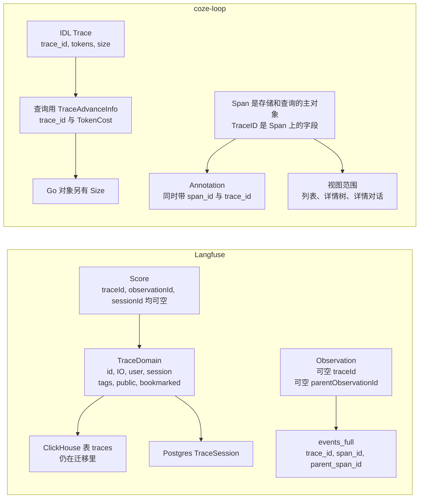
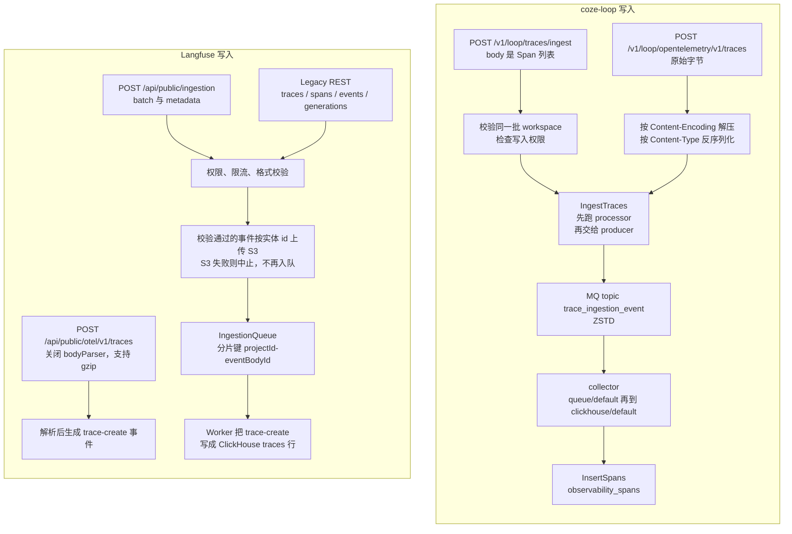
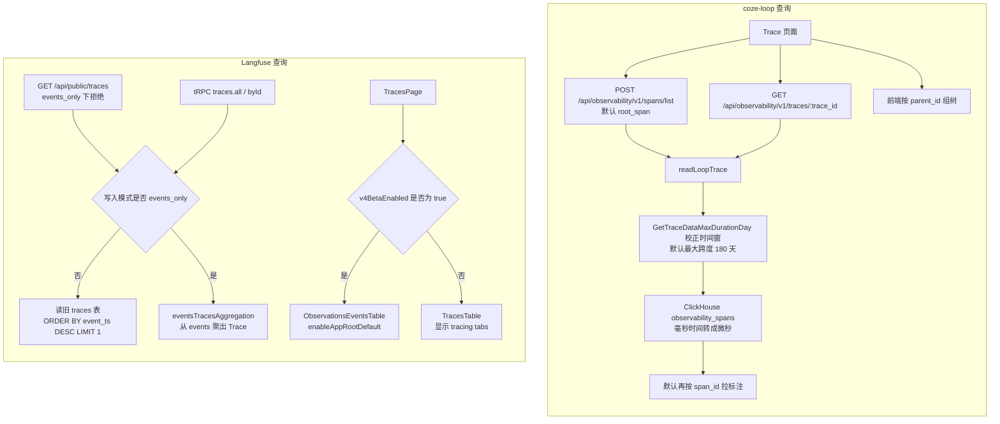

# Trace 设计：coze-loop vs Langfuse

本篇记录两个系统里 Trace 的源码事实。每条事实链到固定提交。推断单独放在文末，并标 **【推断】**。

点选能力并打开证据：[能力点选](interactive.mdx)。单独打开静态页：[trace-design](pathname:///html/trace-design/)。

## 源码版本

| 系统 | 仓库 | 提交 |
|---|---|---|
| coze-loop | [wzqwtt/coze-loop](https://github.com/wzqwtt/coze-loop) | [`3a6a2bf0`](https://github.com/wzqwtt/coze-loop/tree/3a6a2bf07b057fec0c702e514e8345fb5684e83a) |
| Langfuse | [wzqwtt/langfuse](https://github.com/wzqwtt/langfuse) | [`f75c661d`](https://github.com/wzqwtt/langfuse/tree/f75c661dbe8c6b85523c81486b39e8403ac2c141) |

下文链接都指向这两个提交的 blob。行号对应该提交上的文件。

## 术语

两边都使用 Trace 这个词。字段和存储并不相同。下文在每个系统里使用该系统的源码用词。

| 概念 | coze-loop | Langfuse |
|---|---|---|
| 调用单元 | Span | Observation |
| 会话键 | `thread_id` | `sessionId` |
| 会话存储 | `thread_id` 是 Span 字段名 | Postgres 模型 `TraceSession`，表 `trace_sessions` |
| 评分 | Annotation | Score |
| 登录会话 | 这份笔记没有写 | Prisma `Session` |

## 领域模型

coze-loop 的 IDL `Trace` 只有三个可选字段。Langfuse 的 `TraceDomain` 带名称、输入输出、用户、会话和公开标记。存储差异见 [写入路径](#写入路径) 里的表。

### coze-loop 的 Trace 对象

| 事实 | 证据 |
|---|---|
| IDL 里的 `Trace` 只有三个可选字段：`trace_id`、`tokens`、`size`。 | [trace.thrift L3-L6](https://github.com/wzqwtt/coze-loop/blob/3a6a2bf07b057fec0c702e514e8345fb5684e83a/idl/thrift/coze/loop/observability/domain/trace.thrift#L3-L6) |
| `TokenCost` 拆成 `input_token` 和 `output_token`。 | [trace.thrift L8-L11](https://github.com/wzqwtt/coze-loop/blob/3a6a2bf07b057fec0c702e514e8345fb5684e83a/idl/thrift/coze/loop/observability/domain/trace.thrift#L8-L11) |
| 查询接口里的 `TraceAdvanceInfo` 只有 `trace_id` 和 `TokenCost`。它没有 `size`。 | [trace service thrift L60-L63](https://github.com/wzqwtt/coze-loop/blob/3a6a2bf07b057fec0c702e514e8345fb5684e83a/idl/thrift/coze/loop/observability/coze.loop.observability.trace.thrift#L60-L63) |
| Go 领域对象 `TraceAdvanceInfo` 额外有 `Size`。 | [span.go L208-L213](https://github.com/wzqwtt/coze-loop/blob/3a6a2bf07b057fec0c702e514e8345fb5684e83a/backend/modules/observability/domain/trace/entity/loop_span/span.go#L208-L213) |
| OpenAPI 把 `TraceAdvanceInfo` 转成 `Trace` 时会带上 `size`。 | [trace.go L34-L42](https://github.com/wzqwtt/coze-loop/blob/3a6a2bf07b057fec0c702e514e8345fb5684e83a/backend/modules/observability/application/convertor/trace/trace.go#L34-L42) |
| `PlatformType` 的取值有 `cozeloop`、`prompt`、`evaluator`、`evaluation_target`、`coze_bot`、`coze_project`、`coze_workflow`、`ark`、`veadk`、`ve_agentkit`、`loop_all`、`inner_cozeloop`、`inner_doubao`、`inner_doubao_unencrypted`、`inner_prompt`、`inner_coze_bot`、`trace_detail`。 | [common.thrift L3-L20](https://github.com/wzqwtt/coze-loop/blob/3a6a2bf07b057fec0c702e514e8345fb5684e83a/idl/thrift/coze/loop/observability/domain/common.thrift#L3-L20) |
| 列表范围有 `root_span`、`all_span`、`llm_span`。 | [common.thrift L22-L25](https://github.com/wzqwtt/coze-loop/blob/3a6a2bf07b057fec0c702e514e8345fb5684e83a/idl/thrift/coze/loop/observability/domain/common.thrift#L22-L25) |
| `TraceScene` 有 `default` 和 `cached`。 | [common.thrift L31-L33](https://github.com/wzqwtt/coze-loop/blob/3a6a2bf07b057fec0c702e514e8345fb5684e83a/idl/thrift/coze/loop/observability/domain/common.thrift#L31-L33) |
| 视图范围有三种：列表、详情树、详情对话。 | [view.thrift L5-L9](https://github.com/wzqwtt/coze-loop/blob/3a6a2bf07b057fec0c702e514e8345fb5684e83a/idl/thrift/coze/loop/observability/domain/view.thrift#L5-L9) |

### coze-loop 的 Span

| 事实 | 证据 |
|---|---|
| 存储和查询的主对象是 Span。`TraceID` 是 Span 上的字段。 | [span.go L156-L162](https://github.com/wzqwtt/coze-loop/blob/3a6a2bf07b057fec0c702e514e8345fb5684e83a/backend/modules/observability/domain/trace/entity/loop_span/span.go#L156-L162) |
| `StartTime` 和 `DurationMicros` 的单位是微秒。 | [span.go L157-L162](https://github.com/wzqwtt/coze-loop/blob/3a6a2bf07b057fec0c702e514e8345fb5684e83a/backend/modules/observability/domain/trace/entity/loop_span/span.go#L157-L162) |
| 对外 `OutputSpan` 带 `trace_id`、`span_id`、`parent_id`、`span_name`、`span_type`、时间、状态、input、output 和标签。 | [span.thrift L45-L77](https://github.com/wzqwtt/coze-loop/blob/3a6a2bf07b057fec0c702e514e8345fb5684e83a/idl/thrift/coze/loop/observability/domain/span.thrift#L45-L77) |
| 写入用的 `InputSpan` 要求 `trace_id`、`span_id`、`parent_id`、`started_at_micros`、`duration`、`workspace_id`、input、output。 | [span.thrift L80-L96](https://github.com/wzqwtt/coze-loop/blob/3a6a2bf07b057fec0c702e514e8345fb5684e83a/idl/thrift/coze/loop/observability/domain/span.thrift#L80-L96) |
| Span 类型常量有 `prompt`、`model`、`parser`、`embedding`、`memory`、`plugin`、`function`、`graph`、`remote`、`loader`、`transformer`、`vector_store`、`vector_retriever`、`agent`、`tool`、`LLMCall`。 | [span.go L65-L80](https://github.com/wzqwtt/coze-loop/blob/3a6a2bf07b057fec0c702e514e8345fb5684e83a/backend/modules/observability/domain/trace/entity/loop_span/span.go#L65-L80) |
| IDL 把未知类型写成 `"unknwon"`。 | [span.thrift L11](https://github.com/wzqwtt/coze-loop/blob/3a6a2bf07b057fec0c702e514e8345fb5684e83a/idl/thrift/coze/loop/observability/domain/span.thrift#L11) |
| `status_code == 0` 映射为 `success`。其他值映射为 `error`。 | [span.go L386-L390](https://github.com/wzqwtt/coze-loop/blob/3a6a2bf07b057fec0c702e514e8345fb5684e83a/backend/modules/observability/domain/trace/entity/loop_span/span.go#L386-L390) |
| IDL 另有 `broken` 状态。 | [span.thrift L6-L8](https://github.com/wzqwtt/coze-loop/blob/3a6a2bf07b057fec0c702e514e8345fb5684e83a/idl/thrift/coze/loop/observability/domain/span.thrift#L6-L8) |
| `GetTrace` 按 `trace_id` 或 `logid` 查出一组 Span，再按开始时间升序返回。 | [trace_service.go L1280-L1344](https://github.com/wzqwtt/coze-loop/blob/3a6a2bf07b057fec0c702e514e8345fb5684e83a/backend/modules/observability/domain/trace/service/trace_service.go#L1280-L1344) |
| 仓库层在 `trace_id` 和 `logid` 都空时直接报错。 | [trace.go L344-L360](https://github.com/wzqwtt/coze-loop/blob/3a6a2bf07b057fec0c702e514e8345fb5684e83a/backend/modules/observability/infra/repo/trace.go#L344-L360) |
| 应用层要求 `trace_id` 或 `logid` 至少一个。 | [application/trace.go L305-L306](https://github.com/wzqwtt/coze-loop/blob/3a6a2bf07b057fec0c702e514e8345fb5684e83a/backend/modules/observability/application/trace.go#L305-L306) |
| token 汇总只统计 `span_type` 为 `LLMCall` 或 `model` 的 Span。它读取 `input_tokens` 和 `output_tokens` 标签。 | [span.go L380-L383](https://github.com/wzqwtt/coze-loop/blob/3a6a2bf07b057fec0c702e514e8345fb5684e83a/backend/modules/observability/domain/trace/entity/loop_span/span.go#L380-L383) · [L885-L929](https://github.com/wzqwtt/coze-loop/blob/3a6a2bf07b057fec0c702e514e8345fb5684e83a/backend/modules/observability/domain/trace/entity/loop_span/span.go#L885-L929) |
| `GetTrace` 响应里的 `TracesAdvanceInfo` 是这次返回 Span 的 token 汇总。 | [application/trace.go L271-L291](https://github.com/wzqwtt/coze-loop/blob/3a6a2bf07b057fec0c702e514e8345fb5684e83a/backend/modules/observability/application/trace.go#L271-L291) |
| 批量 advance info 只查 model Span。它省略 input 和 output，并累加 Span 体积。 | [trace_service.go L1678-L1734](https://github.com/wzqwtt/coze-loop/blob/3a6a2bf07b057fec0c702e514e8345fb5684e83a/backend/modules/observability/domain/trace/service/trace_service.go#L1678-L1734) |
| 批量查询把结束时间再加 1 小时。 | [trace_service.go L1661](https://github.com/wzqwtt/coze-loop/blob/3a6a2bf07b057fec0c702e514e8345fb5684e83a/backend/modules/observability/domain/trace/service/trace_service.go#L1661) · [L1683](https://github.com/wzqwtt/coze-loop/blob/3a6a2bf07b057fec0c702e514e8345fb5684e83a/backend/modules/observability/domain/trace/service/trace_service.go#L1683) |
| 详情树接口 `SearchTraceTree` 走 `GetTraceAll`。它一次拉完整 Span 集合，且不带 input 和 output。 | [application/trace.go L366](https://github.com/wzqwtt/coze-loop/blob/3a6a2bf07b057fec0c702e514e8345fb5684e83a/backend/modules/observability/application/trace.go#L366) · [L415-L421](https://github.com/wzqwtt/coze-loop/blob/3a6a2bf07b057fec0c702e514e8345fb5684e83a/backend/modules/observability/application/trace.go#L415-L421) |
| `GetTraceAll` 的注释写明用于详情和树。累计上限是 10 万条。触顶后截断。 | [trace_service.go L59-L62](https://github.com/wzqwtt/coze-loop/blob/3a6a2bf07b057fec0c702e514e8345fb5684e83a/backend/modules/observability/domain/trace/service/trace_service.go#L59-L62) · [L1347-L1388](https://github.com/wzqwtt/coze-loop/blob/3a6a2bf07b057fec0c702e514e8345fb5684e83a/backend/modules/observability/domain/trace/service/trace_service.go#L1347-L1388) |
| 带详情时单页上限是 1000。不带详情时单页上限是 10000。 | [trace_service.go L59-L60](https://github.com/wzqwtt/coze-loop/blob/3a6a2bf07b057fec0c702e514e8345fb5684e83a/backend/modules/observability/domain/trace/service/trace_service.go#L59-L60) · [L1271-L1274](https://github.com/wzqwtt/coze-loop/blob/3a6a2bf07b057fec0c702e514e8345fb5684e83a/backend/modules/observability/domain/trace/service/trace_service.go#L1271-L1274) |
| 去重键是 `span_id` 加 `trace_id`。 | [span.go L984-L987](https://github.com/wzqwtt/coze-loop/blob/3a6a2bf07b057fec0c702e514e8345fb5684e83a/backend/modules/observability/domain/trace/entity/loop_span/span.go#L984-L987) |
| coze-loop 列表的 root Span 条件是 `parent_id` 属于 `"0"` 或空字符串。 | [cozeloop_filter.go L33-L41](https://github.com/wzqwtt/coze-loop/blob/3a6a2bf07b057fec0c702e514e8345fb5684e83a/backend/modules/observability/domain/trace/service/trace/span_filter/cozeloop_filter.go#L33-L41) |
| 同一过滤器的 LLM 列表只保留 `span_type = model`。 | [cozeloop_filter.go L44-L52](https://github.com/wzqwtt/coze-loop/blob/3a6a2bf07b057fec0c702e514e8345fb5684e83a/backend/modules/observability/domain/trace/service/trace/span_filter/cozeloop_filter.go#L44-L52) |
| `all_span` 不再加父子条件。 | [cozeloop_filter.go L55-L57](https://github.com/wzqwtt/coze-loop/blob/3a6a2bf07b057fec0c702e514e8345fb5684e83a/backend/modules/observability/domain/trace/service/trace/span_filter/cozeloop_filter.go#L55-L57) |
| 列表未传类型时默认 `root_span`。 | [application/trace.go L235-L243](https://github.com/wzqwtt/coze-loop/blob/3a6a2bf07b057fec0c702e514e8345fb5684e83a/backend/modules/observability/application/trace.go#L235-L243) |
| coze-loop 基础过滤还要求 `call_type = Custom`，并按 workspace 过滤。 | [cozeloop_filter.go L16-L30](https://github.com/wzqwtt/coze-loop/blob/3a6a2bf07b057fec0c702e514e8345fb5684e83a/backend/modules/observability/domain/trace/service/trace/span_filter/cozeloop_filter.go#L16-L30) |

### Langfuse 的 Trace 对象

| 事实 | 证据 |
|---|---|
| `TraceDomain` 是前后端共用的 Zod 对象。 | [traces.ts L11-L30](https://github.com/wzqwtt/langfuse/blob/f75c661dbe8c6b85523c81486b39e8403ac2c141/packages/shared/src/domain/traces.ts#L11-L30) |
| Trace 字段包括 `id`、`name`、`timestamp`、`environment`、`tags`、`bookmarked`、`public`、`release`、`version`、`input`、`output`、`metadata`、`createdAt`、`updatedAt`、`sessionId`、`userId`、`projectId`。 | [traces.ts L12-L30](https://github.com/wzqwtt/langfuse/blob/f75c661dbe8c6b85523c81486b39e8403ac2c141/packages/shared/src/domain/traces.ts#L12-L30) |
| `name`、`release`、`version`、`input`、`output`、`sessionId`、`userId` 允许 null。 | [traces.ts L14-L28](https://github.com/wzqwtt/langfuse/blob/f75c661dbe8c6b85523c81486b39e8403ac2c141/packages/shared/src/domain/traces.ts#L14-L28) |
| `metadata` 是字符串键到可空 JSON 的 record。 | [traces.ts L4-L9](https://github.com/wzqwtt/langfuse/blob/f75c661dbe8c6b85523c81486b39e8403ac2c141/packages/shared/src/domain/traces.ts#L4-L9) |
| 采集侧 `TraceBody` 另有 `externalId`。它限制 `name` 最长 1000。 | [ingestion/types.ts L465-L480](https://github.com/wzqwtt/langfuse/blob/f75c661dbe8c6b85523c81486b39e8403ac2c141/packages/shared/src/server/ingestion/types.ts#L465-L480) |
| 公开环境名会被规范化。空值或非法字符落到默认环境。 | [ingestion/types.ts L304-L317](https://github.com/wzqwtt/langfuse/blob/f75c661dbe8c6b85523c81486b39e8403ac2c141/packages/shared/src/server/ingestion/types.ts#L304-L317) |

### Langfuse 的 Observation

| 事实 | 证据 |
|---|---|
| `ObservationType` 包含 `SPAN`、`EVENT`、`GENERATION`、`AGENT`、`TOOL`、`CHAIN`、`RETRIEVER`、`EVALUATOR`、`EMBEDDING`、`GUARDRAIL`。 | [observations.ts L3-L16](https://github.com/wzqwtt/langfuse/blob/f75c661dbe8c6b85523c81486b39e8403ac2c141/packages/shared/src/domain/observations.ts#L3-L16) |
| `ObservationSchema` 用可空 `traceId` 指向 Trace。它用可空 `parentObservationId` 指向父 Observation。 | [observations.ts L55-L65](https://github.com/wzqwtt/langfuse/blob/f75c661dbe8c6b85523c81486b39e8403ac2c141/packages/shared/src/domain/observations.ts#L55-L65) |
| Observation 还有 `level`、`statusMessage`、模型、用量、成本、`promptId`、`promptName`、`promptVersion`、工具定义与工具调用。 | [observations.ts L66-L100](https://github.com/wzqwtt/langfuse/blob/f75c661dbe8c6b85523c81486b39e8403ac2c141/packages/shared/src/domain/observations.ts#L66-L100) |
| `EventsObservationSchema` 在 Observation 上附加 `userId`、`sessionId`、`traceName`、`release`、`tags`、`bookmarked`、`public`、`isRootObservation`。 | [observations.ts L116-L125](https://github.com/wzqwtt/langfuse/blob/f75c661dbe8c6b85523c81486b39e8403ac2c141/packages/shared/src/domain/observations.ts#L116-L125) |
| 根 Observation 的判定是没有 `parentObservationId`，或者 `isAppRoot === true`。 | [eventsTable.ts L44-L50](https://github.com/wzqwtt/langfuse/blob/f75c661dbe8c6b85523c81486b39e8403ac2c141/packages/shared/src/eventsTable.ts#L44-L50) |
| SQL 里根行条件是 `parent_span_id = '' OR is_app_root = true`。 | [eventsTable.ts L4-L9](https://github.com/wzqwtt/langfuse/blob/f75c661dbe8c6b85523c81486b39e8403ac2c141/packages/shared/src/eventsTable.ts#L4-L9) |
| 采集事件类型把 `span-create`、`span-update`、`generation-create`、`generation-update`、`event-create`，以及 agent、tool、chain、retriever、evaluator、embedding、guardrail 的 create，都列为独立事件。同一常量里还有 `trace-create`、`score-create`、`sdk-log`、`dataset-run-item-create`。 | [ingestion/types.ts L319-L339](https://github.com/wzqwtt/langfuse/blob/f75c661dbe8c6b85523c81486b39e8403ac2c141/packages/shared/src/server/ingestion/types.ts#L319-L339) |
| `observation-create` 与 `observation-update` 标成仅用于兼容的旧类型。 | [ingestion/types.ts L336-L338](https://github.com/wzqwtt/langfuse/blob/f75c661dbe8c6b85523c81486b39e8403ac2c141/packages/shared/src/server/ingestion/types.ts#L336-L338) |
| Span 与 Event 的采集体都带可空 `traceId` 和 `parentObservationId`。 | [ingestion/types.ts L482-L511](https://github.com/wzqwtt/langfuse/blob/f75c661dbe8c6b85523c81486b39e8403ac2c141/packages/shared/src/server/ingestion/types.ts#L482-L511) |
| Generation 在 Span 字段上增加 `model`、`usage`、`costDetails`、`promptName`、`promptVersion`。 | [ingestion/types.ts L513-L540](https://github.com/wzqwtt/langfuse/blob/f75c661dbe8c6b85523c81486b39e8403ac2c141/packages/shared/src/server/ingestion/types.ts#L513-L540) |
| `promptName` 与 `promptVersion` 必须同时出现或同时为空。 | [ingestion/types.ts L535-L539](https://github.com/wzqwtt/langfuse/blob/f75c661dbe8c6b85523c81486b39e8403ac2c141/packages/shared/src/server/ingestion/types.ts#L535-L539) |
| ClickHouse `events_full` 用 `trace_id`、`span_id`、`parent_span_id` 表示同一条 Trace 里的 span 树。 | [0039 L3-L5](https://github.com/wzqwtt/langfuse/blob/f75c661dbe8c6b85523c81486b39e8403ac2c141/packages/shared/clickhouse/migrations/canonical/0039_create_events_full.up.sql#L3-L5) |
| 同一行还带 `trace_name`、`is_app_root`、`session_id`、`user_id`、`tags`。 | [0039 L16-L24](https://github.com/wzqwtt/langfuse/blob/f75c661dbe8c6b85523c81486b39e8403ac2c141/packages/shared/clickhouse/migrations/canonical/0039_create_events_full.up.sql#L16-L24) |
| 从 events 聚合 Trace 时，`id` 取 `trace_id`，`timestamp` 取 `min(start_time)`。 | [event-query-builder.ts L528-L535](https://github.com/wzqwtt/langfuse/blob/f75c661dbe8c6b85523c81486b39e8403ac2c141/packages/shared/src/server/queries/clickhouse-sql/event-query-builder.ts#L528-L535) |
| Trace 的 `input`、`output`、`metadata`、`bookmarked` 取 `parent_span_id = ''` 的最新 `event_ts` 行。 | [event-query-builder.ts L541-L558](https://github.com/wzqwtt/langfuse/blob/f75c661dbe8c6b85523c81486b39e8403ac2c141/packages/shared/src/server/queries/clickhouse-sql/event-query-builder.ts#L541-L558) |
| Trace 名称优先取非空 `trace_name`。否则取根 span 的非空 `name`。 | [eventsTable.ts L39-L42](https://github.com/wzqwtt/langfuse/blob/f75c661dbe8c6b85523c81486b39e8403ac2c141/packages/shared/src/eventsTable.ts#L39-L42) |
| 延迟是最早 `start_time` 到最晚 `start_time` 或 `end_time` 的毫秒差。 | [event-query-builder.ts L550-L551](https://github.com/wzqwtt/langfuse/blob/f75c661dbe8c6b85523c81486b39e8403ac2c141/packages/shared/src/server/queries/clickhouse-sql/event-query-builder.ts#L550-L551) |
| Observation 计数排除 `span_id = concat('t-', trace_id)` 的合成 id。 | [event-query-builder.ts L552-L555](https://github.com/wzqwtt/langfuse/blob/f75c661dbe8c6b85523c81486b39e8403ac2c141/packages/shared/src/server/queries/clickhouse-sql/event-query-builder.ts#L552-L555) |
| 成本与用量按 span 做 `sum` 和 `sumMap`。 | [event-query-builder.ts L549-L565](https://github.com/wzqwtt/langfuse/blob/f75c661dbe8c6b85523c81486b39e8403ac2c141/packages/shared/src/server/queries/clickhouse-sql/event-query-builder.ts#L549-L565) |
| 聚合 level 按 ERROR、WARNING、DEFAULT、DEBUG 的优先级取最高。 | [event-query-builder.ts L566-L567](https://github.com/wzqwtt/langfuse/blob/f75c661dbe8c6b85523c81486b39e8403ac2c141/packages/shared/src/server/queries/clickhouse-sql/event-query-builder.ts#L566-L567) |
| `eventsTracesAggregation` 的注释写明：按 `trace_id` 把 events 重新聚成 Trace。注释称这是迁到只使用 events 表之前的临时做法。 | [query-fragments.ts L103-L128](https://github.com/wzqwtt/langfuse/blob/f75c661dbe8c6b85523c81486b39e8403ac2c141/packages/shared/src/server/queries/clickhouse-sql/query-fragments.ts#L103-L128) |
| `truncated` 为 true 时读 `events_core`。否则读 `events_full`。 | [query-fragments.ts L96-L100](https://github.com/wzqwtt/langfuse/blob/f75c661dbe8c6b85523c81486b39e8403ac2c141/packages/shared/src/server/queries/clickhouse-sql/query-fragments.ts#L96-L100) |

## 写入路径

Langfuse 的 OTel 路由在笔记里止于生成 `trace-create` 事件。笔记没有写这些事件是否进入 `processEventBatch`。图里不把 OTel 画进 S3 那条线。

### coze-loop 写入

| 事实 | 证据 |
|---|---|
| OpenAPI 写入路径是 `POST /v1/loop/traces/ingest`。body 是 Span 列表。 | [openapi.thrift L13-L16](https://github.com/wzqwtt/coze-loop/blob/3a6a2bf07b057fec0c702e514e8345fb5684e83a/idl/thrift/coze/loop/observability/coze.loop.observability.openapi.thrift#L13-L16) · [L232](https://github.com/wzqwtt/coze-loop/blob/3a6a2bf07b057fec0c702e514e8345fb5684e83a/idl/thrift/coze/loop/observability/coze.loop.observability.openapi.thrift#L232) |
| OTel 写入路径是 `POST /v1/loop/opentelemetry/v1/traces`。body 为原始字节。workspace 来自 header `cozeloop-workspace-id`。 | [openapi.thrift L26-L32](https://github.com/wzqwtt/coze-loop/blob/3a6a2bf07b057fec0c702e514e8345fb5684e83a/idl/thrift/coze/loop/observability/coze.loop.observability.openapi.thrift#L26-L32) · [L233](https://github.com/wzqwtt/coze-loop/blob/3a6a2bf07b057fec0c702e514e8345fb5684e83a/idl/thrift/coze/loop/observability/coze.loop.observability.openapi.thrift#L233) |
| 内部 `IngestTracesInner` 没有 HTTP 路由注解。 | [trace service thrift L631](https://github.com/wzqwtt/coze-loop/blob/3a6a2bf07b057fec0c702e514e8345fb5684e83a/idl/thrift/coze/loop/observability/coze.loop.observability.trace.thrift#L631) |
| OpenAPI 写入会校验同一批 Span 的 workspace 相同，并检查写入权限。 | [openapi.go L121-L123](https://github.com/wzqwtt/coze-loop/blob/3a6a2bf07b057fec0c702e514e8345fb5684e83a/backend/modules/observability/application/openapi.go#L121-L123) · [L229-L240](https://github.com/wzqwtt/coze-loop/blob/3a6a2bf07b057fec0c702e514e8345fb5684e83a/backend/modules/observability/application/openapi.go#L229-L240) |
| 单批 Span 数受租户配置限制。默认配置 `max_span_length` 为 100。 | [openapi.go L250-L258](https://github.com/wzqwtt/coze-loop/blob/3a6a2bf07b057fec0c702e514e8345fb5684e83a/backend/modules/observability/application/openapi.go#L250-L258) · [observability.yaml L1-L3](https://github.com/wzqwtt/coze-loop/blob/3a6a2bf07b057fec0c702e514e8345fb5684e83a/release/deployment/docker-compose/conf/observability.yaml#L1-L3) |
| 权益检查失败或额度不足时，OpenAPI 跳过该来源并返回容量错误。 | [openapi.go L141-L151](https://github.com/wzqwtt/coze-loop/blob/3a6a2bf07b057fec0c702e514e8345fb5684e83a/backend/modules/observability/application/openapi.go#L141-L151) · [L172-L174](https://github.com/wzqwtt/coze-loop/blob/3a6a2bf07b057fec0c702e514e8345fb5684e83a/backend/modules/observability/application/openapi.go#L172-L174) |
| 权益结果为空时默认存储 3 天。 | [openapi.go L141-L147](https://github.com/wzqwtt/coze-loop/blob/3a6a2bf07b057fec0c702e514e8345fb5684e83a/backend/modules/observability/application/openapi.go#L141-L147) |
| `IngestTraces` 先跑 ingest processor，再把 Span 打成 `TraceData` 交给 producer。 | [trace_service.go L1627-L1652](https://github.com/wzqwtt/coze-loop/blob/3a6a2bf07b057fec0c702e514e8345fb5684e83a/backend/modules/observability/domain/trace/service/trace_service.go#L1627-L1652) |
| producer 按租户发到 MQ topic，压缩为 ZSTD。单条超过 10MB 且含多个 Span 时拆开重发。 | [trace_producer.go L24-L25](https://github.com/wzqwtt/coze-loop/blob/3a6a2bf07b057fec0c702e514e8345fb5684e83a/backend/modules/observability/infra/mq/producer/trace_producer.go#L24-L25) · [L42-L74](https://github.com/wzqwtt/coze-loop/blob/3a6a2bf07b057fec0c702e514e8345fb5684e83a/backend/modules/observability/infra/mq/producer/trace_producer.go#L42-L74) · [L110](https://github.com/wzqwtt/coze-loop/blob/3a6a2bf07b057fec0c702e514e8345fb5684e83a/backend/modules/observability/infra/mq/producer/trace_producer.go#L110) |
| 默认 topic 是 `trace_ingestion_event`。 | [observability.yaml L9](https://github.com/wzqwtt/coze-loop/blob/3a6a2bf07b057fec0c702e514e8345fb5684e83a/release/deployment/docker-compose/conf/observability.yaml#L9) |
| collector 从同一 topic 消费，经 `queue/default` 再交给 `clickhouse/default`。 | [observability.yaml L330-L355](https://github.com/wzqwtt/coze-loop/blob/3a6a2bf07b057fec0c702e514e8345fb5684e83a/release/deployment/docker-compose/conf/observability.yaml#L330-L355) |
| RMQ receiver 反序列化 `TraceData`，丢弃校验失败的 Span，再交给下游。 | [rmq_receiver.go L60-L86](https://github.com/wzqwtt/coze-loop/blob/3a6a2bf07b057fec0c702e514e8345fb5684e83a/backend/modules/observability/domain/trace/service/collector/receiver/rmqreceiver/rmq_receiver.go#L60-L86) |
| 合法 `trace_id` 必须是 32 位小写十六进制，且不能全 0。 | [span.go L537-L548](https://github.com/wzqwtt/coze-loop/blob/3a6a2bf07b057fec0c702e514e8345fb5684e83a/backend/modules/observability/domain/trace/entity/loop_span/span.go#L537-L548) |
| 合法 `span_id` 必须是 16 位小写十六进制，且不能全 0。 | [span.go L549-L556](https://github.com/wzqwtt/coze-loop/blob/3a6a2bf07b057fec0c702e514e8345fb5684e83a/backend/modules/observability/domain/trace/entity/loop_span/span.go#L549-L556) |
| `start_time` 必须落在当前时间前 24 小时到后 1 小时之间。单位是微秒。 | [span.go L557-L559](https://github.com/wzqwtt/coze-loop/blob/3a6a2bf07b057fec0c702e514e8345fb5684e83a/backend/modules/observability/domain/trace/entity/loop_span/span.go#L557-L559) |
| 校验通过后会裁剪过长字段，并把被裁字段名写入 `system_tags_string.clip_fields`。 | [span.go L850-L882](https://github.com/wzqwtt/coze-loop/blob/3a6a2bf07b057fec0c702e514e8345fb5684e83a/backend/modules/observability/domain/trace/entity/loop_span/span.go#L850-L882) |
| ClickHouse exporter 按 TTL 和 workspace 分组后调用 `InsertSpans`。 | [clickhouse_exporter.go L30-L54](https://github.com/wzqwtt/coze-loop/blob/3a6a2bf07b057fec0c702e514e8345fb5684e83a/backend/modules/observability/domain/trace/service/collector/exporter/clickhouseexporter/clickhouse_exporter.go#L30-L54) |
| 插入表名来自租户加 TTL 的配置。它可以按 workspace 分片。 | [infra/repo/trace.go L184-L201](https://github.com/wzqwtt/coze-loop/blob/3a6a2bf07b057fec0c702e514e8345fb5684e83a/backend/modules/observability/infra/repo/trace.go#L184-L201) · [L711-L727](https://github.com/wzqwtt/coze-loop/blob/3a6a2bf07b057fec0c702e514e8345fb5684e83a/backend/modules/observability/infra/repo/trace.go#L711-L727) |
| 开源默认配置只给 `cozeloop` 租户的 `365d` 配了表 `observability_spans` 和 `observability_annotations`。 | [observability.yaml L85-L93](https://github.com/wzqwtt/coze-loop/blob/3a6a2bf07b057fec0c702e514e8345fb5684e83a/release/deployment/docker-compose/conf/observability.yaml#L85-L93) |
| TTL 枚举有 3、7、30、90、180、365 天。 | [span.go L95-L102](https://github.com/wzqwtt/coze-loop/blob/3a6a2bf07b057fec0c702e514e8345fb5684e83a/backend/modules/observability/domain/trace/entity/loop_span/span.go#L95-L102) |
| 天数小于等于 4 映射为 `3d`。之后依次是 7、30、90、180、365。 | [span.go L990-L1003](https://github.com/wzqwtt/coze-loop/blob/3a6a2bf07b057fec0c702e514e8345fb5684e83a/backend/modules/observability/domain/trace/entity/loop_span/span.go#L990-L1003) |
| OTel 入口会先按 `Content-Encoding` 解压，再按 `Content-Type` 反序列化。 | [openapi.go L263-L274](https://github.com/wzqwtt/coze-loop/blob/3a6a2bf07b057fec0c702e514e8345fb5684e83a/backend/modules/observability/application/openapi.go#L263-L274) |

### coze-loop 存储

| 事实 | 证据 |
|---|---|
| 没有名为 traces 的 ClickHouse 表。Span 存在 `observability_spans`。 | [observability_spans.sql L1-L26](https://github.com/wzqwtt/coze-loop/blob/3a6a2bf07b057fec0c702e514e8345fb5684e83a/release/deployment/docker-compose/bootstrap/clickhouse-init/init-sql/observability_spans.sql#L1-L26) |
| Docker 建表包含 `trace_id`、`span_id`、`parent_id`、`space_id`、`span_type`、`span_name`、`start_time`、`duration`、`status_code`、`input`、`output`、`logic_delete_date`，以及 string、long、float、bool、byte 标签 Map。 | [observability_spans.sql L1-L26](https://github.com/wzqwtt/coze-loop/blob/3a6a2bf07b057fec0c702e514e8345fb5684e83a/release/deployment/docker-compose/bootstrap/clickhouse-init/init-sql/observability_spans.sql#L1-L26) |
| 引擎是 `MergeTree`。分区键是 `toDate(start_time / 1000000)`。主键和排序键都是 `start_time`。 | [observability_spans.sql L34-L36](https://github.com/wzqwtt/coze-loop/blob/3a6a2bf07b057fec0c702e514e8345fb5684e83a/release/deployment/docker-compose/bootstrap/clickhouse-init/init-sql/observability_spans.sql#L34-L36) |
| `trace_id`、`space_id`、`span_type`、`span_name` 有 bloom filter。`input`、`output` 有 `tokenbf_v1`。 | [observability_spans.sql L27-L33](https://github.com/wzqwtt/coze-loop/blob/3a6a2bf07b057fec0c702e514e8345fb5684e83a/release/deployment/docker-compose/bootstrap/clickhouse-init/init-sql/observability_spans.sql#L27-L33) |
| Helm 的同名建表语句与 Docker 这份一致。 | [helm observability_spans.sql L1-L36](https://github.com/wzqwtt/coze-loop/blob/3a6a2bf07b057fec0c702e514e8345fb5684e83a/release/deployment/helm-chart/charts/app/bootstrap/init/clickhouse/init-sql/observability_spans.sql#L1-L36) |
| 表里没有 `thread_id` 列。`thread_id` 不在超级列集合里。字符串过滤会落到 `tags_string['thread_id']`。 | [spans.go L488-L489](https://github.com/wzqwtt/coze-loop/blob/3a6a2bf07b057fec0c702e514e8345fb5684e83a/backend/modules/observability/infra/repo/ck/spans.go#L488-L489) · [L519-L528](https://github.com/wzqwtt/coze-loop/blob/3a6a2bf07b057fec0c702e514e8345fb5684e83a/backend/modules/observability/infra/repo/ck/spans.go#L519-L528) · [L663-L681](https://github.com/wzqwtt/coze-loop/blob/3a6a2bf07b057fec0c702e514e8345fb5684e83a/backend/modules/observability/infra/repo/ck/spans.go#L663-L681) |
| 写入时按 TTL 填写 `logic_delete_date`。例如 `3d` 为当前时间加 3 天，单位微秒。 | [converter/span.go L69-L83](https://github.com/wzqwtt/coze-loop/blob/3a6a2bf07b057fec0c702e514e8345fb5684e83a/backend/modules/observability/infra/repo/dao/converter/span.go#L69-L83) |
| ClickHouse 插入重试 3 次。注释写明网络重试可能重复写入。 | [spans.go L52-L68](https://github.com/wzqwtt/coze-loop/blob/3a6a2bf07b057fec0c702e514e8345fb5684e83a/backend/modules/observability/infra/repo/ck/spans.go#L52-L68) |
| 查询把请求的毫秒时间转成微秒，再查 `start_time`。 | [infra/repo/trace.go L232-L233](https://github.com/wzqwtt/coze-loop/blob/3a6a2bf07b057fec0c702e514e8345fb5684e83a/backend/modules/observability/infra/repo/trace.go#L232-L233) |
| 列表接口注释把 `start_time`、`end_time` 标成毫秒。 | [trace service thrift L17-L18](https://github.com/wzqwtt/coze-loop/blob/3a6a2bf07b057fec0c702e514e8345fb5684e83a/idl/thrift/coze/loop/observability/coze.loop.observability.trace.thrift#L17-L18) |
| 标注存在另一张表 `observability_annotations`。列包括 `span_id`、`trace_id`、`annotation_type`、`key`、多类型 value、`reasoning`、`correction`、`deleted_at`。 | [observability_annotations.sql L1-L32](https://github.com/wzqwtt/coze-loop/blob/3a6a2bf07b057fec0c702e514e8345fb5684e83a/release/deployment/docker-compose/bootstrap/clickhouse-init/init-sql/observability_annotations.sql#L1-L32) |
| 标注表引擎是 `ReplacingMergeTree(updated_at)`。排序键是 `(start_time, id)`。 | [observability_annotations.sql L30-L32](https://github.com/wzqwtt/coze-loop/blob/3a6a2bf07b057fec0c702e514e8345fb5684e83a/release/deployment/docker-compose/bootstrap/clickhouse-init/init-sql/observability_annotations.sql#L30-L32) |
| 视图存在 MySQL 表 `observability_view`。它含 workspace、平台、span 列表类型、filters、scope。 | [observability_view.sql L1-L22](https://github.com/wzqwtt/coze-loop/blob/3a6a2bf07b057fec0c702e514e8345fb5684e83a/release/deployment/docker-compose/bootstrap/mysql-init/init-sql/observability_view.sql#L1-L22) |
| scope 注释：1 列表，2 详情树，3 详情对话。 | [observability_view.sql L17](https://github.com/wzqwtt/coze-loop/blob/3a6a2bf07b057fec0c702e514e8345fb5684e83a/release/deployment/docker-compose/bootstrap/mysql-init/init-sql/observability_view.sql#L17) |

### Langfuse 写入

| 事实 | 证据 |
|---|---|
| `POST /api/public/ingestion` 接收 `{ batch, metadata }`。它先做权限、限流和格式校验，再异步处理。 | [ingestion.ts L56-L70](https://github.com/wzqwtt/langfuse/blob/f75c661dbe8c6b85523c81486b39e8403ac2c141/web/src/pages/api/public/ingestion.ts#L56-L70) · [L162-L165](https://github.com/wzqwtt/langfuse/blob/f75c661dbe8c6b85523c81486b39e8403ac2c141/web/src/pages/api/public/ingestion.ts#L162-L165) |
| 请求体上限是 4.5mb。 | [ingestion.ts L48-L54](https://github.com/wzqwtt/langfuse/blob/f75c661dbe8c6b85523c81486b39e8403ac2c141/web/src/pages/api/public/ingestion.ts#L48-L54) |
| 用量超阈值时 ingestion 被拒绝。 | [ingestion.ts L127-L130](https://github.com/wzqwtt/langfuse/blob/f75c661dbe8c6b85523c81486b39e8403ac2c141/web/src/pages/api/public/ingestion.ts#L127-L130) |
| `LANGFUSE_MIGRATION_V4_WRITE_MODE === "events_only"` 时，该端点只接受 `score-create`。 | [ingestion.ts L179-L188](https://github.com/wzqwtt/langfuse/blob/f75c661dbe8c6b85523c81486b39e8403ac2c141/web/src/pages/api/public/ingestion.ts#L179-L188) · [L295-L297](https://github.com/wzqwtt/langfuse/blob/f75c661dbe8c6b85523c81486b39e8403ac2c141/web/src/pages/api/public/ingestion.ts#L295-L297) |
| 被拒绝的非 score 事件返回 400。响应提示改用 v4 SDK 或 OTLP，或临时把写入模式设为 `dual`。 | [ingestion.ts L311-L314](https://github.com/wzqwtt/langfuse/blob/f75c661dbe8c6b85523c81486b39e8403ac2c141/web/src/pages/api/public/ingestion.ts#L311-L345) · [L338-L345](https://github.com/wzqwtt/langfuse/blob/f75c661dbe8c6b85523c81486b39e8403ac2c141/web/src/pages/api/public/ingestion.ts#L338-L345) |
| score 事件要求 `scores:create`。其余事件要求 `traces:create`。`sdk-log` 跳过该授权映射。 | [ingestion.ts L384-L390](https://github.com/wzqwtt/langfuse/blob/f75c661dbe8c6b85523c81486b39e8403ac2c141/web/src/pages/api/public/ingestion.ts#L384-L390) |
| `processEventBatch` 先按 ingestion schema 校验，再把 `sdk-log` 记日志后丢出后续处理。 | [processEventBatch.ts L168-L200](https://github.com/wzqwtt/langfuse/blob/f75c661dbe8c6b85523c81486b39e8403ac2c141/packages/shared/src/server/ingestion/processEventBatch.ts#L168-L200) |
| 校验通过的事件按实体 id 分组上传到 S3。S3 失败则中止，不再入队。 | [processEventBatch.ts L276-L332](https://github.com/wzqwtt/langfuse/blob/f75c661dbe8c6b85523c81486b39e8403ac2c141/packages/shared/src/server/ingestion/processEventBatch.ts#L276-L332) |
| S3 成功后，每组事件按 `projectId-eventBodyId` 分片写入 `IngestionQueue`。 | [processEventBatch.ts L328-L346](https://github.com/wzqwtt/langfuse/blob/f75c661dbe8c6b85523c81486b39e8403ac2c141/packages/shared/src/server/ingestion/processEventBatch.ts#L328-L346) |
| Worker 把 `trace-create` 映射成 ClickHouse `traces` 行。字段包括 `session_id`、`user_id`、`public`、`tags`。 | [IngestionService/index.ts L1907-L1939](https://github.com/wzqwtt/langfuse/blob/f75c661dbe8c6b85523c81486b39e8403ac2c141/worker/src/services/IngestionService/index.ts#L1907-L1939) |
| 合并后的 Trace 写入 `TableName.Traces`。 | [IngestionService/index.ts L869-L880](https://github.com/wzqwtt/langfuse/blob/f75c661dbe8c6b85523c81486b39e8403ac2c141/worker/src/services/IngestionService/index.ts#L869-L880) |
| `POST /api/public/traces` 名叫 Create Trace (Legacy)。它把 body 包成 `trace-create`，再调用 `processEventBatch`。 | [traces/index.ts L39-L64](https://github.com/wzqwtt/langfuse/blob/f75c661dbe8c6b85523c81486b39e8403ac2c141/web/src/pages/api/public/traces/index.ts#L39-L64) |
| 该 POST 在 `events_only` 下被拒绝。注释写明它写入旧 traces 表。 | [traces/index.ts L45-L47](https://github.com/wzqwtt/langfuse/blob/f75c661dbe8c6b85523c81486b39e8403ac2c141/web/src/pages/api/public/traces/index.ts#L45-L47) |
| `POST /api/public/spans` 把 body 包成 `observation-create`，`type` 固定为 `SPAN`，并在 `events_only` 下拒绝。 | [spans.ts L18-L38](https://github.com/wzqwtt/langfuse/blob/f75c661dbe8c6b85523c81486b39e8403ac2c141/web/src/pages/api/public/spans.ts#L18-L38) |
| `PATCH /api/public/spans` 发送 `observation-update`。它同样在 `events_only` 下拒绝。 | [spans.ts L59-L75](https://github.com/wzqwtt/langfuse/blob/f75c661dbe8c6b85523c81486b39e8403ac2c141/web/src/pages/api/public/spans.ts#L59-L75) |
| `POST /api/public/events` 发送 `observation-create`，`type` 固定为 `EVENT`。 | [events.ts L16-L33](https://github.com/wzqwtt/langfuse/blob/f75c661dbe8c6b85523c81486b39e8403ac2c141/web/src/pages/api/public/events.ts#L16-L33) |
| `POST /api/public/generations` 名叫 Create Generation (Legacy)。它发送 `observation-create`，`type` 为 `GENERATION`。 | [generations.ts L19-L35](https://github.com/wzqwtt/langfuse/blob/f75c661dbe8c6b85523c81486b39e8403ac2c141/web/src/pages/api/public/generations.ts#L19-L35) |
| `POST /api/public/otel/v1/traces` 名叫 OTel Traces。权限是 `traces:create`。限流资源是 `ingestion`。 | [otel/v1/traces/index.ts L26-L33](https://github.com/wzqwtt/langfuse/blob/f75c661dbe8c6b85523c81486b39e8403ac2c141/web/src/pages/api/public/otel/v1/traces/index.ts#L26-L33) |
| OTel 路由关闭 bodyParser，自行读 body，并支持 gzip。 | [otel/v1/traces/index.ts L20-L24](https://github.com/wzqwtt/langfuse/blob/f75c661dbe8c6b85523c81486b39e8403ac2c141/web/src/pages/api/public/otel/v1/traces/index.ts#L20-L70) · [L67-L70](https://github.com/wzqwtt/langfuse/blob/f75c661dbe8c6b85523c81486b39e8403ac2c141/web/src/pages/api/public/otel/v1/traces/index.ts#L67-L70) |
| 解析后的 OTel span 会生成 `type: "trace-create"` 事件。body 含 `public`、`tags`、`environment`、`input`、`output`。 | [OtelIngestionProcessor.ts L1140-L1161](https://github.com/wzqwtt/langfuse/blob/f75c661dbe8c6b85523c81486b39e8403ac2c141/packages/shared/src/server/otel/OtelIngestionProcessor.ts#L1140-L1161) |
| `is_app_root` 来自 OTel 属性。值为 `true` 或 `"true"` 时为真。 | [OtelIngestionProcessor.ts L1175-L1178](https://github.com/wzqwtt/langfuse/blob/f75c661dbe8c6b85523c81486b39e8403ac2c141/packages/shared/src/server/otel/OtelIngestionProcessor.ts#L1175-L1178) |
| 同一 trace 上若已有完整 `trace-create`，浅层 `trace-create` 会被滤掉。 | [OtelIngestionProcessor.ts L819-L831](https://github.com/wzqwtt/langfuse/blob/f75c661dbe8c6b85523c81486b39e8403ac2c141/packages/shared/src/server/otel/OtelIngestionProcessor.ts#L819-L831) |
| `upsertTrace` 要求提供 `id`、`project_id`、`timestamp`，然后写入 ClickHouse 表 `traces`。 | [repositories/traces.ts L201-L215](https://github.com/wzqwtt/langfuse/blob/f75c661dbe8c6b85523c81486b39e8403ac2c141/packages/shared/src/server/repositories/traces.ts#L201-L215) |

### Langfuse ClickHouse

| 事实 | 证据 |
|---|---|
| 初始 `traces` 表使用 `ReplacingMergeTree(event_ts, is_deleted)`。它按 `toYYYYMM(timestamp)` 分区。 | [0001_traces.up.sql L1-L23](https://github.com/wzqwtt/langfuse/blob/f75c661dbe8c6b85523c81486b39e8403ac2c141/packages/shared/clickhouse/migrations/canonical/0001_traces.up.sql#L1-L23) |
| 排序键是 `project_id`、`toDate(timestamp)`、`id`。 | [0001_traces.up.sql L24-L32](https://github.com/wzqwtt/langfuse/blob/f75c661dbe8c6b85523c81486b39e8403ac2c141/packages/shared/clickhouse/migrations/canonical/0001_traces.up.sql#L24-L32) |
| 列包括 `user_id`、`metadata`、`release`、`version`、`public`、`bookmarked`、`tags`、`input`、`output`、`session_id`。 | [0001_traces.up.sql L4-L15](https://github.com/wzqwtt/langfuse/blob/f75c661dbe8c6b85523c81486b39e8403ac2c141/packages/shared/clickhouse/migrations/canonical/0001_traces.up.sql#L4-L15) |
| `input` 与 `output` 使用 `ZSTD(3)`。 | [0001_traces.up.sql L13-L14](https://github.com/wzqwtt/langfuse/blob/f75c661dbe8c6b85523c81486b39e8403ac2c141/packages/shared/clickhouse/migrations/canonical/0001_traces.up.sql#L13-L14) |
| 初始 `observations` 表以 `trace_id` 关联 Trace，并有 `parent_observation_id`、`type`、`start_time`、`end_time`。 | [0002_observations.up.sql L1-L9](https://github.com/wzqwtt/langfuse/blob/f75c661dbe8c6b85523c81486b39e8403ac2c141/packages/shared/clickhouse/migrations/canonical/0002_observations.up.sql#L1-L9) |
| observations 排序键是 `project_id`、`type`、`toDate(start_time)`、`id`。 | [0002_observations.up.sql L36-L45](https://github.com/wzqwtt/langfuse/blob/f75c661dbe8c6b85523c81486b39e8403ac2c141/packages/shared/clickhouse/migrations/canonical/0002_observations.up.sql#L36-L45) |
| 初始 `scores` 表有非空 `trace_id` 和可空 `observation_id`。 | [0003_scores.up.sql L1-L6](https://github.com/wzqwtt/langfuse/blob/f75c661dbe8c6b85523c81486b39e8403ac2c141/packages/shared/clickhouse/migrations/canonical/0003_scores.up.sql#L1-L6) |
| 后续迁移把 `scores.trace_id` 改成可空。 | [0014 L1](https://github.com/wzqwtt/langfuse/blob/f75c661dbe8c6b85523c81486b39e8403ac2c141/packages/shared/clickhouse/migrations/canonical/0014_scores_modify_nullable_trace_id_column.up.sql#L1) |
| `scores` 增加可空 `session_id`。 | [0012 L1](https://github.com/wzqwtt/langfuse/blob/f75c661dbe8c6b85523c81486b39e8403ac2c141/packages/shared/clickhouse/migrations/canonical/0012_add_session_id_column_scores.up.sql#L1) |
| `scores` 再增加可空 `dataset_run_id`。 | [0017 L1](https://github.com/wzqwtt/langfuse/blob/f75c661dbe8c6b85523c81486b39e8403ac2c141/packages/shared/clickhouse/migrations/canonical/0017_add_run_id_column_scores.up.sql#L1) |
| `events_full` 使用 `ReplacingMergeTree(event_ts, is_deleted)`。主键是 `project_id`、分钟级 `start_time`、`xxHash32(trace_id)`。 | [0039 L112-L116](https://github.com/wzqwtt/langfuse/blob/f75c661dbe8c6b85523c81486b39e8403ac2c141/packages/shared/clickhouse/migrations/canonical/0039_create_events_full.up.sql#L112-L116) |
| `events_full` 含 prompt、模型、用量、成本、工具、实验、telemetry SDK 字段。 | [0039 L30-L90](https://github.com/wzqwtt/langfuse/blob/f75c661dbe8c6b85523c81486b39e8403ac2c141/packages/shared/clickhouse/migrations/canonical/0039_create_events_full.up.sql#L30-L90) |
| `events_core` 列集合与 `events_full` 对齐，但 `input`、`output` 不带 ZSTD codec。 | [0040 L58-L62](https://github.com/wzqwtt/langfuse/blob/f75c661dbe8c6b85523c81486b39e8403ac2c141/packages/shared/clickhouse/migrations/canonical/0040_create_events_core.up.sql#L58-L62) |
| 物化视图 `events_core_mv` 从 `events_full` 写入 `events_core`，并把 `input`、`output`、metadata value 截到 200 字符。 | [0041 L1](https://github.com/wzqwtt/langfuse/blob/f75c661dbe8c6b85523c81486b39e8403ac2c141/packages/shared/clickhouse/migrations/canonical/0041_create_events_core_mv.up.sql#L1) · [L39-L42](https://github.com/wzqwtt/langfuse/blob/f75c661dbe8c6b85523c81486b39e8403ac2c141/packages/shared/clickhouse/migrations/canonical/0041_create_events_core_mv.up.sql#L39-L42) |
| 迁移 `0028` 删除 `traces_null` 上的聚合物化视图。 | [0028 L1-L3](https://github.com/wzqwtt/langfuse/blob/f75c661dbe8c6b85523c81486b39e8403ac2c141/packages/shared/clickhouse/migrations/canonical/0028_drop_traces_null_mvs.up.sql#L1-L3) |
| 迁移 `0029` 删除 `traces_null` 以及 `traces_all_amt`、`traces_7d_amt`、`traces_30d_amt`。 | [0029 L1-L4](https://github.com/wzqwtt/langfuse/blob/f75c661dbe8c6b85523c81486b39e8403ac2c141/packages/shared/clickhouse/migrations/canonical/0029_drop_traces_null_and_amt_tables.up.sql#L1-L4) |
| 该迁移没有 `DROP TABLE traces`。 | [0029 L1-L4](https://github.com/wzqwtt/langfuse/blob/f75c661dbe8c6b85523c81486b39e8403ac2c141/packages/shared/clickhouse/migrations/canonical/0029_drop_traces_null_and_amt_tables.up.sql#L1-L4) |

### Langfuse Postgres

| 事实 | 证据 |
|---|---|
| Prisma `Session` 是 NextAuth 登录会话。字段是 `sessionToken`、`userId`、`expires`。 | [schema.prisma L40-L46](https://github.com/wzqwtt/langfuse/blob/f75c661dbe8c6b85523c81486b39e8403ac2c141/packages/shared/prisma/schema.prisma#L40-L46) |
| LLM session 存在 `TraceSession`。表名是 `trace_sessions`。主键是 `id` 加 `projectId`。 | [schema.prisma L501-L513](https://github.com/wzqwtt/langfuse/blob/f75c661dbe8c6b85523c81486b39e8403ac2c141/packages/shared/prisma/schema.prisma#L501-L513) |
| `TraceSession` 另有 `bookmarked`、`public`、`environment`。默认 environment 是 `default`。 | [schema.prisma L507-L509](https://github.com/wzqwtt/langfuse/blob/f75c661dbe8c6b85523c81486b39e8403ac2c141/packages/shared/prisma/schema.prisma#L507-L509) |
| schema 里没有名为 `Trace` 的 Prisma model。 | [schema.prisma TraceSession](https://github.com/wzqwtt/langfuse/blob/f75c661dbe8c6b85523c81486b39e8403ac2c141/packages/shared/prisma/schema.prisma#L501-L513) |
| `TraceMedia` 把 media 关联到 `projectId`、`traceId`、`field`。 | [schema.prisma L1516-L1528](https://github.com/wzqwtt/langfuse/blob/f75c661dbe8c6b85523c81486b39e8403ac2c141/packages/shared/prisma/schema.prisma#L1516-L1528) |
| `ObservationMedia` 同时保存 `traceId` 与 `observationId`。 | [schema.prisma L1531-L1544](https://github.com/wzqwtt/langfuse/blob/f75c661dbe8c6b85523c81486b39e8403ac2c141/packages/shared/prisma/schema.prisma#L1531-L1544) |
| `Comment.objectType` 可以是 `TRACE`、`OBSERVATION`、`SESSION`、`PROMPT`。 | [schema.prisma L711-L716](https://github.com/wzqwtt/langfuse/blob/f75c661dbe8c6b85523c81486b39e8403ac2c141/packages/shared/prisma/schema.prisma#L711-L716) · [L751-L756](https://github.com/wzqwtt/langfuse/blob/f75c661dbe8c6b85523c81486b39e8403ac2c141/packages/shared/prisma/schema.prisma#L751-L756) |
| `AnnotationQueueObjectType` 包含 `TRACE`、`OBSERVATION`、`SESSION`。 | [schema.prisma L596-L600](https://github.com/wzqwtt/langfuse/blob/f75c661dbe8c6b85523c81486b39e8403ac2c141/packages/shared/prisma/schema.prisma#L596-L600) |
| `User.v4BetaEnabled` 默认 `false`。 | [schema.prisma L57](https://github.com/wzqwtt/langfuse/blob/f75c661dbe8c6b85523c81486b39e8403ac2c141/packages/shared/prisma/schema.prisma#L57) |

## 查询路径

### coze-loop 查询

| 事实 | 证据 |
|---|---|
| 列表 HTTP 是 `POST /api/observability/v1/spans/list`。 | [trace service thrift L626](https://github.com/wzqwtt/coze-loop/blob/3a6a2bf07b057fec0c702e514e8345fb5684e83a/idl/thrift/coze/loop/observability/coze.loop.observability.trace.thrift#L626) |
| 详情 HTTP 是 `GET /api/observability/v1/traces/:trace_id`。 | [trace service thrift L628](https://github.com/wzqwtt/coze-loop/blob/3a6a2bf07b057fec0c702e514e8345fb5684e83a/idl/thrift/coze/loop/observability/coze.loop.observability.trace.thrift#L628) |
| 详情树 HTTP 是 `POST /api/observability/v1/traces/search_tree`。 | [trace service thrift L629](https://github.com/wzqwtt/coze-loop/blob/3a6a2bf07b057fec0c702e514e8345fb5684e83a/idl/thrift/coze/loop/observability/coze.loop.observability.trace.thrift#L629) |
| 批量 token HTTP 是 `POST /api/observability/v1/traces/batch_get_advance_info`。 | [trace service thrift L630](https://github.com/wzqwtt/coze-loop/blob/3a6a2bf07b057fec0c702e514e8345fb5684e83a/idl/thrift/coze/loop/observability/coze.loop.observability.trace.thrift#L630) |
| OpenAPI 还有 `POST /v1/loop/traces/search`、`POST /v1/loop/traces/search_tree`、`POST /v1/loop/traces/list`。 | [openapi.thrift L234-L238](https://github.com/wzqwtt/coze-loop/blob/3a6a2bf07b057fec0c702e514e8345fb5684e83a/idl/thrift/coze/loop/observability/coze.loop.observability.openapi.thrift#L234-L238) |
| `ListTracesOApi` 按传入的 `trace_ids` 调 `GetTracesAdvanceInfo`。返回的是 token 和 size，不是 Span 树。 | [openapi.go L1077-L1090](https://github.com/wzqwtt/coze-loop/blob/3a6a2bf07b057fec0c702e514e8345fb5684e83a/backend/modules/observability/application/openapi.go#L1077-L1090) |
| 列表和详情都要 `readLoopTrace` 权限。 | [auth.go L9](https://github.com/wzqwtt/coze-loop/blob/3a6a2bf07b057fec0c702e514e8345fb5684e83a/backend/modules/observability/domain/component/rpc/auth.go#L9) · [application/trace.go L167-L170](https://github.com/wzqwtt/coze-loop/blob/3a6a2bf07b057fec0c702e514e8345fb5684e83a/backend/modules/observability/application/trace.go#L167-L170) · [L258-L261](https://github.com/wzqwtt/coze-loop/blob/3a6a2bf07b057fec0c702e514e8345fb5684e83a/backend/modules/observability/application/trace.go#L258-L261) |
| 时间窗会被 `GetTraceDataMaxDurationDay` 校正。 | [application/trace.go L203-L213](https://github.com/wzqwtt/coze-loop/blob/3a6a2bf07b057fec0c702e514e8345fb5684e83a/backend/modules/observability/application/trace.go#L203-L213) |
| 默认配置里 `cozeloop` 的最大查询跨度是 180 天。 | [observability.yaml L74-L76](https://github.com/wzqwtt/coze-loop/blob/3a6a2bf07b057fec0c702e514e8345fb5684e83a/release/deployment/docker-compose/conf/observability.yaml#L74-L76) |
| 列表分页多取 1 条判断 `has_more`。游标编码最后一条的 `start_time` 和 `span_id`。 | [infra/repo/trace.go L234](https://github.com/wzqwtt/coze-loop/blob/3a6a2bf07b057fec0c702e514e8345fb5684e83a/backend/modules/observability/infra/repo/trace.go#L234) · [L268-L277](https://github.com/wzqwtt/coze-loop/blob/3a6a2bf07b057fec0c702e514e8345fb5684e83a/backend/modules/observability/infra/repo/trace.go#L268-L277) |
| 查出 Span 后，默认再按 `span_id` 拉标注并挂回 Span。 | [infra/repo/trace.go L247-L266](https://github.com/wzqwtt/coze-loop/blob/3a6a2bf07b057fec0c702e514e8345fb5684e83a/backend/modules/observability/infra/repo/trace.go#L247-L266) |
| 标注按 `span_id` 加 `trace_id` 对齐。 | [span.go L946-L957](https://github.com/wzqwtt/coze-loop/blob/3a6a2bf07b057fec0c702e514e8345fb5684e83a/backend/modules/observability/domain/trace/entity/loop_span/span.go#L946-L957) |
| 按标注过滤时，用子查询从标注表取 `span_id`，并加 `deleted_at = 0` 和 `SETTINGS final = 1`。 | [spans.go L471-L481](https://github.com/wzqwtt/coze-loop/blob/3a6a2bf07b057fec0c702e514e8345fb5684e83a/backend/modules/observability/infra/repo/ck/spans.go#L471-L481) |
| 状态过滤把 `success` 转成 `status_code = 0`。它把 `error` 转成 `status_code NOT IN (0)`。 | [trace_filter_helper.go L95-L119](https://github.com/wzqwtt/coze-loop/blob/3a6a2bf07b057fec0c702e514e8345fb5684e83a/backend/modules/observability/domain/trace/service/trace_filter_helper.go#L95-L119) |
| 可过滤字段配置包括 input、output、status、duration、span_name、trace_id。 | [observability.yaml L95-L150](https://github.com/wzqwtt/coze-loop/blob/3a6a2bf07b057fec0c702e514e8345fb5684e83a/release/deployment/docker-compose/conf/observability.yaml#L95-L150) |
| 系统视图有 Exceptions（status=error）和 High-latency（duration >= 10000）。 | [observability.yaml L44-L50](https://github.com/wzqwtt/coze-loop/blob/3a6a2bf07b057fec0c702e514e8345fb5684e83a/release/deployment/docker-compose/conf/observability.yaml#L44-L50) |
| 视图 CRUD 路由在 `/api/observability/v1/views`。 | [trace service thrift L633-L636](https://github.com/wzqwtt/coze-loop/blob/3a6a2bf07b057fec0c702e514e8345fb5684e83a/idl/thrift/coze/loop/observability/coze.loop.observability.trace.thrift#L633-L636) |
| OpenAPI 查询默认 QPS 上限是 10。 | [observability.yaml L357-L358](https://github.com/wzqwtt/coze-loop/blob/3a6a2bf07b057fec0c702e514e8345fb5684e83a/release/deployment/docker-compose/conf/observability.yaml#L357-L358) |
| 读出 Span 后会把 `system_tags_string.tenant` 写成 `cozeloop`。 | [spans.go L83-L88](https://github.com/wzqwtt/coze-loop/blob/3a6a2bf07b057fec0c702e514e8345fb5684e83a/backend/modules/observability/infra/repo/ck/spans.go#L83-L88) |

### coze-loop 界面

| 事实 | 证据 |
|---|---|
| 控制台路由是 `console/enterprise/:enterpriseID/space/:spaceID/observation/*`。 | [routes/index.tsx L49-L78](https://github.com/wzqwtt/coze-loop/blob/3a6a2bf07b057fec0c702e514e8345fb5684e83a/frontend/apps/cozeloop/src/routes/index.tsx#L49-L78) |
| 观测模块把空路径重定向到 `traces`，并渲染 `TracesPage`。 | [observation app.tsx L9-L11](https://github.com/wzqwtt/coze-loop/blob/3a6a2bf07b057fec0c702e514e8345fb5684e83a/frontend/packages/loop-pages/observation-pages/src/app.tsx#L9-L11) |
| 导航文案是 `Trace`。菜单键是 `observation/traces`。 | [menu-config.tsx L87-L96](https://github.com/wzqwtt/coze-loop/blob/3a6a2bf07b057fec0c702e514e8345fb5684e83a/frontend/apps/cozeloop/src/components/navbar/menu-config.tsx#L87-L96) |
| 页面标题是 `Trace`。最小宽度是 980。 | [pages/trace/index.tsx L16-L26](https://github.com/wzqwtt/coze-loop/blob/3a6a2bf07b057fec0c702e514e8345fb5684e83a/frontend/packages/loop-pages/observation-pages/src/pages/trace/index.tsx#L16-L26) |
| 列表列包括 status、trace_id、input、output、tokens、latency、latency_first_resp、start_time、input_tokens、output_tokens、span_id、span_type、span_name、prompt_key、logic_delete_date。 | [trace-render.tsx L26-L47](https://github.com/wzqwtt/coze-loop/blob/3a6a2bf07b057fec0c702e514e8345fb5684e83a/frontend/packages/loop-pages/observation-pages/src/pages/trace/trace-render.tsx#L26-L47) |
| 列表数据来自 `observabilityTrace.ListSpans`。 | [trace-render.tsx L69-L77](https://github.com/wzqwtt/coze-loop/blob/3a6a2bf07b057fec0c702e514e8345fb5684e83a/frontend/packages/loop-pages/observation-pages/src/pages/trace/trace-render.tsx#L69-L77) |
| 详情和单 Span 详情都调用 `observabilityTrace.GetTrace`。 | [trace-render.tsx L79-L111](https://github.com/wzqwtt/coze-loop/blob/3a6a2bf07b057fec0c702e514e8345fb5684e83a/frontend/packages/loop-pages/observation-pages/src/pages/trace/trace-render.tsx#L79-L111) |
| 页面打开了 trace 搜索开关 `enableTraceSearch`。 | [trace-render.tsx L53](https://github.com/wzqwtt/coze-loop/blob/3a6a2bf07b057fec0c702e514e8345fb5684e83a/frontend/packages/loop-pages/observation-pages/src/pages/trace/trace-render.tsx#L53) |
| `prompt_key` 列用 `PromptSelect` 渲染。 | [trace-render.tsx L120-L128](https://github.com/wzqwtt/coze-loop/blob/3a6a2bf07b057fec0c702e514e8345fb5684e83a/frontend/packages/loop-pages/observation-pages/src/pages/trace/trace-render.tsx#L120-L128) |
| 筛选器默认平台是 `Cozeloop`。默认 Span 类型是 `RootSpan`。 | [trace-selector/index.tsx L290-L298](https://github.com/wzqwtt/coze-loop/blob/3a6a2bf07b057fec0c702e514e8345fb5684e83a/frontend/packages/loop-components/observation-components/src/features/trace-selector/index.tsx#L290-L298) |
| 只有 `root_span` 列表会再请求 `BatchGetTracesAdvanceInfo` 补 token。 | [use-fetch-traces.tsx L59-L88](https://github.com/wzqwtt/coze-loop/blob/3a6a2bf07b057fec0c702e514e8345fb5684e83a/frontend/packages/loop-components/observation-components/src/features/trace-list/components/queries/table/hooks/use-fetch-traces.tsx#L59-L88) |
| 详情把 Span 按 `span_id` 去重并按 `started_at` 排序，再用 `parent_id` 组树。 | [span.tsx L18-L70](https://github.com/wzqwtt/coze-loop/blob/3a6a2bf07b057fec0c702e514e8345fb5684e83a/frontend/packages/loop-components/observation-components/src/features/trace-detail/utils/span.tsx#L18-L70) |
| `parent_id === '0'` 或父节点不在当前集合时，该 Span 成为根。 | [span.tsx L46-L57](https://github.com/wzqwtt/coze-loop/blob/3a6a2bf07b057fec0c702e514e8345fb5684e83a/frontend/packages/loop-components/observation-components/src/features/trace-detail/utils/span.tsx#L46-L57) |
| 把断链节点挂到虚拟根的函数还在文件里。`spans2SpanNodes` 的调用处被注释掉了。 | [span.tsx L61-L70](https://github.com/wzqwtt/coze-loop/blob/3a6a2bf07b057fec0c702e514e8345fb5684e83a/frontend/packages/loop-components/observation-components/src/features/trace-detail/utils/span.tsx#L61-L70) |
| 树组件把 Span 节点转成可折叠树，并高亮选中路径。 | [trace-tree/index.tsx L14-L20](https://github.com/wzqwtt/coze-loop/blob/3a6a2bf07b057fec0c702e514e8345fb5684e83a/frontend/packages/loop-components/observation-components/src/features/trace-detail/components/graphs/trace-tree/index.tsx#L14-L20) · [utils.tsx L16-L52](https://github.com/wzqwtt/coze-loop/blob/3a6a2bf07b057fec0c702e514e8345fb5684e83a/frontend/packages/loop-components/observation-components/src/features/trace-detail/components/graphs/trace-tree/utils.tsx#L16-L52) |
| 图表面板枚举目前只有 `runTree`。 | [tab.ts L2-L4](https://github.com/wzqwtt/coze-loop/blob/3a6a2bf07b057fec0c702e514e8345fb5684e83a/frontend/packages/loop-components/observation-components/src/features/trace-detail/constants/tab.ts#L2-L4) |
| 详情布局支持 `horizontal` 和 `vertical`。 | [interface.ts L58](https://github.com/wzqwtt/coze-loop/blob/3a6a2bf07b057fec0c702e514e8345fb5684e83a/frontend/packages/loop-components/observation-components/src/features/trace-detail/containers/trace-detail/interface.ts#L58) |
| Span 详情固定页签是 Run 和 Metadata。 | [span-detail/index.tsx L38-L41](https://github.com/wzqwtt/coze-loop/blob/3a6a2bf07b057fec0c702e514e8345fb5684e83a/frontend/packages/loop-components/observation-components/src/features/trace-detail/components/span-detail/index.tsx#L38-L41) |
| Run 内容按 Span 类型渲染 input 和 output。model、prompt、retriever 等有各自 schema。 | [model/index.tsx L148-L167](https://github.com/wzqwtt/coze-loop/blob/3a6a2bf07b057fec0c702e514e8345fb5684e83a/frontend/packages/loop-components/observation-components/src/features/trace-data/span-definition/model/index.tsx#L148-L167) |
| 默认渲染把 input、output 当字符串展示。 | [default/index.tsx L37-L78](https://github.com/wzqwtt/coze-loop/blob/3a6a2bf07b057fec0c702e514e8345fb5684e83a/frontend/packages/loop-components/observation-components/src/features/trace-data/span-definition/default/index.tsx#L37-L78) |
| 大字段可以通过 `attr_tos.input_data_url` 或 `output_data_url` 指向对象存储。 | [raw-content.tsx L64-L65](https://github.com/wzqwtt/coze-loop/blob/3a6a2bf07b057fec0c702e514e8345fb5684e83a/frontend/packages/loop-components/observation-components/src/features/trace-data/components/raw-content.tsx#L64-L65) |
| 列表加详情面板默认不传额外 Span 页签。 | [trace-list-with-detail-panel.tsx L390](https://github.com/wzqwtt/coze-loop/blob/3a6a2bf07b057fec0c702e514e8345fb5684e83a/frontend/packages/loop-components/observation-components/src/trace-list-with-detail-panel.tsx#L390) |
| 前端业务源码里，`SearchTraceTree` 只出现在生成的 API 客户端。Trace 页面没有调用它。 | [coze.loop.observability.trace.ts L374-L378](https://github.com/wzqwtt/coze-loop/blob/3a6a2bf07b057fec0c702e514e8345fb5684e83a/frontend/packages/loop-base/api-schema/src/api/idl/observability/coze.loop.observability.trace.ts#L374-L378) |

### Langfuse 查询

| 事实 | 证据 |
|---|---|
| `getTraceById` 在写入模式不是 `events_only` 时读旧 `traces` 表。否则读 events 聚合。 | [events.ts L1207-L1223](https://github.com/wzqwtt/langfuse/blob/f75c661dbe8c6b85523c81486b39e8403ac2c141/packages/shared/src/server/repositories/events.ts#L1207-L1223) |
| 该函数标了 `@deprecated`。新用途应直接调用 `getTraceByIdFromEventsTable`。 | [events.ts L1213-L1215](https://github.com/wzqwtt/langfuse/blob/f75c661dbe8c6b85523c81486b39e8403ac2c141/packages/shared/src/server/repositories/events.ts#L1213-L1215) |
| events 路径用 `eventsTracesAggregation` 建 CTE，再选出 Trace 列。 | [events.ts L1120-L1152](https://github.com/wzqwtt/langfuse/blob/f75c661dbe8c6b85523c81486b39e8403ac2c141/packages/shared/src/server/repositories/events.ts#L1120-L1152) |
| `excludeInputOutput` 时 input 和 output 选空串。截断模式用 `leftUTF8`。 | [events.ts L1163-L1176](https://github.com/wzqwtt/langfuse/blob/f75c661dbe8c6b85523c81486b39e8403ac2c141/packages/shared/src/server/repositories/events.ts#L1163-L1176) |
| `getObservationById` 与 `getTracesIdentifierForSession` 使用同一套 `events_only` 分流。 | [events.ts L1226-L1262](https://github.com/wzqwtt/langfuse/blob/f75c661dbe8c6b85523c81486b39e8403ac2c141/packages/shared/src/server/repositories/events.ts#L1226-L1262) |
| `hasAnyTracingData` 先看项目的 `hasTraces` 标记。未命中再查 ClickHouse。 | [events.ts L1292-L1313](https://github.com/wzqwtt/langfuse/blob/f75c661dbe8c6b85523c81486b39e8403ac2c141/packages/shared/src/server/repositories/events.ts#L1292-L1313) |
| 单条 Trace 的 Observation 读取默认上限是 `LANGFUSE_MAX_OBSERVATIONS_PER_TRACE`。 | [events.ts L427-L449](https://github.com/wzqwtt/langfuse/blob/f75c661dbe8c6b85523c81486b39e8403ac2c141/packages/shared/src/server/repositories/events.ts#L427-L449) |
| 旧表按 id 查询使用 `ORDER BY event_ts DESC LIMIT 1 BY id, project_id`。 | [traces.ts L224-L231](https://github.com/wzqwtt/langfuse/blob/f75c661dbe8c6b85523c81486b39e8403ac2c141/packages/shared/src/server/repositories/traces.ts#L224-L231) |
| 公开 API 的 Trace 字段组是 `core`、`io`、`scores`、`observations`、`metrics`。 | [traces.ts L1511-L1517](https://github.com/wzqwtt/langfuse/blob/f75c661dbe8c6b85523c81486b39e8403ac2c141/packages/shared/src/server/repositories/traces.ts#L1511-L1517) |
| `GET /api/public/traces` 标了 deprecation，并在 `events_only` 下拒绝。 | [traces/index.ts L80-L88](https://github.com/wzqwtt/langfuse/blob/f75c661dbe8c6b85523c81486b39e8403ac2c141/web/src/pages/api/public/traces/index.ts#L80-L88) |
| 查询参数 `useEventsTable` 为真时走 `getTracesFromEventsTableForPublicApi`。否则走旧 traces 表。 | [traces/index.ts L172-L210](https://github.com/wzqwtt/langfuse/blob/f75c661dbe8c6b85523c81486b39e8403ac2c141/web/src/pages/api/public/traces/index.ts#L172-L210) |
| 列表过滤包括 `userId`、`name`、`tags`、`environment`、`sessionId`、`version`、`release`、时间范围。 | [traces/index.ts L156-L170](https://github.com/wzqwtt/langfuse/blob/f75c661dbe8c6b85523c81486b39e8403ac2c141/web/src/pages/api/public/traces/index.ts#L156-L170) |
| `GET /api/public/traces/:traceId` 同样 deprecation，且 `events_only` 拒绝，然后调用 `getTraceById`。 | [traceId.ts L36-L73](https://github.com/wzqwtt/langfuse/blob/f75c661dbe8c6b85523c81486b39e8403ac2c141/web/src/pages/api/public/traces/%5BtraceId%5D.ts#L36-L73) |
| 详情可按字段组决定是否带上 observations、scores、metrics、IO。 | [traceId.ts L61-L98](https://github.com/wzqwtt/langfuse/blob/f75c661dbe8c6b85523c81486b39e8403ac2c141/web/src/pages/api/public/traces/%5BtraceId%5D.ts#L61-L98) |
| tRPC `traces` 注册在根路由。 | [root.ts L77](https://github.com/wzqwtt/langfuse/blob/f75c661dbe8c6b85523c81486b39e8403ac2c141/web/src/server/api/root.ts#L77) |
| `traces.all` 调 `getTracesTable`，并先把评论过滤应用到 `objectType: "TRACE"`。 | [routers/traces.ts L138-L170](https://github.com/wzqwtt/langfuse/blob/f75c661dbe8c6b85523c81486b39e8403ac2c141/web/src/server/api/routers/traces.ts#L138-L170) |
| `traces.byIdWithObservationsAndScores` 并行取 observations 与该 trace 的 scores。 | [routers/traces.ts L384-L413](https://github.com/wzqwtt/langfuse/blob/f75c661dbe8c6b85523c81486b39e8403ac2c141/web/src/server/api/routers/traces.ts#L384-L413) |
| `traces.deleteMany` 要求 `traces:delete`，并调用 `traceDeletionProcessor`。 | [routers/traces.ts L469-L562](https://github.com/wzqwtt/langfuse/blob/f75c661dbe8c6b85523c81486b39e8403ac2c141/web/src/server/api/routers/traces.ts#L469-L562) |
| `traces.bookmark` 更新 ClickHouse trace。写入模式不是 `legacy` 时，它更新 events 的根行 `bookmarked`。 | [routers/traces.ts L565-L610](https://github.com/wzqwtt/langfuse/blob/f75c661dbe8c6b85523c81486b39e8403ac2c141/web/src/server/api/routers/traces.ts#L565-L610) |
| `traces.publish` 同样双写 `public`。非 `legacy` 时 `updateEvents` 按 `traceIds` 更新。 | [routers/traces.ts L625-L675](https://github.com/wzqwtt/langfuse/blob/f75c661dbe8c6b85523c81486b39e8403ac2c141/web/src/server/api/routers/traces.ts#L625-L675) |
| Trace 级 score 聚合要求 `observation_id IS NULL`，并按 `project_id` 与 `trace_id` 分组。 | [query-fragments.ts L175-L204](https://github.com/wzqwtt/langfuse/blob/f75c661dbe8c6b85523c81486b39e8403ac2c141/packages/shared/src/server/queries/clickhouse-sql/query-fragments.ts#L175-L204) |

### Langfuse 界面

| 事实 | 证据 |
|---|---|
| 项目列表页是 `/project/[projectId]/traces`。它再导出 `TracesPage`。 | [traces/index.tsx L1](https://github.com/wzqwtt/langfuse/blob/f75c661dbe8c6b85523c81486b39e8403ac2c141/web/src/pages/project/%5BprojectId%5D/traces/index.tsx#L1) |
| 页面文案把 Trace 定义成一次 function 或 API 调用，并写明 Trace 包含 observations。 | [TracesPage.tsx L44-L48](https://github.com/wzqwtt/langfuse/blob/f75c661dbe8c6b85523c81486b39e8403ac2c141/web/src/features/traces/TracesPage.tsx#L44-L48) |
| 项目还没有 tracing 数据时显示 `TracesOnboarding`。 | [TracesPage.tsx L37-L54](https://github.com/wzqwtt/langfuse/blob/f75c661dbe8c6b85523c81486b39e8403ac2c141/web/src/features/traces/TracesPage.tsx#L37-L54) |
| `useReadPath` 在 `session.user.v4BetaEnabled === true` 时返回 `v4`。已登录且 flag 不为 true 时返回 `v3`。 | [useReadPath.ts L28-L34](https://github.com/wzqwtt/langfuse/blob/f75c661dbe8c6b85523c81486b39e8403ac2c141/web/src/features/events/hooks/useReadPath.ts#L28-L34) |
| 同文件注释写 “v4 is the default experience; v3 is the explicit legacy opt-out”。 | [useReadPath.ts L10-L11](https://github.com/wzqwtt/langfuse/blob/f75c661dbe8c6b85523c81486b39e8403ac2c141/web/src/features/events/hooks/useReadPath.ts#L10-L11) |
| `isV4` 时列表渲染 `ObservationsEventsTable`，并打开 `enableAppRootDefault`。 | [TracesPage.tsx L97-L105](https://github.com/wzqwtt/langfuse/blob/f75c661dbe8c6b85523c81486b39e8403ac2c141/web/src/features/traces/TracesPage.tsx#L97-L105) |
| 非 v4 时渲染 `TracesTable`，并显示 tracing tabs。 | [TracesPage.tsx L81-L87](https://github.com/wzqwtt/langfuse/blob/f75c661dbe8c6b85523c81486b39e8403ac2c141/web/src/features/traces/TracesPage.tsx#L81-L105) · [L103-L105](https://github.com/wzqwtt/langfuse/blob/f75c661dbe8c6b85523c81486b39e8403ac2c141/web/src/features/traces/TracesPage.tsx#L103-L105) |
| 详情路由 `/project/[projectId]/traces/[traceId]` 读取 query `timestamp` 后渲染 `TracePage`。 | [traceId.tsx L9-L16](https://github.com/wzqwtt/langfuse/blob/f75c661dbe8c6b85523c81486b39e8403ac2c141/web/src/pages/project/%5BprojectId%5D/traces/%5BtraceId%5D.tsx#L9-L16) |
| `TracePage` 用 `useTraceDetailData` 拉详情。未找到时提示仍在处理或已删除。 | [TracePage.tsx L27-L51](https://github.com/wzqwtt/langfuse/blob/f75c661dbe8c6b85523c81486b39e8403ac2c141/web/src/features/traces/TracePage.tsx#L27-L51) |
| `trace.public` 且访问者不是项目成员时，页面显示公开分享指示。 | [TracePage.tsx L55-L56](https://github.com/wzqwtt/langfuse/blob/f75c661dbe8c6b85523c81486b39e8403ac2c141/web/src/features/traces/TracePage.tsx#L55-L56) |
| `TraceDetailBody` 把 trace、scores、corrections、observations 传给 `Trace`。 | [TraceDetailBody.tsx L30-L41](https://github.com/wzqwtt/langfuse/blob/f75c661dbe8c6b85523c81486b39e8403ac2c141/web/src/features/traces/components/TraceDetailBody.tsx#L30-L41) |
| 桌面布局是左侧导航加右侧 `TracePanelDetail`。 | [Trace.tsx L290-L296](https://github.com/wzqwtt/langfuse/blob/f75c661dbe8c6b85523c81486b39e8403ac2c141/web/src/features/traces/components/Trace.tsx#L290-L296) |
| 移动端 tab 是 Tree、Timeline、Graph、Info。 | [Trace.tsx L301-L320](https://github.com/wzqwtt/langfuse/blob/f75c661dbe8c6b85523c81486b39e8403ac2c141/web/src/features/traces/components/Trace.tsx#L301-L320) |
| 导航头在 tree、timeline、graph 之间切换。graph 不可用时禁用，并回退到 tree。 | [TracePanelNavigationHeader.tsx L150-L160](https://github.com/wzqwtt/langfuse/blob/f75c661dbe8c6b85523c81486b39e8403ac2c141/web/src/features/traces/components/TracePanelNavigationHeader/TracePanelNavigationHeader.tsx#L150-L160) · [L294-L299](https://github.com/wzqwtt/langfuse/blob/f75c661dbe8c6b85523c81486b39e8403ac2c141/web/src/features/traces/components/TracePanelNavigationHeader/TracePanelNavigationHeader.tsx#L294-L299) |
| 详情头把 `trace.sessionId` 传给后续动作。 | [TraceDetailViewHeader.tsx L115](https://github.com/wzqwtt/langfuse/blob/f75c661dbe8c6b85523c81486b39e8403ac2c141/web/src/features/traces/components/TraceDetailView/components/TraceDetailViewHeader.tsx#L115) |
| 公开路径 `/public/traces/[traceId]` 导出 `TraceRedirectPage`。 | [public traceId.tsx L1-L2](https://github.com/wzqwtt/langfuse/blob/f75c661dbe8c6b85523c81486b39e8403ac2c141/web/src/pages/public/traces/%5BtraceId%5D.tsx#L1-L2) |
| `GET /api/traces/[traceId]/download` 用 `buildTraceExport` 导出 JSON。 | [download.ts L1-L8](https://github.com/wzqwtt/langfuse/blob/f75c661dbe8c6b85523c81486b39e8403ac2c141/web/src/pages/api/traces/%5BtraceId%5D/download.ts#L1-L8) |

## 能力对照

```mermaid
flowchart TB
  subgraph BOTH["两边笔记都写了的能力"]
    direction TB
    B1["OTel 写入"]
    B2["JSON 或批量写入"]
    B3["用父 id 组 span 树"]
    B4["列表过滤"]
    B5["按 trace id 取详情"]
    B6["评分或标注"]
    B7["Prompt 字段或平台过滤"]
  end
  subgraph ONLYCZ["只有 coze-loop 笔记给出的结论"]
    direction TB
    C1["没有名为 traces 的表"]
    C2["thread_id 是 Span 字段"]
    C3["导出到数据集的 HTTP 接口"]
    C4["Trace 页不调用 SearchTraceTree"]
    C5["Trace 页未挂上 Feedback 页签"]
    C6["Trace 页不调用 thread 和 chat API"]
  end
  subgraph ONLYLF["只有 Langfuse 笔记给出的结论"]
    direction TB
    L1["ClickHouse traces 表仍在"]
    L2["Postgres 没有 Trace model"]
    L3["TraceSession"]
    L4["bookmark 与公开分享"]
    L5["删除 Trace"]
    L6["JSON 下载"]
    L7["评论可挂在 TRACE 上"]
    L8["events_only 拒绝 legacy 写入"]
  end
```

单元格写「这份笔记没有写」时，只表示该份笔记没有覆盖。不要把它读成产品没有该能力。

| 能力 | coze-loop | Langfuse |
|---|---|---|
| Trace 领域字段 | IDL `Trace` 只有 `trace_id`、`tokens`、`size`。[trace.thrift L3-L6](https://github.com/wzqwtt/coze-loop/blob/3a6a2bf07b057fec0c702e514e8345fb5684e83a/idl/thrift/coze/loop/observability/domain/trace.thrift#L3-L6) | `TraceDomain` 含 id、名称、时间、环境、标签、收藏、公开、版本、输入输出、metadata、会话和用户。[traces.ts L12-L30](https://github.com/wzqwtt/langfuse/blob/f75c661dbe8c6b85523c81486b39e8403ac2c141/packages/shared/src/domain/traces.ts#L12-L30) |
| 独立 Trace 存储表 | 没有名为 traces 的 ClickHouse 表。Span 在 `observability_spans`。[建表](https://github.com/wzqwtt/coze-loop/blob/3a6a2bf07b057fec0c702e514e8345fb5684e83a/release/deployment/docker-compose/bootstrap/clickhouse-init/init-sql/observability_spans.sql#L1) | ClickHouse 有 `traces` 表。[0001](https://github.com/wzqwtt/langfuse/blob/f75c661dbe8c6b85523c81486b39e8403ac2c141/packages/shared/clickhouse/migrations/canonical/0001_traces.up.sql#L1-L23) Postgres 没有名为 `Trace` 的 model。[TraceSession](https://github.com/wzqwtt/langfuse/blob/f75c661dbe8c6b85523c81486b39e8403ac2c141/packages/shared/prisma/schema.prisma#L501-L513) |
| 按 id 取一组调用单元 | `GetTrace` 按 `trace_id` 返回一组 Span。[GetTrace](https://github.com/wzqwtt/coze-loop/blob/3a6a2bf07b057fec0c702e514e8345fb5684e83a/backend/modules/observability/domain/trace/service/trace_service.go#L1255) | events 按 `trace_id` 聚合成 Trace。旧表查询仍在。[聚合](https://github.com/wzqwtt/langfuse/blob/f75c661dbe8c6b85523c81486b39e8403ac2c141/packages/shared/src/server/queries/clickhouse-sql/event-query-builder.ts#L528-L558) |
| 根节点条件 | `parent_id` 属于 `"0"` 或空字符串。[filter](https://github.com/wzqwtt/coze-loop/blob/3a6a2bf07b057fec0c702e514e8345fb5684e83a/backend/modules/observability/domain/trace/service/trace/span_filter/cozeloop_filter.go#L33-L41) | `parent_span_id = '' OR is_app_root = true`。[eventsTable.ts](https://github.com/wzqwtt/langfuse/blob/f75c661dbe8c6b85523c81486b39e8403ac2c141/packages/shared/src/eventsTable.ts#L4-L9) |
| JSON 或批量写入 | `POST /v1/loop/traces/ingest`。[IngestTraces](https://github.com/wzqwtt/coze-loop/blob/3a6a2bf07b057fec0c702e514e8345fb5684e83a/idl/thrift/coze/loop/observability/coze.loop.observability.openapi.thrift#L232) | `POST /api/public/ingestion`。[handler](https://github.com/wzqwtt/langfuse/blob/f75c661dbe8c6b85523c81486b39e8403ac2c141/web/src/pages/api/public/ingestion.ts#L56-L70) |
| OTel 写入 | `POST /v1/loop/opentelemetry/v1/traces`。[OtelIngestTraces](https://github.com/wzqwtt/coze-loop/blob/3a6a2bf07b057fec0c702e514e8345fb5684e83a/idl/thrift/coze/loop/observability/coze.loop.observability.openapi.thrift#L233) | `POST /api/public/otel/v1/traces`。[route](https://github.com/wzqwtt/langfuse/blob/f75c661dbe8c6b85523c81486b39e8403ac2c141/web/src/pages/api/public/otel/v1/traces/index.ts#L26-L33) |
| 异步入库 | MQ topic `trace_ingestion_event`，collector 再写 ClickHouse。[配置](https://github.com/wzqwtt/coze-loop/blob/3a6a2bf07b057fec0c702e514e8345fb5684e83a/release/deployment/docker-compose/conf/observability.yaml#L330) | S3 成功后写入 `IngestionQueue`。Worker 再写 ClickHouse。[processEventBatch](https://github.com/wzqwtt/langfuse/blob/f75c661dbe8c6b85523c81486b39e8403ac2c141/packages/shared/src/server/ingestion/processEventBatch.ts#L328-L346) |
| 列表形态 | `root_span`、`all_span`、`llm_span`。默认 `root_span`。[SpanListType](https://github.com/wzqwtt/coze-loop/blob/3a6a2bf07b057fec0c702e514e8345fb5684e83a/idl/thrift/coze/loop/observability/domain/common.thrift#L22) | v4 渲染 `ObservationsEventsTable`。非 v4 渲染 `TracesTable`。[TracesPage](https://github.com/wzqwtt/langfuse/blob/f75c661dbe8c6b85523c81486b39e8403ac2c141/web/src/features/traces/TracesPage.tsx#L97-L105) |
| 详情树 | 前端按 `parent_id` 组树。页面不调用 `SearchTraceTree`。[spans2SpanNodes](https://github.com/wzqwtt/coze-loop/blob/3a6a2bf07b057fec0c702e514e8345fb5684e83a/frontend/packages/loop-components/observation-components/src/features/trace-detail/utils/span.tsx#L18) · [页面调用 GetTrace](https://github.com/wzqwtt/coze-loop/blob/3a6a2bf07b057fec0c702e514e8345fb5684e83a/frontend/packages/loop-pages/observation-pages/src/pages/trace/trace-render.tsx#L85) | 移动端 tab 有 Tree、Timeline、Graph、Info。[Trace.tsx](https://github.com/wzqwtt/langfuse/blob/f75c661dbe8c6b85523c81486b39e8403ac2c141/web/src/features/traces/components/Trace.tsx#L301-L320) |
| token、成本或用量 | 只统计 `LLMCall` 和 `model` 的 token 标签。[SpanList.Stat](https://github.com/wzqwtt/coze-loop/blob/3a6a2bf07b057fec0c702e514e8345fb5684e83a/backend/modules/observability/domain/trace/entity/loop_span/span.go#L885) | 成本与用量按 span 做 `sum` 和 `sumMap`。[聚合](https://github.com/wzqwtt/langfuse/blob/f75c661dbe8c6b85523c81486b39e8403ac2c141/packages/shared/src/server/queries/clickhouse-sql/event-query-builder.ts#L549-L565) |
| 评分 | Annotation。含手工反馈，以及自动评估分和改分。[annotation.thrift](https://github.com/wzqwtt/coze-loop/blob/3a6a2bf07b057fec0c702e514e8345fb5684e83a/idl/thrift/coze/loop/observability/domain/annotation.thrift#L32) · [ChangeEvaluatorScore](https://github.com/wzqwtt/coze-loop/blob/3a6a2bf07b057fec0c702e514e8345fb5684e83a/backend/modules/observability/application/trace.go#L1171) | Score 可挂在 Trace、Observation 或 session 上。[校验](https://github.com/wzqwtt/langfuse/blob/f75c661dbe8c6b85523c81486b39e8403ac2c141/packages/shared/src/utils/scores.ts#L6-L24) |
| 评分是否挂上 Trace 页 | Feedback 组件在。列表面板默认不传额外页签。[tab.tsx](https://github.com/wzqwtt/coze-loop/blob/3a6a2bf07b057fec0c702e514e8345fb5684e83a/frontend/packages/loop-components/observation-components/src/features/trace-detail/components/feedback/tab.tsx#L9) · [L390](https://github.com/wzqwtt/coze-loop/blob/3a6a2bf07b057fec0c702e514e8345fb5684e83a/frontend/packages/loop-components/observation-components/src/trace-list-with-detail-panel.tsx#L390) | 详情把 scores 传给 `Trace`。[TraceDetailBody](https://github.com/wzqwtt/langfuse/blob/f75c661dbe8c6b85523c81486b39e8403ac2c141/web/src/features/traces/components/TraceDetailBody.tsx#L30-L41) |
| 会话 | `thread_id` 是 Span 字段。有 thread API。Trace 页没有调用这些 API。[ListThreadChat](https://github.com/wzqwtt/coze-loop/blob/3a6a2bf07b057fec0c702e514e8345fb5684e83a/backend/modules/observability/domain/trace/service/trace_service.go#L3102) · [页面入口](https://github.com/wzqwtt/coze-loop/blob/3a6a2bf07b057fec0c702e514e8345fb5684e83a/frontend/packages/loop-pages/observation-pages/src/pages/trace/trace-render.tsx#L69) | `sessionId` 在 Trace 上。Worker 向 `trace_sessions` 插入一行。[domain](https://github.com/wzqwtt/langfuse/blob/f75c661dbe8c6b85523c81486b39e8403ac2c141/packages/shared/src/domain/traces.ts#L27) · [upsert](https://github.com/wzqwtt/langfuse/blob/f75c661dbe8c6b85523c81486b39e8403ac2c141/worker/src/services/IngestionService/index.ts#L882-L894) |
| 收藏与公开 | 这份笔记没有写。 | `traces.bookmark` 与 `traces.publish`。[bookmark](https://github.com/wzqwtt/langfuse/blob/f75c661dbe8c6b85523c81486b39e8403ac2c141/web/src/server/api/routers/traces.ts#L565-L610) · [publish](https://github.com/wzqwtt/langfuse/blob/f75c661dbe8c6b85523c81486b39e8403ac2c141/web/src/server/api/routers/traces.ts#L625-L675) |
| 删除 Trace | 这份笔记没有写。 | `traces.deleteMany`。[deleteMany](https://github.com/wzqwtt/langfuse/blob/f75c661dbe8c6b85523c81486b39e8403ac2c141/web/src/server/api/routers/traces.ts#L469-L495) |
| JSON 下载 | 这份笔记没有写。 | `GET /api/traces/[traceId]/download`。[download](https://github.com/wzqwtt/langfuse/blob/f75c661dbe8c6b85523c81486b39e8403ac2c141/web/src/pages/api/traces/%5BtraceId%5D/download.ts#L1-L8) |
| 评论 | 这份笔记没有写。 | `Comment.objectType` 可以是 `TRACE`。[schema](https://github.com/wzqwtt/langfuse/blob/f75c661dbe8c6b85523c81486b39e8403ac2c141/packages/shared/prisma/schema.prisma#L751-L756) |
| 导出或实验 | `POST /api/observability/v1/traces/export_to_dataset`。[ExportTracesToDataset](https://github.com/wzqwtt/coze-loop/blob/3a6a2bf07b057fec0c702e514e8345fb5684e83a/idl/thrift/coze/loop/observability/coze.loop.observability.trace.thrift#L642) | event 行有实验字段。事件类型含 `dataset-run-item-create`。[0039](https://github.com/wzqwtt/langfuse/blob/f75c661dbe8c6b85523c81486b39e8403ac2c141/packages/shared/clickhouse/migrations/canonical/0039_create_events_full.up.sql#L68-L80) |
| Prompt | 平台过滤按 `call_type`。列表有 `prompt_key` 列。[prompt_filter.go](https://github.com/wzqwtt/coze-loop/blob/3a6a2bf07b057fec0c702e514e8345fb5684e83a/backend/modules/observability/domain/trace/service/trace/span_filter/prompt_filter.go#L29) | Observation 保存 `promptId`、`promptName`、`promptVersion`。[observations.ts](https://github.com/wzqwtt/langfuse/blob/f75c661dbe8c6b85523c81486b39e8403ac2c141/packages/shared/src/domain/observations.ts#L77-L79) |
| 新写入模式拒绝旧接口 | 这份笔记没有写 `events_only`。 | `events_only` 时 ingestion 只接受 `score-create`。Legacy trace POST 被拒绝。[允许类型](https://github.com/wzqwtt/langfuse/blob/f75c661dbe8c6b85523c81486b39e8403ac2c141/web/src/pages/api/public/ingestion.ts#L295-L297) |

### coze-loop 能力表

| 能力 | 是否存在 | 证据 |
|---|---|---|
| Trace 独立存储表 | 否 | [observability_spans.sql](https://github.com/wzqwtt/coze-loop/blob/3a6a2bf07b057fec0c702e514e8345fb5684e83a/release/deployment/docker-compose/bootstrap/clickhouse-init/init-sql/observability_spans.sql#L1) |
| Trace 作为 Span 集合查询 | 是 | [GetTrace](https://github.com/wzqwtt/coze-loop/blob/3a6a2bf07b057fec0c702e514e8345fb5684e83a/backend/modules/observability/domain/trace/service/trace_service.go#L1255) |
| Trace 领域对象含 token 与 size | 是 | [trace.thrift](https://github.com/wzqwtt/coze-loop/blob/3a6a2bf07b057fec0c702e514e8345fb5684e83a/idl/thrift/coze/loop/observability/domain/trace.thrift#L3) |
| OpenAPI JSON 写入 | 是 | [IngestTraces](https://github.com/wzqwtt/coze-loop/blob/3a6a2bf07b057fec0c702e514e8345fb5684e83a/idl/thrift/coze/loop/observability/coze.loop.observability.openapi.thrift#L232) |
| OpenTelemetry 写入 | 是 | [OtelIngestTraces](https://github.com/wzqwtt/coze-loop/blob/3a6a2bf07b057fec0c702e514e8345fb5684e83a/idl/thrift/coze/loop/observability/coze.loop.observability.openapi.thrift#L233) |
| MQ 再入 ClickHouse | 是 | [collector 配置](https://github.com/wzqwtt/coze-loop/blob/3a6a2bf07b057fec0c702e514e8345fb5684e83a/release/deployment/docker-compose/conf/observability.yaml#L330) |
| root / all / llm 列表 | 是 | [SpanListType](https://github.com/wzqwtt/coze-loop/blob/3a6a2bf07b057fec0c702e514e8345fb5684e83a/idl/thrift/coze/loop/observability/domain/common.thrift#L22) |
| 列表过滤、分页、系统视图 | 是 | [ListSpans](https://github.com/wzqwtt/coze-loop/blob/3a6a2bf07b057fec0c702e514e8345fb5684e83a/idl/thrift/coze/loop/observability/coze.loop.observability.trace.thrift#L15) · [系统视图](https://github.com/wzqwtt/coze-loop/blob/3a6a2bf07b057fec0c702e514e8345fb5684e83a/release/deployment/docker-compose/conf/observability.yaml#L44) |
| 详情按 trace_id 取 Span | 是 | [GetTrace 路由](https://github.com/wzqwtt/coze-loop/blob/3a6a2bf07b057fec0c702e514e8345fb5684e83a/idl/thrift/coze/loop/observability/coze.loop.observability.trace.thrift#L628) |
| 前端 Span 树 | 是 | [spans2SpanNodes](https://github.com/wzqwtt/coze-loop/blob/3a6a2bf07b057fec0c702e514e8345fb5684e83a/frontend/packages/loop-components/observation-components/src/features/trace-detail/utils/span.tsx#L18) |
| 前端 Trace 页调用 SearchTraceTree | 否 | [页面调用 GetTrace](https://github.com/wzqwtt/coze-loop/blob/3a6a2bf07b057fec0c702e514e8345fb5684e83a/frontend/packages/loop-pages/observation-pages/src/pages/trace/trace-render.tsx#L85) |
| token 汇总 | 是 | [SpanList.Stat](https://github.com/wzqwtt/coze-loop/blob/3a6a2bf07b057fec0c702e514e8345fb5684e83a/backend/modules/observability/domain/trace/entity/loop_span/span.go#L885) |
| 手工反馈 | 是 | [CreateManualAnnotation](https://github.com/wzqwtt/coze-loop/blob/3a6a2bf07b057fec0c702e514e8345fb5684e83a/backend/modules/observability/domain/trace/service/trace_service.go#L1955) |
| 自动评估分与改分 | 是 | [annotation.thrift](https://github.com/wzqwtt/coze-loop/blob/3a6a2bf07b057fec0c702e514e8345fb5684e83a/idl/thrift/coze/loop/observability/domain/annotation.thrift#L32) · [ChangeEvaluatorScore](https://github.com/wzqwtt/coze-loop/blob/3a6a2bf07b057fec0c702e514e8345fb5684e83a/backend/modules/observability/application/trace.go#L1171) |
| Trace 页挂上 Feedback 页签 | 否 | [tab.tsx](https://github.com/wzqwtt/coze-loop/blob/3a6a2bf07b057fec0c702e514e8345fb5684e83a/frontend/packages/loop-components/observation-components/src/features/trace-detail/components/feedback/tab.tsx#L9) · [面板默认空数组](https://github.com/wzqwtt/coze-loop/blob/3a6a2bf07b057fec0c702e514e8345fb5684e83a/frontend/packages/loop-components/observation-components/src/trace-list-with-detail-panel.tsx#L390) |
| 按 trace 的对话视图 API | 是 | [ListTraceChat](https://github.com/wzqwtt/coze-loop/blob/3a6a2bf07b057fec0c702e514e8345fb5684e83a/backend/modules/observability/domain/trace/service/trace_service.go#L3016) |
| 按 thread 的会话 API | 是 | [ListThreadChat](https://github.com/wzqwtt/coze-loop/blob/3a6a2bf07b057fec0c702e514e8345fb5684e83a/backend/modules/observability/domain/trace/service/trace_service.go#L3102) |
| 前端 Trace 页使用 thread 或 chat API | 否 | [ListSpans 与 GetTrace](https://github.com/wzqwtt/coze-loop/blob/3a6a2bf07b057fec0c702e514e8345fb5684e83a/frontend/packages/loop-pages/observation-pages/src/pages/trace/trace-render.tsx#L69) |
| 导出到数据集 | 是 | [ExportTracesToDataset](https://github.com/wzqwtt/coze-loop/blob/3a6a2bf07b057fec0c702e514e8345fb5684e83a/idl/thrift/coze/loop/observability/coze.loop.observability.trace.thrift#L642) |
| Prompt、评估器、评测对象作为 Trace 平台过滤 | 是 | [prompt_filter.go](https://github.com/wzqwtt/coze-loop/blob/3a6a2bf07b057fec0c702e514e8345fb5684e83a/backend/modules/observability/domain/trace/service/trace/span_filter/prompt_filter.go#L29) · [evaluator_filter.go](https://github.com/wzqwtt/coze-loop/blob/3a6a2bf07b057fec0c702e514e8345fb5684e83a/backend/modules/observability/domain/trace/service/trace/span_filter/evaluator_filter.go#L26) · [eval_target_filter.go](https://github.com/wzqwtt/coze-loop/blob/3a6a2bf07b057fec0c702e514e8345fb5684e83a/backend/modules/observability/domain/trace/service/trace/span_filter/eval_target_filter.go#L25) |

### Langfuse 能力表

| 能力 | 是否存在 | 证据 |
|---|---|---|
| Trace 领域对象（id、IO、user、session、tags、public、bookmark） | 存在 | [TraceDomain](https://github.com/wzqwtt/langfuse/blob/f75c661dbe8c6b85523c81486b39e8403ac2c141/packages/shared/src/domain/traces.ts#L12-L30) |
| Observation 通过 `traceId` 挂到 Trace | 存在 | [ObservationSchema](https://github.com/wzqwtt/langfuse/blob/f75c661dbe8c6b85523c81486b39e8403ac2c141/packages/shared/src/domain/observations.ts#L55-L65) |
| Span 树（`parentObservationId` / `parent_span_id`） | 存在 | [events_full](https://github.com/wzqwtt/langfuse/blob/f75c661dbe8c6b85523c81486b39e8403ac2c141/packages/shared/clickhouse/migrations/canonical/0039_create_events_full.up.sql#L3-L5) |
| 多种 Observation 类型（SPAN、GENERATION、AGENT、TOOL 等） | 存在 | [ObservationType](https://github.com/wzqwtt/langfuse/blob/f75c661dbe8c6b85523c81486b39e8403ac2c141/packages/shared/src/domain/observations.ts#L3-L16) |
| 批量 legacy ingestion | 存在 | [ingestion handler](https://github.com/wzqwtt/langfuse/blob/f75c661dbe8c6b85523c81486b39e8403ac2c141/web/src/pages/api/public/ingestion.ts#L56-L70) |
| `events_only` 下拒绝 legacy trace 写入 | 存在 | [允许类型](https://github.com/wzqwtt/langfuse/blob/f75c661dbe8c6b85523c81486b39e8403ac2c141/web/src/pages/api/public/ingestion.ts#L295-L297) |
| Legacy REST：trace、span、event、generation | 存在 | [traces POST](https://github.com/wzqwtt/langfuse/blob/f75c661dbe8c6b85523c81486b39e8403ac2c141/web/src/pages/api/public/traces/index.ts#L39-L47) · [spans](https://github.com/wzqwtt/langfuse/blob/f75c661dbe8c6b85523c81486b39e8403ac2c141/web/src/pages/api/public/spans.ts#L18-L25) · [events](https://github.com/wzqwtt/langfuse/blob/f75c661dbe8c6b85523c81486b39e8403ac2c141/web/src/pages/api/public/events.ts#L16-L23) · [generations](https://github.com/wzqwtt/langfuse/blob/f75c661dbe8c6b85523c81486b39e8403ac2c141/web/src/pages/api/public/generations.ts#L19-L26) |
| OTLP `POST /api/public/otel/v1/traces` | 存在 | [OTel route](https://github.com/wzqwtt/langfuse/blob/f75c661dbe8c6b85523c81486b39e8403ac2c141/web/src/pages/api/public/otel/v1/traces/index.ts#L26-L33) |
| ClickHouse `traces` 表 | 存在 | [0001](https://github.com/wzqwtt/langfuse/blob/f75c661dbe8c6b85523c81486b39e8403ac2c141/packages/shared/clickhouse/migrations/canonical/0001_traces.up.sql#L1-L23) |
| ClickHouse `events_full` / `events_core` | 存在 | [events_full](https://github.com/wzqwtt/langfuse/blob/f75c661dbe8c6b85523c81486b39e8403ac2c141/packages/shared/clickhouse/migrations/canonical/0039_create_events_full.up.sql#L1-L24) · [events_core_mv](https://github.com/wzqwtt/langfuse/blob/f75c661dbe8c6b85523c81486b39e8403ac2c141/packages/shared/clickhouse/migrations/canonical/0041_create_events_core_mv.up.sql#L39-L42) |
| 从 events 聚合出 Trace | 存在 | [aggregation](https://github.com/wzqwtt/langfuse/blob/f75c661dbe8c6b85523c81486b39e8403ac2c141/packages/shared/src/server/queries/clickhouse-sql/event-query-builder.ts#L528-L558) |
| Postgres 中的 Trace 主表 | 不存在 | [TraceSession](https://github.com/wzqwtt/langfuse/blob/f75c661dbe8c6b85523c81486b39e8403ac2c141/packages/shared/prisma/schema.prisma#L501-L513) |
| Session 挂在 Trace 的 `sessionId` 上 | 存在 | [domain](https://github.com/wzqwtt/langfuse/blob/f75c661dbe8c6b85523c81486b39e8403ac2c141/packages/shared/src/domain/traces.ts#L27) · [upsert](https://github.com/wzqwtt/langfuse/blob/f75c661dbe8c6b85523c81486b39e8403ac2c141/worker/src/services/IngestionService/index.ts#L882-L894) |
| Trace 级 Score（`observation_id` 为空） | 存在 | [聚合过滤](https://github.com/wzqwtt/langfuse/blob/f75c661dbe8c6b85523c81486b39e8403ac2c141/packages/shared/src/server/queries/clickhouse-sql/query-fragments.ts#L197-L204) |
| Observation 级 Score | 存在 | [校验](https://github.com/wzqwtt/langfuse/blob/f75c661dbe8c6b85523c81486b39e8403ac2c141/packages/shared/src/utils/scores.ts#L6-L24) |
| Session 级 Score | 存在 | [PostScoreBody](https://github.com/wzqwtt/langfuse/blob/f75c661dbe8c6b85523c81486b39e8403ac2c141/packages/shared/src/features/scores/interfaces/shared.ts#L13-L16) |
| Trace 列表 UI | 存在 | [TracesPage](https://github.com/wzqwtt/langfuse/blob/f75c661dbe8c6b85523c81486b39e8403ac2c141/web/src/features/traces/TracesPage.tsx#L97-L105) |
| 详情树、时间线、图 | 存在 | [Trace.tsx](https://github.com/wzqwtt/langfuse/blob/f75c661dbe8c6b85523c81486b39e8403ac2c141/web/src/features/traces/components/Trace.tsx#L301-L320) |
| Bookmark 与公开分享 | 存在 | [bookmark](https://github.com/wzqwtt/langfuse/blob/f75c661dbe8c6b85523c81486b39e8403ac2c141/web/src/server/api/routers/traces.ts#L565-L610) · [publish](https://github.com/wzqwtt/langfuse/blob/f75c661dbe8c6b85523c81486b39e8403ac2c141/web/src/server/api/routers/traces.ts#L625-L675) |
| 删除 Trace | 存在 | [deleteMany](https://github.com/wzqwtt/langfuse/blob/f75c661dbe8c6b85523c81486b39e8403ac2c141/web/src/server/api/routers/traces.ts#L469-L495) |
| JSON 下载 | 存在 | [download](https://github.com/wzqwtt/langfuse/blob/f75c661dbe8c6b85523c81486b39e8403ac2c141/web/src/pages/api/traces/%5BtraceId%5D/download.ts#L1-L8) |
| 挂在 Trace 上的评论 | 存在 | [CommentObjectType](https://github.com/wzqwtt/langfuse/blob/f75c661dbe8c6b85523c81486b39e8403ac2c141/packages/shared/prisma/schema.prisma#L751-L756) |
| Prompt 挂在 Observation | 存在 | [prompt 字段](https://github.com/wzqwtt/langfuse/blob/f75c661dbe8c6b85523c81486b39e8403ac2c141/packages/shared/src/domain/observations.ts#L77-L79) |
| 实验或数据集字段挂在 event 行 | 存在 | [experiment columns](https://github.com/wzqwtt/langfuse/blob/f75c661dbe8c6b85523c81486b39e8403ac2c141/packages/shared/clickhouse/migrations/canonical/0039_create_events_full.up.sql#L68-L80) |

## 评分、会话、评测

### coze-loop 的 Annotation 与 thread

| 事实 | 证据 |
|---|---|
| 标注类型有 `auto_evaluate`、`manual_evaluation_set`、`manual_feedback`、`coze_feedback`、`openapi_feedback`。 | [annotation.thrift L5-L10](https://github.com/wzqwtt/coze-loop/blob/3a6a2bf07b057fec0c702e514e8345fb5684e83a/idl/thrift/coze/loop/observability/domain/annotation.thrift#L5-L10) |
| `Annotation` 同时带 `span_id` 和 `trace_id`。 | [annotation.thrift L50-L53](https://github.com/wzqwtt/coze-loop/blob/3a6a2bf07b057fec0c702e514e8345fb5684e83a/idl/thrift/coze/loop/observability/domain/annotation.thrift#L50-L53) |
| 自动评估结果含 `score`、`correction`、`reasoning`，并关联 evaluator、record、task、experiment。 | [annotation.thrift L26-L40](https://github.com/wzqwtt/coze-loop/blob/3a6a2bf07b057fec0c702e514e8345fb5684e83a/idl/thrift/coze/loop/observability/domain/annotation.thrift#L26-L40) |
| 手工反馈含 tag key 和 tag value。 | [annotation.thrift L43-L48](https://github.com/wzqwtt/coze-loop/blob/3a6a2bf07b057fec0c702e514e8345fb5684e83a/idl/thrift/coze/loop/observability/domain/annotation.thrift#L43-L48) |
| 手工标注创建接口是 `POST /api/observability/v1/annotations`。 | [trace service thrift L637](https://github.com/wzqwtt/coze-loop/blob/3a6a2bf07b057fec0c702e514e8345fb5684e83a/idl/thrift/coze/loop/observability/coze.loop.observability.trace.thrift#L637) |
| 创建时先按 Span 找到原记录，再写成 `manual_feedback` 并插入标注表。 | [trace_service.go L1955-L1994](https://github.com/wzqwtt/coze-loop/blob/3a6a2bf07b057fec0c702e514e8345fb5684e83a/backend/modules/observability/domain/trace/service/trace_service.go#L1955-L1994) |
| 应用层会用 tag 服务校验这条手工标注。 | [application/trace.go L867-L871](https://github.com/wzqwtt/coze-loop/blob/3a6a2bf07b057fec0c702e514e8345fb5684e83a/backend/modules/observability/application/trace.go#L867-L871) |
| OpenAPI 也能按 `trace_id` 加 annotation key 创建或删除反馈。 | [openapi.thrift L42-L63](https://github.com/wzqwtt/coze-loop/blob/3a6a2bf07b057fec0c702e514e8345fb5684e83a/idl/thrift/coze/loop/observability/coze.loop.observability.openapi.thrift#L42-L63) · [L240-L241](https://github.com/wzqwtt/coze-loop/blob/3a6a2bf07b057fec0c702e514e8345fb5684e83a/idl/thrift/coze/loop/observability/coze.loop.observability.openapi.thrift#L240-L241) |
| 改评估分数的接口是 `POST /api/observability/v1/traces/change_eval_score`。它要求 annotation id 和 correction。 | [trace service thrift L644](https://github.com/wzqwtt/coze-loop/blob/3a6a2bf07b057fec0c702e514e8345fb5684e83a/idl/thrift/coze/loop/observability/coze.loop.observability.trace.thrift#L644) · [application/trace.go L1171-L1210](https://github.com/wzqwtt/coze-loop/blob/3a6a2bf07b057fec0c702e514e8345fb5684e83a/backend/modules/observability/application/trace.go#L1171-L1210) |
| 组件里有 Feedback 页签，渲染 `TraceFeedBack`。 | [tab.tsx L9-L20](https://github.com/wzqwtt/coze-loop/blob/3a6a2bf07b057fec0c702e514e8345fb5684e83a/frontend/packages/loop-components/observation-components/src/features/trace-detail/components/feedback/tab.tsx#L9-L20) |
| `ManualAnnotation` 展示 tag 名和 tag 值，或 key 和 value。 | [score.tsx L10-L35](https://github.com/wzqwtt/coze-loop/blob/3a6a2bf07b057fec0c702e514e8345fb5684e83a/frontend/packages/loop-components/observation-components/src/features/trace-detail/components/feedback/score.tsx#L10-L35) |
| `thread_id` 是 Span 字段名常量。它不是 Trace 结构字段。 | [span.go L61](https://github.com/wzqwtt/coze-loop/blob/3a6a2bf07b057fec0c702e514e8345fb5684e83a/backend/modules/observability/domain/trace/entity/loop_span/span.go#L61) |
| `ListTraceChat` 按 `trace_id` 拉 `model` 和 `tool` Span，再拆成对话消息。 | [trace_service.go L3032-L3093](https://github.com/wzqwtt/coze-loop/blob/3a6a2bf07b057fec0c702e514e8345fb5684e83a/backend/modules/observability/domain/trace/service/trace_service.go#L3032-L3093) |
| model Span 的 input 记为 user，output 记为 assistant。tool Span 记为 tool。 | [trace_service.go L3430-L3467](https://github.com/wzqwtt/coze-loop/blob/3a6a2bf07b057fec0c702e514e8345fb5684e83a/backend/modules/observability/domain/trace/service/trace_service.go#L3430-L3467) |
| `ListThreadChat` 按 `thread_id` 只拉 `model` Span，并支持前后游标和锚点定位。 | [trace_service.go L3102-L3182](https://github.com/wzqwtt/coze-loop/blob/3a6a2bf07b057fec0c702e514e8345fb5684e83a/backend/modules/observability/domain/trace/service/trace_service.go#L3102-L3182) · [L3185-L3207](https://github.com/wzqwtt/coze-loop/blob/3a6a2bf07b057fec0c702e514e8345fb5684e83a/backend/modules/observability/domain/trace/service/trace_service.go#L3185-L3207) |
| `GetThreadStat` 在同一 `thread_id` 的 model Span 上汇总开始时间、时长、user、token 和模型。 | [trace_service.go L3370-L3427](https://github.com/wzqwtt/coze-loop/blob/3a6a2bf07b057fec0c702e514e8345fb5684e83a/backend/modules/observability/domain/trace/service/trace_service.go#L3370-L3427) · [响应字段](https://github.com/wzqwtt/coze-loop/blob/3a6a2bf07b057fec0c702e514e8345fb5684e83a/idl/thrift/coze/loop/observability/coze.loop.observability.trace.thrift#L586-L592) |
| `GetAdjacentTrace` 在同一 thread 内按方向取相邻一条 trace。时间窗是锚点前后各 7 天。 | [trace_service.go L3294-L3367](https://github.com/wzqwtt/coze-loop/blob/3a6a2bf07b057fec0c702e514e8345fb5684e83a/backend/modules/observability/domain/trace/service/trace_service.go#L3294-L3367) |
| 这四个会话接口的 HTTP 分别是 `/api/observability/v1/traces/chat/list`、`/api/observability/v1/threads/chat/list`、`/api/observability/v1/threads/stat`、`/api/observability/v1/threads/adjacent_trace`。 | [trace service thrift L651-L654](https://github.com/wzqwtt/coze-loop/blob/3a6a2bf07b057fec0c702e514e8345fb5684e83a/idl/thrift/coze/loop/observability/coze.loop.observability.trace.thrift#L651-L654) |
| 默认对话页大小是 50。 | [trace_service.go L53](https://github.com/wzqwtt/coze-loop/blob/3a6a2bf07b057fec0c702e514e8345fb5684e83a/backend/modules/observability/domain/trace/service/trace_service.go#L53) |
| IDL `Session` 只有 `user_id`。它出现在任务和评测 RPC。它不是 thread 会话对象。 | [common.thrift L66-L68](https://github.com/wzqwtt/coze-loop/blob/3a6a2bf07b057fec0c702e514e8345fb5684e83a/idl/thrift/coze/loop/observability/domain/common.thrift#L66-L68) |
| 前端源码没有 `ListTraceChat`、`ListThreadChat`、`GetThreadStat`、`GetAdjacentTrace` 的调用。 | [trace-render.tsx 的数据入口](https://github.com/wzqwtt/coze-loop/blob/3a6a2bf07b057fec0c702e514e8345fb5684e83a/frontend/packages/loop-pages/observation-pages/src/pages/trace/trace-render.tsx#L69-L77) |

### Langfuse 的 session

| 事实 | 证据 |
|---|---|
| Worker 在 Trace 带 `session_id` 时向 Postgres `trace_sessions` 做 `INSERT ... ON CONFLICT DO NOTHING`。 | [IngestionService/index.ts L882-L894](https://github.com/wzqwtt/langfuse/blob/f75c661dbe8c6b85523c81486b39e8403ac2c141/worker/src/services/IngestionService/index.ts#L882-L894) |
| 插入列是 `id`、`project_id`、`environment`、`created_at`、`updated_at`。 | [IngestionService/index.ts L890-L891](https://github.com/wzqwtt/langfuse/blob/f75c661dbe8c6b85523c81486b39e8403ac2c141/worker/src/services/IngestionService/index.ts#L890-L891) |
| 冲突时不更新已有 session 行。 | [IngestionService/index.ts L882-L894](https://github.com/wzqwtt/langfuse/blob/f75c661dbe8c6b85523c81486b39e8403ac2c141/worker/src/services/IngestionService/index.ts#L882-L894) |
| `sessions.bookmark` 对 `traceSession` 做 upsert，只改 `bookmarked`。 | [sessions.ts L1008-L1046](https://github.com/wzqwtt/langfuse/blob/f75c661dbe8c6b85523c81486b39e8403ac2c141/web/src/server/api/routers/sessions.ts#L1008-L1046) |
| `sessions.publish` 同样 upsert `public`。 | [sessions.ts L1048-L1056](https://github.com/wzqwtt/langfuse/blob/f75c661dbe8c6b85523c81486b39e8403ac2c141/web/src/server/api/routers/sessions.ts#L1048-L1056) |
| session 列表查询同时从 ClickHouse traces 与 Postgres `traceSession` 取数。 | [sessions.ts L4-L21](https://github.com/wzqwtt/langfuse/blob/f75c661dbe8c6b85523c81486b39e8403ac2c141/web/src/server/api/routers/sessions.ts#L4-L21) |
| 公开 `GET /api/public/sessions/:sessionId` 先读 `prisma.traceSession`，再按 session id 取 traces。 | [sessionId.ts L22-L48](https://github.com/wzqwtt/langfuse/blob/f75c661dbe8c6b85523c81486b39e8403ac2c141/web/src/pages/api/public/sessions/%5BsessionId%5D.ts#L22-L48) |

### Langfuse 的 Score

| 事实 | 证据 |
|---|---|
| `ScoreSchema` 的引用字段是可空的 `traceId`、`sessionId`、`datasetRunId`、`observationId`。 | [scores.ts L109-L120](https://github.com/wzqwtt/langfuse/blob/f75c661dbe8c6b85523c81486b39e8403ac2c141/packages/shared/src/domain/scores.ts#L109-L120) |
| 来源枚举是 `API`、`EVAL`、`ANNOTATION`。 | [scores.ts L4-L9](https://github.com/wzqwtt/langfuse/blob/f75c661dbe8c6b85523c81486b39e8403ac2c141/packages/shared/src/domain/scores.ts#L4-L9) |
| 数据类型是 `NUMERIC`、`CATEGORICAL`、`BOOLEAN`、`CORRECTION`、`TEXT`。 | [scores.ts L46-L52](https://github.com/wzqwtt/langfuse/blob/f75c661dbe8c6b85523c81486b39e8403ac2c141/packages/shared/src/domain/scores.ts#L46-L52) |
| 公开创建接口只允许 source 为 `API` 或 `ANNOTATION`。 | [scores.ts L13-L21](https://github.com/wzqwtt/langfuse/blob/f75c661dbe8c6b85523c81486b39e8403ac2c141/packages/shared/src/domain/scores.ts#L13-L21) |
| `PostScoreBodyFoundationSchema` 同时接受 `traceId`、`sessionId`、`datasetRunId`、`observationId`。 | [shared.ts L10-L21](https://github.com/wzqwtt/langfuse/blob/f75c661dbe8c6b85523c81486b39e8403ac2c141/packages/shared/src/features/scores/interfaces/shared.ts#L10-L21) |
| 校验要求三者恰好一个：`traceId`（可再带 `observationId`）、`sessionId`，或 `datasetRunId`。 | [utils/scores.ts L6-L24](https://github.com/wzqwtt/langfuse/blob/f75c661dbe8c6b85523c81486b39e8403ac2c141/packages/shared/src/utils/scores.ts#L6-L24) |
| `observationId` 不能单独出现。它必须伴随 `traceId`。 | [utils/scores.ts L14-L23](https://github.com/wzqwtt/langfuse/blob/f75c661dbe8c6b85523c81486b39e8403ac2c141/packages/shared/src/utils/scores.ts#L14-L23) |
| `POST /api/public/scores` 调用 `ScoresApiService.createScore`。权限是 `scores:create`。 | [scores/index.ts L20-L49](https://github.com/wzqwtt/langfuse/blob/f75c661dbe8c6b85523c81486b39e8403ac2c141/web/src/pages/api/public/scores/index.ts#L20-L49) |
| 该 GET 在 `events_only` 下被拒绝。 | [scores/index.ts L64-L70](https://github.com/wzqwtt/langfuse/blob/f75c661dbe8c6b85523c81486b39e8403ac2c141/web/src/pages/api/public/scores/index.ts#L64-L70) |
| 采集事件类型包含 `score-create`。 | [ingestion/types.ts L321](https://github.com/wzqwtt/langfuse/blob/f75c661dbe8c6b85523c81486b39e8403ac2c141/packages/shared/src/server/ingestion/types.ts#L321) |
| Worker 写 score 时带上 `session_id`。 | [IngestionService/index.ts L699](https://github.com/wzqwtt/langfuse/blob/f75c661dbe8c6b85523c81486b39e8403ac2c141/worker/src/services/IngestionService/index.ts#L699) |
| score 归属分类里，有 `traceId` 且 kind 为 trace 时返回 `{ kind: "trace", id: score.traceId }`。 | [repositories/scores.ts L3426-L3431](https://github.com/wzqwtt/langfuse/blob/f75c661dbe8c6b85523c81486b39e8403ac2c141/packages/shared/src/server/repositories/scores.ts#L3426-L3431) |

### 评测、Prompt、数据集

| 事实 | 证据 |
|---|---|
| Prompt 平台列表只看 `call_type` 属于 `PromptPlayground`、`PromptDebug`、`PTaaS` 的 Span。 | [prompt_filter.go L20-L33](https://github.com/wzqwtt/coze-loop/blob/3a6a2bf07b057fec0c702e514e8345fb5684e83a/backend/modules/observability/domain/trace/service/trace/span_filter/prompt_filter.go#L20-L33) |
| 评估器平台只看 `call_type = Evaluator`。 | [evaluator_filter.go L16-L29](https://github.com/wzqwtt/coze-loop/blob/3a6a2bf07b057fec0c702e514e8345fb5684e83a/backend/modules/observability/domain/trace/service/trace/span_filter/evaluator_filter.go#L16-L29) |
| 评测对象平台只看 `call_type = EvalTarget`。 | [eval_target_filter.go L16-L29](https://github.com/wzqwtt/coze-loop/blob/3a6a2bf07b057fec0c702e514e8345fb5684e83a/backend/modules/observability/domain/trace/service/trace/span_filter/eval_target_filter.go#L16-L29) |
| 评测目标类型里有 `Trace`。 | [eval_target.thrift L91](https://github.com/wzqwtt/coze-loop/blob/3a6a2bf07b057fec0c702e514e8345fb5684e83a/idl/thrift/coze/loop/evaluation/domain/eval_target.thrift#L91) |
| 评测集业务分类 `from_online_trace` 表示数据来自在线 trace。 | [eval_set.thrift L177](https://github.com/wzqwtt/coze-loop/blob/3a6a2bf07b057fec0c702e514e8345fb5684e83a/idl/thrift/coze/loop/evaluation/domain/eval_set.thrift#L177) |
| Trace 可以导出到数据集。接口是 `POST /api/observability/v1/traces/export_to_dataset`。 | [trace service thrift L642](https://github.com/wzqwtt/coze-loop/blob/3a6a2bf07b057fec0c702e514e8345fb5684e83a/idl/thrift/coze/loop/observability/coze.loop.observability.trace.thrift#L642) |
| Observation 保存 `promptId`、`promptName`、`promptVersion`。 | [observations.ts L77-L79](https://github.com/wzqwtt/langfuse/blob/f75c661dbe8c6b85523c81486b39e8403ac2c141/packages/shared/src/domain/observations.ts#L77-L79) |
| `events_full` 有 `experiment_id`、`experiment_dataset_id`、`experiment_item_id`、`experiment_item_expected_output`。 | [0039 L68-L80](https://github.com/wzqwtt/langfuse/blob/f75c661dbe8c6b85523c81486b39e8403ac2c141/packages/shared/clickhouse/migrations/canonical/0039_create_events_full.up.sql#L68-L80) |
| Score 可带 `executionTraceId`，并有来源 `EVAL`。 | [scores.ts L4-L9](https://github.com/wzqwtt/langfuse/blob/f75c661dbe8c6b85523c81486b39e8403ac2c141/packages/shared/src/domain/scores.ts#L4-L9) · [L102-L107](https://github.com/wzqwtt/langfuse/blob/f75c661dbe8c6b85523c81486b39e8403ac2c141/packages/shared/src/domain/scores.ts#L102-L107) |
| 采集事件类型包含 `dataset-run-item-create`。 | [ingestion/types.ts L335](https://github.com/wzqwtt/langfuse/blob/f75c661dbe8c6b85523c81486b39e8403ac2c141/packages/shared/src/server/ingestion/types.ts#L335) |

## 推断

这些不是源码直接写出的结论。

| 推断 | 依据 |
|---|---|
| 【推断】coze-loop 产品里的一条 Trace 是同一 `trace_id` 下 Span 的查询视图。存储层没有独立 Trace 行。 | 没有名为 traces 的表。[observability_spans.sql](https://github.com/wzqwtt/coze-loop/blob/3a6a2bf07b057fec0c702e514e8345fb5684e83a/release/deployment/docker-compose/bootstrap/clickhouse-init/init-sql/observability_spans.sql#L1) `GetTrace` 按 `trace_id` 返回一组 Span。[trace_service.go](https://github.com/wzqwtt/coze-loop/blob/3a6a2bf07b057fec0c702e514e8345fb5684e83a/backend/modules/observability/domain/trace/service/trace_service.go#L1280-L1344) |
| 【推断】`logic_delete_date` 按 TTL 写入。本次看到的列表 SQL 测试没有自动追加过期条件。过期是否另有清理任务，这份阅读没有覆盖。 | [converter/span.go L69-L83](https://github.com/wzqwtt/coze-loop/blob/3a6a2bf07b057fec0c702e514e8345fb5684e83a/backend/modules/observability/infra/repo/dao/converter/span.go#L69-L83) |
| 【推断】coze-loop 的对话会话对应 Span 标签 `thread_id`。它不是 IDL 里的 `Session`。 | [span.go L61](https://github.com/wzqwtt/coze-loop/blob/3a6a2bf07b057fec0c702e514e8345fb5684e83a/backend/modules/observability/domain/trace/entity/loop_span/span.go#L61) · [common.thrift L66-L68](https://github.com/wzqwtt/coze-loop/blob/3a6a2bf07b057fec0c702e514e8345fb5684e83a/idl/thrift/coze/loop/observability/domain/common.thrift#L66-L68) |
| 【推断】coze-loop 的 Trace 页面当前展示的是 Span 列表加 `GetTrace` 组出来的树。后端的 search tree、trace chat、thread chat 没有接到这个页面。 | [trace-render.tsx](https://github.com/wzqwtt/coze-loop/blob/3a6a2bf07b057fec0c702e514e8345fb5684e83a/frontend/packages/loop-pages/observation-pages/src/pages/trace/trace-render.tsx#L69-L111) · [生成客户端里的 SearchTraceTree](https://github.com/wzqwtt/coze-loop/blob/3a6a2bf07b057fec0c702e514e8345fb5684e83a/frontend/packages/loop-base/api-schema/src/api/idl/observability/coze.loop.observability.trace.ts#L374-L378) |
| 【推断】Feedback 组件存在，但 Trace 页面没有把它挂进 Span 详情页签。 | [tab.tsx](https://github.com/wzqwtt/coze-loop/blob/3a6a2bf07b057fec0c702e514e8345fb5684e83a/frontend/packages/loop-components/observation-components/src/features/trace-detail/components/feedback/tab.tsx#L9-L20) · [面板 L390](https://github.com/wzqwtt/coze-loop/blob/3a6a2bf07b057fec0c702e514e8345fb5684e83a/frontend/packages/loop-components/observation-components/src/trace-list-with-detail-panel.tsx#L390) |
| 【推断】Langfuse v4 读路径上的 Trace 更像同一 `trace_id` 下 span 行的聚合视图。 | [event-query-builder.ts L528-L558](https://github.com/wzqwtt/langfuse/blob/f75c661dbe8c6b85523c81486b39e8403ac2c141/packages/shared/src/server/queries/clickhouse-sql/event-query-builder.ts#L528-L558) · [query-fragments.ts L103-L128](https://github.com/wzqwtt/langfuse/blob/f75c661dbe8c6b85523c81486b39e8403ac2c141/packages/shared/src/server/queries/clickhouse-sql/query-fragments.ts#L103-L128) |
| 【推断】旧 `traces` 表和 `upsertTrace` 仍在代码里。不能把「Trace 表已删除」当成事实。 | [0001](https://github.com/wzqwtt/langfuse/blob/f75c661dbe8c6b85523c81486b39e8403ac2c141/packages/shared/clickhouse/migrations/canonical/0001_traces.up.sql#L1-L23) · [0029 没有 DROP TABLE traces](https://github.com/wzqwtt/langfuse/blob/f75c661dbe8c6b85523c81486b39e8403ac2c141/packages/shared/clickhouse/migrations/canonical/0029_drop_traces_null_and_amt_tables.up.sql#L1-L4) · [upsertTrace](https://github.com/wzqwtt/langfuse/blob/f75c661dbe8c6b85523c81486b39e8403ac2c141/packages/shared/src/server/repositories/traces.ts#L201-L215) |
| 【推断】`events_only` 拒绝 legacy trace、span、generation 写入。OTel 入口没有这段拒绝逻辑。 | [ingestion.ts L295-L297](https://github.com/wzqwtt/langfuse/blob/f75c661dbe8c6b85523c81486b39e8403ac2c141/web/src/pages/api/public/ingestion.ts#L295-L297) · [OTel route](https://github.com/wzqwtt/langfuse/blob/f75c661dbe8c6b85523c81486b39e8403ac2c141/web/src/pages/api/public/otel/v1/traces/index.ts#L26-L33) |
| 【推断】`useReadPath` 的注释说 v4 是默认体验。`v4BetaEnabled` 的数据库默认值是 false。代码只在 flag 为 true 时走 v4。 | [useReadPath.ts L10-L11](https://github.com/wzqwtt/langfuse/blob/f75c661dbe8c6b85523c81486b39e8403ac2c141/web/src/features/events/hooks/useReadPath.ts#L10-L11) · [L28-L34](https://github.com/wzqwtt/langfuse/blob/f75c661dbe8c6b85523c81486b39e8403ac2c141/web/src/features/events/hooks/useReadPath.ts#L28-L34) · [schema.prisma L57](https://github.com/wzqwtt/langfuse/blob/f75c661dbe8c6b85523c81486b39e8403ac2c141/packages/shared/prisma/schema.prisma#L57) |
| 【推断】`eventsTracesAggregation` 自称临时方案。源码没有给出迁移完成条件。 | [query-fragments.ts L103-L128](https://github.com/wzqwtt/langfuse/blob/f75c661dbe8c6b85523c81486b39e8403ac2c141/packages/shared/src/server/queries/clickhouse-sql/query-fragments.ts#L103-L128) |
| 【推断】Prisma `Session` 与 `TraceSession` 是两套对象。 | [schema.prisma L40-L46](https://github.com/wzqwtt/langfuse/blob/f75c661dbe8c6b85523c81486b39e8403ac2c141/packages/shared/prisma/schema.prisma#L40-L46) · [L501-L513](https://github.com/wzqwtt/langfuse/blob/f75c661dbe8c6b85523c81486b39e8403ac2c141/packages/shared/prisma/schema.prisma#L501-L513) |
| 【推断】公开 API 列表在 `events_only` 下直接拒绝。它和 UI 的 v4 events 读路径不是同一条开关。 | [traces/index.ts L80-L88](https://github.com/wzqwtt/langfuse/blob/f75c661dbe8c6b85523c81486b39e8403ac2c141/web/src/pages/api/public/traces/index.ts#L80-L88) · [useReadPath.ts L28-L34](https://github.com/wzqwtt/langfuse/blob/f75c661dbe8c6b85523c81486b39e8403ac2c141/web/src/features/events/hooks/useReadPath.ts#L28-L34) |
