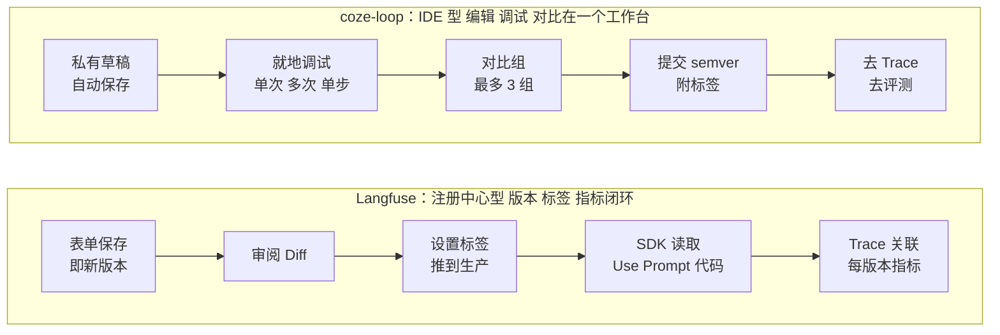
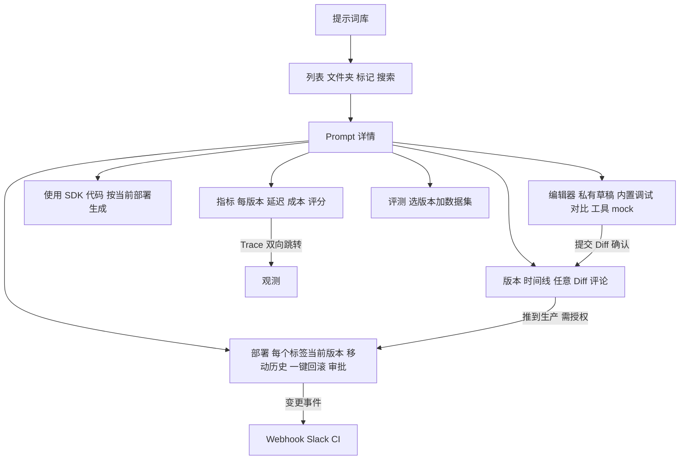

# coze-loop 与 Langfuse 提示词管理：功能横向对比与产品建议

> 返回 [索引](README.md) · 详细报告：[coze-loop](coze-loop.md) · [Langfuse](langfuse.md) · [交互页面](index.html)

- coze-loop 提交 `3a6a2bf0`；Langfuse 提交 `f75c661d`。
- 每个单元格带源码永久链接。第 3 节"产品建议"是**推断**，已标注。

## 1. 产品定位一图

## 2. 功能对比矩阵

图例：✅ 有 · ⚠️ 部分 / 有限制 · ❌ 无

### 2.1 组织与概念

| 功能 | coze-loop | Langfuse |
|---|---|---|
| 租户范围 | ✅ 空间。[routes/index.tsx#L48-L84](https://github.com/wzqwtt/coze-loop/blob/3a6a2bf07b057fec0c702e514e8345fb5684e83a/frontend/apps/cozeloop/src/routes/index.tsx#L48-L84) | ✅ 项目。[pages](https://github.com/wzqwtt/langfuse/blob/f75c661dbe8c6b85523c81486b39e8403ac2c141/web/src/pages/project/%5BprojectId%5D/prompts/%5B%5B...folder%5D%5D.tsx#L1) |
| 标识 | Prompt Key，不可改，≤ 100。[prompt-create-modal#L256-L327](https://github.com/wzqwtt/coze-loop/blob/3a6a2bf07b057fec0c702e514e8345fb5684e83a/frontend/packages/loop-components/prompt-components-v2/src/components/prompt-create-modal/index.tsx#L256-L327) | 名字，不可改，≤ 255。[constants.ts#L6-L19](https://github.com/wzqwtt/langfuse/blob/f75c661dbe8c6b85523c81486b39e8403ac2c141/packages/shared/src/features/prompts/constants.ts#L6-L19) |
| 显示名 / 描述 | ✅ 名称 + 描述。[prompt-create-modal#L286-L327](https://github.com/wzqwtt/coze-loop/blob/3a6a2bf07b057fec0c702e514e8345fb5684e83a/frontend/packages/loop-components/prompt-components-v2/src/components/prompt-create-modal/index.tsx#L286-L327) | ❌ 只有名字；有提交说明。[NewPromptForm#L76-L90](https://github.com/wzqwtt/langfuse/blob/f75c661dbe8c6b85523c81486b39e8403ac2c141/web/src/features/prompts/components/NewPromptForm/index.tsx#L76-L90) |
| 文件夹 | ❌ 平铺列表。[list/index.tsx#L28-L159](https://github.com/wzqwtt/coze-loop/blob/3a6a2bf07b057fec0c702e514e8345fb5684e83a/frontend/packages/loop-pages/prompt-pages/src/pages/list/index.tsx#L28-L159) | ✅ 名字中的 `/`。[prompts-table.tsx#L115-L139](https://github.com/wzqwtt/langfuse/blob/f75c661dbe8c6b85523c81486b39e8403ac2c141/web/src/features/prompts/components/prompts-table.tsx#L115-L139) |
| 标记（tags） | ❌ | ✅ 跨版本共享，可筛选。[updatePromptTags.ts#L3-L36](https://github.com/wzqwtt/langfuse/blob/f75c661dbe8c6b85523c81486b39e8403ac2c141/web/src/features/prompts/server/utils/updatePromptTags.ts#L3-L36) |
| 内容形态 | 消息列表 + Placeholder 角色 + 多模态。[consts#L107-L112](https://github.com/wzqwtt/coze-loop/blob/3a6a2bf07b057fec0c702e514e8345fb5684e83a/frontend/packages/loop-components/prompt-components-v2/src/consts/index.ts#L107-L112) | text 或 chat，创建后固定。[NewPromptForm#L297-L318](https://github.com/wzqwtt/langfuse/blob/f75c661dbe8c6b85523c81486b39e8403ac2c141/web/src/features/prompts/components/NewPromptForm/index.tsx#L297-L318) |
| 模型配置 | ✅ 结构化表单，模型来自运维配置。[consts#L14-L28](https://github.com/wzqwtt/coze-loop/blob/3a6a2bf07b057fec0c702e514e8345fb5684e83a/frontend/packages/loop-components/prompt-components-v2/src/consts/index.ts#L14-L28) | ⚠️ 自由 JSON config。[NewPromptForm#L389-L411](https://github.com/wzqwtt/langfuse/blob/f75c661dbe8c6b85523c81486b39e8403ac2c141/web/src/features/prompts/components/NewPromptForm/index.tsx#L389-L411) |
| 工具定义 | ✅ 函数卡片 + mock 返回。[tools-card#L132-L305](https://github.com/wzqwtt/coze-loop/blob/3a6a2bf07b057fec0c702e514e8345fb5684e83a/frontend/packages/loop-components/prompt-components-v2/src/components/prompt-develop/components/tools-card/index.tsx#L132-L305) | ⚠️ 写在 config 中，实验读取。[experiments/utils.ts#L199-L218](https://github.com/wzqwtt/langfuse/blob/f75c661dbe8c6b85523c81486b39e8403ac2c141/worker/src/features/experiments/utils.ts#L199-L218) |
| 模板引擎 | ✅ Normal / Jinja2 / GoTemplate。[template-select.tsx#L41-L176](https://github.com/wzqwtt/coze-loop/blob/3a6a2bf07b057fec0c702e514e8345fb5684e83a/frontend/packages/loop-components/prompt-components-v2/src/components/prompt-develop/components/prompt-editor-card/template-select.tsx#L41-L176) | ⚠️ 仅 `{{var}}`。[stringChecks.ts#L7-L47](https://github.com/wzqwtt/langfuse/blob/f75c661dbe8c6b85523c81486b39e8403ac2c141/packages/shared/src/utils/stringChecks.ts#L7-L47) |
| 带类型变量 | ✅ 非 Normal 引擎可定义类型。[consts#L78-L91](https://github.com/wzqwtt/coze-loop/blob/3a6a2bf07b057fec0c702e514e8345fb5684e83a/frontend/packages/loop-components/prompt-components-v2/src/consts/index.ts#L78-L91) | ❌ 只有文本变量和 placeholder。[compileChatMessages.ts#L34-L91](https://github.com/wzqwtt/langfuse/blob/f75c661dbe8c6b85523c81486b39e8403ac2c141/packages/shared/src/server/llm/compileChatMessages.ts#L34-L91) |
| 组合 / 复用 | ⚠️ 片段存在，开源版隐藏。[develop page#L79-L86](https://github.com/wzqwtt/coze-loop/blob/3a6a2bf07b057fec0c702e514e8345fb5684e83a/frontend/packages/loop-pages/prompt-pages/src/pages/develop/index.tsx#L79-L86) | ✅ 链接 text prompt，已解析/带标签切换。[prompt-detail.tsx#L695-L720](https://github.com/wzqwtt/langfuse/blob/f75c661dbe8c6b85523c81486b39e8403ac2c141/web/src/features/prompts/components/prompt-detail.tsx#L695-L720) |

### 2.2 编辑与调试

| 功能 | coze-loop | Langfuse |
|---|---|---|
| 草稿 | ✅ 服务端每用户草稿，800 ms 自动保存。[use-prompt.ts#L238-L285](https://github.com/wzqwtt/coze-loop/blob/3a6a2bf07b057fec0c702e514e8345fb5684e83a/frontend/packages/loop-components/prompt-components-v2/src/hooks/use-prompt.ts#L238-L285) | ⚠️ 表单草稿只存本地。[NewPromptForm#L194-L215](https://github.com/wzqwtt/langfuse/blob/f75c661dbe8c6b85523c81486b39e8403ac2c141/web/src/features/prompts/components/NewPromptForm/index.tsx#L194-L215) |
| 编辑器内运行 | ✅ 单次 / 多次 2–10 组。[group-select.tsx#L52-L153](https://github.com/wzqwtt/coze-loop/blob/3a6a2bf07b057fec0c702e514e8345fb5684e83a/frontend/packages/loop-components/prompt-components-v2/src/components/prompt-develop/components/send-msg-area/group-select.tsx#L52-L153) | ❌ 需跳到 Playground。[JumpToPlaygroundDropdownMenuController.tsx#L265-L306](https://github.com/wzqwtt/langfuse/blob/f75c661dbe8c6b85523c81486b39e8403ac2c141/web/src/features/playground/page/components/JumpToPlaygroundDropdownMenuController.tsx#L265-L306) |
| 工具单步调试 | ✅ 每次工具调用暂停，可改 mock。[tools-card#L132-L305](https://github.com/wzqwtt/coze-loop/blob/3a6a2bf07b057fec0c702e514e8345fb5684e83a/frontend/packages/loop-components/prompt-components-v2/src/components/prompt-develop/components/tools-card/index.tsx#L132-L305) | ❌ |
| 多模态输入 | ✅ ≤ 20 张图，每张 ≤ 20 MB。[consts#L10-L12](https://github.com/wzqwtt/coze-loop/blob/3a6a2bf07b057fec0c702e514e8345fb5684e83a/frontend/packages/loop-components/prompt-components-v2/src/consts/index.ts#L10-L12) | ❌ 提示词管理中未见 |
| 并排对比 | ✅ 最多 3 组，可设为基准组。[compare-area.tsx#L160-L185](https://github.com/wzqwtt/coze-loop/blob/3a6a2bf07b057fec0c702e514e8345fb5684e83a/frontend/packages/loop-components/prompt-components-v2/src/components/prompt-develop/components/prompt-content/compare-area.tsx#L160-L185) | ⚠️ Playground 多窗口。[JumpToPlaygroundDropdownMenuController.tsx#L265-L306](https://github.com/wzqwtt/langfuse/blob/f75c661dbe8c6b85523c81486b39e8403ac2c141/web/src/features/playground/page/components/JumpToPlaygroundDropdownMenuController.tsx#L265-L306) |
| 调试历史 | ✅ 最近 7 天。[execute-history-panel#L60-L72](https://github.com/wzqwtt/coze-loop/blob/3a6a2bf07b057fec0c702e514e8345fb5684e83a/frontend/packages/loop-pages/prompt-pages/src/components/execute-history-panel/index.tsx#L60-L72) | ❌ |
| 调试 Trace | ✅ 按 debug_id 抽屉。[develop page#L65-L92](https://github.com/wzqwtt/coze-loop/blob/3a6a2bf07b057fec0c702e514e8345fb5684e83a/frontend/packages/loop-pages/prompt-pages/src/pages/develop/index.tsx#L65-L92) | ❌ Playground 运行不关联版本。[chatCompletionHandler.ts#L29-L170](https://github.com/wzqwtt/langfuse/blob/f75c661dbe8c6b85523c81486b39e8403ac2c141/web/src/features/playground/server/chatCompletionHandler.ts#L29-L170) |
| Playground | ⚠️ 状态存浏览器，可"快速创建"。[use-playground.ts#L119-L131](https://github.com/wzqwtt/coze-loop/blob/3a6a2bf07b057fec0c702e514e8345fb5684e83a/frontend/packages/loop-components/prompt-components-v2/src/hooks/use-playground.ts#L119-L131) | ✅ 双向：载入 prompt、存为新 prompt 或版本。[SaveToPromptButton.tsx#L59-L91](https://github.com/wzqwtt/langfuse/blob/f75c661dbe8c6b85523c81486b39e8403ac2c141/web/src/features/playground/page/components/SaveToPromptButton.tsx#L59-L91) |

### 2.3 版本、发布与回滚

| 功能 | coze-loop | Langfuse |
|---|---|---|
| 版本号 | 用户填 semver，前端要求不低于基线。[utils/prompt.ts#L314-L366](https://github.com/wzqwtt/coze-loop/blob/3a6a2bf07b057fec0c702e514e8345fb5684e83a/frontend/packages/loop-components/prompt-components-v2/src/utils/prompt.ts#L314-L366) | 系统自增整数。[createPrompt.ts#L170](https://github.com/wzqwtt/langfuse/blob/f75c661dbe8c6b85523c81486b39e8403ac2c141/web/src/features/prompts/server/actions/createPrompt.ts#L170) |
| 提交说明 | ✅ ≤ 200。[prompt-submit#L160-L167](https://github.com/wzqwtt/coze-loop/blob/3a6a2bf07b057fec0c702e514e8345fb5684e83a/frontend/packages/loop-components/prompt-components-v2/src/components/prompt-submit/index.tsx#L160-L167) | ✅ ≤ 500。[constants.ts#L3](https://github.com/wzqwtt/langfuse/blob/f75c661dbe8c6b85523c81486b39e8403ac2c141/packages/shared/src/features/prompts/constants.ts#L3) |
| 提交前 Diff | ✅ 第 2 次起强制 2 步。[prompt-submit#L90-L276](https://github.com/wzqwtt/coze-loop/blob/3a6a2bf07b057fec0c702e514e8345fb5684e83a/frontend/packages/loop-components/prompt-components-v2/src/components/prompt-submit/index.tsx#L90-L276) | ✅ 审阅变更。[ReviewPromptDialog.tsx#L44-L70](https://github.com/wzqwtt/langfuse/blob/f75c661dbe8c6b85523c81486b39e8403ac2c141/web/src/features/prompts/components/NewPromptForm/ReviewPromptDialog.tsx#L44-L70) |
| 版本间 Diff | ⚠️ 草稿 vs 已提交。[editor-card-header-actions.tsx#L80-L110](https://github.com/wzqwtt/coze-loop/blob/3a6a2bf07b057fec0c702e514e8345fb5684e83a/frontend/packages/loop-components/prompt-components-v2/src/components/prompt-develop/components/prompt-editor-card/editor-card-header-actions.tsx#L80-L110) | ⚠️ 任一版本 vs 选中版本，含 config。[PromptVersionDiffDialog.tsx#L18-L100](https://github.com/wzqwtt/langfuse/blob/f75c661dbe8c6b85523c81486b39e8403ac2c141/web/src/features/prompts/components/PromptVersionDiffDialog.tsx#L18-L100) |
| 标签 | ✅ 预置 production/beta/test + 自定义。[version-label-select.tsx#L43-L97](https://github.com/wzqwtt/coze-loop/blob/3a6a2bf07b057fec0c702e514e8345fb5684e83a/frontend/packages/loop-components/prompt-components-v2/src/components/version-label/version-label-select.tsx#L43-L97) | ✅ latest 自动、production 默认 + 自定义。[constants.ts#L22-L25](https://github.com/wzqwtt/langfuse/blob/f75c661dbe8c6b85523c81486b39e8403ac2c141/packages/shared/src/features/prompts/constants.ts#L22-L25) |
| "推到生产"引导 | ⚠️ 在提交弹窗或版本记录面板编辑标签。[version-list#L153-L177](https://github.com/wzqwtt/coze-loop/blob/3a6a2bf07b057fec0c702e514e8345fb5684e83a/frontend/packages/loop-components/prompt-components-v2/src/components/version-list/index.tsx#L153-L177) | ✅ 专门的"推到生产"分组和按钮。[SetPromptVersionLabels#L210-L225](https://github.com/wzqwtt/langfuse/blob/f75c661dbe8c6b85523c81486b39e8403ac2c141/web/src/features/prompts/components/SetPromptVersionLabels/index.tsx#L210-L225) |
| 默认安全 | ⚠️ SDK 不带标签时读最新版本，提交即生效。[service/manage.go#L221-L307](https://github.com/wzqwtt/coze-loop/blob/3a6a2bf07b057fec0c702e514e8345fb5684e83a/backend/modules/prompt/domain/service/manage.go#L221-L307) | ✅ 新版本默认不带 production。[NewPromptForm#L89](https://github.com/wzqwtt/langfuse/blob/f75c661dbe8c6b85523c81486b39e8403ac2c141/web/src/features/prompts/components/NewPromptForm/index.tsx#L89) |
| 回滚 | ⚠️ 移动标签，或恢复到草稿再提交。[version-list#L101-L127](https://github.com/wzqwtt/coze-loop/blob/3a6a2bf07b057fec0c702e514e8345fb5684e83a/frontend/packages/loop-components/prompt-components-v2/src/components/version-list/index.tsx#L101-L127) | ⚠️ 移动 production 标签。[SetPromptVersionLabels#L210-L225](https://github.com/wzqwtt/langfuse/blob/f75c661dbe8c6b85523c81486b39e8403ac2c141/web/src/features/prompts/components/SetPromptVersionLabels/index.tsx#L210-L225) |
| 受保护标签 | ❌ | ✅ 需权益。[promptRouter.ts#L1407-L1529](https://github.com/wzqwtt/langfuse/blob/f75c661dbe8c6b85523c81486b39e8403ac2c141/web/src/features/prompts/server/routers/promptRouter.ts#L1407-L1529) |
| 标签移动历史 | ❌ | ⚠️ 只在审计日志和自动化事件中。[promptRouter.ts#L352-L361](https://github.com/wzqwtt/langfuse/blob/f75c661dbe8c6b85523c81486b39e8403ac2c141/web/src/features/prompts/server/routers/promptRouter.ts#L352-L361) |

### 2.4 消费与闭环

| 功能 | coze-loop | Langfuse |
|---|---|---|
| SDK 引导 | ⚠️ 外链文档 + 复制 key。[prompt-header#L543-L581](https://github.com/wzqwtt/coze-loop/blob/3a6a2bf07b057fec0c702e514e8345fb5684e83a/frontend/packages/loop-components/prompt-components-v2/src/components/prompt-develop/components/prompt-header/index.tsx#L543-L581) | ✅ Use Prompt 标签页生成代码。[prompt-detail.tsx#L766-L785](https://github.com/wzqwtt/langfuse/blob/f75c661dbe8c6b85523c81486b39e8403ac2c141/web/src/features/prompts/components/prompt-detail.tsx#L766-L785) |
| 托管执行 | ✅ PTaaS `execute`。[openapi.thrift#L7-L17](https://github.com/wzqwtt/coze-loop/blob/3a6a2bf07b057fec0c702e514e8345fb5684e83a/idl/thrift/coze/loop/prompt/coze.loop.prompt.openapi.thrift#L7-L17) | ❌ 只分发模板。[promptNameHandler.ts#L40-L53](https://github.com/wzqwtt/langfuse/blob/f75c661dbe8c6b85523c81486b39e8403ac2c141/web/src/features/prompts/server/handlers/promptNameHandler.ts#L40-L53) |
| 生产 Trace 关联 | ⚠️ 列表"调用记录"按 key 筛选。[list page#L54-L60](https://github.com/wzqwtt/coze-loop/blob/3a6a2bf07b057fec0c702e514e8345fb5684e83a/frontend/packages/loop-pages/prompt-pages/src/pages/list/index.tsx#L54-L60) | ✅ PromptBadge + Linked Generations。[PromptBadge.tsx#L7-L19](https://github.com/wzqwtt/langfuse/blob/f75c661dbe8c6b85523c81486b39e8403ac2c141/web/src/features/traces/components/PromptBadge.tsx#L7-L19) |
| 每版本指标 | ❌ | ✅ 延迟、token、成本、评分。[PromptMetricsPage.tsx#L176-L313](https://github.com/wzqwtt/langfuse/blob/f75c661dbe8c6b85523c81486b39e8403ac2c141/web/src/features/prompts/PromptMetricsPage.tsx#L176-L313) |
| 数据集评测 | ✅ 已提交版本作为评测对象。[eval_target.thrift#L88-L94](https://github.com/wzqwtt/coze-loop/blob/3a6a2bf07b057fec0c702e514e8345fb5684e83a/idl/thrift/coze/loop/evaluation/domain/eval_target.thrift#L88-L94) | ✅ 详情页发起实验，实时校验变量。[MultiStepExperimentForm.tsx#L272-L280](https://github.com/wzqwtt/langfuse/blob/f75c661dbe8c6b85523c81486b39e8403ac2c141/web/src/features/experiments/components/MultiStepExperimentForm.tsx#L272-L280) |
| 自动化 / 通知 | ❌ | ✅ Webhook / Slack / GitHub。[automationForm.tsx#L268-L312](https://github.com/wzqwtt/langfuse/blob/f75c661dbe8c6b85523c81486b39e8403ac2c141/web/src/features/automations/components/automationForm.tsx#L268-L312) |
| 评论 | ❌ | ✅ 版本评论。[prompt-detail.tsx#L590-L631](https://github.com/wzqwtt/langfuse/blob/f75c661dbe8c6b85523c81486b39e8403ac2c141/web/src/features/prompts/components/prompt-detail.tsx#L590-L631) |
| 导入 / 导出 | ❌ | ✅ JSON，导入 ≤ 500。[promptRouter.ts#L1530-L1728](https://github.com/wzqwtt/langfuse/blob/f75c661dbe8c6b85523c81486b39e8403ac2c141/web/src/features/prompts/server/routers/promptRouter.ts#L1530-L1728) |
| 复制 | ✅ 从版本创建副本。[version-list/index.tsx#L101-L319](https://github.com/wzqwtt/coze-loop/blob/3a6a2bf07b057fec0c702e514e8345fb5684e83a/frontend/packages/loop-components/prompt-components-v2/src/components/version-list/index.tsx#L101-L319) | ✅ prompt 和文件夹，可重写引用。[createPrompt.ts#L292-L691](https://github.com/wzqwtt/langfuse/blob/f75c661dbe8c6b85523c81486b39e8403ac2c141/web/src/features/prompts/server/actions/createPrompt.ts#L292-L691) |
| AI agent 工具 | ❌ | ✅ MCP 工具，写操作需批准。[mcpPolicy.ts#L259-L290](https://github.com/wzqwtt/langfuse/blob/f75c661dbe8c6b85523c81486b39e8403ac2c141/packages/shared/src/in-app-agent/server/mcpPolicy.ts#L259-L290) |

### 2.5 权限与治理

| 功能 | coze-loop | Langfuse |
|---|---|---|
| 角色 | ❌ 开源版只查空间成员。[foundation auth.go#L30-L70](https://github.com/wzqwtt/coze-loop/blob/3a6a2bf07b057fec0c702e514e8345fb5684e83a/backend/modules/foundation/application/auth.go#L30-L70) | ✅ Owner / Admin / Member / Viewer。[projectAccessRights.ts#L105-L293](https://github.com/wzqwtt/langfuse/blob/f75c661dbe8c6b85523c81486b39e8403ac2c141/packages/shared/src/features/rbac/projectAccessRights.ts#L105-L293) |
| 界面按权限禁用 | ⚠️ 仅"创建人删除"，且只在前端。[list page#L74-L84](https://github.com/wzqwtt/coze-loop/blob/3a6a2bf07b057fec0c702e514e8345fb5684e83a/frontend/packages/loop-pages/prompt-pages/src/pages/list/index.tsx#L74-L84) | ✅ 无 CUD 时禁用写按钮。[PromptsPage.tsx#L47-L54](https://github.com/wzqwtt/langfuse/blob/f75c661dbe8c6b85523c81486b39e8403ac2c141/web/src/features/prompts/PromptsPage.tsx#L47-L54) |
| 审计日志 | ❌ 界面中未见 | ✅ 每次增删改。[prompt-api-service.ts#L85-L93](https://github.com/wzqwtt/langfuse/blob/f75c661dbe8c6b85523c81486b39e8403ac2c141/web/src/features/prompts/server/prompt-api-service.ts#L85-L93) |
| 冲突提示 | ❌ 常量存在但未使用。[consts#L6-L8](https://github.com/wzqwtt/coze-loop/blob/3a6a2bf07b057fec0c702e514e8345fb5684e83a/frontend/packages/loop-components/prompt-components-v2/src/consts/index.ts#L6-L8) | — 无草稿概念，不需要 |
| 获取限流 | ✅ 每空间 500 QPS。[prompt.yaml#L1-L16](https://github.com/wzqwtt/coze-loop/blob/3a6a2bf07b057fec0c702e514e8345fb5684e83a/release/deployment/docker-compose/conf/prompt.yaml#L1-L16) | ❌ 不限。[RateLimitService.ts#L280-L285](https://github.com/wzqwtt/langfuse/blob/f75c661dbe8c6b85523c81486b39e8403ac2c141/web/src/features/public-api/server/RateLimitService.ts#L280-L285) |

## 3. 自建提示词库的产品建议

> 以下全部是 **【推断】**。每条注明依据。

### 3.1 借鉴 coze-loop

1. **编辑器内调试。** 编辑、运行、看 Trace 在同一屏完成，减少跳转。依据：[normal-area.tsx#L211-L331](https://github.com/wzqwtt/coze-loop/blob/3a6a2bf07b057fec0c702e514e8345fb5684e83a/frontend/packages/loop-components/prompt-components-v2/src/components/prompt-develop/components/prompt-content/normal-area.tsx#L211-L331)。
2. **工具 mock + 单步调试。** 不接真实工具也能调 agent 类 prompt。依据：[tools-card#L132-L305](https://github.com/wzqwtt/coze-loop/blob/3a6a2bf07b057fec0c702e514e8345fb5684e83a/frontend/packages/loop-components/prompt-components-v2/src/components/prompt-develop/components/tools-card/index.tsx#L132-L305)。
3. **多次运行测稳定性。** 一键跑 N 次看输出方差。依据：[group-select.tsx#L52-L153](https://github.com/wzqwtt/coze-loop/blob/3a6a2bf07b057fec0c702e514e8345fb5684e83a/frontend/packages/loop-components/prompt-components-v2/src/components/prompt-develop/components/send-msg-area/group-select.tsx#L52-L153)。
4. **服务端私有草稿 + 自动保存。** 不丢工作，也不污染版本历史。依据：[use-prompt.ts#L238-L285](https://github.com/wzqwtt/coze-loop/blob/3a6a2bf07b057fec0c702e514e8345fb5684e83a/frontend/packages/loop-components/prompt-components-v2/src/hooks/use-prompt.ts#L238-L285)。
5. **提交前强制 Diff 确认。** 依据：[prompt-submit#L90-L276](https://github.com/wzqwtt/coze-loop/blob/3a6a2bf07b057fec0c702e514e8345fb5684e83a/frontend/packages/loop-components/prompt-components-v2/src/components/prompt-submit/index.tsx#L90-L276)。
6. **提交拦截规则。** 模型能力与模板不匹配时阻止提交。依据：[prompt-header#L208-L253](https://github.com/wzqwtt/coze-loop/blob/3a6a2bf07b057fec0c702e514e8345fb5684e83a/frontend/packages/loop-components/prompt-components-v2/src/components/prompt-develop/components/prompt-header/index.tsx#L208-L253)。
7. **结构化模型与工具配置。** 比自由 JSON 更不易出错。依据：[consts#L14-L28](https://github.com/wzqwtt/coze-loop/blob/3a6a2bf07b057fec0c702e514e8345fb5684e83a/frontend/packages/loop-components/prompt-components-v2/src/consts/index.ts#L14-L28)。

### 3.2 借鉴 Langfuse

1. **默认读取 `production`；新版本默认不上线。** 依据：[NewPromptForm#L89](https://github.com/wzqwtt/langfuse/blob/f75c661dbe8c6b85523c81486b39e8403ac2c141/web/src/features/prompts/components/NewPromptForm/index.tsx#L89)、[getPromptByName.ts#L49-L55](https://github.com/wzqwtt/langfuse/blob/f75c661dbe8c6b85523c81486b39e8403ac2c141/web/src/features/prompts/server/actions/getPromptByName.ts#L49-L55)。
2. **显式"推到生产"操作。** 发布是一等动作，不藏在标签编辑里。依据：[SetPromptVersionLabels#L210-L225](https://github.com/wzqwtt/langfuse/blob/f75c661dbe8c6b85523c81486b39e8403ac2c141/web/src/features/prompts/components/SetPromptVersionLabels/index.tsx#L210-L225)。
3. **受保护标签 + 角色。** 人人可建版本，只有授权者可发布。依据：[projectAccessRights.ts#L105-L293](https://github.com/wzqwtt/langfuse/blob/f75c661dbe8c6b85523c81486b39e8403ac2c141/packages/shared/src/features/rbac/projectAccessRights.ts#L105-L293)。
4. **每版本指标页。** 用生产数据比较版本。依据：[PromptMetricsPage.tsx#L176-L313](https://github.com/wzqwtt/langfuse/blob/f75c661dbe8c6b85523c81486b39e8403ac2c141/web/src/features/prompts/PromptMetricsPage.tsx#L176-L313)。
5. **Trace ↔ Prompt 双向跳转。** 依据：[PromptBadge.tsx#L7-L19](https://github.com/wzqwtt/langfuse/blob/f75c661dbe8c6b85523c81486b39e8403ac2c141/web/src/features/traces/components/PromptBadge.tsx#L7-L19)。
6. **产品内 SDK 代码片段**，带当前名字 / 版本 / 标签。依据：[prompt-detail.tsx#L766-L785](https://github.com/wzqwtt/langfuse/blob/f75c661dbe8c6b85523c81486b39e8403ac2c141/web/src/features/prompts/components/prompt-detail.tsx#L766-L785)。
7. **变更事件 → Webhook / Slack / CI。** 依据：[automationForm.tsx#L268-L312](https://github.com/wzqwtt/langfuse/blob/f75c661dbe8c6b85523c81486b39e8403ac2c141/web/src/features/automations/components/automationForm.tsx#L268-L312)。
8. **文件夹、标记、导入导出、评论。** 规模变大后必需。依据：[prompts-table.tsx#L115-L139](https://github.com/wzqwtt/langfuse/blob/f75c661dbe8c6b85523c81486b39e8403ac2c141/web/src/features/prompts/components/prompts-table.tsx#L115-L139)、[promptRouter.ts#L1530-L1728](https://github.com/wzqwtt/langfuse/blob/f75c661dbe8c6b85523c81486b39e8403ac2c141/web/src/features/prompts/server/routers/promptRouter.ts#L1530-L1728)。

### 3.3 两者都缺，应补齐

| 缺口 | 为什么重要 | 依据 |
|---|---|---|
| 标签移动时间线 / 部署视图 | 回答"现在线上是哪个版本、谁何时改的" | coze-loop 无审计 [version-list#L153-L177](https://github.com/wzqwtt/coze-loop/blob/3a6a2bf07b057fec0c702e514e8345fb5684e83a/frontend/packages/loop-components/prompt-components-v2/src/components/version-list/index.tsx#L153-L177)；Langfuse 时间线不显示标签移动 [prompt-history.tsx#L140-L178](https://github.com/wzqwtt/langfuse/blob/f75c661dbe8c6b85523c81486b39e8403ac2c141/web/src/features/prompts/components/prompt-history.tsx#L140-L178) |
| 一键回滚 | 两者都靠手动移动标签 | [SetPromptVersionLabels#L210-L225](https://github.com/wzqwtt/langfuse/blob/f75c661dbe8c6b85523c81486b39e8403ac2c141/web/src/features/prompts/components/SetPromptVersionLabels/index.tsx#L210-L225)、[version-list#L101-L127](https://github.com/wzqwtt/coze-loop/blob/3a6a2bf07b057fec0c702e514e8345fb5684e83a/frontend/packages/loop-components/prompt-components-v2/src/components/version-list/index.tsx#L101-L127) |
| 任意两版本 Diff（含标签、config） | Langfuse 只能对选中版本；coze-loop 只能草稿 vs 已提交 | [PromptVersionDiffDialog.tsx#L18-L100](https://github.com/wzqwtt/langfuse/blob/f75c661dbe8c6b85523c81486b39e8403ac2c141/web/src/features/prompts/components/PromptVersionDiffDialog.tsx#L18-L100)、[editor-card-header-actions.tsx#L80-L110](https://github.com/wzqwtt/coze-loop/blob/3a6a2bf07b057fec0c702e514e8345fb5684e83a/frontend/packages/loop-components/prompt-components-v2/src/components/prompt-develop/components/prompt-editor-card/editor-card-header-actions.tsx#L80-L110) |
| 发布审批 | 两者都没有 | [coze-loop auth.go#L30-L70](https://github.com/wzqwtt/coze-loop/blob/3a6a2bf07b057fec0c702e514e8345fb5684e83a/backend/modules/foundation/application/auth.go#L30-L70)、[authorizeProtectedLabelMutation.ts#L70-L152](https://github.com/wzqwtt/langfuse/blob/f75c661dbe8c6b85523c81486b39e8403ac2c141/web/src/features/prompts/server/utils/authorizeProtectedLabelMutation.ts#L70-L152) |
| Playground 运行关联版本 | 调试结果无法归档到版本 | [chatCompletionHandler.ts#L29-L170](https://github.com/wzqwtt/langfuse/blob/f75c661dbe8c6b85523c81486b39e8403ac2c141/web/src/features/playground/server/chatCompletionHandler.ts#L29-L170)、[use-playground.ts#L119-L131](https://github.com/wzqwtt/coze-loop/blob/3a6a2bf07b057fec0c702e514e8345fb5684e83a/frontend/packages/loop-components/prompt-components-v2/src/hooks/use-playground.ts#L119-L131) |
| 评估器 prompt 也纳入版本管理 | Langfuse 的 LLM-as-judge 独立于提示词管理 | [schema.prisma#L1007](https://github.com/wzqwtt/langfuse/blob/f75c661dbe8c6b85523c81486b39e8403ac2c141/packages/shared/prisma/schema.prisma#L1007) |

### 3.4 应避免

- 权限只在前端检查。依据：[list page#L74-L84](https://github.com/wzqwtt/coze-loop/blob/3a6a2bf07b057fec0c702e514e8345fb5684e83a/frontend/packages/loop-pages/prompt-pages/src/pages/list/index.tsx#L74-L84)。
- 文案与行为不一致（"三花括号"实为双花括号）。依据：[en-US.json#L171-L174](https://github.com/wzqwtt/coze-loop/blob/3a6a2bf07b057fec0c702e514e8345fb5684e83a/frontend/packages/loop-base/loop-lng/src/locales/prompt/en-US.json#L171-L174)。
- 存在却无入口的概念（安全级别、MCP）。依据：[prompt-create-modal#L66-L91](https://github.com/wzqwtt/coze-loop/blob/3a6a2bf07b057fec0c702e514e8345fb5684e83a/frontend/packages/loop-components/prompt-components-v2/src/components/prompt-create-modal/index.tsx#L66-L91)。
- 不同入口事件行为不一致（REST 删除不发事件）。依据：[deletePrompt.ts#L13-L127](https://github.com/wzqwtt/langfuse/blob/f75c661dbe8c6b85523c81486b39e8403ac2c141/web/src/features/prompts/server/actions/deletePrompt.ts#L13-L127)。
- 降级后旧限制仍生效却隐藏设置入口。依据：[checkHasProtectedLabels.ts#L9-L25](https://github.com/wzqwtt/langfuse/blob/f75c661dbe8c6b85523c81486b39e8403ac2c141/web/src/features/prompts/server/utils/checkHasProtectedLabels.ts#L9-L25)。
- SDK 文档指向商业站点而非当前部署。依据：[prompt-header#L562-L570](https://github.com/wzqwtt/coze-loop/blob/3a6a2bf07b057fec0c702e514e8345fb5684e83a/frontend/packages/loop-components/prompt-components-v2/src/components/prompt-develop/components/prompt-header/index.tsx#L562-L570)。

### 3.5 建议的信息架构

