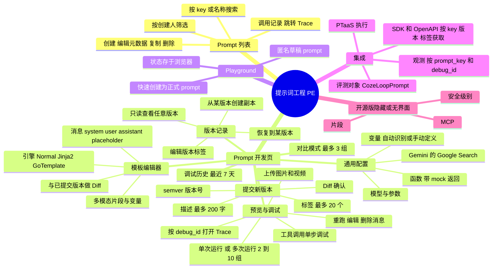
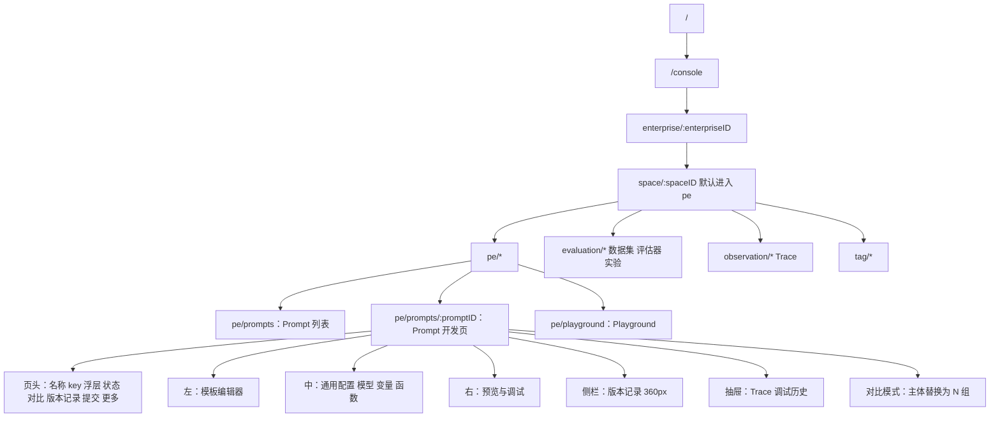
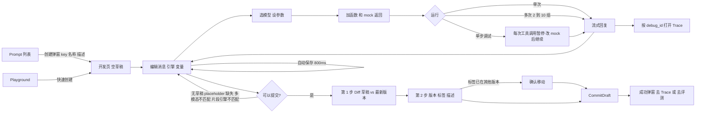
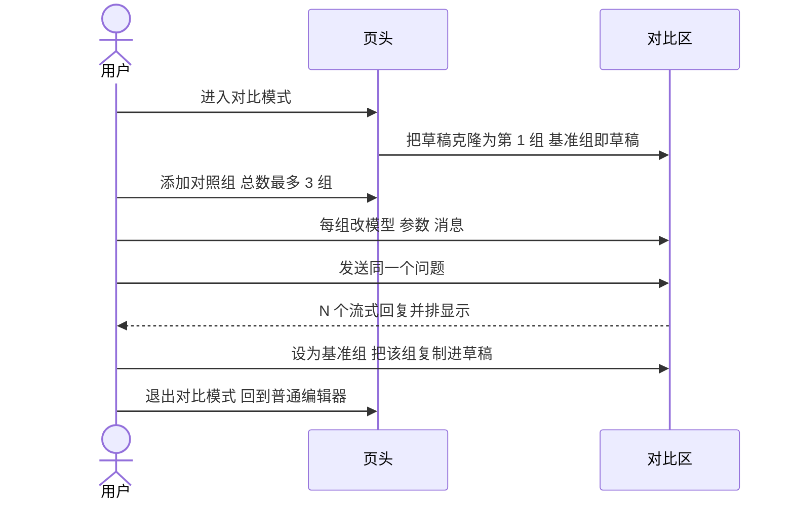
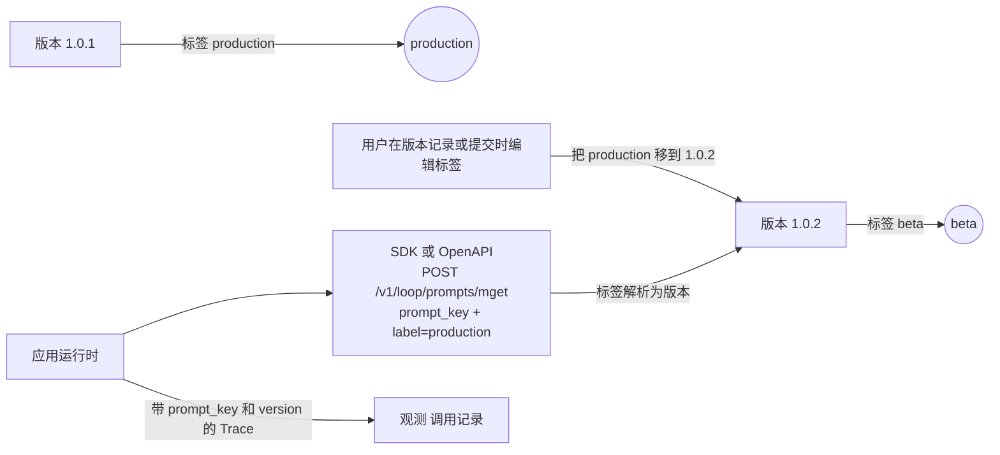
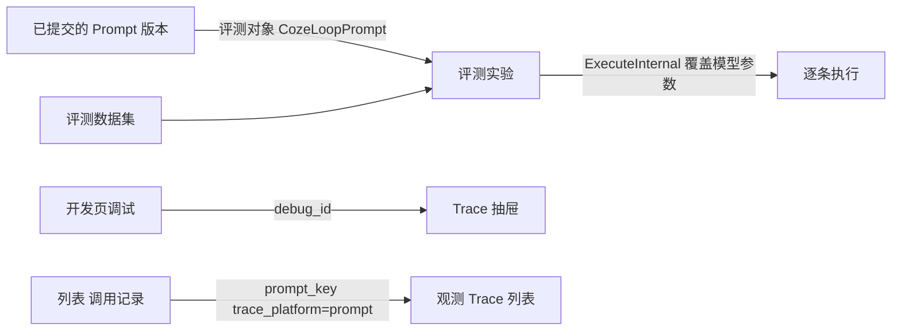
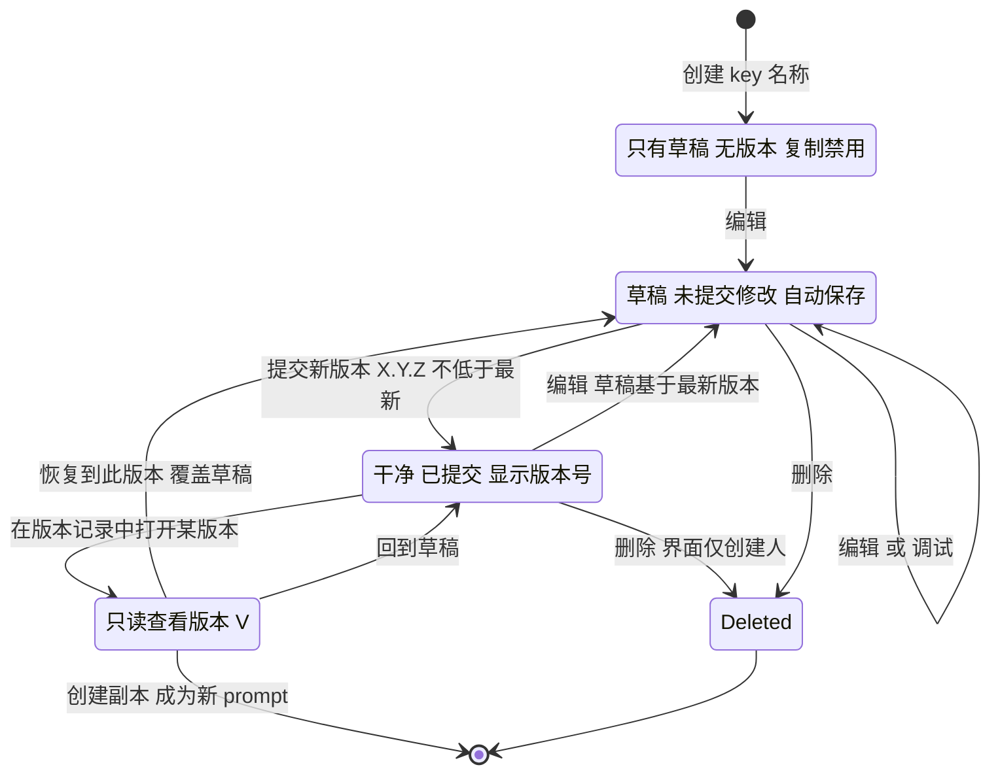
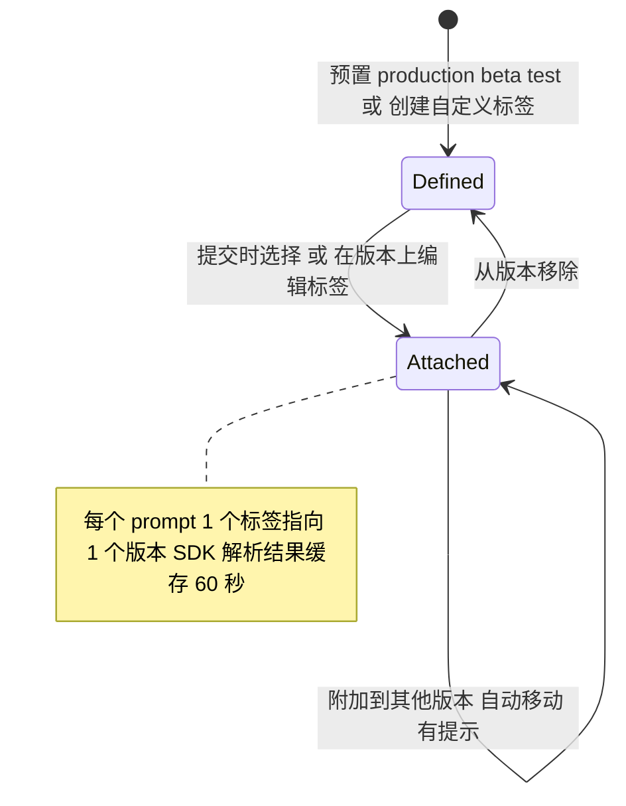

# coze-loop 提示词管理：功能设计（产品视角）

> 返回 [索引](README.md) · 对照阅读 [Langfuse](langfuse.md) · [横向对比与产品建议](comparison.md) · [交互页面](index.html)

- **仓库：** [wzqwtt/coze-loop](https://github.com/wzqwtt/coze-loop)，提交 `3a6a2bf07b057fec0c702e514e8345fb5684e83a`。
- **视角：** 用户能看到什么、能做什么。来源：前端页面与组件、IDL、i18n 文案、部署配置。
- **后端实现** 见 [../prompt/coze-loop.md](../prompt/coze-loop.md)。本文只在后端规则影响用户体验时引用后端代码。
- **路径简写：** `FE` = `frontend/packages/loop-components/prompt-components-v2/src`。
- **规则：** 每条事实带永久链接。推断用 **【推断】** 标注。

## 目录

1. [结论速览](#1-结论速览)
2. [功能地图](#2-功能地图)
3. [概念与术语](#3-概念与术语)
4. [信息架构](#4-信息架构)
5. [关键用户旅程](#5-关键用户旅程)
6. [生命周期状态](#6-生命周期状态)
7. [权限与协作](#7-权限与协作)
8. [限制与配额](#8-限制与配额)
9. [集成](#9-集成)
10. [设计取舍与缺口](#10-设计取舍与缺口)

## 1. 结论速览

- **位置：** 提示词工程（PE）是每个空间的第一个菜单区。它有 2 个入口：**Prompt 开发** 和 **Playground**。[menu-config.tsx#L40-L60](https://github.com/wzqwtt/coze-loop/blob/3a6a2bf07b057fec0c702e514e8345fb5684e83a/frontend/apps/cozeloop/src/components/navbar/menu-config.tsx#L40-L60)
- **核心循环：**
  1. 编辑草稿。草稿自动保存。
  2. 就地调试：单次运行、多次运行、工具调用单步调试。
  3. 与最多 2 个对照组比较。
  4. **提交新版本**（编号快照），可附加**版本标签**。
- **提交后：** 界面引导用户去 Trace（SDK 上报）和评测数据集。
- **开源版 = 商业版 UI 减去部分功能。** 共享组件库 `prompt-components-v2` 有大量 `buttonConfig` 和功能开关。[type.ts#L61-L174](https://github.com/wzqwtt/coze-loop/blob/3a6a2bf07b057fec0c702e514e8345fb5684e83a/frontend/packages/loop-components/prompt-components-v2/src/components/prompt-develop/type.ts#L61-L174) 开源页面关闭了：
  - 片段（`hideSnippet={true}`）
  - MCP 界面
  - 差异编辑（`canDiffEdit={false}`）
  - 调试区的角色切换
- **协作模型：** 每用户私有草稿 + 空间共享的版本历史 + 用标签表达发布。没有评审、审批、角色权限。任何空间成员都能做任何事（见 [§7](#7-权限与协作)）。

## 2. 功能地图



## 3. 概念与术语

| 概念 | 用户看到的样子 | 证据 |
|---|---|---|
| **空间** | 所有路由都在 `/console/enterprise/:enterpriseID/space/:spaceID/` 下。选中空间后才显示 PE 菜单。没有空间的用户看到"无空间"。 | [routes/index.tsx#L48-L84](https://github.com/wzqwtt/coze-loop/blob/3a6a2bf07b057fec0c702e514e8345fb5684e83a/frontend/apps/cozeloop/src/routes/index.tsx#L48-L84)、[space-route.tsx#L13-L28](https://github.com/wzqwtt/coze-loop/blob/3a6a2bf07b057fec0c702e514e8345fb5684e83a/frontend/apps/cozeloop/src/routes/space-route.tsx#L13-L28) |
| **Prompt** | 用 **Prompt Key** 标识，创建后不可改。另有名称和描述。 | Key：`^[a-zA-Z][a-zA-Z0-9_.]*$`，≤ 100 字符，编辑时禁用。名称 ≤ 100 字符，不能以符号开头。描述 ≤ 500 字符。[prompt-create-modal#L256-L327](https://github.com/wzqwtt/coze-loop/blob/3a6a2bf07b057fec0c702e514e8345fb5684e83a/frontend/packages/loop-components/prompt-components-v2/src/components/prompt-create-modal/index.tsx#L256-L327) |
| **草稿** | 修改后 800 ms 防抖自动保存。页头显示"未提交修改"或"已提交"，以及"草稿已自动保存于 <时间>"。每份草稿属于 1 个用户。 | [use-prompt.ts#L238-L285](https://github.com/wzqwtt/coze-loop/blob/3a6a2bf07b057fec0c702e514e8345fb5684e83a/frontend/packages/loop-components/prompt-components-v2/src/hooks/use-prompt.ts#L238-L285)、[prompt-header#L616-L655](https://github.com/wzqwtt/coze-loop/blob/3a6a2bf07b057fec0c702e514e8345fb5684e83a/frontend/packages/loop-components/prompt-components-v2/src/components/prompt-develop/components/prompt-header/index.tsx#L616-L655)、[prompt_user_draft.sql#L23-L25](https://github.com/wzqwtt/coze-loop/blob/3a6a2bf07b057fec0c702e514e8345fb5684e83a/release/deployment/docker-compose/bootstrap/mysql-init/init-sql/prompt_user_draft.sql#L23-L25) |
| **版本** | 由"提交新版本"创建。格式 `X.Y.Z`，每段 0–9999。前端要求**不低于基线版本**。默认建议值 = 最新版本补丁号 +1；首次为 `0.0.1`。 | [utils/prompt.ts#L314-L366](https://github.com/wzqwtt/coze-loop/blob/3a6a2bf07b057fec0c702e514e8345fb5684e83a/frontend/packages/loop-components/prompt-components-v2/src/utils/prompt.ts#L314-L366)、[prompt-header#L828-L836](https://github.com/wzqwtt/coze-loop/blob/3a6a2bf07b057fec0c702e514e8345fb5684e83a/frontend/packages/loop-components/prompt-components-v2/src/components/prompt-develop/components/prompt-header/index.tsx#L828-L836) |
| **版本标签** | 空间级标签。预置 `production`、`beta`、`test`。自定义标签匹配 `^[a-z0-9_]+$`，≤ 50 字符。每个 prompt 的 1 个标签指向 1 个版本。**附加标签会把它从旧版本移走**，界面会提示。一次最多选 20 个。 | [version-label-select.tsx#L43](https://github.com/wzqwtt/coze-loop/blob/3a6a2bf07b057fec0c702e514e8345fb5684e83a/frontend/packages/loop-components/prompt-components-v2/src/components/version-label/version-label-select.tsx#L43)、[L84-L97](https://github.com/wzqwtt/coze-loop/blob/3a6a2bf07b057fec0c702e514e8345fb5684e83a/frontend/packages/loop-components/prompt-components-v2/src/components/version-label/version-label-select.tsx#L84-L97)、[L291-L329](https://github.com/wzqwtt/coze-loop/blob/3a6a2bf07b057fec0c702e514e8345fb5684e83a/frontend/packages/loop-components/prompt-components-v2/src/components/version-label/version-label-select.tsx#L291-L329)、[prompt.yaml#L18-L22](https://github.com/wzqwtt/coze-loop/blob/3a6a2bf07b057fec0c702e514e8345fb5684e83a/release/deployment/docker-compose/conf/prompt.yaml#L18-L22) |
| **片段** | 可复用的片段 prompt，自动生成 key `fornax.segment.<id>`，显示"N 个项目引用"。**开源页面隐藏它。** | [prompt-create-modal#L135-L140](https://github.com/wzqwtt/coze-loop/blob/3a6a2bf07b057fec0c702e514e8345fb5684e83a/frontend/packages/loop-components/prompt-components-v2/src/components/prompt-create-modal/index.tsx#L135-L140)、[list page#L106-L124](https://github.com/wzqwtt/coze-loop/blob/3a6a2bf07b057fec0c702e514e8345fb5684e83a/frontend/packages/loop-pages/prompt-pages/src/pages/list/index.tsx#L106-L124)、[develop page#L79-L86](https://github.com/wzqwtt/coze-loop/blob/3a6a2bf07b057fec0c702e514e8345fb5684e83a/frontend/packages/loop-pages/prompt-pages/src/pages/develop/index.tsx#L79-L86) |
| **模板引擎** | 3 种：Normal、Jinja2、GoTemplate。Normal 自动识别变量。Jinja2 / GoTemplate 手动增删变量，支持复杂逻辑。切换引擎前确认："可能导致现有变量渲染失败"。 | [template-select.tsx#L41-L176](https://github.com/wzqwtt/coze-loop/blob/3a6a2bf07b057fec0c702e514e8345fb5684e83a/frontend/packages/loop-components/prompt-components-v2/src/components/prompt-develop/components/prompt-editor-card/template-select.tsx#L41-L176)、[consts#L120-L124](https://github.com/wzqwtt/coze-loop/blob/3a6a2bf07b057fec0c702e514e8345fb5684e83a/frontend/packages/loop-components/prompt-components-v2/src/consts/index.ts#L120-L124) |
| **变量** | Normal：从 `{{name}}` 自动识别（字母开头，≤ 50 字符），默认 String。多模态变量和 Placeholder 变量从消息片段识别。其他引擎：手动添加带类型的变量（String、Integer、Float、Boolean、Object、数组、Placeholder、Multimodal）。 | [utils/prompt.ts#L211-L282](https://github.com/wzqwtt/coze-loop/blob/3a6a2bf07b057fec0c702e514e8345fb5684e83a/frontend/packages/loop-components/prompt-components-v2/src/utils/prompt.ts#L211-L282)、[variables-card#L67-L158](https://github.com/wzqwtt/coze-loop/blob/3a6a2bf07b057fec0c702e514e8345fb5684e83a/frontend/packages/loop-components/prompt-components-v2/src/components/prompt-develop/components/variables-card/index.tsx#L67-L158)、[consts#L78-L91](https://github.com/wzqwtt/coze-loop/blob/3a6a2bf07b057fec0c702e514e8345fb5684e83a/frontend/packages/loop-components/prompt-components-v2/src/consts/index.ts#L78-L91) |
| **消息角色** | System、User、Assistant、**Placeholder**。Placeholder 在运行时用"mock 消息组"填充。 | [consts#L107-L112](https://github.com/wzqwtt/coze-loop/blob/3a6a2bf07b057fec0c702e514e8345fb5684e83a/frontend/packages/loop-components/prompt-components-v2/src/consts/index.ts#L107-L112) |
| **模型配置** | 从空间的模型列表选择，再设参数：temperature、max_tokens、top_p、top_k、惩罚项、JSON 模式、extra、深度思考开关/长度/程度。**模型和参数 schema 由运维在 `model_config.yaml` 中定义；没有模型管理界面。** | [consts#L14-L28](https://github.com/wzqwtt/coze-loop/blob/3a6a2bf07b057fec0c702e514e8345fb5684e83a/frontend/packages/loop-components/prompt-components-v2/src/consts/index.ts#L14-L28)、[model_config.yaml#L1-L31](https://github.com/wzqwtt/coze-loop/blob/3a6a2bf07b057fec0c702e514e8345fb5684e83a/release/deployment/docker-compose/conf/model_config.yaml#L1-L31)、[manage.go#L21-L32](https://github.com/wzqwtt/coze-loop/blob/3a6a2bf07b057fec0c702e514e8345fb5684e83a/backend/modules/llm/infra/config/manage.go#L21-L32) |
| **函数（工具）** | "函数"卡片提供工具选择：None、Auto、指定函数。每个函数有 **mock 返回**。选 Auto 或指定函数时自动打开"单步调试"。Google Search 只对 Gemini v2 显示。模型不支持函数调用时显示"模型不支持"。 | [tools-card#L132-L305](https://github.com/wzqwtt/coze-loop/blob/3a6a2bf07b057fec0c702e514e8345fb5684e83a/frontend/packages/loop-components/prompt-components-v2/src/components/prompt-develop/components/tools-card/index.tsx#L132-L305) |
| **多模态** | 调试可输入图片和视频：≤ 20 张图，每张 ≤ 20 MB。模板用了多模态变量而模型不支持时，禁止提交。提示"历史图片消息 1 天后过期"。 | [consts#L10-L12](https://github.com/wzqwtt/coze-loop/blob/3a6a2bf07b057fec0c702e514e8345fb5684e83a/frontend/packages/loop-components/prompt-components-v2/src/consts/index.ts#L10-L12)、[send-msg-area#L205-L250](https://github.com/wzqwtt/coze-loop/blob/3a6a2bf07b057fec0c702e514e8345fb5684e83a/frontend/packages/loop-components/prompt-components-v2/src/components/prompt-develop/components/send-msg-area/index.tsx#L205-L250)、[prompt-header#L222-L253](https://github.com/wzqwtt/coze-loop/blob/3a6a2bf07b057fec0c702e514e8345fb5684e83a/frontend/packages/loop-components/prompt-components-v2/src/components/prompt-develop/components/prompt-header/index.tsx#L222-L253) |
| **MCP** | 只有一个 prop `mcpEnable?`。开源版没有 MCP 界面。IDL 有 `mcp_config`。 | [type.ts#L62-L67](https://github.com/wzqwtt/coze-loop/blob/3a6a2bf07b057fec0c702e514e8345fb5684e83a/frontend/packages/loop-components/prompt-components-v2/src/components/prompt-develop/type.ts#L62-L67)、[prompt.thrift#L63-L84](https://github.com/wzqwtt/coze-loop/blob/3a6a2bf07b057fec0c702e514e8345fb5684e83a/idl/thrift/coze/loop/prompt/domain/prompt.thrift#L63-L84) |
| **安全级别 L1–L4** | IDL 和后端有，默认 L3。**创建和编辑弹窗中没有。** | [prompt.thrift#L12-L34](https://github.com/wzqwtt/coze-loop/blob/3a6a2bf07b057fec0c702e514e8345fb5684e83a/idl/thrift/coze/loop/prompt/domain/prompt.thrift#L12-L34)、[prompt-create-modal#L66-L91](https://github.com/wzqwtt/coze-loop/blob/3a6a2bf07b057fec0c702e514e8345fb5684e83a/frontend/packages/loop-components/prompt-components-v2/src/components/prompt-create-modal/index.tsx#L66-L91) |

## 4. 信息架构

### 4.1 路由树

来源：[routes/index.tsx#L21-L96](https://github.com/wzqwtt/coze-loop/blob/3a6a2bf07b057fec0c702e514e8345fb5684e83a/frontend/apps/cozeloop/src/routes/index.tsx#L21-L96)、[prompt-pages/app.tsx#L10-L20](https://github.com/wzqwtt/coze-loop/blob/3a6a2bf07b057fec0c702e514e8345fb5684e83a/frontend/packages/loop-pages/prompt-pages/src/app.tsx#L10-L20)。



### 4.2 页面布局草图

**Prompt 列表**（[list/index.tsx#L28-L159](https://github.com/wzqwtt/coze-loop/blob/3a6a2bf07b057fec0c702e514e8345fb5684e83a/frontend/packages/loop-pages/prompt-pages/src/pages/list/index.tsx#L28-L159)）

```text
┌──────────────────────────────────────────────────────────────────────┐
│ [搜索 key/名称] [创建人 ▼]                              [+ 创建 Prompt] │
├──────────┬──────┬──────┬────────┬────────┬────────┬──────┬──────┬────┤
│Prompt Key│ 名称 │ 描述 │最新版本│最新提交人│最近提交│创建人│创建时间│操作│
│ key 📋 ●未提交 │ ...                                        │详情 调用记录│
│          │      │      │        │        │        │      │      │编辑 复制 删除│
└──────────┴──────┴──────┴────────┴────────┴────────┴──────┴──────┴────┘
```

- 列定义：[prompt-list/column.tsx#L14-L121](https://github.com/wzqwtt/coze-loop/blob/3a6a2bf07b057fec0c702e514e8345fb5684e83a/frontend/packages/loop-components/prompt-components-v2/src/components/prompt-list/column.tsx#L14-L121)。
- 行操作（[list/index.tsx#L40-L88](https://github.com/wzqwtt/coze-loop/blob/3a6a2bf07b057fec0c702e514e8345fb5684e83a/frontend/packages/loop-pages/prompt-pages/src/pages/list/index.tsx#L40-L88)）：
  - **调用记录**：打开按 `prompt_key` 预筛选的 Trace。
  - **复制**：首次提交前禁用。
  - **删除**：界面只允许创建人。

**Prompt 开发页**（[develop/index.tsx#L24-L100](https://github.com/wzqwtt/coze-loop/blob/3a6a2bf07b057fec0c702e514e8345fb5684e83a/frontend/packages/loop-pages/prompt-pages/src/pages/develop/index.tsx#L24-L100)）

```text
┌───────────────────────────────────────────────────────────────────────────┐
│ ← 名称 [key ⓘ 复制 / 使用 SDK] [未提交修改|已提交 v1.0.2]                   │
│                                  [对比模式] [版本记录] [提交新版本] [⋯]     │
├────────────────────────┬──────────────────────┬───────────────┬──────────┤
│ 模板编辑器              │ 通用配置              │ 预览与调试     │ 版本记录  │
│ [引擎 ▼] [进入 Diff]    │  模型 + 参数          │  消息流        │ 当前草稿  │
│  System ...            │  变量                 │  ...          │ v1.0.2 🏷 │
│  User {{q}}            │  函数 + mock          │ [单次/多次 ▼]  │ v1.0.1 🏷 │
│  Placeholder           │  (可折叠)             │ [输入框] [发送]│ (可选)   │
└────────────────────────┴──────────────────────┴───────────────┴──────────┘
```

- 主体切换：`SnippetArea` / `CompareArea` / `NormalArea` + 可选版本记录面板。[prompt-layout#L57-L125](https://github.com/wzqwtt/coze-loop/blob/3a6a2bf07b057fec0c702e514e8345fb5684e83a/frontend/packages/loop-components/prompt-components-v2/src/components/prompt-develop/components/prompt-layout/index.tsx#L57-L125)
- 三栏，中栏和右栏可折叠。[normal-area.tsx#L211-L331](https://github.com/wzqwtt/coze-loop/blob/3a6a2bf07b057fec0c702e514e8345fb5684e83a/frontend/packages/loop-components/prompt-components-v2/src/components/prompt-develop/components/prompt-content/normal-area.tsx#L211-L331)
- 页头按钮（[prompt-header#L292-L463](https://github.com/wzqwtt/coze-loop/blob/3a6a2bf07b057fec0c702e514e8345fb5684e83a/frontend/packages/loop-components/prompt-components-v2/src/components/prompt-develop/components/prompt-header/index.tsx#L292-L463)、[L657-L788](https://github.com/wzqwtt/coze-loop/blob/3a6a2bf07b057fec0c702e514e8345fb5684e83a/frontend/packages/loop-components/prompt-components-v2/src/components/prompt-develop/components/prompt-header/index.tsx#L657-L788)）：
  - 查看旧版本时，"提交新版本"变成**回到草稿**。
  - "更多"菜单含复制和删除。**有草稿时隐藏复制。**
- Key 浮层：复制按钮 + "使用 SDK"外链。[prompt-header#L520-L582](https://github.com/wzqwtt/coze-loop/blob/3a6a2bf07b057fec0c702e514e8345fb5684e83a/frontend/packages/loop-components/prompt-components-v2/src/components/prompt-develop/components/prompt-header/index.tsx#L520-L582)
- 模板卡片的"进入 Diff"比较草稿与已提交版本；没有已提交版本时禁用。[editor-card-header-actions.tsx#L80-L110](https://github.com/wzqwtt/coze-loop/blob/3a6a2bf07b057fec0c702e514e8345fb5684e83a/frontend/packages/loop-components/prompt-components-v2/src/components/prompt-develop/components/prompt-editor-card/editor-card-header-actions.tsx#L80-L110)

**Playground**（[playground/index.tsx#L16-L60](https://github.com/wzqwtt/coze-loop/blob/3a6a2bf07b057fec0c702e514e8345fb5684e83a/frontend/packages/loop-pages/prompt-pages/src/pages/playground/index.tsx#L16-L60)）

- 复用 `PromptDevelop`，带 `isPlayground`。
- 页头只有"对比"和**快速创建**。[prompt-header#L334-L390](https://github.com/wzqwtt/coze-loop/blob/3a6a2bf07b057fec0c702e514e8345fb5684e83a/frontend/packages/loop-components/prompt-components-v2/src/components/prompt-develop/components/prompt-header/index.tsx#L334-L390)
- **状态存在浏览器 `localStorage`，按空间区分**（键 `playground-info`、`playground-mockset`）。不存服务端。[use-playground.ts#L119-L131](https://github.com/wzqwtt/coze-loop/blob/3a6a2bf07b057fec0c702e514e8345fb5684e83a/frontend/packages/loop-components/prompt-components-v2/src/hooks/use-playground.ts#L119-L131)、[consts#L30-L33](https://github.com/wzqwtt/coze-loop/blob/3a6a2bf07b057fec0c702e514e8345fb5684e83a/frontend/packages/loop-components/prompt-components-v2/src/consts/index.ts#L30-L33)

**对比模式**

- 主体变成"基准组"+"对照组 1..N"。每组有自己的模板、模型、变量、工具、mock 数据。[compare-area.tsx#L160-L185](https://github.com/wzqwtt/coze-loop/blob/3a6a2bf07b057fec0c702e514e8345fb5684e83a/frontend/packages/loop-components/prompt-components-v2/src/components/prompt-develop/components/prompt-content/compare-area.tsx#L160-L185)
- **最多 3 组**：已有 3 组时"添加对照组"禁用。[prompt-header#L763-L787](https://github.com/wzqwtt/coze-loop/blob/3a6a2bf07b057fec0c702e514e8345fb5684e83a/frontend/packages/loop-components/prompt-components-v2/src/components/prompt-develop/components/prompt-header/index.tsx#L763-L787)
- **"设为基准组"** 把某组配置换入草稿。[compare-item#L290-L320](https://github.com/wzqwtt/coze-loop/blob/3a6a2bf07b057fec0c702e514e8345fb5684e83a/frontend/packages/loop-components/prompt-components-v2/src/components/prompt-develop/components/compare-item/index.tsx#L290-L320)

**版本记录面板**（[version-list/index.tsx#L101-L319](https://github.com/wzqwtt/coze-loop/blob/3a6a2bf07b057fec0c702e514e8345fb5684e83a/frontend/packages/loop-components/prompt-components-v2/src/components/version-list/index.tsx#L101-L319)、[version-item.tsx#L46-L155](https://github.com/wzqwtt/coze-loop/blob/3a6a2bf07b057fec0c702e514e8345fb5684e83a/frontend/packages/loop-components/prompt-components-v2/src/components/version-list/version-item.tsx#L46-L155)）

- 顶部"当前草稿"，下面是已提交版本：版本号、来源版本、提交时间和人、描述、标签（可编辑）。
- 选中版本后只读加载。[develop.tsx#L49-L60](https://github.com/wzqwtt/coze-loop/blob/3a6a2bf07b057fec0c702e514e8345fb5684e83a/frontend/packages/loop-components/prompt-components-v2/src/components/prompt-develop/develop.tsx#L49-L60)
- 操作："创建副本"、"恢复到此版本"。恢复提示："恢复将覆盖最新 prompt"。

**抽屉**

- Trace：按 `debug_id` 列出 span。[trace-tabs#L42-L80](https://github.com/wzqwtt/coze-loop/blob/3a6a2bf07b057fec0c702e514e8345fb5684e83a/frontend/packages/loop-pages/prompt-pages/src/components/trace-tabs/index.tsx#L42-L80)
- 调试历史：最近 7 天。[execute-history-panel#L60-L72](https://github.com/wzqwtt/coze-loop/blob/3a6a2bf07b057fec0c702e514e8345fb5684e83a/frontend/packages/loop-pages/prompt-pages/src/components/execute-history-panel/index.tsx#L60-L72)

## 5. 关键用户旅程

### 5.1 创建 → 编辑 → 调试 → 提交



| 步骤 | 说明 | 证据 |
|---|---|---|
| 创建 | 弹窗调用 `CreatePrompt`。只有从 Playground 创建时才带 `draft_detail`。 | [prompt-create-modal#L66-L156](https://github.com/wzqwtt/coze-loop/blob/3a6a2bf07b057fec0c702e514e8345fb5684e83a/frontend/packages/loop-components/prompt-components-v2/src/components/prompt-create-modal/index.tsx#L66-L156) |
| 运行模式 | 单次运行，或多次运行 2–10 组（"用于稳定性测试"）。 | [group-select.tsx#L52-L153](https://github.com/wzqwtt/coze-loop/blob/3a6a2bf07b057fec0c702e514e8345fb5684e83a/frontend/packages/loop-components/prompt-components-v2/src/components/prompt-develop/components/send-msg-area/group-select.tsx#L52-L153) |
| 消息操作 | 单条消息可重跑、编辑、删除。 | [tool-btns.tsx#L95-L210](https://github.com/wzqwtt/coze-loop/blob/3a6a2bf07b057fec0c702e514e8345fb5684e83a/frontend/packages/loop-components/prompt-components-v2/src/components/prompt-develop/components/message-area/message-item/tool-btns.tsx#L95-L210) |
| 调试上下文 | 历史、mock 变量、mock 工具、调试配置、对比配置按"用户 + prompt"自动存到服务端。 | [use-prompt.ts#L290-L310](https://github.com/wzqwtt/coze-loop/blob/3a6a2bf07b057fec0c702e514e8345fb5684e83a/frontend/packages/loop-components/prompt-components-v2/src/hooks/use-prompt.ts#L290-L310) |
| 提交拦截 | 无草稿、placeholder 变量缺失、多模态不匹配、片段与引擎不匹配时禁止提交。 | [prompt-header#L208-L253](https://github.com/wzqwtt/coze-loop/blob/3a6a2bf07b057fec0c702e514e8345fb5684e83a/frontend/packages/loop-components/prompt-components-v2/src/components/prompt-develop/components/prompt-header/index.tsx#L208-L253) |
| 提交弹窗 | **首次提交只有表单。之后分 2 步："确认版本差异" → "确认版本信息"。** 字段：版本、标签、描述（≤ 200 字）。 | [prompt-submit#L90-L276](https://github.com/wzqwtt/coze-loop/blob/3a6a2bf07b057fec0c702e514e8345fb5684e83a/frontend/packages/loop-components/prompt-components-v2/src/components/prompt-submit/index.tsx#L90-L276) |
| 提交后 | 成功弹窗提供观测 Trace 和评测数据集链接。 | [show-submit-success.tsx#L10-L62](https://github.com/wzqwtt/coze-loop/blob/3a6a2bf07b057fec0c702e514e8345fb5684e83a/frontend/packages/loop-components/prompt-components-v2/src/components/prompt-submit/show-submit-success.tsx#L10-L62) |

### 5.2 对比模型或 prompt 变体



- 对比配置随调试上下文保存，刷新后仍在。[use-prompt.ts#L290-L310](https://github.com/wzqwtt/coze-loop/blob/3a6a2bf07b057fec0c702e514e8345fb5684e83a/frontend/packages/loop-components/prompt-components-v2/src/hooks/use-prompt.ts#L290-L310)
- 组是临时的。除了"设为基准组"再正常提交，**没有"把该组存为版本"的操作**。

### 5.3 标签发布、回滚与 SDK 使用



- **发布：** 在版本记录面板编辑某版本的标签，或在提交时选择标签。[version-list#L153-L177](https://github.com/wzqwtt/coze-loop/blob/3a6a2bf07b057fec0c702e514e8345fb5684e83a/frontend/packages/loop-components/prompt-components-v2/src/components/version-list/index.tsx#L153-L177)
- **回滚：** 没有专门按钮。两条路径：
  - 把 `production` 标签移回旧版本。
  - 在版本记录中"恢复到此版本"，覆盖草稿后再提交。[version-list#L101-L127](https://github.com/wzqwtt/coze-loop/blob/3a6a2bf07b057fec0c702e514e8345fb5684e83a/frontend/packages/loop-components/prompt-components-v2/src/components/version-list/index.tsx#L101-L127)
- **SDK 契约：** `PromptQuery{prompt_key, version, label}`。"设置 version 时忽略 label"。[domain_openapi/prompt.thrift#L85-L89](https://github.com/wzqwtt/coze-loop/blob/3a6a2bf07b057fec0c702e514e8345fb5684e83a/idl/thrift/coze/loop/prompt/domain_openapi/prompt.thrift#L85-L89)
- **路由：** `mget`、`execute`、`execute_streaming`。[openapi.thrift#L7-L17](https://github.com/wzqwtt/coze-loop/blob/3a6a2bf07b057fec0c702e514e8345fb5684e83a/idl/thrift/coze/loop/prompt/coze.loop.prompt.openapi.thrift#L7-L17)
- **PTaaS：** `execute` 把 prompt 变成托管接口（"提示词即服务"），可覆盖工具和模型配置，**只以单步模式运行**。[openapi.go#L601-L917](https://github.com/wzqwtt/coze-loop/blob/3a6a2bf07b057fec0c702e514e8345fb5684e83a/backend/modules/prompt/application/openapi.go#L601-L917)
- **界面中的 SDK 引导** 只有"使用 SDK"外链和可复制的 key。没有产品内代码片段，本页也不管理 API Key。[prompt-header#L543-L581](https://github.com/wzqwtt/coze-loop/blob/3a6a2bf07b057fec0c702e514e8345fb5684e83a/frontend/packages/loop-components/prompt-components-v2/src/components/prompt-develop/components/prompt-header/index.tsx#L543-L581)

### 5.4 与评测和观测联动



- **评测对象：** `EvalTargetType.CozeLoopPrompt = 2`。[eval_target.thrift#L88-L94](https://github.com/wzqwtt/coze-loop/blob/3a6a2bf07b057fec0c702e514e8345fb5684e83a/idl/thrift/coze/loop/evaluation/domain/eval_target.thrift#L88-L94)
- 实验界面有 prompt 和版本选择器。[eval-target-prompt-version-select.tsx#L1-L82](https://github.com/wzqwtt/coze-loop/blob/3a6a2bf07b057fec0c702e514e8345fb5684e83a/frontend/packages/loop-components/evaluate-components/src/components/selectors/evaluate-target/eval-target-prompt-version-select.tsx#L1-L82)
- 评测后端调用 `ExecuteInternal`，传入数据集变量、历史、用户问题；可覆盖模型 ID、max_tokens、temperature、top_p。[evaluation prompt.go#L37-L72](https://github.com/wzqwtt/coze-loop/blob/3a6a2bf07b057fec0c702e514e8345fb5684e83a/backend/modules/evaluation/infra/rpc/prompt/prompt.go#L37-L72)
- **只能评测已提交版本，不能评测草稿。** `ExecuteInternal` 要求版本。[execute.thrift#L10-L21](https://github.com/wzqwtt/coze-loop/blob/3a6a2bf07b057fec0c702e514e8345fb5684e83a/idl/thrift/coze/loop/prompt/coze.loop.prompt.execute.thrift#L10-L21)
- **调用记录：** 打开按 `prompt_key` 筛选、`trace_platform=prompt` 的 Trace。[list page#L54-L60](https://github.com/wzqwtt/coze-loop/blob/3a6a2bf07b057fec0c702e514e8345fb5684e83a/frontend/packages/loop-pages/prompt-pages/src/pages/list/index.tsx#L54-L60)
- **调试 Trace：** 每次调试运行有按 `debug_id` 的 Trace 抽屉。[develop page#L65-L92](https://github.com/wzqwtt/coze-loop/blob/3a6a2bf07b057fec0c702e514e8345fb5684e83a/frontend/packages/loop-pages/prompt-pages/src/pages/develop/index.tsx#L65-L92)
- README 描述同样的流程。[README.md#L123-L125](https://github.com/wzqwtt/coze-loop/blob/3a6a2bf07b057fec0c702e514e8345fb5684e83a/README.md#L123-L125)

## 6. 生命周期状态

### 6.1 Prompt 与草稿状态



- 状态标签由 `is_modified` 决定。[prompt-header#L208-L209](https://github.com/wzqwtt/coze-loop/blob/3a6a2bf07b057fec0c702e514e8345fb5684e83a/frontend/packages/loop-components/prompt-components-v2/src/components/prompt-develop/components/prompt-header/index.tsx#L208-L209)
- 回到草稿：`handleBackToDraft`。[prompt-header#L194-L206](https://github.com/wzqwtt/coze-loop/blob/3a6a2bf07b057fec0c702e514e8345fb5684e83a/frontend/packages/loop-components/prompt-components-v2/src/components/prompt-develop/components/prompt-header/index.tsx#L194-L206)
- 复制在有草稿或首次提交前隐藏。[prompt-header#L697-L730](https://github.com/wzqwtt/coze-loop/blob/3a6a2bf07b057fec0c702e514e8345fb5684e83a/frontend/packages/loop-components/prompt-components-v2/src/components/prompt-develop/components/prompt-header/index.tsx#L697-L730)

### 6.2 标签状态



- 证据：[version-label-select.tsx#L61-L110](https://github.com/wzqwtt/coze-loop/blob/3a6a2bf07b057fec0c702e514e8345fb5684e83a/frontend/packages/loop-components/prompt-components-v2/src/components/version-label/version-label-select.tsx#L61-L110)、[prompt.yaml#L24-L27](https://github.com/wzqwtt/coze-loop/blob/3a6a2bf07b057fec0c702e514e8345fb5684e83a/release/deployment/docker-compose/conf/prompt.yaml#L24-L27)。

## 7. 权限与协作

| 层面 | 行为 | 证据 |
|---|---|---|
| 界面 | 只有创建人能删除（否则提示"无权限删除"）。**仅前端检查。** | [list page#L74-L84](https://github.com/wzqwtt/coze-loop/blob/3a6a2bf07b057fec0c702e514e8345fb5684e83a/frontend/packages/loop-pages/prompt-pages/src/pages/list/index.tsx#L74-L84) |
| 界面 | 全局 `readonly` prop；查看旧版本时只读。 | [develop.tsx#L49-L60](https://github.com/wzqwtt/coze-loop/blob/3a6a2bf07b057fec0c702e514e8345fb5684e83a/frontend/packages/loop-components/prompt-components-v2/src/components/prompt-develop/develop.tsx#L49-L60) |
| 服务端（开源） | 任何空间成员可做任何操作。动作参数（read、edit、debug、execute、editSecLevel）被忽略。所以"仅创建人删除"后端不强制。 | [foundation auth.go#L30-L70](https://github.com/wzqwtt/coze-loop/blob/3a6a2bf07b057fec0c702e514e8345fb5684e83a/backend/modules/foundation/application/auth.go#L30-L70)、[consts/auth.go#L6-L14](https://github.com/wzqwtt/coze-loop/blob/3a6a2bf07b057fec0c702e514e8345fb5684e83a/backend/modules/prompt/pkg/consts/auth.go#L6-L14) |
| 协作 | 草稿每用户私有，两人可同时编辑不互相覆盖。最后一次提交决定 `latest_version`。 | [prompt_user_draft.sql#L23-L25](https://github.com/wzqwtt/coze-loop/blob/3a6a2bf07b057fec0c702e514e8345fb5684e83a/release/deployment/docker-compose/bootstrap/mysql-init/init-sql/prompt_user_draft.sql#L23-L25) |
| 协作 | 版本表单要求后来者的版本号高于基线。后端不强制顺序。 | [utils/prompt.ts#L314-L337](https://github.com/wzqwtt/coze-loop/blob/3a6a2bf07b057fec0c702e514e8345fb5684e83a/frontend/packages/loop-components/prompt-components-v2/src/utils/prompt.ts#L314-L337) |
| 协作 | 常量 `UPDATED_DRAFT_CODE = 600503308` 暗示"草稿已在别处更新"的冲突提示，但**开源代码中未使用**。 | [consts#L6-L8](https://github.com/wzqwtt/coze-loop/blob/3a6a2bf07b057fec0c702e514e8345fb5684e83a/frontend/packages/loop-components/prompt-components-v2/src/consts/index.ts#L6-L8) |
| 协作 | 没有评论、评审、审批、通知。 | — |

## 8. 限制与配额

| 限制 | 值 | 证据 |
|---|---|---|
| Prompt Key | ≤ 100 字符，字母开头，`[A-Za-z0-9_.]` | [prompt-create-modal#L256-L284](https://github.com/wzqwtt/coze-loop/blob/3a6a2bf07b057fec0c702e514e8345fb5684e83a/frontend/packages/loop-components/prompt-components-v2/src/components/prompt-create-modal/index.tsx#L256-L284) |
| 名称 / 描述 | 名称 ≤ 100；描述 ≤ 500 | [prompt-create-modal#L286-L327](https://github.com/wzqwtt/coze-loop/blob/3a6a2bf07b057fec0c702e514e8345fb5684e83a/frontend/packages/loop-components/prompt-components-v2/src/components/prompt-create-modal/index.tsx#L286-L327) |
| 变量名 | ≤ 50 字符，`^[a-zA-Z][a-zA-Z0-9_-]*` | [variable-modal#L386-L412](https://github.com/wzqwtt/coze-loop/blob/3a6a2bf07b057fec0c702e514e8345fb5684e83a/frontend/packages/loop-components/prompt-components-v2/src/components/prompt-develop/components/variables-card/variable-modal.tsx#L386-L412) |
| 版本 | `X.Y.Z`，每段 0–9999；描述 ≤ 200 | [utils/prompt.ts#L314-L366](https://github.com/wzqwtt/coze-loop/blob/3a6a2bf07b057fec0c702e514e8345fb5684e83a/frontend/packages/loop-components/prompt-components-v2/src/utils/prompt.ts#L314-L366)、[prompt-submit#L160-L167](https://github.com/wzqwtt/coze-loop/blob/3a6a2bf07b057fec0c702e514e8345fb5684e83a/frontend/packages/loop-components/prompt-components-v2/src/components/prompt-submit/index.tsx#L160-L167) |
| 标签 | 每次提交 ≤ 20；key ≤ 50，`[a-z0-9_]` | [version-label-select.tsx#L43-L97](https://github.com/wzqwtt/coze-loop/blob/3a6a2bf07b057fec0c702e514e8345fb5684e83a/frontend/packages/loop-components/prompt-components-v2/src/components/version-label/version-label-select.tsx#L43-L97) |
| 对比组 | ≤ 3 | [prompt-header#L777-L786](https://github.com/wzqwtt/coze-loop/blob/3a6a2bf07b057fec0c702e514e8345fb5684e83a/frontend/packages/loop-components/prompt-components-v2/src/components/prompt-develop/components/prompt-header/index.tsx#L777-L786) |
| 多次运行 | 2–10 组 | [group-select.tsx#L138-L153](https://github.com/wzqwtt/coze-loop/blob/3a6a2bf07b057fec0c702e514e8345fb5684e83a/frontend/packages/loop-components/prompt-components-v2/src/components/prompt-develop/components/send-msg-area/group-select.tsx#L138-L153) |
| 图片 | ≤ 20 张，每张 ≤ 20 MB | [consts#L10-L12](https://github.com/wzqwtt/coze-loop/blob/3a6a2bf07b057fec0c702e514e8345fb5684e83a/frontend/packages/loop-components/prompt-components-v2/src/consts/index.ts#L10-L12) |
| 调试历史 | 最近 7 天 | [execute-history-panel#L60-L72](https://github.com/wzqwtt/coze-loop/blob/3a6a2bf07b057fec0c702e514e8345fb5684e83a/frontend/packages/loop-pages/prompt-pages/src/components/execute-history-panel/index.tsx#L60-L72) |
| 自动保存 | 800 ms 防抖 | [use-prompt.ts#L266-L272](https://github.com/wzqwtt/coze-loop/blob/3a6a2bf07b057fec0c702e514e8345fb5684e83a/frontend/packages/loop-components/prompt-components-v2/src/hooks/use-prompt.ts#L266-L272) |
| 默认 max_tokens | 界面 4096；模型 schema 有自己的上限（示例最大 4096，默认 2048） | [consts#L28](https://github.com/wzqwtt/coze-loop/blob/3a6a2bf07b057fec0c702e514e8345fb5684e83a/frontend/packages/loop-components/prompt-components-v2/src/consts/index.ts#L28)、[model_config.yaml#L18-L24](https://github.com/wzqwtt/coze-loop/blob/3a6a2bf07b057fec0c702e514e8345fb5684e83a/release/deployment/docker-compose/conf/model_config.yaml#L18-L24) |
| QPS（服务端） | SDK 获取每空间 500；PTaaS 每 prompt key 100 | [prompt.yaml#L1-L16](https://github.com/wzqwtt/coze-loop/blob/3a6a2bf07b057fec0c702e514e8345fb5684e83a/release/deployment/docker-compose/conf/prompt.yaml#L1-L16) |
| 渲染与 agent（服务端） | 渲染 10 s / 1 MB；工具循环 ≤ 50 步 / 30 分钟 | [safe_writer.go#L12-L16](https://github.com/wzqwtt/coze-loop/blob/3a6a2bf07b057fec0c702e514e8345fb5684e83a/backend/modules/prompt/pkg/template/safe_writer.go#L12-L16)、[service/execute.go#L32-L35](https://github.com/wzqwtt/coze-loop/blob/3a6a2bf07b057fec0c702e514e8345fb5684e83a/backend/modules/prompt/domain/service/execute.go#L32-L35) |

## 9. 集成

| 模块 | 集成方式 | 证据 |
|---|---|---|
| SDK / OpenAPI | 按 key + 版本或标签批量获取 | [openapi.thrift#L7-L17](https://github.com/wzqwtt/coze-loop/blob/3a6a2bf07b057fec0c702e514e8345fb5684e83a/idl/thrift/coze/loop/prompt/coze.loop.prompt.openapi.thrift#L7-L17) |
| PTaaS | 托管执行接口，单步 | [openapi.go#L601-L917](https://github.com/wzqwtt/coze-loop/blob/3a6a2bf07b057fec0c702e514e8345fb5684e83a/backend/modules/prompt/application/openapi.go#L601-L917) |
| 评测 | 已提交版本作为评测对象 | [eval_target.thrift#L88-L94](https://github.com/wzqwtt/coze-loop/blob/3a6a2bf07b057fec0c702e514e8345fb5684e83a/idl/thrift/coze/loop/evaluation/domain/eval_target.thrift#L88-L94) |
| 观测 | 列表"调用记录"；调试 Trace 抽屉 | [list page#L54-L60](https://github.com/wzqwtt/coze-loop/blob/3a6a2bf07b057fec0c702e514e8345fb5684e83a/frontend/packages/loop-pages/prompt-pages/src/pages/list/index.tsx#L54-L60) |
| 模型 | 来自 `model_config.yaml`，无管理界面 | [model_config.yaml#L1-L31](https://github.com/wzqwtt/coze-loop/blob/3a6a2bf07b057fec0c702e514e8345fb5684e83a/release/deployment/docker-compose/conf/model_config.yaml#L1-L31) |
| 通知 / Webhook | 无 | — |

## 10. 设计取舍与缺口

| # | 取舍或缺口 | 影响 | 证据 |
|---|---|---|---|
| 1 | 开源 = 商业 UI 减功能。一个 `PromptDevelop` 组件约 15 个 `buttonConfig` 钩子。 | 一套代码服务两个版本；开源版带着休眠概念（片段、MCP、安全级别、差异编辑）。 | [type.ts#L61-L174](https://github.com/wzqwtt/coze-loop/blob/3a6a2bf07b057fec0c702e514e8345fb5684e83a/frontend/packages/loop-components/prompt-components-v2/src/components/prompt-develop/type.ts#L61-L174) |
| 2 | 每用户草稿 + 自由版本号。 | 简单、无锁、不丢工作。缺合并与冲突感知：`base_version` 不展示为冲突，`UPDATED_DRAFT_CODE` 未用。缺发布治理：移动 `production` 无审批。 | [consts#L6-L8](https://github.com/wzqwtt/coze-loop/blob/3a6a2bf07b057fec0c702e514e8345fb5684e83a/frontend/packages/loop-components/prompt-components-v2/src/consts/index.ts#L6-L8) |
| 3 | 标签是发布机制，但入口藏在版本记录面板或提交弹窗中。 | 无"按标签看部署"视图，无标签移动审计。SDK 读者在 60 s 缓存 TTL 内生效；带标签提交时缓存不失效。 | [prompt.yaml#L24-L27](https://github.com/wzqwtt/coze-loop/blob/3a6a2bf07b057fec0c702e514e8345fb5684e83a/release/deployment/docker-compose/conf/prompt.yaml#L24-L27) |
| 4 | Playground 存在浏览器。 | 快、匿名。不能分享，清缓存就丢。"快速创建"是唯一升级路径。 | [use-playground.ts#L119-L131](https://github.com/wzqwtt/coze-loop/blob/3a6a2bf07b057fec0c702e514e8345fb5684e83a/frontend/packages/loop-components/prompt-components-v2/src/hooks/use-playground.ts#L119-L131) |
| 5 | 对比模式是探索性的。 | 无评分或指标对照；最多 3 组；系统性对比交给评测模块，且只支持已提交版本。 | [prompt-header#L763-L787](https://github.com/wzqwtt/coze-loop/blob/3a6a2bf07b057fec0c702e514e8345fb5684e83a/frontend/packages/loop-components/prompt-components-v2/src/components/prompt-develop/components/prompt-header/index.tsx#L763-L787) |
| 6 | 引擎决定变量工作方式。 | Normal 自动识别、全是字符串；其他引擎手动定义类型。**文案不一致：** Normal 引擎文案写"三花括号 {{{}}}"，但识别和渲染都用双花括号。 | [en-US.json#L171-L174](https://github.com/wzqwtt/coze-loop/blob/3a6a2bf07b057fec0c702e514e8345fb5684e83a/frontend/packages/loop-base/loop-lng/src/locales/prompt/en-US.json#L171-L174)、[utils/prompt.ts#L232-L252](https://github.com/wzqwtt/coze-loop/blob/3a6a2bf07b057fec0c702e514e8345fb5684e83a/frontend/packages/loop-components/prompt-components-v2/src/utils/prompt.ts#L232-L252) |
| 7 | 调试中工具只用 mock。 | 真实工具只在用户应用中执行。运行时丢弃 tool-choice，"指定函数"不被模型调用强制。 | [tools-card#L132-L305](https://github.com/wzqwtt/coze-loop/blob/3a6a2bf07b057fec0c702e514e8345fb5684e83a/frontend/packages/loop-components/prompt-components-v2/src/components/prompt-develop/components/tools-card/index.tsx#L132-L305)、[chat.go#L23-L70](https://github.com/wzqwtt/coze-loop/blob/3a6a2bf07b057fec0c702e514e8345fb5684e83a/backend/modules/prompt/infra/rpc/convertor/chat.go#L23-L70) |
| 8 | 模型管理基于文件。 | 运维编辑 `model_config.yaml`（注释"后续会使用数据库管理"）。无界面添加模型或密钥。 | [manage.go#L31-L32](https://github.com/wzqwtt/coze-loop/blob/3a6a2bf07b057fec0c702e514e8345fb5684e83a/backend/modules/llm/infra/config/manage.go#L31-L32) |
| 9 | SDK 引导在外部。 | "使用 SDK"指向 loop.coze.cn 商业文档，自托管也一样；无基于当前 key / 版本 / 标签生成的代码片段。 | [prompt-header#L562-L570](https://github.com/wzqwtt/coze-loop/blob/3a6a2bf07b057fec0c702e514e8345fb5684e83a/frontend/packages/loop-components/prompt-components-v2/src/components/prompt-develop/components/prompt-header/index.tsx#L562-L570) |
| 10 | 权限在界面上只是装饰。 | 仅创建人删除只在客户端检查；安全级别无界面；后端只查空间成员。 | [foundation auth.go#L30-L70](https://github.com/wzqwtt/coze-loop/blob/3a6a2bf07b057fec0c702e514e8345fb5684e83a/backend/modules/foundation/application/auth.go#L30-L70) |
