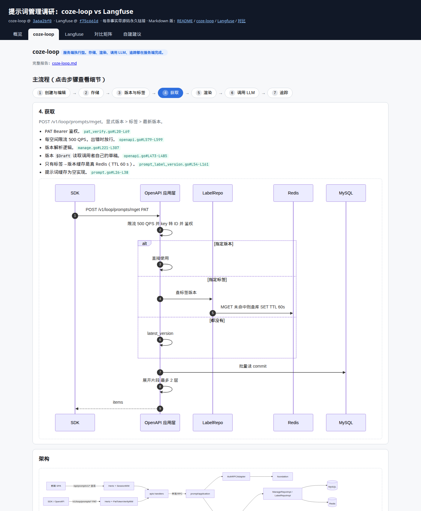

# 提示词管理调研：coze-loop vs Langfuse

本目录对比两个开源 LLM 平台的提示词管理实现。范围：创建 → 存储 → 获取 → 发送给 LLM，以及数据模型、模板、版本与标签、缓存、风险。

## 文件索引

| 文件 | 内容 |
|---|---|
| [index.html](index.html) | 交互页面：按系统分页签、可点击的流程步骤、对比矩阵、Mermaid 图。单文件，无构建步骤 |
| [coze-loop.md](coze-loop.md) | coze-loop 详细报告 |
| [langfuse.md](langfuse.md) | Langfuse 详细报告 |
| [comparison.md](comparison.md) | 横向对比矩阵 + 自建提示词库建议 |
| [assets/report-screenshot.png](assets/report-screenshot.png) | 交互页面截图 |

## 源码版本

| 系统 | 仓库 | 提交 |
|---|---|---|
| coze-loop | [wzqwtt/coze-loop](https://github.com/wzqwtt/coze-loop) | [`3a6a2bf0`](https://github.com/wzqwtt/coze-loop/tree/3a6a2bf07b057fec0c702e514e8345fb5684e83a) |
| Langfuse | [wzqwtt/langfuse](https://github.com/wzqwtt/langfuse) | [`f75c661d`](https://github.com/wzqwtt/langfuse/tree/f75c661dbe8c6b85523c81486b39e8403ac2c141) |

所有源码链接都是固定提交的永久链接。

## 结论速览

| 维度 | coze-loop | Langfuse |
|---|---|---|
| 定位 | 服务端执行型：存储、渲染、调用 LLM 一体 | 注册中心型：存储与分发，客户端渲染 |
| 编辑 | 每用户私有草稿 → 提交 | 每次保存即新版本 |
| 版本号 | 用户指定 semver | 系统自增整数 |
| 默认读取 | 最新版本 | `production` 标签 |
| 模板 | normal / jinja2 / go_template | 正则 `{{var}}` + placeholder |
| 组合 | 片段，按 ID + 版本，2 层 | 依赖，按名字 + 版本或标签，5 层 |
| 服务端缓存 | 仅标签→版本（60 s） | 已解析提示词（1 h），epoch 失效 |
| 主要风险 | 跨空间标签修改、标签缓存漏失效、密钥落库 | 项目级缓存冷启动、删除非原子、获取不限流 |

详细对比与建议见 [comparison.md](comparison.md)。

## 本地查看交互页面

- 直接用浏览器打开 `prompt/index.html`。
- 或运行 `python3 -m http.server`，访问 `http://localhost:8000/prompt/`。
- 开启 GitHub Pages（master 分支根目录）后，访问 `/prompt/`。
- Mermaid 从 jsDelivr CDN 加载，需要联网。

## 写作约定

- 正文采用简化技术中文（参考 ASD-STE100）：短句、一句一个意思、主动语态、术语一致、多用列表。
- 每条事实都附源码永久链接。推断性内容单独标注。
