# 五种经典架构模式深讲：分层、事件驱动、微内核、微服务、基于空间

这份文档对应 Mark Richards 的《软件架构模式》（*Software Architecture Patterns*）里的五种模式，以及 Richards 和 Neal Ford 在《软件架构：架构模式、特征及实践指南》（*Fundamentals of Software Architecture*）里对它们的扩展讲法。

[七种常见软件架构风格](architecture-styles.md) 已经从“我该选哪个”的角度讲过分层、事件驱动、微内核和服务化。这份文档不重复那些结论，而是往下挖一层：

- 书里给每种模式起的**专门名词**是什么意思（封闭层、事件中介者、插件注册表、处理单元、数据泵……）。
- 每种模式的**内部结构**和**一次请求怎么流动**。
- 书对每种模式的**定性评分**。
- 每种模式和**插件化**是什么关系——你最终要判断的是“我的应用要不要插件化”。

另外，前一篇完全没讲的**基于空间的架构（Space-Based）**，这里会完整展开。

先看五种模式各自想解决的那个“最初的痛”：

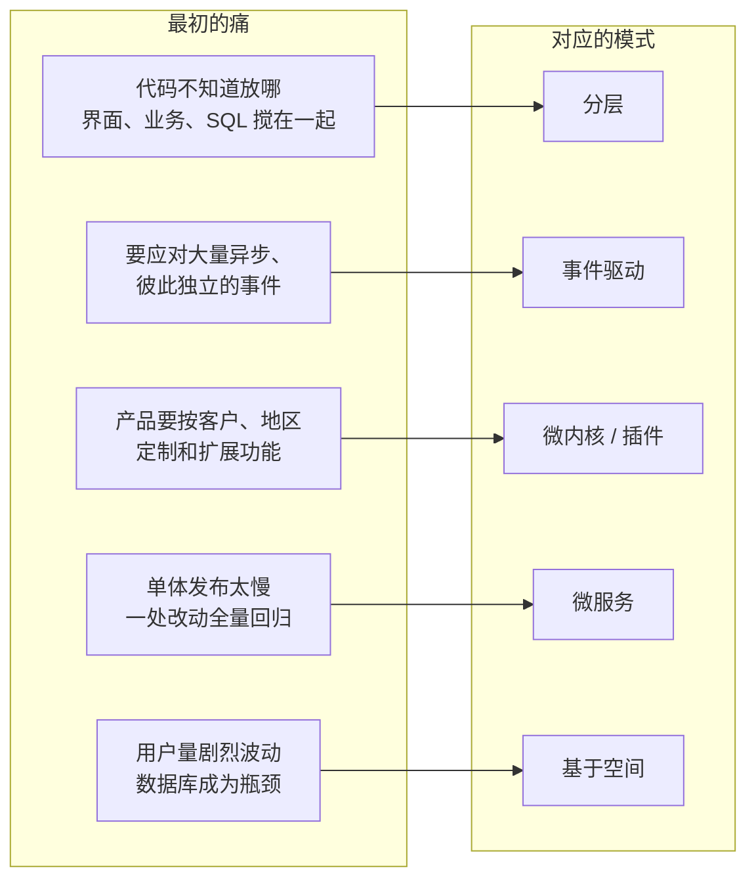
```mermaid
flowchart LR
  subgraph PAIN["最初的痛"]
    P1["代码不知道放哪<br/>界面、业务、SQL 搅在一起"]
    P2["要应对大量异步、<br/>彼此独立的事件"]
    P3["产品要按客户、地区<br/>定制和扩展功能"]
    P4["单体发布太慢<br/>一处改动全量回归"]
    P5["用户量剧烈波动<br/>数据库成为瓶颈"]
  end
  subgraph PAT["对应的模式"]
    A1["分层"]
    A2["事件驱动"]
    A3["微内核 / 插件"]
    A4["微服务"]
    A5["基于空间"]
  end
  P1 --> A1
  P2 --> A2
  P3 --> A3
  P4 --> A4
  P5 --> A5
```

再看它们的“形状”：前三种既可以是单体也可以是分布式，后两种天生是分布式。

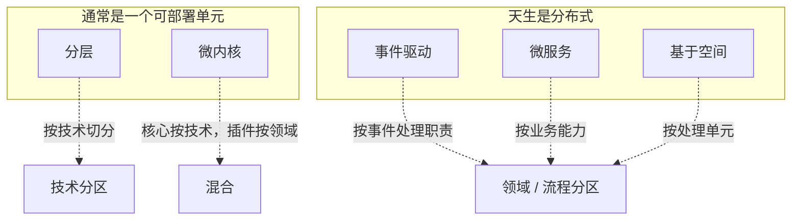
```mermaid
flowchart TB
  subgraph MONO["通常是一个可部署单元"]
    L["分层"]
    K["微内核"]
  end
  subgraph DIST["天生是分布式"]
    E["事件驱动"]
    M["微服务"]
    S["基于空间"]
  end
  L -.->|"按技术切分"| TP["技术分区"]
  K -.->|"核心按技术，插件按领域"| MIX["混合"]
  E -.->|"按事件处理职责"| DP["领域 / 流程分区"]
  M -.->|"按业务能力"| DP
  S -.->|"按处理单元"| DP
```

*Fundamentals* 特别强调“技术分区”和“领域分区”的区别：分层是按技术角色（界面、业务、持久化）横着切；微服务是按业务能力（订单、库存）竖着切。这一区别会贯穿全文。

---

## 1. 分层架构（Layered Architecture）

### 1.1 核心思想与它要解决的问题

分层是绝大多数单体应用的默认起点。它要解决的问题很朴素：**代码按什么规则摆放**。把系统按技术职责切成几个水平层，每层只负责一类事情，层与层之间按固定方向调用。

它之所以流行，一个重要原因是**组织结构**：很多公司本来就分成前端组、后端组、DBA 组，分层恰好和这种分工对齐（这是康威定律的一个直接体现）。

### 1.2 组件与拓扑

书中最典型的是四层：表现层、业务层、持久层、数据库层。层的数量不是固定的，小系统可能把业务和持久合在一起，大系统可能多出一个“服务层”放公共业务组件。

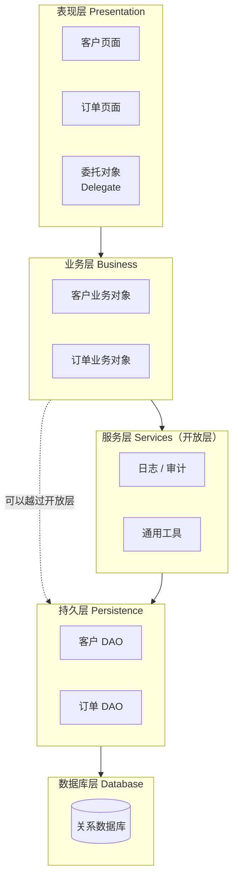
```mermaid
flowchart TB
  subgraph PL["表现层 Presentation"]
    direction LR
    PC1["客户页面"]
    PC2["订单页面"]
    PC3["委托对象<br/>Delegate"]
  end
  subgraph BL["业务层 Business"]
    direction LR
    BC1["客户业务对象"]
    BC2["订单业务对象"]
  end
  subgraph SL["服务层 Services（开放层）"]
    direction LR
    SC1["日志 / 审计"]
    SC2["通用工具"]
  end
  subgraph PSL["持久层 Persistence"]
    direction LR
    DAO1["客户 DAO"]
    DAO2["订单 DAO"]
  end
  subgraph DBL["数据库层 Database"]
    DB[("关系数据库")]
  end
  PL --> BL
  BL --> SL
  BL -.->|"可以越过开放层"| PSL
  SL --> PSL
  PSL --> DBL
```

每一层内部有若干**组件**，同一层的组件职责类型相同。层的意义在于：**某层的组件只处理属于这一层的逻辑**。业务层不关心页面怎么画，也不关心 SQL 怎么写。

### 1.3 关键概念

#### 封闭层与开放层

书里给每一层一个属性：**封闭（closed）** 或 **开放（open）**。

- **封闭层**：请求从上往下走时，**必须经过**这一层，不能跳过。
- **开放层**：请求**可以绕过**这一层，直接到下一层。

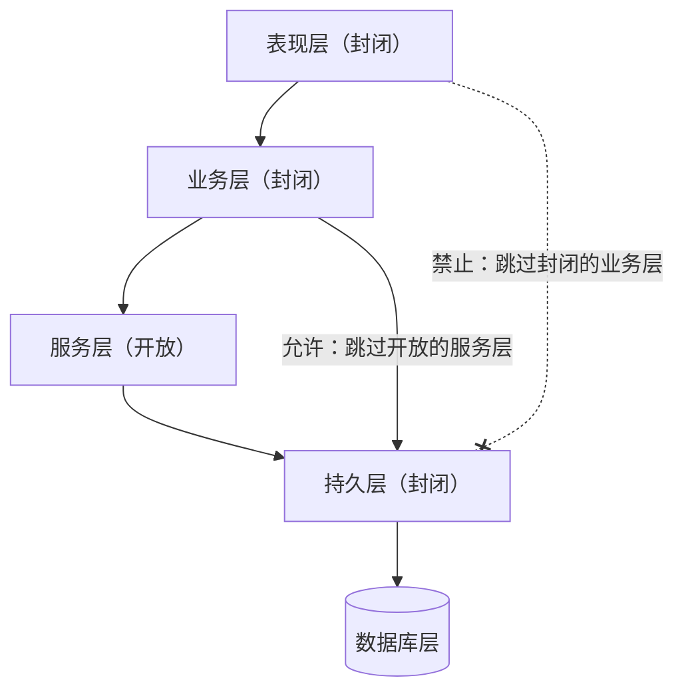
```mermaid
flowchart TB
  P["表现层（封闭）"] --> B["业务层（封闭）"]
  B --> S["服务层（开放）"]
  S --> D["持久层（封闭）"]
  B -->|"允许：跳过开放的服务层"| D
  P -. "禁止：跳过封闭的业务层" .-x D
  D --> DB[("数据库层")]
```

默认情况下，所有层都应该是封闭的。为什么要“多走一步”？因为下一个概念。

#### 隔离层（Layers of Isolation）

封闭层带来的好处叫**隔离层**：某一层的改动，一般不会影响其他层，只要层之间的接口（约定）不变。

举例：持久层把 SQL 换成 ORM。如果表现层可以直接调用持久层，表现层也得跟着改；如果持久层上面有一个封闭的业务层，那么改动就止于业务层，表现层完全不知道。

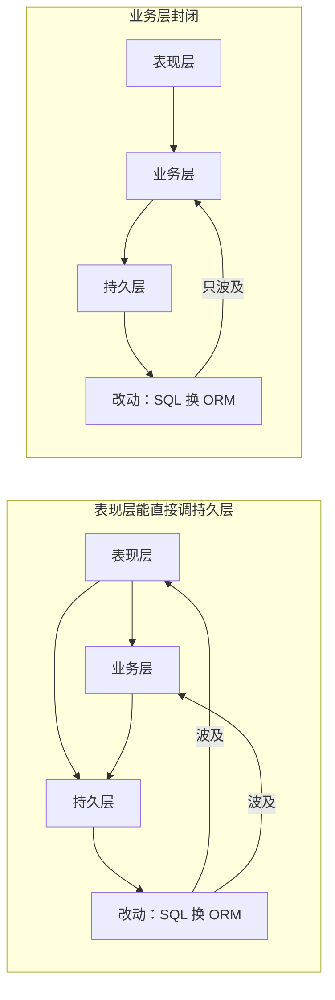
```mermaid
flowchart LR
  subgraph OPEN["表现层能直接调持久层"]
    direction TB
    OP["表现层"] --> OB["业务层"]
    OP --> OD["持久层"]
    OB --> OD
    OD --> OX["改动：SQL 换 ORM"]
    OX -->|"波及"| OP
    OX -->|"波及"| OB
  end
  subgraph CLOSED["业务层封闭"]
    direction TB
    CP["表现层"] --> CB["业务层"]
    CB --> CD["持久层"]
    CD --> CX["改动：SQL 换 ORM"]
    CX -->|"只波及"| CB
  end
```

#### 为什么需要开放层

如果所有层都封闭，“公共业务组件”放哪？比如日期工具、审计日志。放在业务层，表现层能用但持久层用不了（持久层不能往上调）；单独放一层又必须被每个请求经过，很浪费。书的解法：**加一个开放的服务层**，业务层可以用它，也可以绕过它。

关键是：开放还是封闭，**要在架构里写清楚并沟通到位**，不然每个开发者会按自己的理解跳层，隔离层就形同虚设。

#### 架构污水池反模式（Architecture Sinkhole）

**污水池**指的是：请求穿过每一层，每一层什么也不做，只是原样转发。比如“查一个客户的名字”，表现层调业务层，业务层原样调持久层，持久层发一条 `SELECT`，然后原路返回。

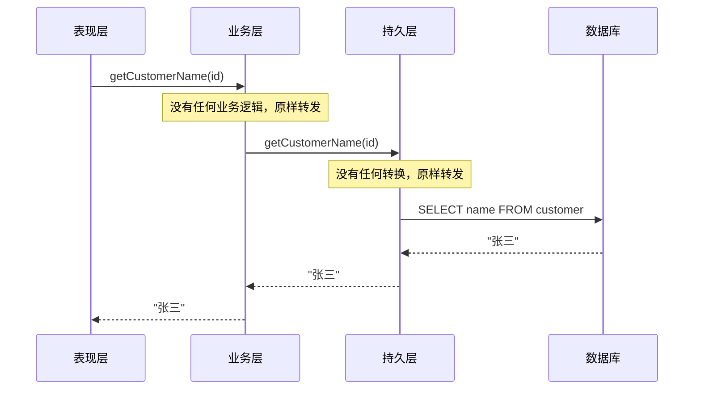
```mermaid
sequenceDiagram
  participant P as 表现层
  participant B as 业务层
  participant D as 持久层
  participant DB as 数据库
  P->>B: getCustomerName(id)
  Note over B: 没有任何业务逻辑，原样转发
  B->>D: getCustomerName(id)
  Note over D: 没有任何转换，原样转发
  D->>DB: SELECT name FROM customer
  DB-->>D: "张三"
  D-->>B: "张三"
  B-->>P: "张三"
```

每个分层系统都会有一些这样的请求，这本身不是问题。书给了一个经验法则：**大约 80/20**。如果约 20% 的请求是“穿透式”的，属于正常；如果大部分请求都是这样，说明分层不适合这个问题，或者应该把一部分层改成开放的。

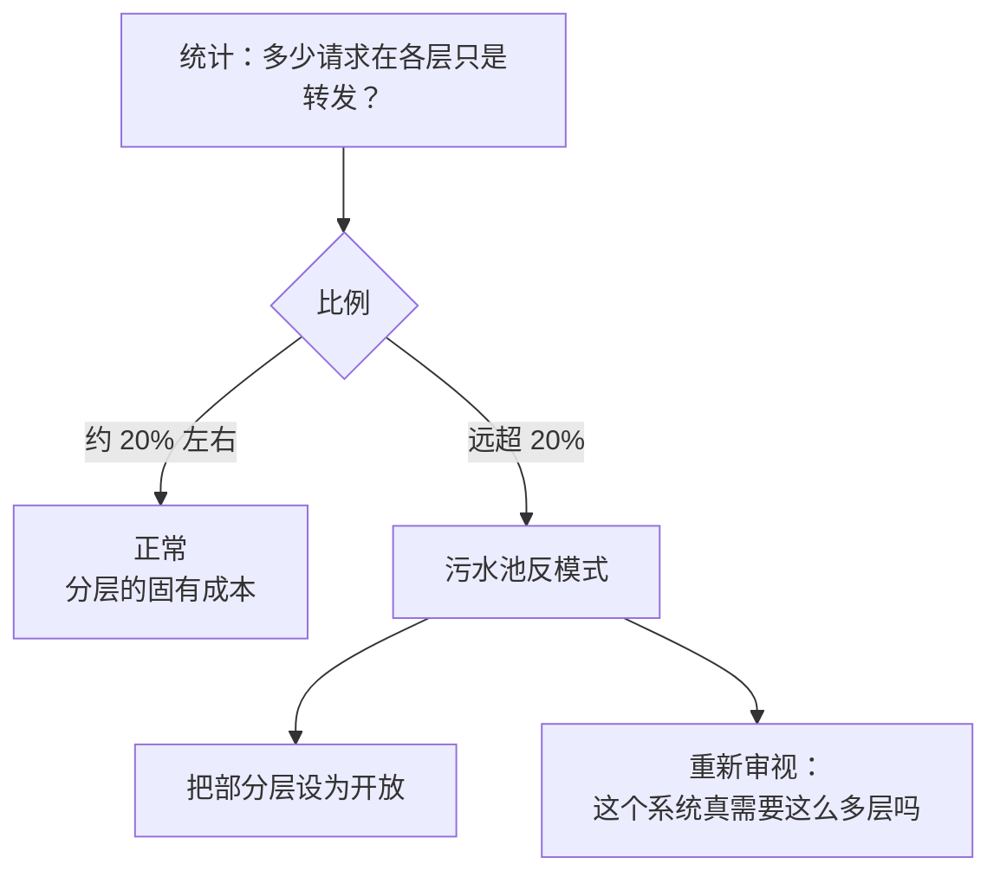
```mermaid
flowchart TD
  Q["统计：多少请求在各层只是转发？"] --> R{"比例"}
  R -->|"约 20% 左右"| OK["正常<br/>分层的固有成本"]
  R -->|"远超 20%"| BAD["污水池反模式"]
  BAD --> F1["把部分层设为开放"]
  BAD --> F2["重新审视：<br/>这个系统真需要这么多层吗"]
```

### 1.4 一次请求怎么流动

以书里的经典例子为原型：查询客户信息和他的订单。这次业务层确实做了事情——把两份数据合成一个视图。

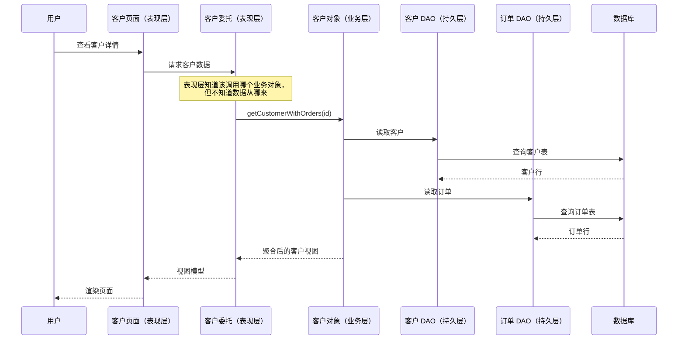
```mermaid
sequenceDiagram
  participant U as 用户
  participant S as 客户页面（表现层）
  participant DG as 客户委托（表现层）
  participant CO as 客户对象（业务层）
  participant CD as 客户 DAO（持久层）
  participant OD as 订单 DAO（持久层）
  participant DB as 数据库
  U->>S: 查看客户详情
  S->>DG: 请求客户数据
  Note over DG: 表现层知道该调用哪个业务对象，<br/>但不知道数据从哪来
  DG->>CO: getCustomerWithOrders(id)
  CO->>CD: 读取客户
  CD->>DB: 查询客户表
  DB-->>CD: 客户行
  CO->>OD: 读取订单
  OD->>DB: 查询订单表
  DB-->>OD: 订单行
  CO-->>DG: 聚合后的客户视图
  DG-->>S: 视图模型
  S-->>U: 渲染页面
```

### 1.5 取舍：适合与不适合

**适合：**

- 新项目不知道选什么时，先用分层，后续再演进。
- 团队按技术角色分工，规模不大，预算和时间有限。
- 业务以 CRUD 为主。

**不适合：**

- 需求变化通常是**纵向的**。加一个“发票”功能，要同时动表现层、业务层、持久层——一次领域改动穿过所有层，这正是技术分区的弱点。
- 需要高扩展性或高弹性：整个应用是一个部署单元，要扩就整体扩。
- 代码量增长后，分层单体很容易滑向“大泥球”。

### 1.6 书中评分

《软件架构模式》（2015 版）给出的是“高 / 低”二值定性评价，不是量化指标：

| 维度 | 评价 | 理由（概括） |
| --- | --- | --- |
| 整体敏捷性 | 低 | 整体是单体，组件在层之间紧耦合，改动需要全量发布 |
| 易部署性 | 低 | 一处小改动也要重新部署整个应用 |
| 可测试性 | 高 | 可以 mock 下层，单独测试某一层 |
| 性能 | 低 | 每个请求都要穿过多层，开销累积 |
| 可扩展性（伸缩） | 低 | 单体，只能整体扩容 |
| 易开发性 | 高 | 模式人人熟悉，和团队分工吻合 |

### 1.7 真实风格的例子

一家保险公司的内部客户管理系统：Spring MVC 写页面（表现层），`@Service` 类写核保规则（业务层），MyBatis 写 DAO（持久层），Oracle 数据库。前端组、后端组、DBA 组各管一层。一个新功能（“客户积分”）通常要三个组一起排期——这就是技术分区在组织上的代价。

### 1.8 和插件化的关系

分层本身**不提供扩展点**。但两点值得记住：

- 插件化系统的**核心**内部，经常就是一个分层结构。
- 如果你的“扩展需求”其实是“换一种存储”“换一种渲染”，那属于层内替换，用接口 + 依赖注入就够了，不需要插件化（详见 [七种常见软件架构风格](architecture-styles.md) 中“端口与适配器”一节）。

---

## 2. 事件驱动架构（Event-Driven Architecture）

### 2.1 核心思想与它要解决的问题

事件驱动是一种**分布式、异步**的架构模式。它把系统拆成一批**单一用途的事件处理组件**，它们异步地接收事件、处理事件，必要时再产出新的事件。

它要解决的问题是：系统要应对大量**彼此独立、异步发生**的事情（下单、支付、发货、库存变化……），而且需要**高伸缩**、**高响应**。如果用同步调用把这些步骤串起来，最慢的那一步决定整体响应时间，任何一步挂掉都会让整条链失败。

书里的事件驱动有两种**拓扑**：**中介者拓扑**和**代理（Broker）拓扑**。两者的区别是：有没有一个“总指挥”。

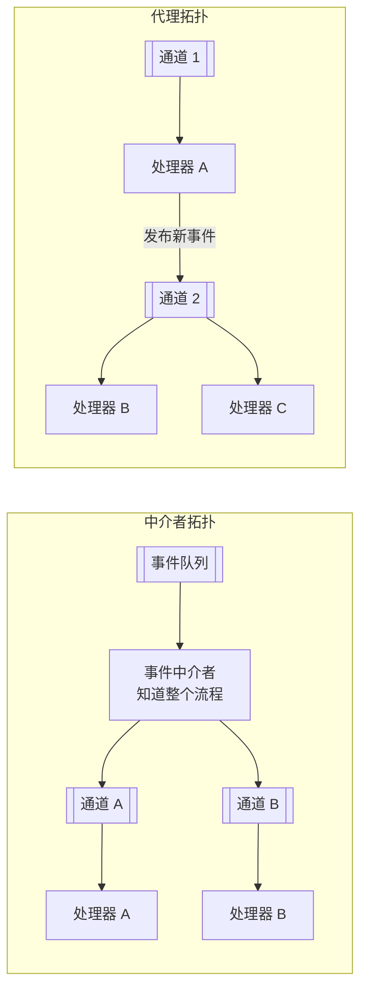
```mermaid
flowchart LR
  subgraph MED["中介者拓扑"]
    direction TB
    MQ[["事件队列"]] --> MM["事件中介者<br/>知道整个流程"]
    MM --> MC1[["通道 A"]] --> MP1["处理器 A"]
    MM --> MC2[["通道 B"]] --> MP2["处理器 B"]
  end
  subgraph BRK["代理拓扑"]
    direction TB
    BC1[["通道 1"]] --> BP1["处理器 A"]
    BP1 -->|"发布新事件"| BC2[["通道 2"]]
    BC2 --> BP2["处理器 B"]
    BC2 --> BP3["处理器 C"]
  end
```

### 2.2 中介者拓扑（Mediator Topology）

#### 组件

中介者拓扑由四类组件组成：

| 组件 | 职责 |
| --- | --- |
| **事件队列（event queue）** | 接收客户端发来的**初始事件**，交给中介者 |
| **事件中介者（event mediator）** | 知道一个初始事件需要哪些步骤，按顺序或并行地把**处理事件**派发出去。它只负责编排，不做业务逻辑 |
| **事件通道（event channel）** | 中介者和处理器之间的异步管道，通常是消息队列或主题 |
| **事件处理器（event processor）** | 包含真正的业务逻辑，每个处理器只做一件事，彼此独立 |

这里有两个容易混的名词：

- **初始事件（initial event）**：外部发进来的那个事件，比如“客户搬家了”。
- **处理事件（processing event）**：中介者为完成初始事件而派生出的一个个步骤事件，比如“改地址”“重算保费”“更新理赔记录”。

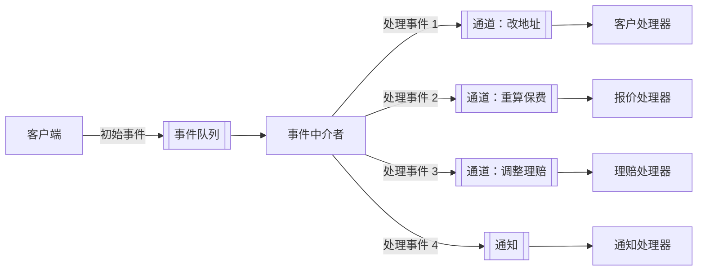
```mermaid
flowchart LR
  CLIENT["客户端"] -->|"初始事件"| EQ[["事件队列"]]
  EQ --> MED["事件中介者"]
  MED -->|"处理事件 1"| CH1[["通道：改地址"]]
  MED -->|"处理事件 2"| CH2[["通道：重算保费"]]
  MED -->|"处理事件 3"| CH3[["通道：调整理赔"]]
  MED -->|"处理事件 4"| CH4[["通知"]]
  CH1 --> EP1["客户处理器"]
  CH2 --> EP2["报价处理器"]
  CH3 --> EP3["理赔处理器"]
  CH4 --> EP4["通知处理器"]
```

事件中介者的实现可以很简单（自己写一段编排代码、Apache Camel 这类集成框架），也可以很重（BPEL 引擎、BPM 流程引擎）。*Fundamentals* 建议按事件的复杂程度分级：简单事件走轻量中介者，复杂、需要人工介入的走 BPM 类中介者。

#### 一次事件怎么流动

“客户搬家”这一初始事件：步骤 1 必须先做，步骤 2、3 可以并行，最后发通知。

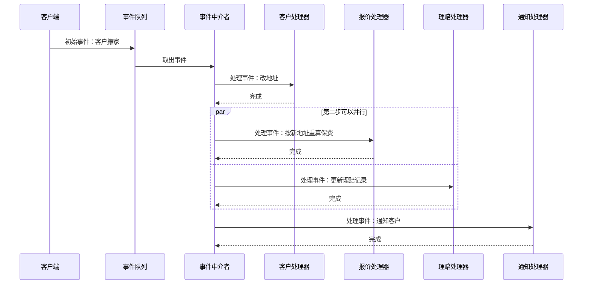
```mermaid
sequenceDiagram
  participant C as 客户端
  participant Q as 事件队列
  participant M as 事件中介者
  participant A as 客户处理器
  participant R as 报价处理器
  participant L as 理赔处理器
  participant N as 通知处理器
  C->>Q: 初始事件：客户搬家
  Q->>M: 取出事件
  M->>A: 处理事件：改地址
  A-->>M: 完成
  par 第二步可以并行
    M->>R: 处理事件：按新地址重算保费
    R-->>M: 完成
  and
    M->>L: 处理事件：更新理赔记录
    L-->>M: 完成
  end
  M->>N: 处理事件：通知客户
  N-->>M: 完成
```

中介者知道“整个故事”，所以出错时它能决定重试、补偿还是报警。这是中介者拓扑最大的优势，也是它的瓶颈：中介者本身要高可用，而且流程一多，它就变成一个“什么都知道”的中心。

### 2.3 代理拓扑（Broker Topology）

代理拓扑**没有中央中介者**。消息流沿着一条“链”分布在各个处理器之间：每个处理器处理完一个事件后，**发布一个新事件**说明自己做了什么，谁关心谁订阅。

组件只有两类：

- **代理（broker）**：一组事件通道，可以是一个消息中间件集群，也可以是多个独立的通道。
- **事件处理器**：处理事件，并发布新事件。

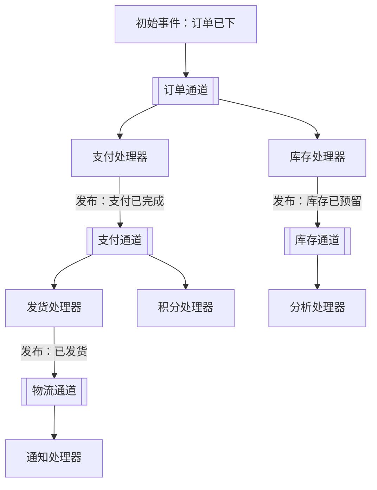
```mermaid
flowchart TB
  START["初始事件：订单已下"] --> C1[["订单通道"]]
  C1 --> INV["库存处理器"]
  C1 --> PAY["支付处理器"]
  INV -->|"发布：库存已预留"| C2[["库存通道"]]
  PAY -->|"发布：支付已完成"| C3[["支付通道"]]
  C3 --> SHIP["发货处理器"]
  C3 --> PTS["积分处理器"]
  SHIP -->|"发布：已发货"| C4[["物流通道"]]
  C4 --> NOTI["通知处理器"]
  C2 --> ANA["分析处理器"]
```

文章的 Figure 2 画的正是这种拓扑：一个事件进入通道，多个处理器订阅，处理器又把新事件放回通道，形成链式反应。

#### 一次事件怎么流动

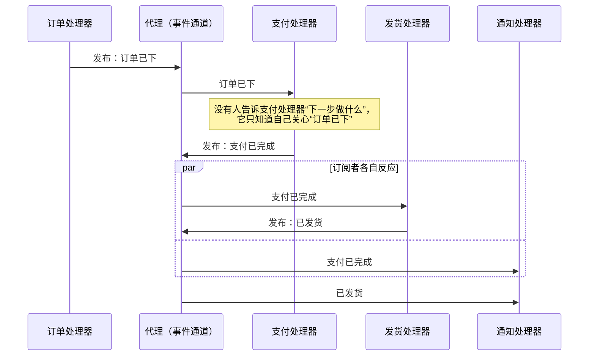
```mermaid
sequenceDiagram
  participant O as 订单处理器
  participant B as 代理（事件通道）
  participant P as 支付处理器
  participant S as 发货处理器
  participant N as 通知处理器
  O->>B: 发布：订单已下
  B->>P: 订单已下
  Note over P: 没有人告诉支付处理器“下一步做什么”，<br/>它只知道自己关心“订单已下”
  P->>B: 发布：支付已完成
  par 订阅者各自反应
    B->>S: 支付已完成
    S->>B: 发布：已发货
  and
    B->>N: 支付已完成
  end
  B->>N: 已发货
```

### 2.4 两种拓扑怎么选

| 维度 | 中介者拓扑 | 代理拓扑 |
| --- | --- | --- |
| 谁知道全流程 | 中介者 | 没有人，流程散在各处理器里 |
| 错误处理 | 中介者能集中处理、重试、补偿 | 难：没有人知道“整件事”是否完成 |
| 耦合 | 处理器之间解耦，但都依赖中介者 | 处理器之间只靠事件名耦合，最松 |
| 伸缩与性能 | 中介者可能成为瓶颈 | 最好，没有中心节点 |
| 可观测性 | 好，状态在中介者里 | 差，需要链路追踪 |
| 适合 | 步骤有顺序、需要编排和错误恢复的流程 | 简单的事件链，追求吞吐与扩展 |

一句话：**中介者拓扑是编排（orchestration），代理拓扑是协同（choreography）**。

### 2.5 关键考虑

- **异步带来的一致性问题**：处理器各自提交，没有跨处理器的事务。一个步骤失败，其他步骤可能已经完成。书里明确提醒：如果一个业务单元需要原子性事务，**不要把它拆到多个处理器里**。
- **契约**：事件的结构（字段、版本）就是处理器之间的契约，要像 API 一样管理。
- **数据丢失**：*Fundamentals* 提到三处可能丢消息——发布时、处理器取出后处理前、处理器写库前。对策是持久化队列、客户端确认（client acknowledge）、最后参与者支持（last participant support）。
- **错误处理**：*Fundamentals* 介绍了“工作流事件模式”（workflow event pattern）：处理器出错时不阻塞，把出错事件交给一个工作流处理器修复后重新提交。
- **请求-响应**：有些场景需要同步结果（比如查余额），可以用“回复队列 + 关联 id”在事件系统上模拟，但不要把整个系统都这么做。

### 2.6 适合与不适合

**适合：** 高并发、事件彼此独立的系统；需要高伸缩和高响应；有大量“一件事发生后，好几处要各自反应”的场景。

**不适合：** 强一致、需要立即得到结果的流程；团队还没准备好处理异步调试、重复投递和最终一致。

### 2.7 书中评分

| 维度 | 评价 | 理由（概括） |
| --- | --- | --- |
| 整体敏捷性 | 高 | 处理器彼此解耦，改动通常只影响一个处理器 |
| 易部署性 | 高 | 处理器解耦，可以单独部署；中介者拓扑稍难，因为处理器和中介者有关联 |
| 可测试性 | 低 | 异步，需要专门工具产生事件，单测和集成测试都更复杂 |
| 性能 | 高 | 异步、并行处理，消息队列本身的开销被并行抵消 |
| 可扩展性（伸缩） | 高 | 每个处理器可以独立扩容 |
| 易开发性 | 低 | 异步编程、契约管理、错误处理都更复杂 |

### 2.8 真实风格的例子

**中介者：** 保险公司“客户搬家”流程，要依次改地址、重算保费、调整理赔、发通知，失败要补偿——用一个流程引擎做中介者。

**代理：** 电商下单之后，库存、支付、积分、推荐、搜索、数据分析各自订阅订单事件。新增一个“发优惠券”，只需新增一个订阅者（Kafka 主题 + 消费组是这种拓扑最常见的实现）。

### 2.9 和插件化的关系

代理拓扑和插件化有一个共同点：**新增功能 = 新增一个订阅者**，发布者不用改。所以事件是插件最常用的**接入方式**之一（VS Code 的 `onDidSaveTextDocument`，WordPress 的 `add_action`）。

差别在于：事件驱动架构里的处理器通常是**独立部署的进程**，由你自己的团队写；插件化里的插件通常**在宿主里运行**，可能由第三方写，还需要安装、加载、版本兼容这一整套机制。把进程内的事件总线当作扩展点，是插件化的一种设计；把整个系统做成事件驱动架构，是另一回事。

---

## 3. 微内核架构（Microkernel / Plug-in Architecture）

### 3.1 核心思想与它要解决的问题

微内核也叫**插件架构**。它把应用分成两类组件：**核心系统（core system）** 和 **插件模块（plug-in modules）**。核心提供最小的运行机制，具体功能、定制逻辑、特殊处理都放在插件里。

它最初针对的是**产品型软件**：要打包、下载、安装到客户那里的软件，比如 IDE、浏览器、报税软件。这类软件面对的问题是：不同客户、不同地区、不同时间要不同的功能组合，而你不想为每个客户维护一套分支。书里也指出它适用于**有大量定制规则的业务应用**，比如按地区不同的保险理赔规则。

文章用浏览器做例子：浏览器是核心系统，扩展是插件。文章的 Figure 3 只画了“一个核心 + 周围一圈插件”；下面把书里提到的内部部件也画出来。

### 3.2 组件与拓扑

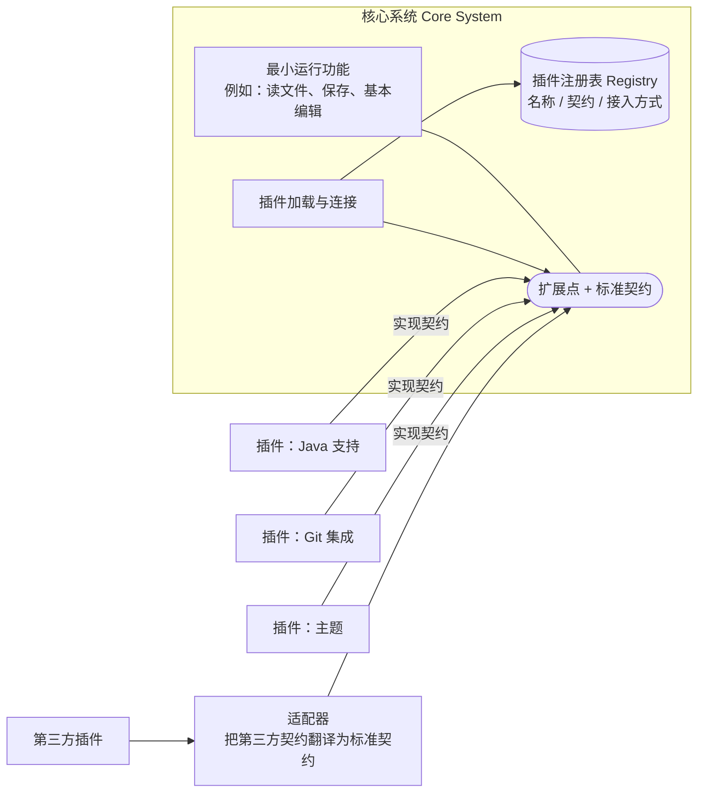
```mermaid
flowchart LR
  subgraph CORE["核心系统 Core System"]
    direction TB
    BASE["最小运行功能<br/>例如：读文件、保存、基本编辑"]
    REG[("插件注册表 Registry<br/>名称 / 契约 / 接入方式")]
    LOADER["插件加载与连接"]
    EXT(["扩展点 + 标准契约"])
    BASE --- EXT
    LOADER --> REG
    LOADER --> EXT
  end
  P1["插件：Java 支持"] -->|"实现契约"| EXT
  P2["插件：Git 集成"] -->|"实现契约"| EXT
  P3["插件：主题"] -->|"实现契约"| EXT
  P4["第三方插件"] --> ADP["适配器<br/>把第三方契约翻译为标准契约"]
  ADP --> EXT
```

#### 核心系统

核心系统包含让系统**运转起来的最少功能**。*Fundamentals* 给了另一种说法：核心是系统的**“快乐路径”（happy path）**——没有任何定制时的通用处理流程。比如保险理赔：核心只做“接收理赔 → 校验 → 计算 → 出结果”这条通用流程，每个地区不同的规则都在插件里。

核心系统内部可以是分层的，也可以是模块化的，这不影响整体是“微内核”。

#### 插件模块

插件是**独立的组件**，提供额外功能、定制处理或特殊规则。书里强调一点：**插件之间应该互相独立**，插件 A 不应该依赖插件 B。插件之间出现依赖，就会带来加载顺序、版本组合的问题，复杂度会急剧上升。

### 3.3 关键概念

#### 插件注册表（Registry）

核心系统需要知道：**有哪些插件可用，以及怎么找到它们**。这就是注册表。书里描述的注册表条目包含：

- 插件的**名称**
- 插件的**数据契约**（输入和输出的结构）
- **远程访问协议细节**（如果插件通过网络连接）

注册表的实现可以很简单：一个内部的 `Map`（键是插件名，值是插件引用），也可以是一个服务注册中心、ZooKeeper 之类的外部组件。

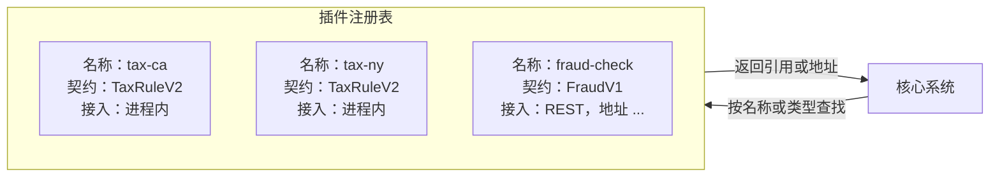
```mermaid
flowchart LR
  subgraph REGISTRY["插件注册表"]
    direction TB
    R1["名称：tax-ca<br/>契约：TaxRuleV2<br/>接入：进程内"]
    R2["名称：tax-ny<br/>契约：TaxRuleV2<br/>接入：进程内"]
    R3["名称：fraud-check<br/>契约：FraudV1<br/>接入：REST，地址 ..."]
  end
  CORE["核心系统"] -->|"按名称或类型查找"| REGISTRY
  REGISTRY -->|"返回引用或地址"| CORE
```

#### 契约（Contracts）

核心和插件之间的约定叫**契约**，规定行为、输入数据和输出数据。书里提到契约的三种常见形式：XML 文档、Java 对象，或者其他数据结构（今天更常见的是 JSON 或接口定义）。

- **标准契约**：最常见的做法是核心定义一个通用契约，所有插件都实现它。
- **适配器**：第三方插件的契约和你的标准不一致时，在中间加一个适配器做翻译，核心不需要为每个插件写特殊代码。

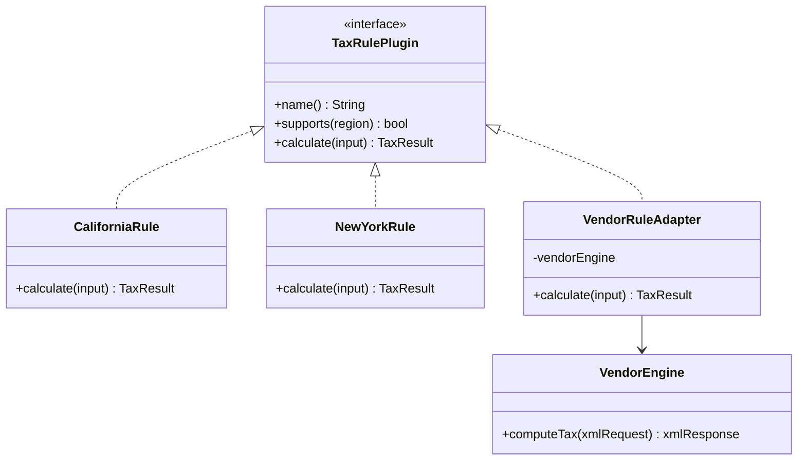
```mermaid
classDiagram
  class TaxRulePlugin {
    <<interface>>
    +name() String
    +supports(region) bool
    +calculate(input) TaxResult
  }
  class CaliforniaRule {
    +calculate(input) TaxResult
  }
  class NewYorkRule {
    +calculate(input) TaxResult
  }
  class VendorRuleAdapter {
    -vendorEngine
    +calculate(input) TaxResult
  }
  class VendorEngine {
    +computeTax(xmlRequest) xmlResponse
  }
  TaxRulePlugin <|.. CaliforniaRule
  TaxRulePlugin <|.. NewYorkRule
  TaxRulePlugin <|.. VendorRuleAdapter
  VendorRuleAdapter --> VendorEngine
```

#### 插件的连接方式

插件怎么接到核心上，书里列了几种：OSGi、消息、Web 服务，或者直接的对象实例化（点对点）。*Fundamentals* 把它归纳成两类：

- **点对点（进程内）**：插件和核心在同一个进程，核心直接调用插件的方法或构造插件对象。最快，但插件出错会拖垮核心。
- **远程**：插件是独立服务，通过 REST 或消息与核心通信。隔离好、插件可以独立伸缩，但多了网络调用，整体变成分布式系统。

另外还有一个正交维度：**编译期插件**还是**运行期插件**。编译期插件改动需要重新构建整个应用；运行期插件可以在不重新部署核心的情况下增删（OSGi、Jigsaw、Java 的 `ServiceLoader`、动态库、脚本包）。

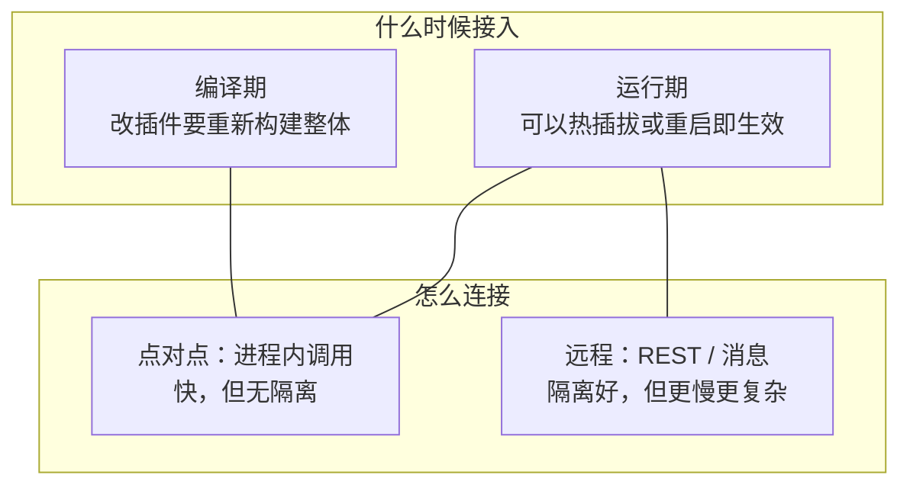
```mermaid
flowchart TB
  subgraph WHEN["什么时候接入"]
    CT["编译期<br/>改插件要重新构建整体"]
    RT["运行期<br/>可以热插拔或重启即生效"]
  end
  subgraph HOW["怎么连接"]
    PP["点对点：进程内调用<br/>快，但无隔离"]
    RM["远程：REST / 消息<br/>隔离好，但更慢更复杂"]
  end
  CT --- PP
  RT --- PP
  RT --- RM
```

#### 插件也可以有自己的数据

*Fundamentals* 建议：插件一般**不直接访问核心的共享数据库**。插件需要的数据由核心通过契约传进去；插件如果需要自己的数据，就自带一个小存储（比如嵌入式数据库、规则文件）。这样插件和核心的数据模型不会缠在一起。

### 3.4 一次请求怎么流动

以保险理赔为例：核心跑通用流程，在“规则计算”这一步按地区找插件。

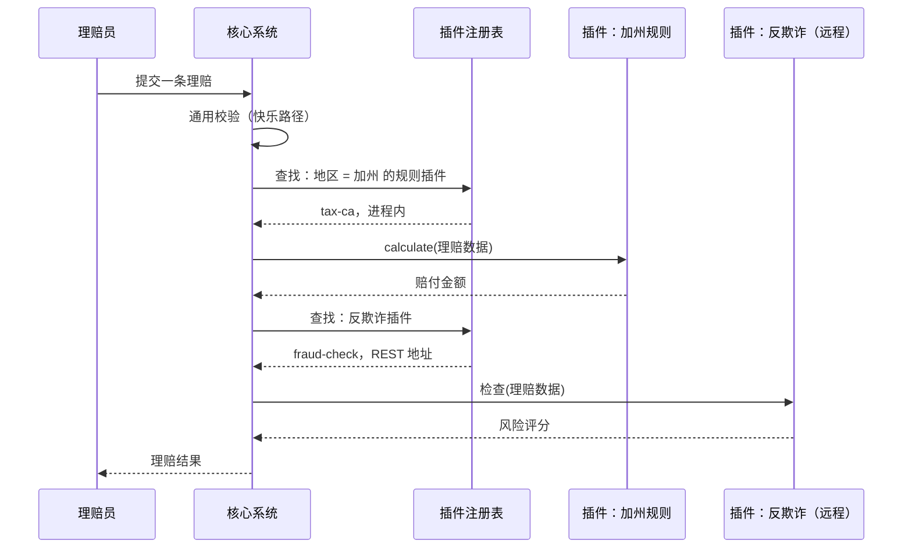
```mermaid
sequenceDiagram
  participant U as 理赔员
  participant C as 核心系统
  participant R as 插件注册表
  participant CA as 插件：加州规则
  participant F as 插件：反欺诈（远程）
  U->>C: 提交一条理赔
  C->>C: 通用校验（快乐路径）
  C->>R: 查找：地区 = 加州 的规则插件
  R-->>C: tax-ca，进程内
  C->>CA: calculate(理赔数据)
  CA-->>C: 赔付金额
  C->>R: 查找：反欺诈插件
  R-->>C: fraud-check，REST 地址
  C->>F: 检查(理赔数据)
  F-->>C: 风险评分
  C-->>U: 理赔结果
```

注意核心代码里**没有任何 `if 地区 == 加州`**。新增一个地区，只需新增一个插件并登记到注册表。

### 3.5 取舍：适合与不适合

**适合：**

- 产品型软件，需要按客户、地区、版本组合功能。
- 业务规则多、按维度变化（地区、行业、客户等级），且规则之间相互独立。
- 需要第三方或其他团队在不改核心的前提下扩展。
- 作为演进的起点：后期可以把插件拆成远程服务，逐步走向分布式。

**不适合 / 风险：**

- **核心的契约极难改**。核心一改，所有插件都可能受影响。核心要在开始就设计得足够稳定，这需要前期有较多分析。
- 插件之间如果开始互相依赖，模式就被破坏了。
- 插件太多、太细时，管理（版本、兼容、注册）本身成为负担。
- 单体形态下伸缩能力有限（见评分）。

### 3.6 书中评分

| 维度 | 评价 | 理由（概括） |
| --- | --- | --- |
| 整体敏捷性 | 高 | 改动大多可以隔离在单个插件内，插件可以独立开发 |
| 易部署性 | 高 | 运行期插件可以在不重启核心的情况下加入（取决于实现） |
| 可测试性 | 高 | 插件可以单独测试，也很容易被 mock 掉 |
| 性能 | 高 | 可以只装需要的插件，裁剪掉不用的功能；书里也指出这个模式本身并不“天然”高性能，评价“高”是说通常表现不错 |
| 可扩展性（伸缩） | 低 | 大多数实现是单体，伸缩只能整体进行 |
| 易开发性 | 低 | 需要周到的契约设计和治理，插件机制本身实现复杂 |

> 性能这一项的“高”我有把握，但它是带条件的（书中附了一段说明），不是说微内核天生比其他模式快。

### 3.7 真实风格的例子

- **IDE / 编辑器**：Eclipse 的核心几乎只有一个插件运行时（OSGi），连 Java 编辑功能都是插件；VS Code 的扩展运行在单独的扩展宿主进程里。
- **浏览器**：文章举的例子。
- **报税软件**：核心做通用流程，每个州、每种表格是一个插件。
- **保险理赔**：核心跑通用理赔流程，各地区规则是插件——这是书里反复用的业务应用例子。

### 3.8 和插件化的关系

这就是插件化本身。你要做的决定，基本就是本节的那几个变量：

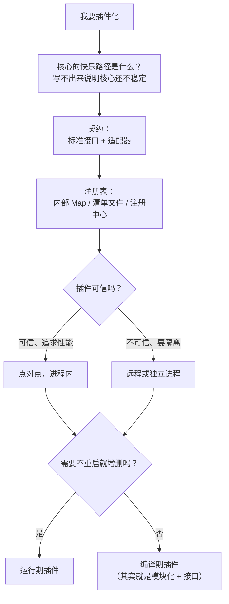
```mermaid
flowchart TD
  START["我要插件化"] --> C1["核心的快乐路径是什么？<br/>写不出来说明核心还不稳定"]
  C1 --> C2["契约：<br/>标准接口 + 适配器"]
  C2 --> C3["注册表：<br/>内部 Map / 清单文件 / 注册中心"]
  C3 --> C4{"插件可信吗？"}
  C4 -->|"可信、追求性能"| C5["点对点，进程内"]
  C4 -->|"不可信、要隔离"| C6["远程或独立进程"]
  C5 --> C7{"需要不重启就增删吗？"}
  C6 --> C7
  C7 -->|"是"| C8["运行期插件"]
  C7 -->|"否"| C9["编译期插件<br/>（其实就是模块化 + 接口）"]
```

如果走到最后是“编译期插件 + 可信 + 只有本团队写”，那你需要的很可能只是**模块化 + 接口**，而不是一个插件平台。[七种常见软件架构风格](architecture-styles.md) 中“微内核 / 插件化”一节列出的三个前提条件，在这里依然适用。

---

## 4. 微服务架构（Microservices Architecture）

### 4.1 核心思想与它要解决的问题

微服务把应用拆成一组**独立部署的服务组件**，每个服务尽量只负责一件事，服务之间通过网络通信。一个服务挂了，其他服务仍能运行（前提是设计了降级）。

书里认为微服务是从两个方向演化出来的：

- **从单体演化**：分层单体发布太慢、一处改动要全量回归，于是把应用按功能切开，各自独立部署。
- **从 SOA 演化**：SOA 太重（企业服务总线、复杂的服务编排、大量的协议转换），微服务是对它的简化。

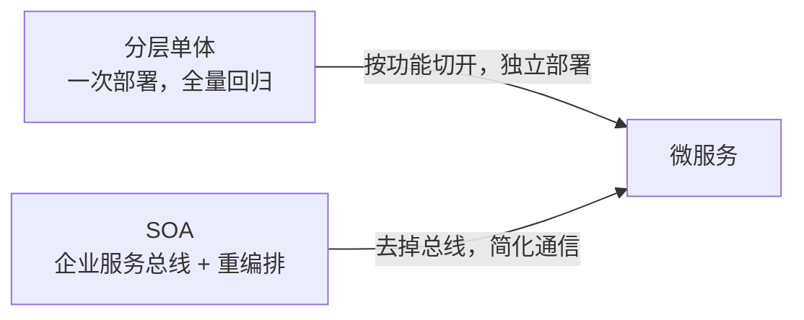
```mermaid
flowchart LR
  MONO["分层单体<br/>一次部署，全量回归"] -->|"按功能切开，独立部署"| MS["微服务"]
  SOA["SOA<br/>企业服务总线 + 重编排"] -->|"去掉总线，简化通信"| MS
```

### 4.2 组件与拓扑

书中微服务的核心概念有三个：

1. **独立部署单元**：每个服务是单独部署的，这让伸缩、隔离、持续交付都容易很多。
2. **服务组件（service component）**：书里特意不用“服务”而用“服务组件”，因为一个服务组件可以包含**一个或多个模块**，粒度可以从一个函数到一大块业务能力。
3. **分布式**：服务组件之间通过远程协议通信（REST、消息、RPC）。

文章 Figure 4 画的就是：客户端请求 → 用户界面层 → 轻量消息代理 → 多个服务组件，每个组件里包含若干模块。

```mermaid
flowchart TB
  CLIENT["客户端请求"] --> UI["用户界面层 / API 层"]
  UI --> ACC["访问层：REST 网关或轻量消息代理"]
  ACC --> S1
  ACC --> S2
  ACC --> S3
  subgraph S1["服务组件：订单"]
    M11["模块：下单"]
    M12["模块：订单查询"]
    D1[("订单数据")]
  end
  subgraph S2["服务组件：库存"]
    M21["模块：库存预留"]
    D2[("库存数据")]
  end
  subgraph S3["服务组件：支付"]
    M31["模块：扣款"]
    M32["模块：退款"]
    D3[("支付数据")]
  end
```

#### 粒度：最难的设计决定

服务组件粒度是微服务里**最难做对的事**：

- **太粗**：一个服务包揽太多，回到单体的问题，部署和测试都不轻松。
- **太细**：一个请求要跨十几个服务，服务之间为了完成一件事频繁互调，需要编排——这其实已经退化成 SOA 或“分布式单体”。

*Fundamentals* 用**限界上下文（bounded context）** 作为边界依据（来自领域驱动设计），并给出几个判断粒度的信号：服务的目的是否单一、是否需要事务、服务之间的通信是否过于频繁（“编舞”太多就该合并）。

```mermaid
flowchart LR
  COARSE["太粗<br/>一个服务一大块业务"] -->|"拆"| RIGHT["合适<br/>一个限界上下文"]
  FINE["太细<br/>一个请求跨十几个服务"] -->|"合"| RIGHT
  RIGHT --> SIG["判断信号：<br/>职责单一 / 不需跨服务事务 /<br/>服务间调用不频繁"]
```

### 4.3 三种拓扑

书里描述了微服务的三种常见拓扑。区别在于**客户端怎么访问服务组件**。

#### API-REST 拓扑

面向网站或公开 API。服务组件很细（通常一两个模块），通过 REST 接口暴露，客户端经由一个 API 层（API 网关）访问。很多云平台的公开 API（文件存储、地图、翻译）就是这种形态。

#### 应用-REST 拓扑

面向传统的业务应用。客户端是有自己界面的 Web 或富客户端应用，通过 REST 调用后端服务组件。和 API-REST 的区别：服务组件粒度更**粗**，每个代表业务应用的一大块功能，适合中小规模、复杂度不高的业务应用。

#### 集中式消息拓扑

不用 REST 直连，而是在客户端和服务组件之间放一个**轻量的集中式消息代理**（如 ActiveMQ、RabbitMQ）。注意它**不是** SOA 的企业服务总线：它不做编排、不做协议转换、不做复杂路由，只负责传递消息。它带来了异步、排队、负载均衡、更好的可靠性，代价是消息代理本身要做集群避免单点。

```mermaid
flowchart TB
  subgraph T1["API-REST 拓扑"]
    direction TB
    C1["网站 / 外部调用方"] --> G1["API 层"]
    G1 --> A1["细粒度服务"]
    G1 --> A2["细粒度服务"]
    G1 --> A3["细粒度服务"]
  end
  subgraph T2["应用-REST 拓扑"]
    direction TB
    C2["业务应用界面"] --> B1["粗粒度服务"]
    C2 --> B2["粗粒度服务"]
  end
  subgraph T3["集中式消息拓扑"]
    direction TB
    C3["客户端"] --> MB[["轻量消息代理"]]
    MB --> M1["服务"]
    MB --> M2["服务"]
    MB --> M3["服务"]
  end
```

| 拓扑 | 客户端 | 服务粒度 | 通信 | 典型场景 |
| --- | --- | --- | --- | --- |
| API-REST | 网站、外部开发者 | 细 | 同步 REST | 公开 API、网站后端 |
| 应用-REST | 有自己界面的业务应用 | 粗 | 同步 REST | 中小型企业应用 |
| 集中式消息 | 业务应用、内部系统 | 中到粗 | 异步消息 | 需要排队、可靠投递的大型业务系统 |

### 4.4 关键概念

#### 避免编排和服务间依赖

这是书里对微服务最重要的告诫之一：**服务组件之间的互相调用越少越好**。服务 A 为了完成请求需要同步调用 B、C、D，那么：

- 延迟叠加，任一服务慢都会拖慢整体。
- 任一服务挂了，A 也失败。
- B 改接口，A 要跟着改，独立部署名存实亡。

书里的建议很具体：

- 如果多个服务都需要同一段通用逻辑（比如格式化、校验），**宁可复制代码**，也不要为它做一个共享服务。这违反 DRY 原则，但换来的是服务间不再耦合。书中把这看作微服务里可以接受的取舍。
- 如果发现无论怎么设计都需要大量服务间调用和编排，那可能说明**这个问题不适合微服务**，应该回到分层单体，或者考虑基于服务的架构（service-based，*Fundamentals* 中的一种更粗粒度的分布式架构）。

```mermaid
flowchart LR
  subgraph BAD["避免：服务间链式调用"]
    direction LR
    BA["订单"] -->|"同步"| BB["库存"]
    BB -->|"同步"| BC["定价"]
    BC -->|"同步"| BD["促销"]
  end
  subgraph GOOD["倾向：各自完成，必要时发事件"]
    direction LR
    GA["订单<br/>本地复制定价规则"] -->|"发布：订单已下"| GQ[["消息"]]
    GQ --> GB["库存"]
    GQ --> GD["促销"]
  end
```

*Fundamentals* 把这个话题展开成**协同（choreography） vs 编排（orchestration）**：微服务倾向协同（各服务对事件做出反应），但需要跨服务完成一个业务事务时，也可以引入一个专门的编排服务；同时它明确指出跨服务事务（Saga）是“不得不用时才用”的复杂方案。

#### 数据归属

*Fundamentals* 的规则：**每个服务拥有自己的数据**，其他服务不能直接读写它的表，只能通过它的接口或它发布的事件拿数据。这是微服务能独立演进的前提——如果两个服务共享一张表，改表结构就要两个服务一起发布。

```mermaid
flowchart TB
  subgraph OK["数据归属清晰"]
    direction LR
    O1["订单服务"] --> OD1[("订单库")]
    O2["库存服务"] --> OD2[("库存库")]
    O1 -->|"调用接口或订阅事件"| O2
  end
  subgraph NG["共享数据库"]
    direction LR
    N1["订单服务"] --> ND[("共享库")]
    N2["库存服务"] --> ND
  end
  NG -->|"改一张表，两个服务一起发布"| PROBLEM["独立部署失效"]
```

#### 运维相关的术语

*Fundamentals* 还提到微服务的一些配套概念：**边车（sidecar）** 承担日志、监控、熔断等运维横切关注点；多个边车连起来构成**服务网格（service mesh）**；前端可以是单体 UI，也可以是**微前端**。

### 4.5 一次请求怎么流动

API-REST 拓扑下的一次下单。注意订单服务只和库存服务做了一次必要的同步调用，其余后续动作都通过事件完成。

```mermaid
sequenceDiagram
  participant C as 客户端
  participant G as API 层
  participant O as 订单服务
  participant I as 库存服务
  participant MQ as 消息代理
  participant N as 通知服务
  C->>G: POST /orders
  G->>O: 转发请求
  O->>I: 预留库存
  alt 库存服务不可用
    I--xO: 超时
    O-->>G: 503，请稍后重试
  else 预留成功
    I-->>O: 已预留
    O->>O: 写自己的订单库
    O->>MQ: 发布：订单已创建
    O-->>G: 201 Created
    MQ->>N: 订单已创建
    N->>N: 发送确认通知
  end
  G-->>C: 响应
```

### 4.6 取舍：适合与不适合

**适合：**

- 多个团队需要各自独立发布。
- 应用不同部分的伸缩需求差别很大。
- 需要持续交付、快速迭代。
- 业务边界相对稳定，能划出清楚的限界上下文。

**不适合 / 风险：**

- 服务之间天然需要大量交互或强一致事务。
- 团队规模小，运维能力（监控、追踪、自动部署）不足。
- 业务边界还在频繁变化——边界一变，就要跨服务迁移数据。
- 最常见的失败形态是“分布式单体”（见 [七种常见软件架构风格](architecture-styles.md)）。

### 4.7 书中评分

| 维度 | 评价 | 理由（概括） |
| --- | --- | --- |
| 整体敏捷性 | 高 | 服务组件独立部署，改动范围小 |
| 易部署性 | 高 | 粒度细、独立部署，可以只发布改动的服务 |
| 可测试性 | 高 | 只需测试改动的服务；但书中也提醒，服务间如果有依赖，回归测试仍然会扩大 |
| 性能 | 低 | 分布式，网络调用和远程协议有开销 |
| 可扩展性（伸缩） | 高 | 每个服务可以单独扩容 |
| 易开发性 | 高 | 功能隔离在小服务里，开发范围更小、更好理解 |

> 注意“性能：低”指的是架构本身的倾向（网络开销），不代表用微服务做不出高性能系统。“易开发性：高”是针对单个服务内部而言；*Fundamentals* 后来的星级评分里，微服务的“简单性”（simplicity）一项评分很低，两本书的视角不同。

### 4.8 真实风格的例子

一个外卖平台：用户、商家、菜单、订单、配送、支付、营销各是一个服务，各有自己的数据库。午高峰只扩订单和配送服务；营销服务挂了，下单照样能用，只是不显示优惠券。服务之间的后续动作（下单后通知商家、派单给骑手）通过消息代理用事件完成。

### 4.9 和插件化的关系

微服务和插件化回答的是不同问题：

- 微服务回答“**谁可以独立发布、独立伸缩**”，服务通常都由你的团队写。
- 插件化回答“**核心发布之后，谁还能往里加功能**”，插件可能由别人写。

但两者可以结合：

- 微内核的**远程插件**本质上就是一个按契约接入的微服务。
- 一些平台型产品（比如 Shopify 应用、Slack 应用）是“核心是一个大平台 + 第三方以独立服务的形式接入 Webhook / API”，可以看作远程插件化。

如果你想插件化的原因是“我们的团队要能独立发版”，那你要的可能是服务化或模块化，而不是插件化。

---

## 5. 基于空间的架构（Space-Based Architecture）

这是 [七种常见软件架构风格](architecture-styles.md) 完全没讲的一种，也是五种里最不常见、最“重”的一种。文章称它也叫“云架构模式”（cloud architecture pattern），这是 2015 版报告里的说法。

### 5.1 核心思想与它要解决的问题

先看它针对的痛。大多数 Web 应用的结构是：

```mermaid
flowchart LR
  U["用户"] --> WS["Web 服务器层<br/>容易加机器"]
  WS --> AS["应用服务器层<br/>也能加机器，但更难"]
  AS --> DB[("数据库<br/>最难扩")]
```

用户量上来时，Web 服务器可以加，应用服务器也可以加，但**所有请求最终都压到同一个数据库上**。数据库是最难水平扩展的一层，这就形成了一个“三角形”瓶颈：越往下越窄。用户量**突然暴涨**时（秒杀、抢票），扩前两层只会把压力更快地传到数据库，最终整体崩溃。

基于空间的架构的做法是：**把中心数据库从同步请求路径上拿掉**。

- 每个处理单元把应用需要的数据**放在自己的内存里**（内存数据网格）。
- 处理单元之间**互相复制**数据，保持一致。
- 写数据库这件事改为**异步**进行，用户请求完全不用等数据库。

“空间”这个名字来自**元组空间（tuple space）**：多个并行进程通过一块共享内存交换数据的思想。这里的“共享内存”就是分布在各处理单元之间、相互复制的内存数据。

### 5.2 组件与拓扑

两类主要组件：**处理单元（processing unit）** 和 **虚拟化中间件（virtualized middleware）**。文章的 Figure 5 画的正是这两块：上面是一排处理单元，每个内部有应用模块、内存数据网格和一个本地小存储；下面是虚拟化中间件，包括消息网格、数据网格、处理网格和部署管理器。

```mermaid
flowchart TB
  subgraph PUS["处理单元（可动态增减）"]
    direction LR
    subgraph PU1["处理单元 1"]
      direction TB
      APP1["应用模块"]
      IMDG1[("内存数据网格")]
      REP1["数据复制引擎"]
      APP1 --- IMDG1 --- REP1
    end
    subgraph PU2["处理单元 2"]
      direction TB
      APP2["应用模块"]
      IMDG2[("内存数据网格")]
      REP2["数据复制引擎"]
      APP2 --- IMDG2 --- REP2
    end
    subgraph PU3["处理单元 N"]
      direction TB
      APP3["应用模块"]
      IMDG3[("内存数据网格")]
      REP3["数据复制引擎"]
      APP3 --- IMDG3 --- REP3
    end
  end
  PU1 <-->|"复制"| PU2
  PU2 <-->|"复制"| PU3
  subgraph VM["虚拟化中间件"]
    direction LR
    MG["消息网格"]
    DG["数据网格"]
    PG["处理网格"]
    DM["部署管理器"]
  end
  PUS <--> VM
```

#### 处理单元

处理单元包含：

- **应用模块**：业务逻辑。可以是整个应用，也可以只是应用的一部分（按功能分成几类处理单元）。
- **内存数据网格**：这个处理单元需要的数据，放在内存里。
- **数据复制引擎**：把本单元的数据变化同步给其他单元。2015 版报告里还提到一个可选的**异步持久化存储**，用于故障恢复。

文章说的“处理单元可以按需求自动扩缩，数据在单元之间复制处理，不需要持久化到中心数据库”，就是在描述这一部分。

#### 虚拟化中间件

虚拟化中间件负责处理单元之间的“家务事”，由四部分组成：

| 组件 | 职责 |
| --- | --- |
| **消息网格（messaging grid）** | 管理输入请求和会话状态。请求进来后，决定交给哪个处理单元（可以是轮询，也可以更复杂） |
| **数据网格（data grid）** | 管理处理单元之间的数据复制。*Fundamentals* 指出它往往其实就分布在各处理单元的复制引擎里，而不是一个独立组件 |
| **处理网格（processing grid）** | 可选。一个请求需要多个不同类型的处理单元协作时，由它编排（类似中介者） |
| **部署管理器（deployment manager）** | 根据负载动态启动和关闭处理单元，用户多了就加，少了就减 |

```mermaid
flowchart LR
  REQ["用户请求"] --> MG["消息网格<br/>路由到某个处理单元<br/>维护会话"]
  MG --> PU["处理单元"]
  PU <--> DG["数据网格<br/>单元间复制"]
  PU <--> PG["处理网格<br/>多单元协作时编排"]
  DM["部署管理器<br/>监控负载"] -->|"启动 / 关闭"| PU
```

### 5.3 关键概念

#### 内存中的复制数据

每个处理单元里都有一份数据。一个单元修改了数据，复制引擎把变化**异步地**推给其他单元。读取几乎都是**本地内存读取**，所以非常快。

*Fundamentals* 区分了两种缓存模型：

- **复制缓存（replicated cache）**：每个单元都有完整的一份。读最快，容错最好；但数据量要能放进每个单元的内存，更新频率也不能太高。
- **分布式缓存（distributed cache）**：数据分片存放在一个外部缓存集群里，单元去远程读。一致性更好、能存更多数据；但多了网络调用，而且缓存集群本身要高可用。

还有一种折中叫**近缓存（near cache）**：本地放热点数据，其余去分布式缓存读。*Fundamentals* 对近缓存并不推荐，因为各处理单元的本地热点不同，行为难以预测。

```mermaid
flowchart TB
  subgraph REPL["复制缓存"]
    direction LR
    RA["单元 A<br/>完整数据"] <--> RB["单元 B<br/>完整数据"]
    RB <--> RC["单元 C<br/>完整数据"]
  end
  subgraph DIST["分布式缓存"]
    direction LR
    DA["单元 A"] --> DC[("外部缓存集群<br/>数据分片")]
    DB2["单元 B"] --> DC
    DCC["单元 C"] --> DC
  end
  REPL -.->|"读最快，容量受限"| X1["适合：数据小、读多写少"]
  DIST -.->|"一致性好，多一次网络"| X2["适合：数据大、更新频繁"]
```

#### 数据泵、数据写入器、数据读取器

数据库并没有消失，只是**被挪出了请求路径**。*Fundamentals* 引入三个名词描述数据怎么最终落库，以及怎么从库里回来：

- **数据泵（data pump）**：处理单元更新了内存数据后，把这次变化**异步地**发出去（通常是消息队列），送往数据库方向。数据泵保证投递，一般按业务领域或处理单元类型分开。
- **数据写入器（data writer）**：从数据泵里接收消息，把变化写进数据库。写入器可以按领域划分，也可以一个写入器服务所有类型。
- **数据读取器（data reader）**：从数据库读数据，送回处理单元。它不在日常请求路径上，只在三种情况下工作：所有处理单元同时崩溃需要重建、重新部署所有处理单元、需要读取不在缓存里的归档数据。这条反向的路径也叫**反向数据泵**。

```mermaid
flowchart LR
  subgraph HOT["请求路径（只碰内存）"]
    PU["处理单元<br/>内存数据网格"]
  end
  PU -->|"异步：数据变化"| PUMP[["数据泵<br/>消息队列"]]
  PUMP --> WR["数据写入器"]
  WR --> DB[("数据库")]
  DB --> RD["数据读取器"]
  RD -->|"冷启动 / 全部重建时<br/>反向数据泵"| PU
```

#### 为什么它能去掉数据库瓶颈

关键是两点：

1. **读写都在内存**：用户请求只和本地内存数据网格打交道，不等数据库。
2. **数据库写入异步化、削峰**：峰值时刻的写入先进数据泵排队，数据写入器按数据库能承受的速度慢慢写。数据库从“同步瓶颈”变成“最终落盘的地方”。

于是伸缩只取决于**能起多少个处理单元**，而不是数据库能扛多少连接。

```mermaid
flowchart TB
  subgraph TRAD["传统三层"]
    direction TB
    TU["用户 x 10 倍"] --> TW["Web 层：可扩"]
    TW --> TA["应用层：可扩"]
    TA -->|"每个请求同步等待"| TD[("数据库：瓶颈")]
  end
  subgraph SBA["基于空间"]
    direction TB
    SU["用户 x 10 倍"] --> SM["消息网格"]
    SM --> SP["处理单元 x N<br/>部署管理器按需增加"]
    SP -->|"异步，排队削峰"| SQ[["数据泵"]]
    SQ --> SD[("数据库：按自己的速度写")]
  end
```

#### 数据冲突与一致性风险

代价也正来自“每个单元一份数据、异步复制”：

- **数据冲突（data collision）**：单元 A 和单元 B 几乎同时修改同一条数据，各自先改了本地内存，再把变化复制给对方——结果互相覆盖。复制延迟越长、单元越多、同一数据更新越频繁，冲突越多。
- *Fundamentals* 给了一个估算冲突率的公式，大意是：冲突数与**处理单元实例数**、**同一数据的更新频率的平方**、**复制延迟**成正比，与**缓存中数据条数**成反比。（公式形式我凭记忆写出，原书的确切符号和形式请以原书为准。）
- **最终一致**：数据库总是落后于内存，报表和外部系统读数据库时看到的是“过一会儿之前”的数据。
- **数据丢失风险**：处理单元在数据泵发出消息前崩溃，那次变化可能丢失；需要持久化的消息队列和确认机制。
- **缓存容量**：复制缓存要求数据能放进每个单元的内存，不适合海量数据。

```mermaid
sequenceDiagram
  participant A as 处理单元 A
  participant B as 处理单元 B
  Note over A,B: 座位 12 排 5 号，剩余 1 张
  A->>A: 用户甲购买，本地剩余改为 0
  B->>B: 用户乙购买，本地剩余改为 0
  A->>B: 复制：12 排 5 号已售给甲
  B->>A: 复制：12 排 5 号已售给乙
  Note over A,B: 冲突：同一张票卖了两次<br/>复制延迟越大，这个窗口越宽
```

对付冲突的常见手段：按业务键把请求固定路由到同一个处理单元（让同一张票总是由同一个单元处理）、缩短复制延迟、对极少数关键数据改用分布式缓存或分布式锁。

### 5.4 一次请求怎么流动

演唱会抢票的一次购票请求：

```mermaid
sequenceDiagram
  participant U as 用户
  participant MG as 消息网格
  participant PU as 处理单元 2
  participant RP as 其他处理单元
  participant DP as 数据泵
  participant DW as 数据写入器
  participant DB as 数据库
  participant DM as 部署管理器
  U->>MG: 购买 12 排 6 号
  MG->>PU: 路由（按场次固定到单元 2）
  PU->>PU: 读内存：有票，扣减，生成订单
  PU-->>MG: 购票成功
  MG-->>U: 购票成功
  par 不在请求路径上
    PU->>RP: 复制：12 排 6 号已售
  and
    PU->>DP: 发布：订单已创建
    DP->>DW: 投递
    DW->>DB: 写入订单
  end
  DM->>DM: 发现负载升高
  DM->>RP: 启动新的处理单元
  Note over RP: 新单元从其他单元复制数据，<br/>不必从数据库加载
```

### 5.5 取舍：适合与不适合

**适合：**

- 并发量**极高且波动剧烈**：抢票、秒杀、拍卖、在线投票。
- 对**响应时间**要求很高，数据库撑不住同步访问。
- 数据量能放进内存，或者“热”数据能放进内存。

**不适合：**

- 大规模关系型数据、复杂查询和报表为主的系统。
- 需要强一致事务（金融账务等），冲突的代价无法接受。
- 团队和预算有限：内存数据网格产品（如 Hazelcast、Apache Ignite、GigaSpaces、Oracle Coherence）有许可和运维成本，测试高负载场景也很贵。

### 5.6 书中评分

| 维度 | 评价 | 理由（概括） |
| --- | --- | --- |
| 整体敏捷性 | 高 | 处理单元可以动态启动和关闭，应对环境变化快 |
| 易部署性 | 高 | 虽然不是彻底解耦的分布式架构，但它是动态的，借助云平台可以方便地把单元推到服务器上 |
| 可测试性 | 低 | 很难在测试环境里模拟出足以考验伸缩能力的高负载，成本高 |
| 性能 | 高 | 内存数据访问加缓存机制 |
| 可扩展性（伸缩） | 高 | 几乎不依赖中心数据库，去掉了伸缩的主要瓶颈 |
| 易开发性 | 低 | 缓存与内存数据网格产品复杂，开发时要时刻考虑不影响伸缩和一致性 |

> *Fundamentals* 里基于空间的架构在弹性（elasticity）、伸缩、性能上是满分，在简单性、可测试性上很低，成本也偏高。我对星级的具体数字没有把握，这里只说倾向。

### 5.7 真实风格的例子

一个演唱会票务平台：平时访问量很小，开票那一刻瞬间几十万人涌入。

- 开票前，部署管理器预先拉起一批处理单元，数据读取器把座位库存加载进内存。
- 开票时，消息网格把同一场次的请求固定路由到少数处理单元，减少冲突；所有购票都在内存里完成。
- 订单通过数据泵排队写入数据库，数据库只需按自己的速度消化。
- 结束后，部署管理器缩容到最少几个单元。

*Fundamentals* 还举了在线拍卖的例子：出价需要即时响应，而且出价数量和时间难以预测。

### 5.8 和插件化的关系

基于空间的架构解决的是**伸缩与性能**，和插件化几乎是两个维度：

- 它不提供扩展点。
- 它的处理单元内部仍然可以是分层或者微内核的。
- 如果你想插件化的原因里没有“极端并发”，这个模式和你的决定基本无关；了解它的意义在于知道“数据库瓶颈”还可以这样解决。

---

## 6. 横向对比

### 6.1 书中评分汇总

下表汇总上文各节，来自《软件架构模式》（2015 版报告）的二值定性评价，不是测量值。*Fundamentals* 后来改成了更多维度的 1 到 5 星评分，部分结论有差异（例如微服务的“易开发性”）。

| 维度 | 分层 | 事件驱动 | 微内核 | 微服务 | 基于空间 |
| --- | --- | --- | --- | --- | --- |
| 整体敏捷性 | 低 | 高 | 高 | 高 | 高 |
| 易部署性 | 低 | 高 | 高 | 高 | 高 |
| 可测试性 | 高 | 低 | 高 | 高 | 低 |
| 性能 | 低 | 高 | 高 | 低 | 高 |
| 可扩展性（伸缩） | 低 | 高 | 低 | 高 | 高 |
| 易开发性 | 高 | 低 | 低 | 高 | 低 |

一个有意思的规律：**没有一个模式全是“高”**。分层用敏捷性和伸缩换来了易开发和易测试；事件驱动和基于空间用可测试性和易开发换来了性能和伸缩；微内核在伸缩上让步；微服务在性能上让步。

### 6.2 结构性对比

| 维度 | 分层 | 事件驱动 | 微内核 | 微服务 | 基于空间 |
| --- | --- | --- | --- | --- | --- |
| 部署形态 | 单体 | 分布式 | 通常单体 | 分布式 | 分布式 |
| 切分方式 | 技术分区 | 按事件处理职责 | 核心 + 按功能的插件 | 按业务能力 | 按处理单元 |
| 通信 | 进程内调用 | 异步事件 | 进程内或远程 | 同步 REST 或消息 | 内存 + 异步复制 |
| 数据 | 一个共享库 | 各处理器自行处理 | 核心库 + 插件自带 | 每服务一库 | 内存为主，异步落库 |
| 关键名词 | 封闭 / 开放层、隔离层、污水池 | 中介者、代理、事件通道、处理器 | 核心系统、插件、注册表、契约 | 服务组件、粒度、三种拓扑 | 处理单元、四种网格、数据泵 |
| 主要风险 | 大泥球、污水池 | 一致性、调试难 | 核心契约难改 | 分布式单体、运维 | 数据冲突、成本 |
| 与插件化的关系 | 核心内部常用 | 事件是插件的接入方式 | 本身 | 远程插件 ≈ 服务 | 基本无关 |

### 6.3 决策图

这张图以“要不要插件化”为终点问题，但先排除那些其实别的模式更合适的情况。

```mermaid
flowchart TD
  START["我的系统最主要的压力是什么？"] --> Q1{"用户量剧烈波动，<br/>数据库是瓶颈？"}
  Q1 -->|"是"| SB["基于空间<br/>（仅限热点那部分）"]
  Q1 -->|"否"| Q2{"多个团队必须<br/>独立发布、独立伸缩？"}
  Q2 -->|"是"| Q2A{"业务边界清楚吗？"}
  Q2A -->|"清楚"| MS["微服务"]
  Q2A -->|"还在变"| MOD["先模块化单体<br/>边界稳定后再拆"]
  Q2 -->|"否"| Q3{"大量异步、彼此独立的事件，<br/>一件事触发多处反应？"}
  Q3 -->|"是"| Q3A{"需要集中编排、<br/>错误恢复吗？"}
  Q3A -->|"需要"| MED["事件驱动：中介者拓扑"]
  Q3A -->|"不需要"| BRK["事件驱动：代理拓扑"]
  Q3 -->|"否"| Q4{"按客户、地区、版本<br/>定制功能，或第三方要扩展？"}
  Q4 -->|"是"| Q4A{"核心的快乐路径<br/>已经稳定了吗？"}
  Q4A -->|"稳定"| MK["微内核 / 插件化"]
  Q4A -->|"不稳定"| WAIT["先分层或模块化<br/>等核心稳定再抽插件"]
  Q4 -->|"否"| LY["分层<br/>注意封闭层与污水池"]
```

### 6.4 模式怎么组合

五种模式并不互斥，书里自己就多次提到组合：

- 微内核的**核心系统内部**通常是分层的。
- 微内核的插件可以是**远程服务**，于是系统的一部分变成了微服务。
- 微服务之间的后续动作常用**事件驱动（代理拓扑）**。
- 基于空间的**处理单元内部**可以是分层或模块化的；处理网格本身就像一个事件中介者。
- 事件驱动的单个**事件处理器内部**也可以是分层的。

一个组合示例：一个面向多地区的保险平台。

```mermaid
flowchart TB
  subgraph MSV["整体：微服务（按业务能力拆分）"]
    direction LR
    subgraph CLAIM["理赔服务：内部是微内核"]
      direction TB
      CORE["核心系统<br/>内部是分层"]
      PCA["插件：加州规则"]
      PNY["插件：纽约规则"]
      PCA --> CORE
      PNY --> CORE
    end
    POLICY["保单服务<br/>内部是分层"]
    subgraph QUOTE["报价服务：开放日高峰用基于空间"]
      direction TB
      QPU1["处理单元"]
      QPU2["处理单元"]
      QPU1 <--> QPU2
    end
  end
  CLAIM -->|"发布：理赔已结案"| BUS[["事件通道（代理拓扑）"]]
  POLICY -->|"发布：客户搬家"| MEDI["事件中介者"]
  MEDI --> CLAIM
  MEDI --> QUOTE
  BUS --> NOTI["通知处理器"]
  BUS --> RPT["报表处理器"]
  FRAUD["反欺诈服务<br/>作为理赔的远程插件"] -.->|"契约接入"| CORE
```

读这张图：

- 最外层按业务能力拆成服务（微服务）。
- 只有“理赔规则按地区变化”这一块用了微内核——插件化只出现在真正需要按维度定制的地方。
- 核心系统内部仍然是普通的分层。
- 报价服务只在特定高峰时段需要极端伸缩，才用基于空间。
- 服务之间的旁路反应用代理拓扑，跨服务的流程（客户搬家）用中介者拓扑。
- 反欺诈服务以远程插件的形式接入理赔核心，说明“远程插件”和“微服务”之间的边界其实很近。

**回到你的问题：** 插件化（微内核）在五种模式里是唯一一个以“可扩展、可定制”为核心目标的。它的书中评分告诉你代价在哪里：伸缩低、开发难，而且核心契约一旦公开就很难改。判断要不要插件化时，可以先用 [七种常见软件架构风格](architecture-styles.md) 末尾的三个前提条件筛一遍，再用本文第 3.8 节的决策图确定插件的形态。

---

## 来源

- Orkhan Huseynli，*Software Architecture Patterns: 5 minute read*，Medium，2021-09-04：<https://orkhanscience.medium.com/software-architecture-patterns-5-mins-read-e9e3c8eb47d2>。本文的五种模式范围与文章一致，文章的五张示意图均取自下面的 O'Reilly 报告。本文的文字和图均为重新编写，未复制原文或原图。
- Mark Richards，*Software Architecture Patterns*，O'Reilly，2015（报告）：<https://www.oreilly.com/content/software-architecture-patterns/>。本文的五种模式结构、关键名词与“高 / 低”评分出自这一版。该书 2022 年出了扩充的第二版，内容和评分方式可能有变化。
- Mark Richards、Neal Ford，*Fundamentals of Software Architecture*（中译《软件架构：架构模式、特征及实践指南》），O'Reilly，2020。本文中关于技术分区与领域分区、快乐路径、数据泵 / 写入器 / 读取器、复制缓存与分布式缓存、数据冲突、数据归属、工作流事件模式等内容出自这本书。
- 前置文档：[七种常见软件架构风格](architecture-styles.md)。
